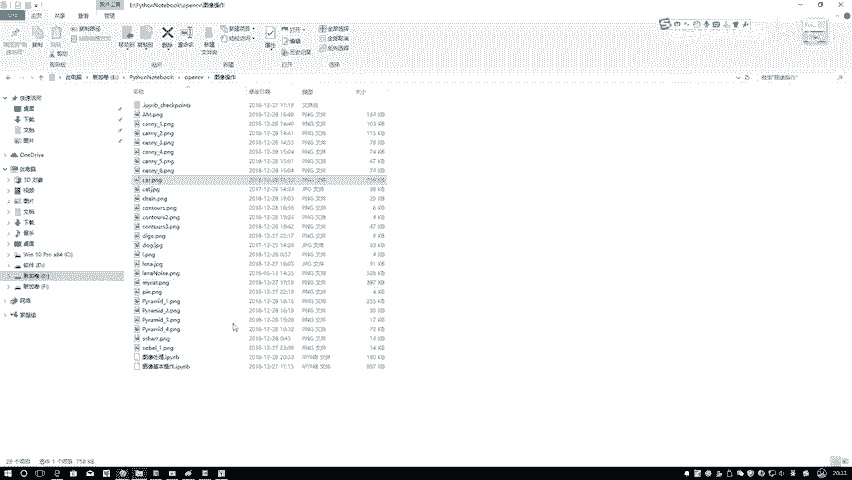
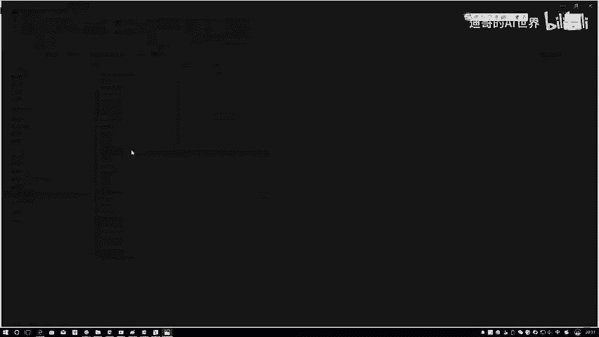
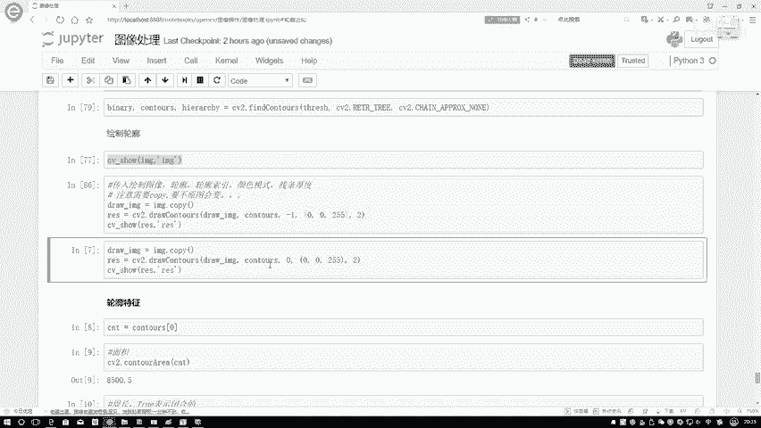

# P21：2-轮廓检测结果 - 迪哥的AI世界 - BV1hrUNYcENc

做好了我们数据之后啊，接下来我就要执行这样一个检测操作，我们来看一下几个输入啊，第一个输入就是我像我刚才说的，咱们传建的是当前我的一个二值，处理完的一个图像，第二参数呢咱们是选的最后一个吧。

在这里相当于干什么要去它这个TRA模块，要去检测所有的轮廓，第三个呢就在这里，我要是把所有的点都给我画出来，这个意思，那现在当我们执行完这一行代码之后，它会给我返回几个值，第一个值嗯。

第一个值咱们也看一下，在这里我给大家展示一下，第一个值，其实啊就是我刚才做完二值那个结果，你看就是我刚做完二值那个结果吧，第二个值哎呀，第二个值这个它怎么画呢，这个直接打印出来了，它是一堆轮廓点啊。

我看下shift值吧，哦它是一个list的结构，我们可以用南派和R转换一下，这个相当于什么，这里边保存的是你的一些轮廓的信息，然后呢最后一个最后一个是你的一个层级，像我刚才说的。

它是把一个结果保存在一个层级的结构当中，这个咱现在暂时用不上，然后下面就是当我们执行完这个结果之后，哎我是不是说中间这个参数啊，它是我的一个返回的一个轮廓的信息啊，所有轮廓都存在这里了。

那我们是不是得把它画出来看一看啊，但这个轮廓我们该怎么去画呢，在这里咱们来看一下啊，我绘绘制这个轮廓它的一个步骤，首先第一步在这里我跟大家先提一个事啊。

就是在这一块我们需要把imagine copy一下，因为啊当我执行绘图这个操作完之后，它会干什么，他竟然啊会把我当前这个joe mine，在它原始的图像上进行改变，并且保存下来。

所以说在这一块我执行了一个imagine点copy，要不然的情况下呃，整体的一个流程它就不对了，这样我先给大家看一下问题吧，我现在注释掉，让大家知道这么一个事，其实这东西我觉着应该啊。

应该就是大家在用的过程当中，自己啊也能总结出来，用过程中肯定会遇到各种各样的问题，当你遇到一些问题的时候，你就一想哎为什么出现这个错误啊，当时啊我在使用过程当中也是啊，直到发现这样一个事之后。

才慢慢去调看看怎么能去改这样一个结果，再来看现在啊我去执行这样的一个结果，这样吧，我在执行之前，我给大家看一下这个JOIMAGINE哦，在这里就是呃我的mg是吧，一会儿它会这块，我这样吧。

我先传进来的是一个mg，然后呢，我先对我的一个输入图像进行一个展示吧，这是我的一个IMG，咱们先来展示一下，展示完是当前这张图的结果吧，再来看一下，在这里我说我怎么去做的。

在这里我去照了一下当前的一个轮廓吧，照轮廓的过程当中啊，需要传几个参数，第一个就是我的一个在什么上去画，或者说你的原图像，你要画这个轮廓，你是不是说要你在原图像当中进行一个绘制啊，这是你的一个原图像。

第二呢你刚才是不是说给我去找到这些轮廓，要把这个轮廓画到原图像上面，那你得告诉我这个轮廓是什么吧，第三个参数啊，第三个参数咱一会可以自己写，第三个参数啊，就是你要画这个轮廓，你要画几个轮廓里边好。

你比如说你这你这里边有那么多车，还有楼那轮廓海了去了，你要画第几个轮廓，我们大家啊就是默认它是默认，你可以写成一吧，一相当于什么，你要把所有的轮廓都画进来，一会咱可以看一下，但是这这里边可能轮廓太多了。

一会我换一换一个图啊，给大家看一下不同的轮廓，最后一个0025啥意思啊，它是什么b gr是吧，BGR它颜色的一个就是你的颜色的一个模式，当你要是红色的时候，你想拿红色的线去画，那它就是一个0025吧。

BGR的格式，然后最后一个最后一个二它是线条的一个宽度，一会给大家展示一下，大家就能看到了，这样我先执行一下，咱俩要看一下它的一个结果，通过这个照函数啊，我是得到了一个返回的结果吧。

返回结果就相当于把我的轮廓，画到了我的图像当中，再来看一下，执行完之后啊，得到这样一个结果，用什么，用一个红色的，哎呀这块这样嘶呃这这这这样也行吧，这样也行吧，他不用灰度图，这就咱们先这么看吧。

一会大家换一个，在这一块，他是不是把我的一些轮廓信息全划进来了，这个就是我当前得到的一个结果，然后呢得到的结果咱一会儿再来观察结果，这个摄像图里轮廓太多了，咱不好观察，一会咱换张稍微简单点图。

咱再来观察结果，在这里啊，我们再来去执下这个，我再去show一下这个imagine，你看这个轮廓结果我是返回的，不是有result值吗，但是啊我在执行，我再去画这个mg的时候。

大家发没发现我这个输入图像是不是也变了呀，所以说当你进行自己测试的时候，每一次画的时候，他都会把你原始图像进行改变，那你说每一次画它都要改变你的图像，那以后你要再做在原始图像做测试。

相当于是在已有的轮廓上再去画轮廓，是不是就不准了呀，所以啊大家一定要注意一件事啊，就在这里你实际啊就是用一个mg点copy，把点数据给他复制过来，然后传给一个JOIMAGINE。

然后呢通过照明阵再传进去，这样呢我画出来结果它就是一个呃，就就怎么说呢，咱们再执行一下吧，通过咱们的一个例子给大家演示，在这一块哎现在它没有东西吧，然后啊我通过这个传进来个copy这imagine。

咱执行完他有轮廓的吧，然后呢我再截执行原图，它是没变的吧，相当于啊就是它在里边像我该说的会改变，然后这个copy啥意思啊，之前上课的时候有同学问我，这个copy以前没见过copy，是这样啊。

就是如果说你不用点copy，那相当于什么，大家可以看一下，如果说你不用点copy，我把这个东西给它去掉，去掉完之后咱再来执行一下，我再看一下，执行完有轮廓吧，那你说这个mg变不变啊。

mg这个东西也变了吧，所以说啊如果说你直接写个等号，相当于啊他俩指定的是相同的一个东西，那你说指定相同东西，那你变必然我也变了吧，点copy它是一个不一样的，相当于是我是用imagine复制出来一部分。

指定成一个新的东西，这个装imagine和我当前这个mg，他俩完全是两个事啊，这个意思行，然后在这里给大家看几个参数吧，这一块这一块可能不太明显，这样吧。

我我给他换一组，我看一看。

换一些轮廓哦，换这个轮廓吧，换这个轮廓，这个轮廓简单点，要不那轮廓里边东西太多了，咱先把这个轮廓拿过来啊，这是我当前刚才画的一些数据检测下轮廓，这这行不执行了，然后在执行第一步，你看轮廓检测的过程当中。

他是不是把所有的轮廓全检测到了，这一块，是我使用什么指定一个一吧，然后呢你来看一下，我说我把这个东西你别一了，我只能乘个零，嘿大家看一下是不是只有一个啊，然后呢那你说我指定个一行不行啊，只要不越界都行。

指定个一，你看刚才刚才零什么这个三角它的一个外圈吧，这回一呢三角的一个里圈，那你看我再指定成个二呢，哎但是这个它的一个外圈，那三估计就是它的一个里圈呗，哎就是它的里圈吧。

然后啊在这个就是一般情况下默认一，它是指全全部的，然后只能成其他值，就是按照顺序进行选择，然后啊，我们还可以在这里指定一些，它线条的一个宽度啊，这就是自己观察用的，你指定成个五。

咱可以来看一下得嗷嗷嗷大的一个是不是，但你只要太大了，有问题啊，就是里层和外层看起来怎么样了，看起来就是被包围，被融合在一起了吧，所以说这个值啊不要使用量太大，指定成一个差不多的就行。

这样起码咱还能看出来一个里层，外层之间的一个差异，然后下面下面这个结果也是一个类似的。

只不说把它改成一个零了。