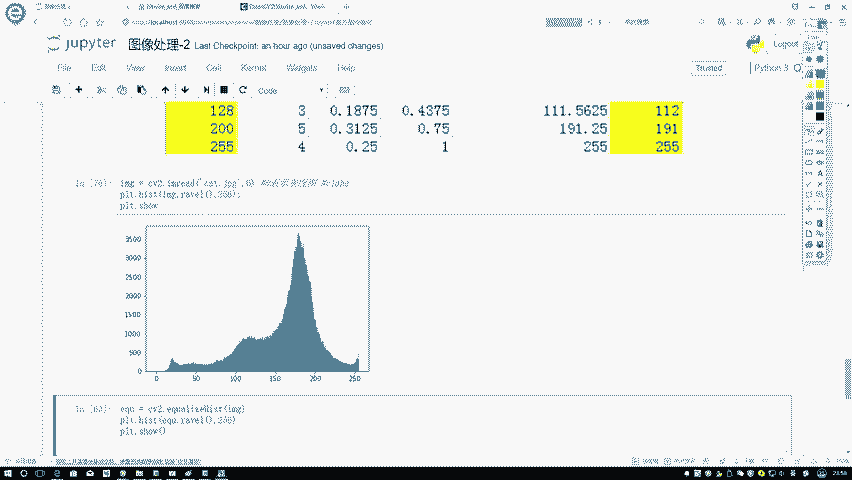
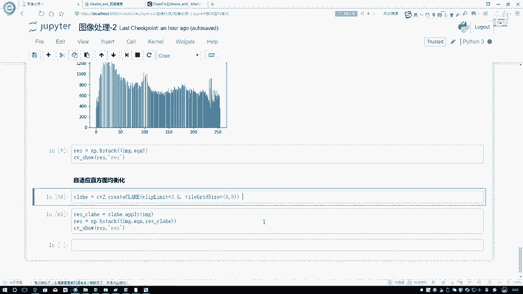
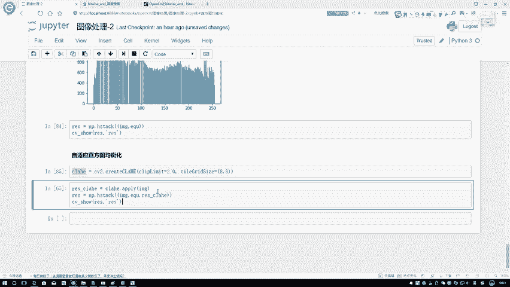

# P27：3-均衡化效果 - 迪哥的AI世界 - BV1hrUNYcENc

然后呢咱实际看一下吧，在这里跟大家说一下，就是我们用open CV啊，怎么样去做咱的一个直方图均衡化，首先这样我给大家呃。

还是先看这个猫吧，我先把这个猫啊给它读进来，这个猫因为它比较有特点是吗，它这一块就是就是它直方图分布当中啊，特别不均衡，是不是它比较有特点，再来看一下它这个就是均衡化完之后啊，结果长什么样子。

你要做这个均衡化。

直接我把这个均衡化的函数给它导进来嗯，你使用这个均衡化函数啊，其实上就是呃你只需要传进来，我当前的一个图像就可以了，这是我读进来的图像吧，我把图像传进去，然后下面我画它的一个结果再来展示一下。

可以看一看，对比一下吧，我这两个图其实应该画在一起的，但但在这里我为了分别给大家展示代码，所以没有画到一起啊，可以看一下第一个图是不是这块挺尖的，那你看做完一个均匀化之后，是不是说他变得胖了一点。

可能没有矮太多，但是起码他是变胖了一些吧。

这个就跟大家说了一下，我们的一个均衡化结果长是长什么样子，原来你看离顶比较近，这部分是不是都没有啊，现在一些比较小的值数也比较多了，这个就是咱们做完均衡化，均衡化，均衡化之后，它的一个结果是长什么样子。

然后呢再来看一下，就是你说你做了均衡化和不做均衡化。

咱不都是一张图吗，它们看起来有什么区别啊。

咱在这里展示一下，你看做完均衡化之后，通过返回出来一个就是反实际返回来出来了。

就是一个执行完变换之后，像素点它的一个结果吧，因为均衡化之后啊。

咱得到的东西不还是像素点吗，那不还是个图像吗，咱展示一下啊，他们之间的一个区别在这里，这张图像就是原始图像吧，我什么也没做，右边这张图像就是我做完均衡化之后，它的一个结果嗯，可能给我们的一个感觉。

怎么感觉怎么样呢，好像右边颜色更深一些，看着就是看着怎么样，看着更明显一点吧，左边的色彩有点太淡了，是不是这个意思啊，咱再换，咱再来换一个人看一下哦，我们再换一个人。

咱们来换这个丽娜，呃换他。

然后再来重新执行一下，你看它呀，可能就是没有那个猫那么明显，然后反正均匀化之后。

反正也是均衡了，再来看下结果，左边就是原始的图，右边是我均衡化之后的一个结果，整体感觉是不是右边这边感觉更亮一些，看着我就是更显眼一些，是这个意思吧，这个就是咱均衡化之后它的一个结果。

那是不是大家可能感觉哎呀，你这个均衡化咱这么做效果挺好的，以后呢我想把色彩，我想把图像看的更舒服一点，或者是你对图像再做一些嗯，就是比如说你想做一些类似处理的时候，我们就用均衡化是不是就可以了。

咱再给大家看另外一张图，这张图啊可能稍微有点细节。

我们来看这张图当中啊，也是这样一个趋势啊，均衡化完之后大概变均衡了。

这个均衡的效果可能比之前要更好一点，然后再来看一下左边这张图是我原始图。

右边是均衡化之后完的结果，从整体上感觉好像更亮了一些，但是呢你看这个图当中这个脸和这个图当中，这个脸左边这个点当中啊，我能看到一些细节，是不是，但是右图当你给它进进行了一个进化之后，它的一些细节。

你说你还能看到了吗，好像就没有了吧，在这里啊，好像说诶我直接完战斗操作之后，我却丢失了一些细节，那你说我们该怎么办啊，在这里大家可以想一想，我为什么会丢失一些细节啊。

在这一块好像是我对整体图像进行了一个平均，那是不是在这里有一些本来属于它自有的特征，你整体像是做了一些平均似的，你给平均到一些别的地方去了，好是不是有这样一个感觉啊，那你说啊咱们现在做均衡化哎。

讲道理啊，是不是我应该分模块去做可能更好啊，别在这里我给它分成几块，在这里在这里分成几个格子吧，每个格子到时候大家大都咱们可以指定大小，比如说是个8×8的吧，在这里哎你说我这个格子你做自己的均衡化。

这个格子做自己这个做自己，每一个地方如果说它都做自己的，是不是要比全集做起来更靠谱一点啊，因为全局啊，你这么一做可能有些影响因素就比较多了吧，但是你局部做也有个问题，局部做你一旦有些噪音点数据的时候。

或者有些噪音的时候，是不是说它会产生影响，那有有可能还不如整体做好了呢，这时候啊教大家自己先去衡量一下，但是啊咱来观察一下，还是这个图，我能不能呃按照我刚才说的，给它分小块来进行这样一个均衡化处理呢。

其实也可以的。

open CV当中啊，已经给了我们现成的这样的一个函数去做啊，这个东西我们叫做一个自适应均衡化，其实啊特别像我说的啊。

创建出来一些小格子，通过小格子自己做自己的，然后呢再把它们补全在一起。

那大家可能现在会问一个问题，就是你这样分别做完之后，可能会导致一个现象啊，你现在不是整体的那一分别做完之后哎，图像的一些边界，是不是看起来他就是就是更是边界了，是不是每个格子它会产生一些边界出来啊。

啊会有这样一个现象，OBCV当中啊，给我们加上了一些线性的一些呃，线性的一些差值处理啊，所以说在这一块我们就不给大家深入了，到时候大家感兴趣啊，可以详细的去看一下它自适应的一个均衡化。

里边儿还要对每一个格子产生结果，再进行一些额外处理的。

这样再来看它的一个结果长什么样子，首先啊我先把这个方法生成出来，然后呢把我当前自适应均衡块的方法，应用到我当前的输入数据当中。

并且呢我把前面三个结果都给它连在一起，再来看一下，此时咱们来看一下结果呃，换ABC吧，第一个我A这个图就是我原始图像吧，B这个图我做了一个全局的C，这个图我是做了一个分不同小模块的。

从整体上感觉你看C这个图，是不是说我的一些纹理，或者是我的一些细节照样给我保存下来了，比B图要好一些吧，并且我的C图看起来也是比也是比A图亮吧，所以说啊当大家在执行一些操作的时候，我们得想一想。

你要保存一些具体的一些细节的时候，做全局啊，可能有时候效果不是特别好，但是呢像我刚才说的，你做一些局部，可能会由于一些噪音点产生一些额外的影响，这些啊都没准儿的，在这里啊主要跟大家说了一下啊。

咱们这样的一个对比，那这节课就给大家说到这里了，主要给大家说了一下我们直方图啊，图像当中直方图我们该怎么去做。

以及呢，直方图当中每一个位置都表着什么样的含义。

还有就是我们用这张图啊，可以对图像做哪些操作，主要就是一个均衡化。

还有呢我们刚才所说的这个自适应均衡化，那这里啊直方图啊。

