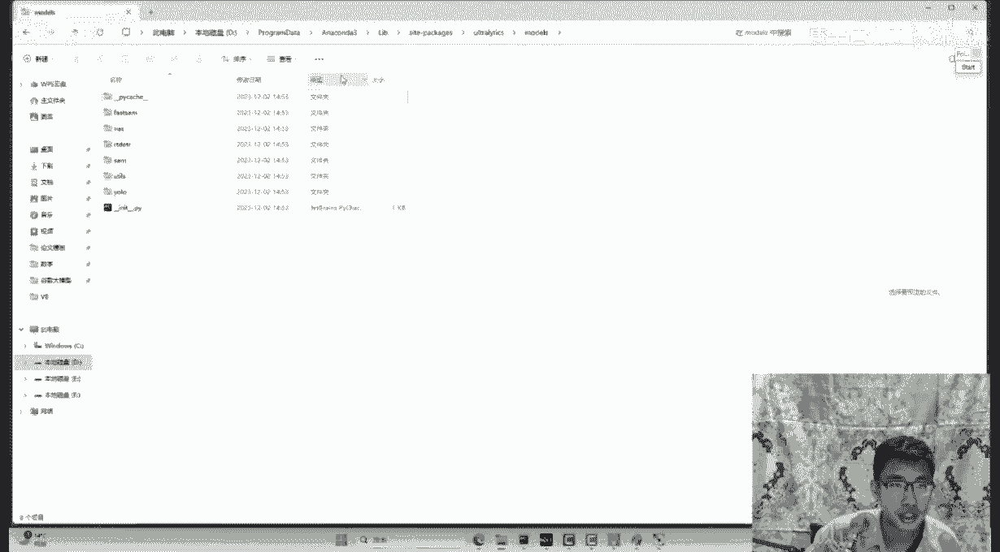

# P3：YOLOV8改 - 唐宇迪讲AI - BV1WYyoYXE2y

嗯哼哼哈，嘿i like it，皮卡啊，来小伙伴可以帮帮我反馈一下，咱们那个声音画面是都OK啊，要这样啊，我给大家简单介绍一下，就是咱们今天的一个主题啊，我们今天啊整体来说就一件事儿。

我会给大家来说一说啊，物体检测是玩什么的，这是第一件事儿，第二件事呢大家也看到了啊，咱们今天呢会给大家说一个呃现在来说啊，比较前沿的东西啊，叫做yo v8，可能YOO这个词啊，大家已经听过好多年了。

是不是，那好像啊yellow他一直在升级，一直在进化，以前的最早啊，我们给大家捋捋历史吧，最早这东西啊，哪年的，我们可以说是16年啊，有这个V1版本，当年啊大家可以看是不是78年前的事了，蛮久了啊。

然后接下来18年有这个V3，20年呢有这个V4，然后后面啊其实一代版本下来就是去年啊，去年2年吧我们叫做一个V7，今年的23年就是V8来了，今天咱们第一件事啊，我会给大家梳理一下。

就是这个历代版本当中啊，他都做了哪些个改进，都解决了哪些个问题啊，这第一件事我会给大家说说这些版本，然后第二件事呢我们会带着大家说一说啊，就是yo v8，第一件事我们该怎么去用，第二件事呢。

我们的源码该怎么理解，第三件事呢，我们如果说啊想在这个原始的模型基础上，咱再加一些自己的模块，我们该怎么加，其实啊今天来的同学啊，就是不论大家咱之前有没有基础学，没学过相关的东西，我觉得都无所谓啊。

因为yo这个东西啊，它本身就没什么难度，它没什么难度，原因是什么，其实没什么难度，我觉得原因是这样，是因为源码写得好，它源码是一个高度解耦的状态，我们可以用其中的模块。

或者说我们去学其中源码学起来非常轻松，不是说这玩意简单，是因为人家代码写得好，人家工程项目做得好，所以说才让我们学起来啊，会更轻松一些，好了，那我们先简单过一过吧，因为我们今天说物体检测啊。

那先给大家放个demo，就是物体检测啊，他要去做些什么事儿，无论是你优了V几啊，还是其他的什么检测算法，我们要做的东西啊都是一样的，输入呢就是我们这样一个图像数据，然后我们输出的就是这个某物体。

这个框在哪儿啊，第一件事物体框在哪儿，第二件事呢这个框它是什么东西，把这件事儿搞定就完事了啊，这就是说我们检测去做什么，然后呢我们回到右手当中吧，来yo啊，这几代系列我给大家简单的概述概述啊。

就是他要去解决一件什么事，咱们今天这样啊，因为我们重点是V8，所以说前面啊这一代版本我就给大家简单概述，大家呢就听我讲讲故事就可以啊，这东西并不难，举个例子吧，来我这给大家画图吧，大家就看图刷就行了。

我不打PPT了，因为我觉着看PPT吧更慢，你都不如听我给你讲讲故事得了，最早啊我们叫V1版本，V1版本是怎么做的，大家帮我想一件事啊，这V1版本你可以当做16年啊，他奠定了一下这个大框架长什么样子。

输入呢，我们有一张图像，然后图像当中哎我们说这块有物体，比如说我想检测到这个飞机在哪，那这件事咱该咋做，我举一个简单的例子，就第一步咱们是不是去提特征啊，咱说最简单的就通过卷积提特征是不行啊。

其实yo这一代版本啊，更多的改进就是说在网络结构上啊，怎么提特征，怎么把这个网络结构变复杂，一会我会给大家看一看啊，好了，那假设说啊我们经过了一裤兜子，卷积一系列卷积，咱得到了啥，是不是会得到很多的。

就得到一个特征图，然后特征图上有很多特征点，这个没问题吧，就是卷积之后啊，哎我们得到特征图，特征图上有很多点，代表着我们得到很多特征，然后问大家一件事啊，就是特征图上的每一个点它都相当于什么。

是不是每一个点，它都能相当于原始输入当中的一个区域啊，那大家帮我看是不是这么个事儿，特征图上的这样一个点，不就都会对应于原始输入上的一个区域吗，那想问问大家啊，就是你觉着检测该怎么做，检测是不是找东西。

就比如说你在你家啊，你手机找不着了，该怎么办，手机找不着，我真干过这个事儿，我手机找不着了，我把我家翻个底儿朝天，每一个地方我都看一看啊，咱们在这儿，咱们在那，咱们在每一个地方是不是对我们来说。

咱们叫做一遍地的一个思想，什么叫便利，哎我说第一个区域我看看你是不是个物体，第二个区域我看看你在不在这，第三个区域看看你有没有物体，所以说检测啊，在yo这个基本算法来看他在干什么。

他在找一些初始化或者叫原始的区域，我要每一个区域去编辑一下，哎你是不是一个物体，那我写个C叫什么C呢，叫做一个置信度啊，就是confidence置信度的意思，表示它是物体的一个可能性，这是第一件事啊。

我们说咱每个窗口上我都要去预测啊，你是不是个物体，然后第二件事啊，大家帮我看第一个窗口，在第一个窗口当中啊，哎你看这里边啊，我们是不是说哎这个飞机啊在这呢，但是你这个绿色的大框啊。

框起来的好像多出来点东西，框的不太准，那咋办，哎我们说咱要把这个框啊，绿色的框做一些微调啊，我说得得到你实际这个物体它的长宽啊，框有长宽，是不是框还有中心点的一个坐标。

所以说大家也这么去理解我们要预测的啊，是有几个值，是有五个值啊，每个区我都看一看，第一个你是不是物体，如果你是一个物体，这个物体在哪儿呢，让神经网络帮我们把这件事预测出来，是不是就行了好了。

你看V1版本怎么样，我觉得很简单的一个思想是吧，就通过卷积得到特征，把特征图映射到原始区域当中去预测就行了，所以说大家没有种感觉越简单，这种结构其实它做起来效率是越高的，它速度是越快的是吧。

所以说啊从yellow啊第一代版本开始，他就奠定了一个基础，我们要做一件什么事，咱们要做这个检测啊，我们希望检测的时候，咱要做的是一个越快越好啊，把检测的东西咱尽量速度要快一点好了，这是第一个事。

接下来我们第二个事，第二个事啊，咱们要说一说V2版本在V2版本咋样了，这里我给大家举个例子啊，就V1当中啊，你看这一块是不是说哎，这一个点对应原始的一个区域啊，哎那我想问问大家啊，就是咱们这个物体来说。

是不是有高矮胖瘦之分啊，比如说人大家呢，兄弟今天咱们有没有兄弟长这个样子的，来，就是比较扁的，比较胖的，有的人呢可能是这样的，我可能是这样的，我贼瘦，我可能是这样的，那也就是说哎对于物体来说呀。

咱们可能框啊它大小也是不一样的，哎那我说V2啊，他做这样一个改进，他说这一每一个点啊也在对应原始的数据区域，比如这个点它对应这个区域就不是一个窗口了，他说我能不能多对应几种框呢。

就相当于哎V1是一个区域，我就找有没有正方形的物体，但是V2开始他说呀，哎我对每个区域啊，既看一看有没有正方形的，就看有没有长得高的，又看有没有长得胖的，就说明咱要把这件事找东西，这件事给它做的更全。

是不是可以的呀，这就是V2啊，他说我们要做东西，但是我们要做的更全啊，我们每个区咱们多找一找，有没有啊，符合这个的，有没有符合那个的，把事做全就完事了，然后呢接下来啊接下来第三件事啊。

咱们今年会比较快啊，过节亲爱的算法，所以说我就不打PPT了，你听我讲故事就行，接下来V3这样V3他帮我讲一件事啊，比如说对于我们原始输入图像当中，哎是不是既有一些大目标，比如说我看啊。

你看我画个这么大的飞机，有一个大目标啊，占了这么大的屏幕，然后呢可能还有一个小目标，一个小人儿，他就这么点哎呀，那我说现在啊咱们有一个网络结构，比如说在V3当中，我们的网络结构啊，它有很多很多层啊。

层次非常深，我就点点点省略一些吧，这一块假设有100层吧，那我想问大家一件事啊，越深层的结构，他是越适合做大目标还是小目标来着，来大家帮我想一件事儿，如果说你的特征图做得越深啊，就一个人越老谋深算的。

你想他考虑的东西会不会比较全，他考虑的东西越全，他放眼全局的特征就越大，那是不是越深的层越适合干什么，越适合做一些跟大目标相关的东西吧，那他是不是做适合做大目标，所以说注意啊。

深层哎我们说它是个做大目标，但在咱们任务当中除了有深层哎，我说这一块呢还有浅层，那浅层适合做什么，浅层啊，就是说他在提特征的时候，他只能看到一些比较局部的，比较小的特征，注意啊，兄弟们。

深层是看大的特征，浅层是看什么，浅层是看小的特征，这个是深度学习啊，亘古不变的真理，你层数越多，你能越放眼全局，你能学得越深，你层数越少，你的修为还不够，你只能看着眼巴前的事，想不了太多东西啊。

所以说我们这一块啊是有深层和浅层之分的，在yo v1和V2当中啊，他是这么说的，他说哎呀我们之前啊只有一个输出层，就拿深层去做的，那我想问问大家，就是以前yo当中它适合做大目标还是小目标。

我们以前总说啊，在物体染色当中，大目标的检测非常容易，因为你一个深层网络就能解决掉了，但是小目标的检测不太容易去做，所以说V3啊，他说这样吧，他说呃既然有深层也有浅层，那咱能不能这样。

我们做一个术业有专攻，什么叫术业有专攻呢，越深的层你就单独的去检测大目标啊，越深的层，那我说你是个输出层，你做大目标的事儿，然后越浅的层呢，我说你去做小目标的事是不是可以的呀。

然后中间层还有一个中间的中间那层干什么，检测中不溜大小目标，所以V3啊跟前几代版本最大的区别，就是以前啊你当做只有一个输出层啊，就只能解决大目标的事，但是从V3开始呢，大家会发现有给大家看这配置文件啊。

你会发现它有三个或者四个输出层啊，就是为了能解决大中小目标，把不同大小目标都能检测到，检测的比较全，提升我们召回率的一件事，好这是V3，然后呢，接下来啊时间一晃啊，又到了20年二零年的时候啊。

V4横空出现了，当年V4啊是很让大家震惊的一件事，因为V4这一篇论文，大家知道他引用的参考文献有多少吗，当年的V4啊引用的参考文献超过100篇，我记得没错，正好100篇非常多是吧。

然后V4呢就大家可以这么去想，他是一种什么套路呢，呃兄弟们你们听没听过一招啊，一招叫嫁衣神功，咱兄弟们那个嫁衣神功这一招有没有听过，我一般讲V4我都会讲这个东西叫嫁衣神功，他是干什么的，举个例子啊。

就是你有再高的武功，我说我把你武功咔嚓给你吸过来，跟吸星大法似的啊，你会什么东西我给你吸过来，我也会了，所以说V4啊他是这样的，他说呀你们前三代版本啊，奠定了yo大框架长什么样子。

但是呢你细节做得不够好，什么叫细节做得不够好，你们都是用普通的卷积去做的呀，但是普通卷积怎么样，我们说普通卷积当中，你能学到的信息是非常有限的，能提的特征，那可能提的不是特别好啊，所以说V4开始啊。

他要专注于这样一件事，怎么把网络结构给它做得更有特点，怎么把别人做得好的东西拿到我的任务当中，我给大家举个例子啊，就是计算机视觉当中啊，大家发发现一件事儿，我们在其他地方可能用到的模块。

在我们今天自己任务当中，咱们也也是可以用上的，就是很多东西我们叫做都是一个通用的感觉啊，你不就是提特征的吗，你在行为识别当中，你不是提特征的吗，你在目标追踪当中，你不也提特征吗。

那你们其他模块当中做得好的方法，能不能用在我们这个物体检测任务当中呢，那肯定是可以的，所以说V4啊用我们东北话来说啊，就是跟就就跟个该溜子似的，满大街撒嘛，你们谁家有好东西，我就一家拿点啊。

把网络结构给他做的更复杂，这就是V4，你可以当做是一个几百家之长的算法，但是接下来啊V4和V5是同一时间的，大家就总在争论啊，V4和V5的区别是什么，你这么理解啊，就是V4啊。

它更多的对我们来说就是啥呢，就是一篇论文吧，V5呢它是工程版的一个项目啊，所以说20年的时候最火的就是yo v5，这个项目直接就很多地方都拿商用了，直接用做到自己任务当中很爽的一件事啊。

这是20年V4V5，然后接下来啊就是2年左右22年啊，V6和V7，这个V6和V7吧，就挺奇怪的一件事，就是一般情况下就两代算法，你觉得相差多久，咱讲道理，我说两代算法咱差的不多，你差两个月总行吧。

但是当年V6和V7大家知道差了多久吗，V6啊和V7啊相差不到一周，我估计这俩人是约好了啊，你叫V6，我叫V7啊，你先出来，我过两天再出来，肯定是约好了，一个叫V6，一个V7，相差不超过一周。

那V6呢V6啊大家没啥人去用，也没啥认可美团的东西啊，做的反正也还行吧，但是没啥没啥人去认可，V7呢用的人挺多的，V7当你说有什么特点呢，我给大家说几件事，V7里边做了几点吧，嗯我给大家写一写吧。

第一点来说就是它在网络结构当中啊，提出来了一些叫做层级堆叠的模块，我给大家举个例子啊，就什么叫做层级堆叠模块，这是一个正常的卷积，是不是啊，就你继续往下去走啊，一层一层的，但是这个V7当中啊。

他说哎我们这样啊，咱变点花样行不行，哎我们把不同层级的特征分别做一些拼接，大概这样啊，我就简单画一画，大概这样诶，那大家来看一看，现在他做了什么，最终把所有特征诶拼在一起，再走下面那层。

那你说这种结果有什么特点，其实说白了充分利用不同感受野大小的信息，或者说充分利用不同层级的特征，哎这样能让模型啊学到周围相邻邻居，不同层级的特征，能相当于对你全局信息唉，能有个更综合的汇总吧。

就大家可能说这么做有什么好处啊，就并行的走一些路，唉兄弟们，你们听没听过一句话叫大号练废了，就现在有很多很多家在要要那个二胎，我好多同学家里都都都都要都要二胎，我就问他，我说你要二胎的目的是啥。

我好多同学跟我说，就是大号练废了啊，老大练废了，练个小号吧，练个小号保底吧，这块也如此，你看啊，他走了一些不同层级链路的特征，即便哪个链路没学好，是不是还有其他的给他兜底啊，所以说V7当中啊。

大量去使用这种堆叠这个模块，这是第一个，第二个呢就是在我们任务当中啊，大家知道检测里边是有正负样本之分的，是不是就你让他去学啊，什么是个物体，那你让他去学什么是物体的时候。

你同时也告诉他什么不是物体是吧，得有正负样本啊，V7当中啊，提出来很多跟正负样本怎么去计算相关的事，这个咱先不说了，因为这个不是画图人画出来的，V7当年我讲这个源码，大家感兴趣可以看一看啊。

V7我讲这个源码，我就讲它正负样本的计算，讲了不下一个多小时啊，讲了个源码V7元八，我讲的贼细啊，后期兄弟们赶紧赶紧给看一看，它跟V8就大差不差的，这也没啥区别，好了啊，那接下来我们要说一说V8了。

我先说一说我整体的感觉啊，就是咱先不看这个东西，我先说整体的感觉，整体的感觉是这样的，就是如果说用俩字形容yo这个团队啊，在做这样一件事，一个叫做方便，什么叫方便呢。

就是你可以这么去理解V5V7这个东西啊，你用的时候哎还得用源码啊，还得自己去配置点东西，但是从这个V8开始啊，就咋说呢，你想玩这个东西，大家知道你说花多少时间吗，我估计2分钟。

2分钟你就能上手去跑你自己的事儿了，非常简单非常便捷，第二点呢，第一个我觉得是方便，这个不用说了，第二点叫统一嘶，什么叫做统一啊，为大家举个例子，现在好多公司啊都在做这样一件事，我们来做个对比啊。

就是呃兄弟们有商汤的一个框架。

大家知不知道商汤之前出了一个框架叫open mm lab，兄弟们这个听没听过。

我给大家来看一看啊，就是yo其实也在做类似的一件事，来为大家打开，这是商汤啊，我们进他的主页来看一看，实际上他们框架的特点是这样的，就是它有一个叫open m m live框架。

这里边他做了一个视觉的大一统，什么视觉大一统，就是它有一个底层叫MMCV吧，就是它有设计一个底层计算的框架，用它底层的计算框架可以去玩他所有的任务啊，就是像什么预训练模型啊，像什么3D检测。

2D检测行为识别自带，估计什么OCR所有事都能去玩啊，这就是张涛比较火的一个项目，大家都在去用，尤其搞论文兄弟，你们可以多关注关注，然后我为啥说yo也在做这个事啊，你看这是yo v8的一个技术文档。

在yo v8当中啊，大家点开这个任务，你可以发现一件事。

这里边他的任务其实已经不仅仅局限在检测，这个任务当中了，他还能做什么，还能做分割，还能做分类，还能做姿态，估计也可以做追踪相关事，也就是说一个框架大模型，它要解决所有的问题。

所以说这会为啥说这个优鲁V8，叫做一个统一啊，因为它前面的主干网络，一会给大家看配置文件啊，它前面的主干网络都是完全一样的，都是提特征的方式，只不过说最终呢我们要预测的东西，我们想去预测结果是不同的啊。

由于这个不同，我们可以当做就是前面是不变的，我们改的可以只改输出层就行，这个就是它最大的特点，很方便，我为啥说很方便，我举个例子吧，你想玩其他检测分割分类自带估计模型，你要配环境可能要配多久。

我见过配着墨迹配两三天配不出来的，但是你在ULV8当中2分钟全部2分钟不到，你就可以把这件事给他做出来啊，所以我觉着就是创建yo啊，这一系列开源项目公司啊，始终在遵循一个原则。

越对用户来说越简单的东西是越好的好来，那下面呢我们来具体看一看啊，用了V8它是长什么样子，在旧鲁V8项目当中啊，我们首先先看一个结构图吧，斯通过这个结构图，我相信大家能看出来一些特点。

就是它跟前几代版本在网络结构上是怎么样的，我们叫大差不差吧，都是干什么，先去走一些特征提取的模块，特征提取模式，走完之后做一些哎不同层级特征的拼接，然后呢，三个输出层我们是不是就得到最终的结果了。

所以说通过这个网络结构图，大家来看，你看这里边儿有啥东西，你觉着你之前没见过吗，但凡你玩过啊，任意的从优路V3开始，任意一个框架，兄弟们，你们看一看在网络结构上咋样，这东西有啥区别吗。

我们可以说没有任何区别，是不是，但是只有一点是不同的，大家看这里边多了个啥，多了一个C2F，是不是这个c to f啥意思，大家可能说哎呦这块多了一种特殊的结构，那这块呢人家给出来这个结构。

一会儿呢我们回到项目的源码里边，我会教大家就是怎么去看这个源码，怎么去通过源码理解他，每一步要去做一件什么事啊，所以说大家可以先有整体的感觉，就是YUV8啊，它不比Y6V7多，啥东西。

就是在网络结构上有一丢丢小的变换，其他的地方，我觉得基本上来说都是大同小异的一件事，没有说结构上特别大的一个区别啊，好了。

那下面呢我们先给大家看一看啊，就这个东西怎么去玩，我们自己相关的一些数据，这个事真不难，很多同学都问我，就是老师这个东西怎么跑自己的数据。

我说你能问出这个问题啊，绝对是你比较懒，为啥你比较懒，因为在优鲁V8啊，它的官方教程上全部会告诉你怎么去配置，这个东西，非常简单，是不是来我们正式官方教程我给大家读一遍啊，就是你只需要装一个包啊。

它源码都在这里边，你可以通过这个包去装，或者说你直接把源码下载下来，两种方法都行，我估计大家愿意用前者直接pip store，就人家官方项目这个包就完事了。

然后呢我们来看一看，就当你去把这个包装完之后啊，在我们任务当中，这里边它其实只需要你几行代码，就能训练个模型，现在这个东西啊咋说呢，就是你想去做一件事，简直太轻松了，不需要任何的学习成本。

咱就可以把这个东西给做出来了，来吧，我们看一看，在这里边，第一个我们只需要指定好，你的yellow用的配置文件是哪一个，大家可能说什么叫做yo这个配置文件啊，如果是之前版本也没咋看过，给大家举个例子。

你给我打开一个啊，来这里边我们打开检测的，找一个yo的配置文件，这个呢就是它的一个网络结构，你要做多少类别的分类，然后呢你的一个scale scale，就是说咱可以等比例的放大或者缩小这个模型。

什么叫等比例的放大，就比如说这一块我现在有100个隐藏特征，我说接下来你给它缩小一半，变成50个隐藏特征也行啊，我们可以做一些比例的变换，然后下面呢就是常规的我们配置文件，基本上来说就两个模块。

一个是BACKBALL，我们做特征提取的模块，再往下就是我们做输出层以及特征拼接的模块，它网络结构其实怎么样，对我们来说真的就是非常简单的一件事啊，如果大家你们不清楚这配置员干什么的。

只是回过头看看我们之前讲V7的，那里边会给你具体说啊，就是源码当中每一步怎么做的，一会呢我要看这个就是大家看啊，配置文件当中，就这个东西大家可能看起来相对陌生一点点，是不是其他的。

我觉得对大家来说都很熟悉了吧，那一会我们就说一说，咱们这个c to f这东西是是干什么的，这是第一个啊，我们现在需要准备好的就是YOO唉，它默认的一个配置文件，这个配置文件啊就是在我们自己任务当中。

咱可以干啥，在我们任务当中啊，你直接打开就行，它是自动给你下载的，你不用到哪去找啊，不用到网上去找，它是自动有的好了，这是第一步，简不简单，我觉着就是很就是很很适合小白去玩的，一个教程。

第二个能加载预训练模型，预算模型啊也给你准备好了。

就是这里边它是有几个可以选择的啊，我给大家看啊，就是在这官网教程当中是都有的，在这一块啊，我们点开它的模型，然后选到这个V8，在V8里啊，他给你提供好了一些不同大小的一个模型，你看吧。

就这一块从N到这个叉，就兄弟们，你们买买衣服吧，买衣服它有大小号之分，那越号越小的，那就是说他那个速度越快，但是效果可能不咋地，然后呢接下来还有号大的，号大的就是说他可能效果挺好的。

但是速度来说就会比较慢啊，这就这一块，你有不同层级大小，到时候根据你的需求，你自己去选预选模型，这个东西我给大家说一定要加的，你不加预选模型肯定不行。

这是第二个，你选预选模型啊，随便选一个大中小号就完事了，接下来呢第三步啊，就是我们想训练一个东西啊，训练自己的数据，我跟大家说一说啊，你自己的数据需要长什么样子，在这里边呢，你的数据啊。

你要给它写成一个配置文件里边配置表当中啊，就这个东西真的不需要任何技术含量，来为大家准备好一个例子，在我们这个例子当中啊，这里边是不是有一个叫做我们的配置文件，来为大家打开啊。

这一块就是你要去写你数据的一个配置文件，你数据的配置文件啊，这东西贼简单，我给大家简单说一说啊，第一个它上面要求到你到时候大家自己改啊，我给大家写好这个模板，自己改的时候就是你要需要指定好哎。

我们的路径是在哪儿的，第一个就是你到哪儿去找这个数据啊，你数据存在路径，到时候把你自己标注好的数据啊，你就放在一个文件夹里边，这个是指定的一个文件夹，好比如这个，我给大家打开这个文件吧。

看一看我指定这个文件夹。

