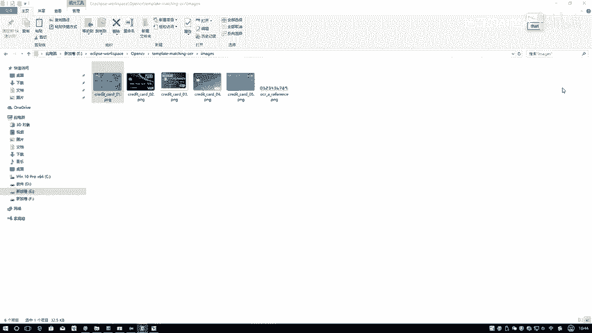
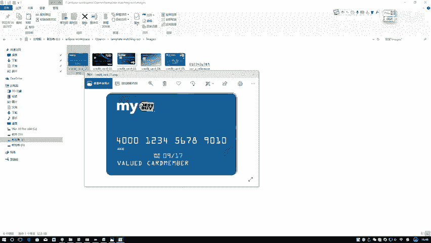
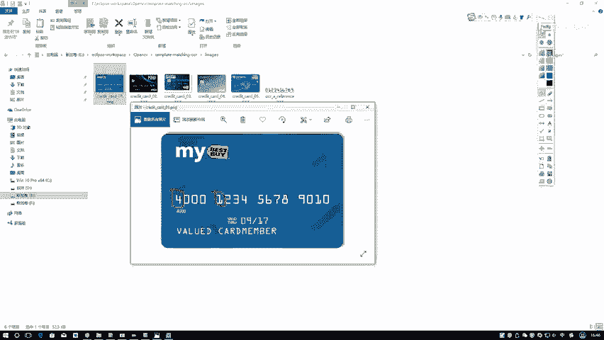
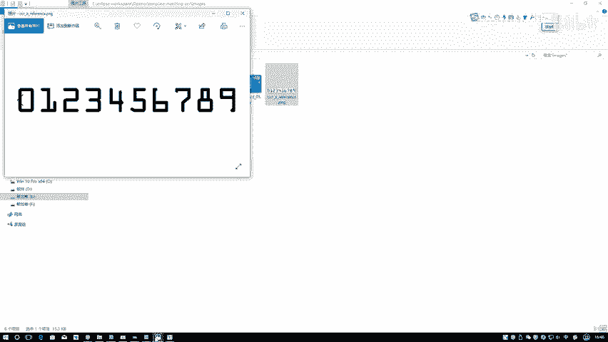
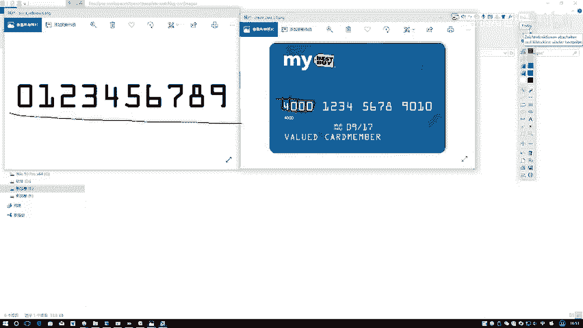
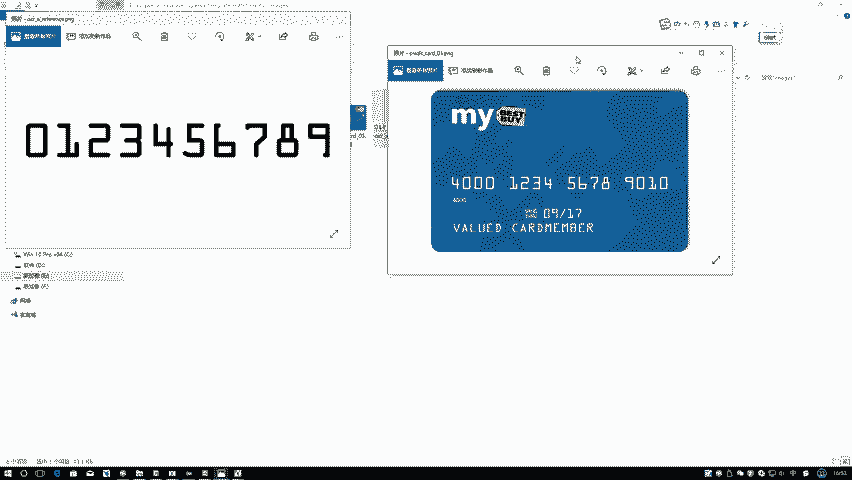
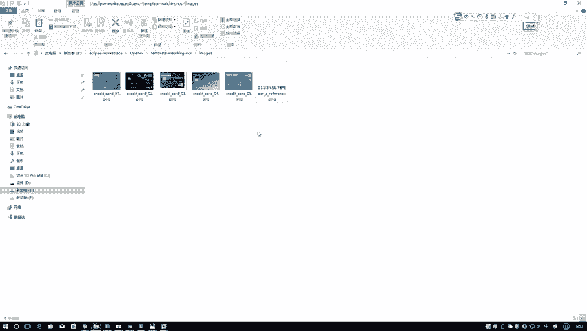

# P31：总体流程与方法讲解 - 迪哥的AI世界 - BV1hrUNYcENc

这节课呀咱们来做一个实际的项目实战，首先啊先跟大家说一下啊，咱们要做一件什么事，这里要打开一张图像，它是一个啊信用卡或者是银行卡吧，在这里我们要做的就是你给我输入，进来一张银行卡。

然后呢你需要我做一件事，第一件事就是你得告诉我当前输入的哎，这个卡里边你看他有卡号吧，什么4000123456789010，你得把这些值给我识别出来，比如说它会给我输出一个序列，第一个序列就是4000。

第二序列是1234，第三个序列，第四个序列，也就是说此时我们不光是把这个数输出来，你还得告诉我这个数哎，它对应的是什么样的一个位置，比如说在这里你需要把第一组给我框起来，告诉我它是4000。

第二组诶它是什么东西，第三组第四组分别是什么，哎其实这个事啊跟我们啊平时生活中啊，停车进那个停车库挺像的吧，你那个车往前一开，它会给你识别出来，哎呀你的一个车牌号在什么位置，并且呢把你车牌号检测出来。

咱们要做的也是一个类似的，只不过说啊咱那个汽车图像不太好找，我们拿到的是一些银行卡的图像，我们呀要对这个银行卡进行一个识别操作，那行了，那我需要先来问问大家，咱这个事儿啊该怎么去做。

之前咱说给大家讲了一下，在open CV当中啊，一些基本操作，比如说一些形态学操作啊，还有模板匹配啊，还有一些图像最基本的操作，这些咱都说过了吧，那这些个东西啊有什么用啊。

咱现在啊就得把它啊都给它应用到一起了，相当于啊把我们以前所学的知识点，全部穿插到咱们这个项目当中了，那我跟大家先给大家解释一下，就是嗯咱们要做这个事，一个流程长什么样子。

首先第一步哎，你说我怎么能把这个东西判断成是一个四啊，怎么能把这个东西判断成是一个一啊，咱之前是不是讲过一个事儿，叫什么叫做一个模板匹配吧，在磨完皮的过程当中，比如说在这里我再给大家打开一个这个估计。

大家一看就能就能明白了，这个是一堆数值，然后这里这个是一个银行卡。

再来看吧，在这里你说当我啊知道了这一块有个数值，有有一个数值吧，我先把这个数值给框起来，这个数值假如说我框到是个四，那你说我怎么样能让计算机知道它是四呢，那首先我可以有这样一个东西，哎我现在可以有模板。

我写个T吧，在模在这个模板当中要准备一些数字啊，准备一下数字就是012345789，接下来这个四来了，比如说你给我传进来是这样一个框，这个红色的框，我拿这个红色的框在这里我要进行对比了。

就是一个模板匹配，template match那个函数在那个模匹匹配函数当中啊，是不是你说你要判断出来它是四，那你得拿这个四所在这个红色区域，跟我左边这个模板当中的每一个区域就不画了。

就是每一个区域进行匹配吧，比如第一步我拿四跟这个零进行匹配算一下，比如说算一下它的一个呃就什么，就是那个平方向的一个平方向的一个差异吧，可以吧，那四个零之间有差异，那四和一之间也有吧。

四和二之间是不是也有啊，在这里啊，我可以把这0123456789哎，都跟这个四算一遍，比如说一算完之后，恰好啊这个四这个位置它的一个值是最小的，如果说按平方向来按向量系数来是不是最大的。

就在这里我找到一个最相似的吧，那我就知道了，当前我第一个框前的位置，它是几14吧，这才能算出来了，那行那你说这件事好像挺简单的，那咱们该怎么样去做呢，首先啊你看会大，估计大家也能看出来了。

第一步哎你说我是不是先得有模板啊，因为咱一会这个任务，咱是基于模板匹配就去做的，那首先你得有个模板，那这个模板你看这个八，你看这种就是这种银行卡的字体，这个八写的挺特别的。

你要用一种跟它不是能匹配在一起的数字，是不合适啊，所以说啊就是根据啊大家任务的不同，我们第一步你如果说你用模板匹配去做，你首先得找到一个跟你啊当前要做这个事儿，非常接近的一个模板。

你看咱这个字体这个六怎么写的，这个六是也这么写的，这个八这么写的，这个八也这么写的，所以说啊这才能叫做一套模板，咱匹配起来才是一个没有什么问题的行了，那你说我现在有模板了。

那刚才你不是说你需要把模板当中啊，你得说哎呀这个零二得框起来，这个一得框起来，你需要把模板当中每一个数字单独拿出来，那这一步操作该怎么去做呀，咱想一想咱之前都学过什么东西啊。

咱之前给大家说一个东西叫做一个轮廓检测吧，那比如这里为大家画一下这个轮廓检测，对于这个零来说挺好的，这个零来说哎，他现在那不一检测就跟一个矩形似的，那挺好的，那你看这个一呢印尼轮廓检测完。

它不是一个矩形吧，而是这样一个形状吧，你看我描的它是这样一个形状，这是轮廓检测完的结果，那你说他现在不是个矩形，那这里边这个一呢，这里边这个一如果说也对轮廓检测描完，也是大概这个样子。

那你说啊第一点他俩这个样子不太规则，然后呢里边它大小也不一样，那这个东西你大家可能说哎呀，我说如果说这东西，那咱咱咱不说大小吧，但你看这个大这个小可能大家想法，你让这个小的reset成一个大的。

然后进行一个匹配行，这种方法可以，但一般情况下我们都怎么做的，一般情况下，是不是说之前给大家说完那个轮廓检测之后，我们还可以用个东西，叫什么轮廓的一些外接形状吧，比如说你拿到轮廓之后。

我可以做这个轮廓什么外接的一个矩形吧，或者外接圆也行，但是在这里我们显然是要用外接的一个矩形吧，这一块我也是做一个外接矩形，这里我也是做一个外接矩形，所以说啊咱们这里要有一个先后的顺序关系了。

第一步我先把这里就是我的模板当中，这是我模板对模板当中进行一个轮廓检测，在轮廓检测过程当中啊，其实我们能得到很多结果，通常情况下会有一个外轮侧，还有一个内轮，就是一个内轮廓，你看这里这是个内内轮廓吧。

然后这是一个外轮廓，那你说我们需要哪个轮廓啊，显然是需要外轮廓吧，所以说啊这第一步我们要对模板以及呢，我输入图像进行轮廓检测，选择的是轮廓，检测完的外轮廓，第二步呢我得到这个轮廓之后。

我需要得到当前轮廓所在的一个外接矩形，是什么，你看当我把这些所有的边儿都描在一起之后，我就知道了他所有的一个外接矩形了，这里咱这个外接矩形哎就都做出来了吧，那做出来之后呢，你说我接下来我这里。

我是不是也要做同样的事啊，在这里假设我把这个四我框出来之后，是不是有写个for循环，这个四跟这个模板当中一个十，一共是十个外接矩形吧，那它俩之间进行一个模板匹配是不就完事了，只不过说在匹配过程当中。

我们需要做一件事，我需要给它进行一个resize，比如说这一块它是一个50×50的，那这里你是不是reset成，也是一个50×50的一个大小啊，啊咱要做这样一件事，这个就是我们的一个基本思想。

用模板匹配啊去做，然后呢我们是基于啊轮廓检测去做的，但是在这个做轮廓检测之前啊，我们还得做挺多个预处理操作，预数据操作，比如说我读键盘图像，第一步你要转成灰度图吧。

第二步你想咱们在之前说轮廓检测过程当中，我们是来转换成一个20的，你转成20万之后呢，咱们还得想，你看这里边，你说上面这个MY它是不是也是一个轮廓呀，它是也轮廓吧，那这可能也是一个轮廓。

那检测到了这么多个轮廓之后，我对这些轮廓是不是多过做一些过滤操作啊，我要保存下这些数字吧，这些数字怎么保存啊，咱可以看一下，你看我这些数值的轮廓，它的长宽比例和你这个麦。

还有这个BS的长宽比例是不一样的呀，一般啊对于一个车牌来说，你看它长宽比是不是固定的，你看没有哪个车牌，它的长宽比例也是特别特别的吧，要么就是货车这种车牌，小汽车也有车牌，车牌举例基本差不多吧。

那咱这个银行卡来说，那就更是一样的了，在这一块我可以先分成四组，那每一组它的长宽比我都能算出来吧，长宽比我算出来过程当中，我现在比如得到了20个轮廓吧，都算完之后，20个轮廓当中我要进行过滤了。

过滤掉一些哎，我这个长宽比例不符合当前咱数值规范的，是不是全扔了，那最后剩下来的是不是，就是我想需要的这些个轮廓了，然后呢比如说第一步，那你说你第一步你能直接得到这个四吗。

第一步一般情况下咱直接得不到这个四，我可能得到的轮廓是这个东西，可能是它的一个整体，所以说咱在这里啊还要分几步，我第一步检测的是大致的一个轮廓，比如说我现在框架这块，那你框架这块大致轮廓也不行啊。

你还得分细节吧，分成每一个每一个进行匹配吧，所以说啊一会儿啊咱要做的里边大家会看到呃，会用到咱们之前讲很多咱的形态学操作，其实目的就在于一点，让咱轮廓检测的啊就是更准确一些，这个数值才能匹配的更好吧。

在这里啊就跟大家先介绍了一下嗯。

咱们要做一件什么事，以及呢咱在做这个事过程当中啊。

基本的一个方法是长什么样子，其实啊，说白了就是把咱之前所学的东西都穿插进来。

