# P34：4-输入数据处理方法 - 迪哥的AI世界 - BV1hrUNYcENc

接下来接下来我说要对输入图像做处理了，由于一会儿啊，咱要对输入图像进行一些呃形态学的操作。

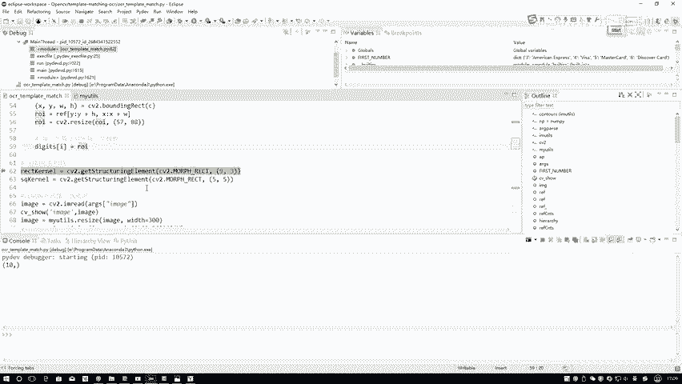

因为这里你看你看这个模板。

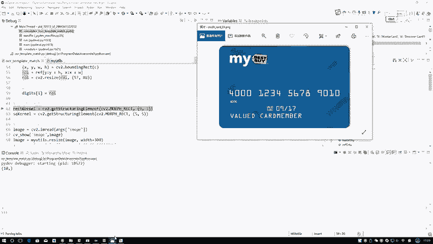

是不是挺简单的一件事，我直接直接去算轮廓就算出来，但是呢你看咱这个信用卡，我你就看这个东西它有些背景吧，背景当中是不是有些干扰项啊，而且这些都有东西，这些个东西是不是都是些干扰项啊。

所以说啊咱这个原始的信用卡数据啊，做起来没有咱这个模板做的那么容易啊。

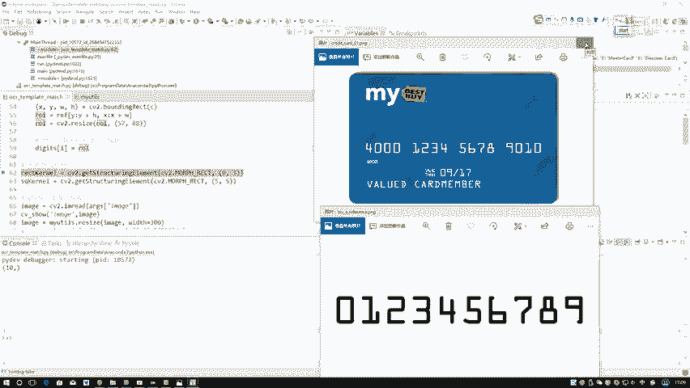

我们得对它做一些额外的预处理操作，就包括很多形态学操作，在形态学操作当中啊，我们可能会用到一些就是那些盒啊，就是这些盒在这我先定义两个盒，第一个盒大小它是一个9×3的，然后第二个它是一个5×5的。

这个呀就完全是呃，根据你实际的一个任务来进行一个，指定它这个大小的，等到时候这样吧，等到说说用，到时候咱再说指定它的核的大小，其实就是以前咱都用用那个open CV当中，给我们指定的三三。

一般都是三三吧，其实也不一定非要三三，你自己用那个CV two的函数自己去get一个核出来，其实也行啊，你指定好它合适的一个大小就完事了，然后再来看吧，接下来咱们是怎么样对输入数据进行预处理。

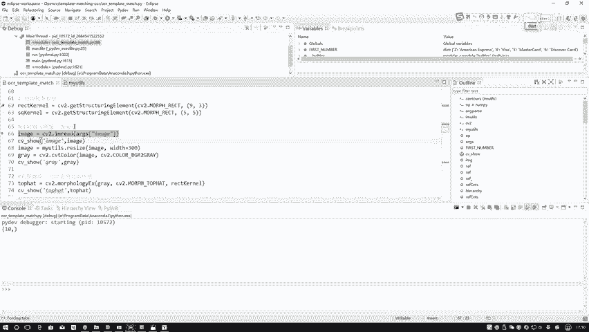

首先把数据读进来，然后呢resize成一个reset的一个大小。

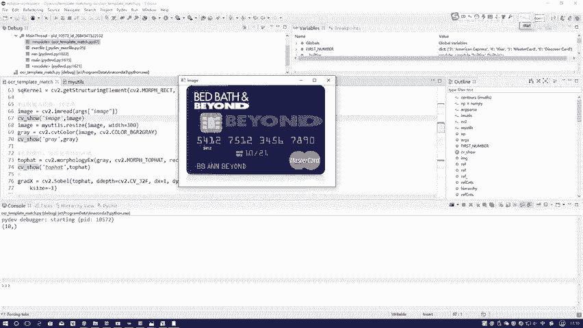

这是我读见数据有点大，给reset个小点的吧，resize并行进行转换成灰度图，这是我当前拿到的一个数据行了，拿到完数据之后，接下来咱们来想数据当中，你是不是说我希望我要一些东西。

我还希望你给我过滤掉一些东西啊，在这里咱先记住一下大概这个图长什么样子，然后执行下一步操作了，来看这是什么操作形态，学操作当中，top hat什么一个礼帽或者叫做顶帽操作吧，包括当前的报，当前刚才呃。

这个就什么就初始化这个核传进去吧，因为我们现在学操作当中，需要你指定好每一个就是进行区域的大小，一个窗口大小吧，这个窗口大小你自己来指定，根据实际任务来，你想突出什么样的区域。

我想突出的是那些字体的区域，所以说你根据哎你这个字体它的大小，或者你这字体区域大小，来指定合适的一个和就可以了，来看一下它的一个结果。

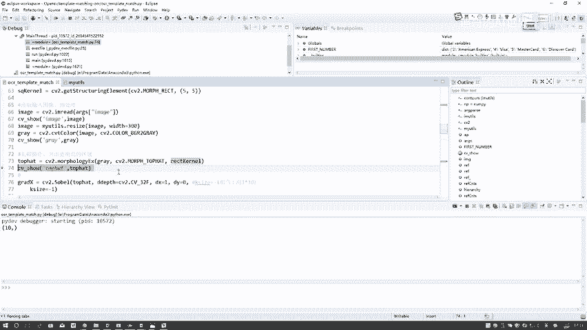

看一下吧，是不是过滤掉一些没有用的东西啊，在这里相当于我们做了一个礼貌的操作，它会我们帮我们凸出来一些啊，就是更明亮的一些区域，当然啊就这些形态的操作，你说老师啊，我一定非要按照你这个步骤去做吗。

不一定啊，就这些操作我给大家演示，主要是想把尽可能多啊，咱以前提到的东西都给大家往里去添加，到时候你可以用一些你觉着比较合适的，一些预处理方法，其实都行，预处理方法有特别多多的种类的。

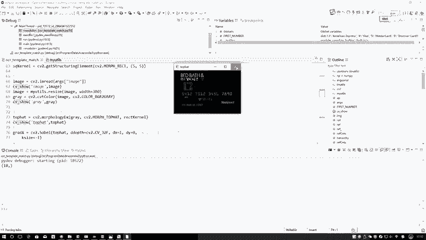

然后第一步完成了一个顶包的操作，咱先突出些明亮区域吧，第二步再来看结果，这是什么，我算了一个索贝尔吧，然后呢算了一下他的一个grading a x啊，其实这里我大概看了一下。

这里就是你算gradient的X，还可以算它的GRADIY吧，还可以把X和Y连在一起，但是啊当我在做的过程当中，我发现一个事啊，就是你只用X比你把X和Y用在一起，效果更好一些，在这里。

所以说这一块我就只用X了，而没有用那个Y，咱以前说那个索贝尔算子的时候，是不是说哎呀做一些要做一些边缘检测，然后我可以把X拿出来，然后求它的一个绝对值，然后做一个归一化，然后再求Y的。

然后再把它俩加在一起啊，在这里啊，到时候大家可以自己实验一下，但是我实验结果发现。

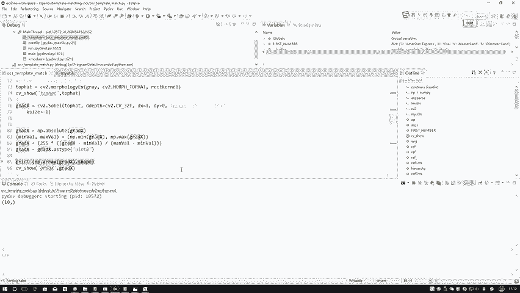

就是X和Y结合在一起不太好，所以在这里只用了X。

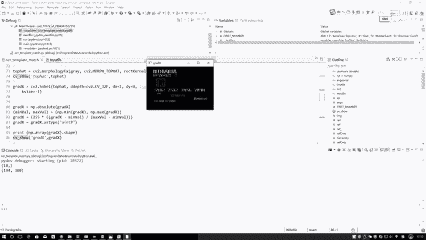

这是做了一个索贝尔算子之后，咱当前得到的结果，这些东西大家应该都比较熟悉了吧，都是我们之前跟大家说的吧，索贝尔算子绝对值归一化。

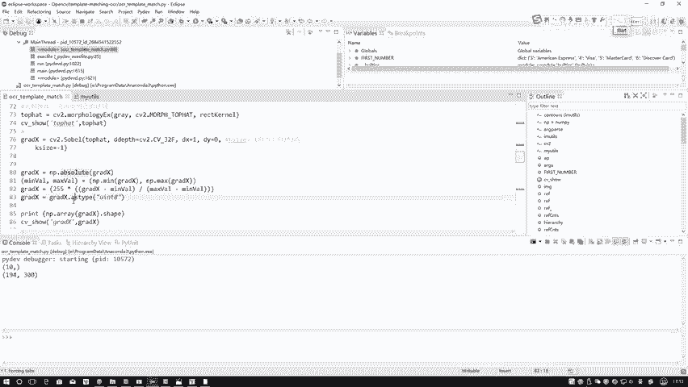

一步一步的，咱都是这么去做的吧，这一步是索贝尔算子咱得到的结果，得到了这个结果之后，那你说现在诶我要做这个轮廓检测呀，可能还不是那么特别好，为什么，因为这里我想怎么去做的，我第一步我想检测到这个组。

第二步我想就是我轮廓，我希望这是一组，这是一组，这是一组，你先给我第一步把这个几个数值，这几个组拿出来，因为在原始信用卡当中不就这四大块吗，我需要先主要把这四大块拿出来，但是这四大块感觉还有什么问题。

那你说怎么样能让这块看起来更像一个块呢，我问大家怎么样才能看上更像一个块啊，咸学当中有没有这样一个操作，好像有叫什么叫做一个B操作吧。

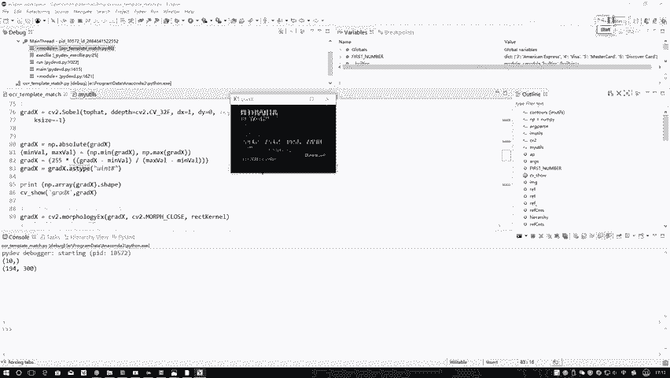

再来看一下嘶B超啥意思啊，在这给大家写出来了，先膨胀再腐蚀是吧，先膨胀，膨胀完了得都连在一起了，是不是就腐蚀不掉了。

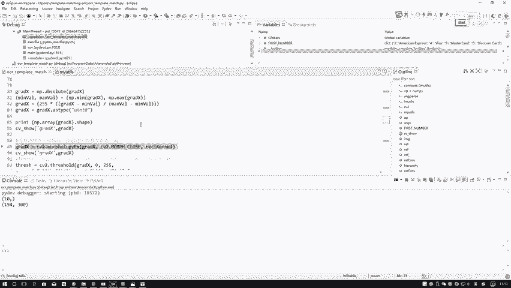

再来看一下结果，来看一下，你看当我执行完B操作之后，是不是相当于这东西像是一块了，这东西像是一块了，这又像一块了，这又像一块了，是不是感觉有有点这个意思了，哎你看是不是这个意思啊。

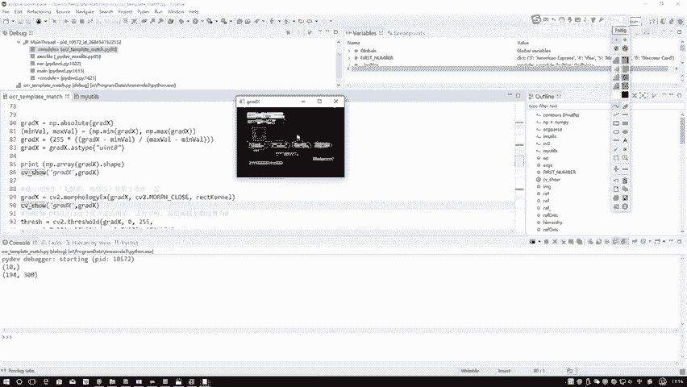

其他没用的东西，像是咱刚才看的，再看原始图像吧，这是原始图像。

那些个背景，那些个没用的，这些乱码七糟的图案，背景这些图案是不统统都过滤掉了。

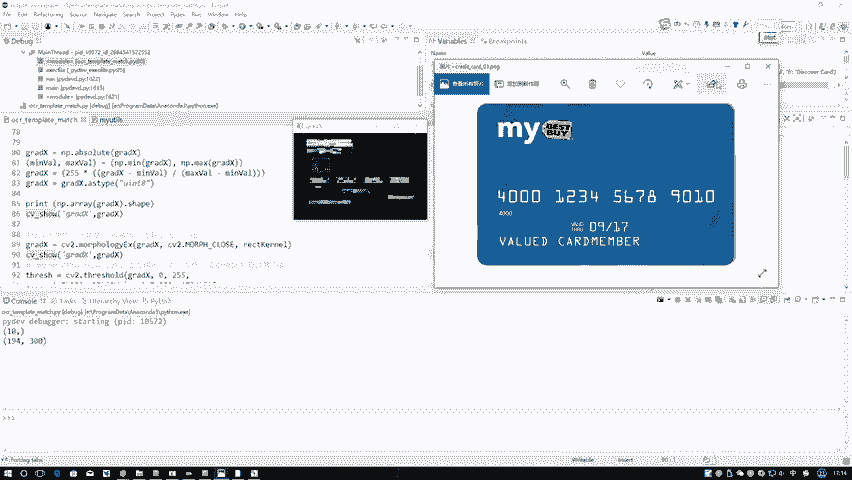

这是啊，咱现在得到了一个B操作啊，先膨胀再腐蚀完，结果目的是想将这一组组连在一起，然后呢，接下来，那你说接下来。

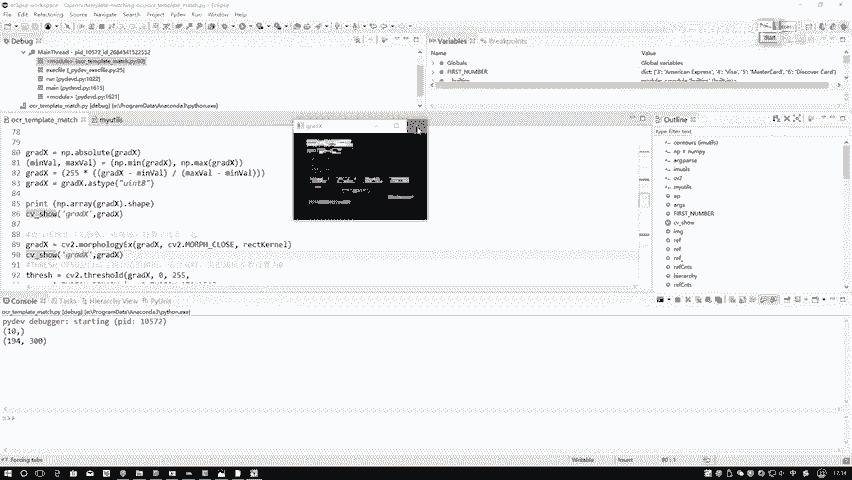

咱是不是还要做一些二值化处理啊，在二值化处理过程当中我们来看吧，二值化处理过程当中有个小窍门，就是这样，当我们啊就是比如在图像当中，图像当中比如说有两种主体吧，你想把这两种主体分得开的时候。

是不是需要你指定一个阈值的范围，在这里还有这样一种方法，你看以前咱用什么，以前的我们都是说预值范围干，要么你指定个十，要么你指定个100，那你指定个零是啥意思啊，指定零二是跟咱们的这种方法。

就OSTU这个方法也是搭配在一起的，相当于啊就是现在哎这个阈值我不太清楚，我只要什么表合适，但是呢我可以告诉你，我这个图像当中啊是有两种主体的，就是适合咱们这种双峰的形式，比如说在这里，这是一个风诶。

这是一个风，那很明显我这个阈值我就自能判断出来了吧，所以说啊在这里就是对于这种双峰的情况下，我需要让这个open CV，你自动的给我判断一下什么阈值啊，它是比较合适的。

所以说啊在这里你看我把这个方法给加进去，并且呢就是你把这个阈值整成零，相当于啊让系统自动的给我做一个判断，不是说啊咱拿零做判断，而是说让咱们这个open CV自动的去做判断啊。

一定要知道这件事不是拿零去做，而是去做自动的这个适合咱这个任务，双峰就找出来哪个有用的，哪个没用，牵扯背景吧。

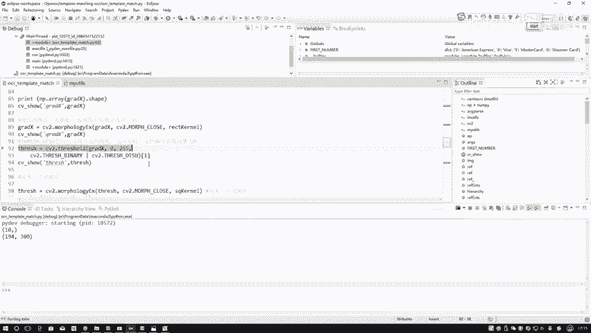

来看下结果，那你看当前这个结果，是不是说我这个20万之后，黑色的那一会就没啥用的，白色这个东西就是我想用的一个结果啊，在这里我们再来看一下，在这一块当中啊，哎你看这个就这个里边的这这些个东西。

给我的一个感觉，是不是好像里边还有个大空，这还有大空呢，这有大这还有大空，怎么能把这个大空你再给我填充的，就是严实一点，或者说把这个东西你再给我用白色的给我，怎么样给我填起来吧。

是不是要做这样的一个意思啊，这不是说我拿画笔就给它填起来啊，你看现在好像我拿画笔给他填起来了，是不是说我让这个用open CV的方法去做啊，什么方法能做这个东西啊，那应该又是一个B操作吧。

所以说啊当我们进行了一个啊。

就是阈值化处理之后啊，咱们再得再来一个B操作，我们再来看一下刚才这里啊。

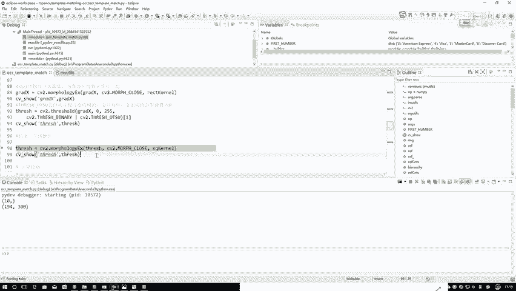

就是再来个碧桃的之后，你看这些个一些缝隙啊，是我们又填充进去了，所以说啊此时我们在检测它的一个外轮廓，应该还是更准确一些的吧。

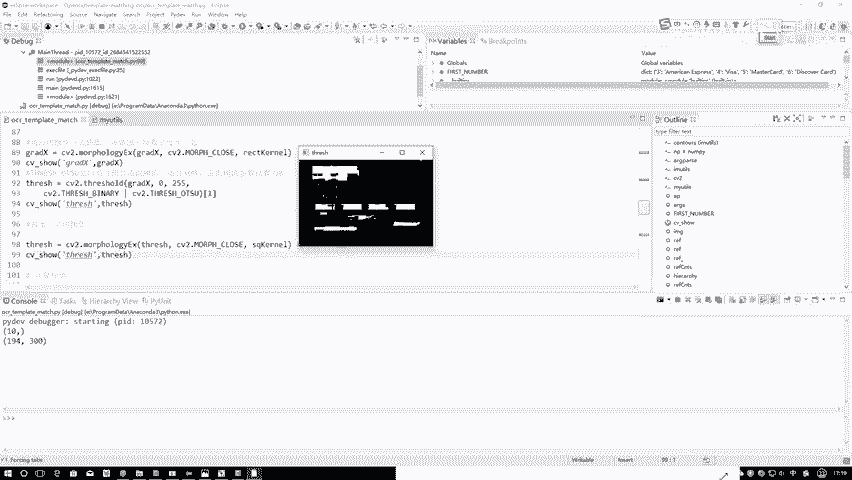

这就是我又执行了一个B操作，然后呢，接下来接下来我要计算这个轮廓吧，咱刚才是不是跟大家说了一下，计算轮廓这个函数啊，这里咱就不看了，计算轮廓，计算完轮廓之后，我把这个轮廓给它画出来，再来看一下呃。

看一下咱这个轮廓，这里你看我把所有轮廓都画出来了，但是此时啊你看这个轮廓就是这张轮廓啊，就是我画的时候，我是在那个原始图像当中去画的，所以说这是个这是一个那个彩色图，没做那个就是各种各样处理的时候。

但是呢我们就是计算轮廓的时候，他是已经执行完这些处理之后才去计算轮廓的，就这里啊你看threshold当中去计算轮廓吧，但是只不过我在画的时候，是画在原始图像当中啊，大家别看这个图。

就以为是你是在原始图像当中计算轮廓，又画的，不是啊，是经过了那么多个处理之后计算出来轮廓，把这个轮廓画到原始图像当中啊，是这个意思，那你看我现在画出这么多轮廓，那这些轮廓当中好点多。

是不是有些啊都不太规则的形状，有些可能不是我想要轮廓，那我是不是得把这些轮廓做一些过滤啊，这过滤掉什么啊，就是只我只要就能换一种笔吧，换这东西我这不能还不用蓝色的，换成绿色吧，我只要这几个轮廓。

只要这四个轮廓吧，因为这四个轮廓才是一个数值。

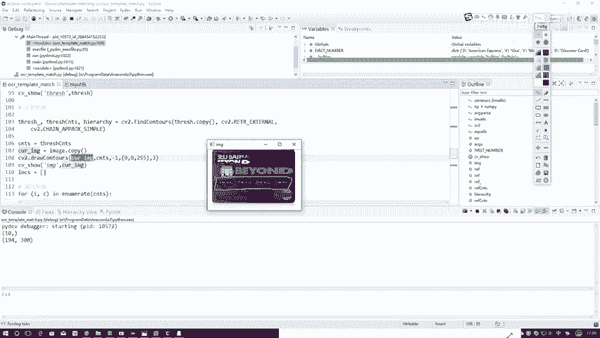