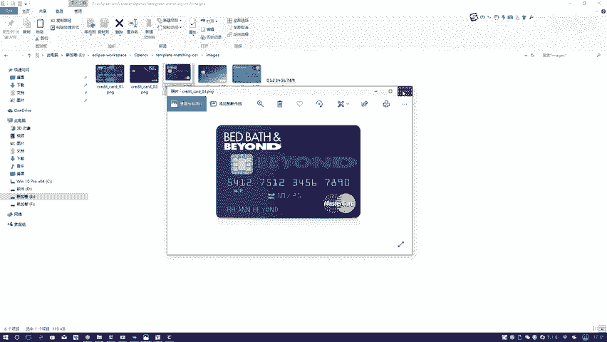

# P35：5-模板匹配得出识别结果 - 迪哥的AI世界 - BV1hrUNYcENc

那接下来咱再来看在这一块，我写了一个locations啊，就是我一会儿要往这里填，进来一些实际有价值的区域，或者说我想要的区域了，在这里第一步我去便利咱当前这个轮廓，在便利过程当中，那你想我这个轮廓。

我是不是也要去计算它的外接矩形啊，因为我要对这个轮廓像我该咋说的。

再来看这个图像，在这里啊，我是不是最开始跟大家说，这个轮廓怎么去判断数理，判断它的一个长宽比，这个长宽比和上面这个长宽比是不一样的吧，所以说你要得到这个长宽比，得到一些它的轮廓特征。

你得先把它的一个外接矩形给做出来吧，第一步外接矩形给我做出来，下一步算它的一个比例，你看这不算比例吗，算它比例过程当中啊，这个你就根据实际任务来吧，做了一个判断，是不是通过这个判断。

我可以怎么样把符合的给他留下来。

这里啊，这个比例到时候大家可以自己来去改改一改，调一调比较合适的值啊，在这里我设置了两个，设置了一些值，做了一些判断，判断完之后再来看一下吧。

在这一块我给你跳进去，哎呀这里边没有画图是吧，嗯那这里边咱不看了，这里我没有画图，就不给大家去看一个轮廓了，就像我刚才说的，他会通过这种判断方法，把每一个轮廓怎么样，对于每个轮廓进行判断吧。

那最终啊就是符合轮廓，我就传全部存在这里了，看有几个，这是第一个，第二个，第三个，第四个，一共咱是不是就是四组那个数字的，我是轮廓数不全算出来了行，那现在我们已经把轮廓全给他算出来了，轮廓全算完之后。

我再把轮廓进行一个排序。

就是什么样，在这里咱们现在不是有14个轮廓吗，排序之后这是第一个，这是第二个，这是第三个，这是第四个行了，咱现在有四个大轮廓了，那你说咱怎么做模板匹配啊，我拿这个一号大轮廓呃。

去跟我当前这个模板当中的每个数值，进行匹配吗，不是吧，我需要在这个第一个大轮廓当中，再分成这么几个四个小轮廓，对于每个小轮廓跟这十个数再进行模板匹配吧，只要做这样一件事啊，行了吧，不用这个原谅色了。

用换红色吧。

在这里啊，我们再接着来看，就是我要去遍历其中每一个轮廓当中数字吧，来看每一个轮廓当中，这是其中每一个轮廓，把每个轮廓什么XYWH我全拿出来吧，相当于你先把这个轮廓告诉我，先把第一个轮廓拿出来。

第一组数值啊，第一个轮廓给它拿出来了，拿出来之后呢，我需要根据这个轮廓把它这个轮廓定位到吧，在这一块有个什么减5+5，减5+5啥意思啊，你这个轮廓啊。

可能给的是正正好好的这样的一个区域，但是呢咱拿的时候你稍微啊给它多一点是吧，往上那么一丁丁，往下那么一丁丁往左一丁丁，往右一丁丁啊，这个意思你看一个减5+5是不是相当，这块两边都是减5+5吧。

减55是不是相当于无论是X和我的一个Y，都相当于往外扩一点啊。

别那么就是贴上去给它稍微往往外扩一点啊，这样是保证咱没啥问题的，行来看第一个轮廓是这么小，第一个轮廓看有点小。

第一轮廓是什么，最上面这个东西它减哎哪去了，这里他是什么。

5412吧，这是我得到当前我的第一个轮廓，它是什么，5412，然后呢，第一个轮廓完之后，我要干什么，对第一个轮廓进行一些处理吧，那是不是要对第一轮廓，找到当前这个轮廓所对应的其中每一个数值啊。

那你说是不是还要在第一轮廓当中，进行一个轮廓检测，找到每一个小轮廓啊，计算方法是不一样的，在这里我给大家快速的看一下，第一步预处理二值化是跟之前做法一样啊，来看看二值化结果。

这是二值化结果升5412了吧，行了，二值化完之后是不能计算轮廓了，还是检测它轮廓，检测完轮廓之后，是不是还要进行一个排序，从左到右进行排序吧，排序完轮廓之后，我接下来要算的是不是。

就是轮廓当中的每一个数值了，在这一块你看我会得几，我会得到几个，应该是四个吧。

就在这里哎，哪去了，这里一组是四个值吧，会得到四个吧。

所以说这一块现在for循环当中，我要对四个当中，每一个分别进行计算和匹配了吧，做法跟咱之前啊都是一样的吧，还是要先去把它的一个外接矩形找到，然后找到矩形当中，然后我就把这个矩形得到reset成一个大小。

这个57和88，大家看属不属项，注意一点，就是咱之前啊在做那个模板的过程当中，我第一我第一，我前面这一步，是不是还对每一个模板reset成这个57，88大小了，所以说啊咱一会儿要做这个模板匹配。

看他俩看这个数到究竟到底是几，那你说它的大小，是不是得跟模板大小一模一样啊，还是这个五十七八十八吧，在这里啊，这个五十七八十八就这么来的啊，表示着咱要做模板匹配，它的大小都是一样的行。

那咱先来看一下第一个数，这是在咱们这个一组当中的轮廓里边，第一个吧，第一个是几啊，第一个看这个数应该是几，应该是个五吧，第一个数应该是五行了，那五算出来了，那你说对这个五。

我怎么样能让计算机认识它是一个五啊，那是不是说对于当前这个图像，我要跟我对这个模板当中的这十个数，一个进行匹配吧，再接下来我先指定个这个得分就是得分的list，一会儿咱们有十个数嘛。

看看它属于零的得分多少，属于一的，属于二的，依然属于九得分多少，那谁高得谁吧，接下来在我这个模板当中就算呗，对模板当中的每一个每一个，我是不是用CV two match template当中。

咱们给大家说了，在这里我们用一种方法，就是其实方法用用什么方法都行啊，到时候大家我们CV是不是提供六种方法，都是大家都可以自己指定，我在这里我们用的是那种校园系数RI，来看RI是谁啊。

是不是当前我找的那个五啊，然后呢这个这是什么，这是我模板该做好的吧，你看这个字典当中是不是做了01234，分别是什么呀，这里边我做的第一个是什么出来，第一个是零二，看这个五和这个零。

它的一个模板的得分等于多少，把那模分把min max location result传进去，我把score值拿出来，它是不返回四个值啊，min啊，这什么min max。

然后还有一个min location，max location这四个数吧，在这里什么location这个东西我都不关心吧，就关心比如说相关系数，就关心最大值得多少就完事了，最大值啊，当前最大值拿出来了。

这是什么，对于零来说吧，跟零匹配完了，跟一匹配，跟二匹配，跟三匹配，是不是道理是一样的，在这里咱一共模板当中十个数吧，那是不是说它需要跟十个数进行匹配，匹配完之后。

我这个score当中是不是有这十个值啊，那这个十个值当中，你说我现在想娶谁，我是不是想取一些，比如说呃最大的那个数是吧，比如说你要取大的，就取大的，如果说你这个方法当中取小取小。

这个方法你用什么都是无所谓的，就是不是不是无所谓吧，用什么其实都可以的，在这里，但是大家注意点，用的方法一定要知道你是取大数还是取小数，在这里咱取最大的那个数就行了，接下来我找到一个最大的最大过程当中。

找到第一个数，那数完事了，这一步当中return，你看有判键什么五吧，所以说第一个数匹配完了，它又是个五，那第二个呢来看这是四吧，对于四来说啊，你就这么匹配去呗，匹配完之后直接看吧，最后是几。

再来看是四吧，那一步一步这么操作完去，是不是会把所有结果都匹配完啊，当这个所有结果都匹配完之后，我这块我接着往下跳吧，这是一匹配完了，然后呢，这是什么，这是二匹配完了，当这部匹配完之后。

接下来他会怎么样，他会把这个框给它画出来吧，画这个框，这就没什么可说的吧，很简单，一个数，把这个框画出来，Three v two，画一个框，放一个test，把这个数写出来，这些都没有什么结果吧。

对这些都没有什么难度吧，然后把第一个框的结果5412传进去，表示第一组数我5412给他算出来了，数完事了，第一组数算出来之后，第二组数，第三组数，道理是不是一模一样的，这样咱就能把所有结果。

一步步的全给它做出来吧，你看这块，接下来就一步步把每个结果都做完了吧。

在这里啊就给大家从头到尾哎，到这步其实就完事了，最后打印不用我说了，最后展示结果就可以了，到这里啊，我们就把所有的流程都给大家，从前到后的去说了一遍，其中啊就包括了每一步啊，咱们该怎样进行处理。

最后再给大家从头到尾看一下吧，咱的一个流程流程就是run当中。

它会给大家显示每一步，我不是画这么多个东西吗，为什么都画出来啊，正常情况下不用画这么多，但是为了给大家演示每一步做什么东西，主要就是把之前咱所学的那些前线学操作哎，那些边界怎么样进行提取，轮廓怎么计算。

都给大家捋了一遍，以及呢咱这个模板匹配啊，该怎么样完成这样一个实际的任务。

模板拿过来，模板预处理模板。

轮廓检测，检测完要外轮廓，外轮廓要外接矩形，原始数据输入进来。

对它进行各种各样处理，想要学各种样操作，目的就是使得我轮廓检测。

能够检测的更准确一些啊，这个意思检测完之后呢，对检测出来的框我要做一个过滤，找到一些比较合适的位置，基于我的长宽比，然后呢找到第一组数，第一组数当中，对第一组数当中的每一个5412，检测好出来了。

导71512，这样不断执行完之后啊，咱就可以把每一组数的结果，全部啊给它做出来了，这个就是我第一个信用卡的结果啊。

这块已经给大家写出来了，那你说我能不能换一个信用卡啊，行再换一个，这块不是有一个0102030405吗。

在这里咱就可以换了。

这个过程当中你可以去配置一下配置里边，你把这个东西这不零三吗，你改成个零四。

apply一下，run一下，这回咱模板都是用一样的，我只拿这样一个模板。

但是这个数不一样，这个数是400123456789010啊，这个数你看这是预处理满的一个结果。

框起来，对于每个数我也去找，找到每个数，最后再给画出来就完事了，咱看一下它的结果吧，这结果吧460012345678910，没问题吧，所以说啊这个就给大家说了一下，当我们拿到了一个信用卡。

信用卡卡片之后，怎么样基于模板匹配这种方法，把其中啊每一个位置的数字检测出来，主要分两步，第一步定位到数字在什么位置，第二步基于定位好的区域，在模板当中去匹配它到底是一个什么样的值。

最终呢把这个结果进行展示啊，就可以了，这个啊就是我们的一个啊全部内容。

跟大家说了一下啊，怎么样去做的啊。

这个啊到时候大家也可以自己玩一下这个模板，觉着嗯是跟给定的是跟这个信用卡恰好匹配的。

如果说大家想做一个跟车牌啊，比如你要做一个车牌识别。

其实啊原理啊都是一个类似的做法，都差不多，用我们这些en CV当中最基本函数啊。

