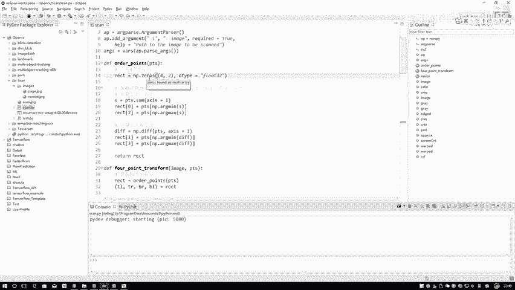
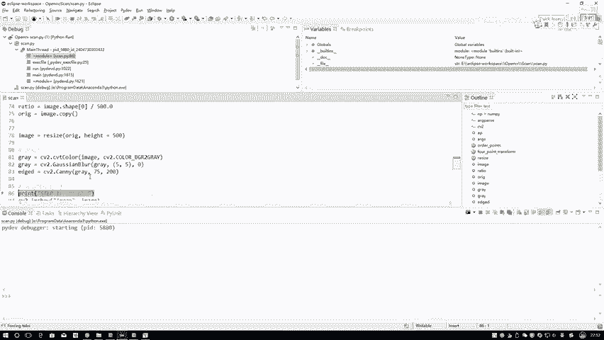
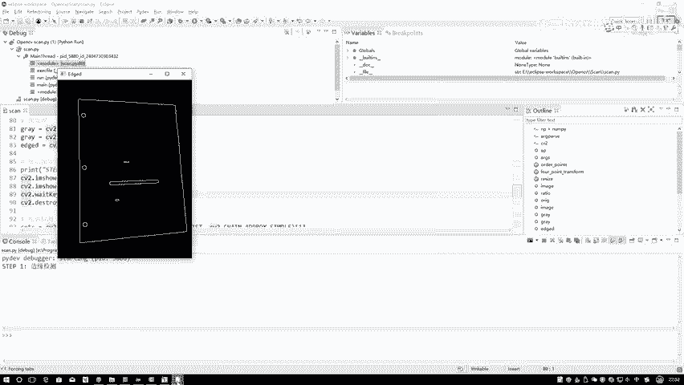
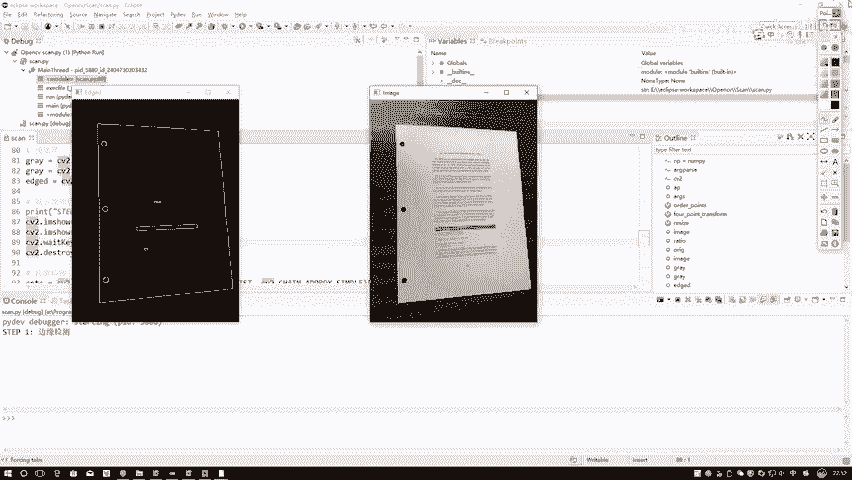
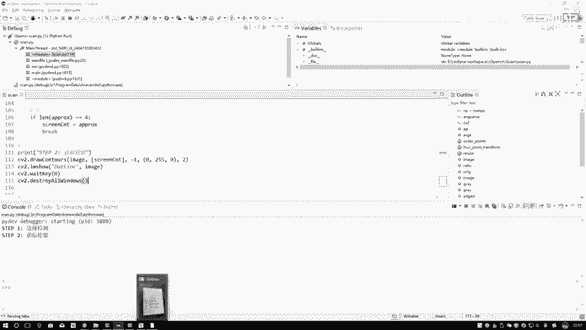
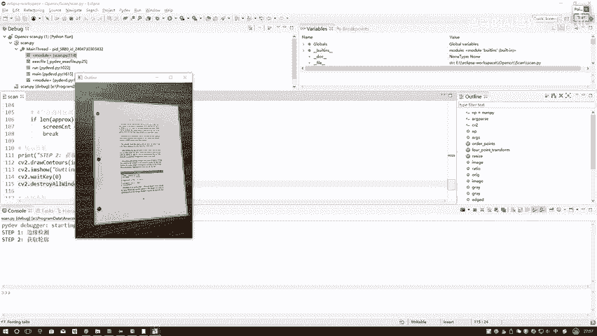
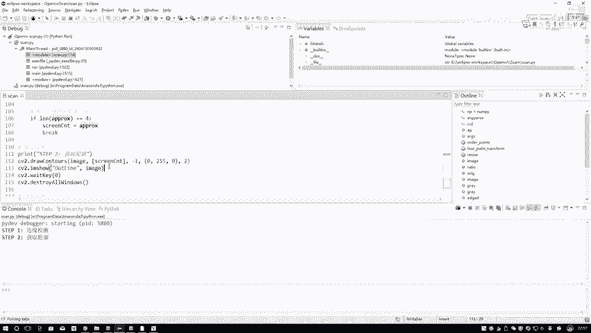

# P36：2-文档轮廓提取 - 迪哥的AI世界 - BV1hrUNYcENc

嗯那接下来咱们来看一下吧，就是咱们这个嗯整体的东西啊是怎么去做的，打上断点，然后跟以前一样，咱们还是debug去看嘶，这里边有几个有几个函数啊，就是我们一会要用的，其中主要的就是包括了咱那个透视变换。

透视变换过程当中啊，一会儿嗯咱们得求一些坐标值，还要做一些转换，稍微麻烦一点，等咱们一会看的时候跟大家说一下，其中每一步我们做一件什么事，第一步呃先把我输入数据读进来，就是当前的一张图像啊。

随便一张图像读进来就可以了，第二步呢，因为一会儿啊，我要对输入图像进行一个reset操作，那大家可以想，就是你对输入图像进行了一个reset，操作完之后啊，如果说你的图像当中涉及到一些关键点。

那你说你把这个图像放大个三倍，那你里边的一个相应的坐标点，每一个点是不是也会经过相同的一个变化呀，事实上一个事儿吧，所以说此时啊我先算出来这样一个比例，相当于啊我reset完之后图像变了，然。

但是呢我想知道这个比例，因为最后啊我是想对原图诶，再执行一些变换操作，所以说当你在落到原图的过程当中，你就得知道你这个resize做了多少比例，它相当于把我坐标诶改变了多少，改变1。5倍，改变三倍。

咱先知道这样一个比例，到时候咱会用上的，在这里第一步我先把这个比例给他算出来，因为一会儿呢咱们在指定过程当中啊，这个shift0是什么，它是个H吧，就是咱们这个resize是H变成1。5倍，W变成1。

5倍吧，所以说按这个比例啊算其中一个就可以了，我指定一个H它等于500，那这个宽它会自动的帮我们进行一个计算，首先第一步我去拿到当前的一个copy，这个copy啊，一会儿咱们要去用啊。

这就是相当于啊最后我做变换的时候，是拿这个copy这个东西去变的，咱们现在还用不上，在这里第一步执行一个reset，reset reset函数啊，在这里也给大家写出来了，其实很简单。

通过你指定的一个H去算一下比例等于多少，基于比例去算一下你相应的什么，相应的一个W和H最终的一个结果吧，3755百，最后要执行这个reset的操作就完事了，接下来我要做一些预处理了。

预处理操作跟咱们嗯之前操作啊都是差不多的，第一步转换灰度图吧，这个不用说了吧，太基本的一个操作，第二步，那图像当中那想都不用想，肯定会有一些噪音点吧，先通过一些高斯滤波操作，我们可以啊。

先剔除掉一些干扰项啊，在这里先做一个高斯滤波，帮我呀去去掉一些噪音点，接下来，接下来咱们在刚才给大家呃，演示那个demo过程当中啊，是不是说我们第一步要做一个边缘检测呀。

因为之后我要做的是一个轮廓提取吧，所以说首先第一步，我先去检测一下它的一个边缘。

检测完变案之后，咱可以展示一下当前我的一个结果。

这个就是当前结果吗，右边这个东西它是我的一个输入，左边这个东西，它就是我这个呃边缘检测得到的结果，那你说这里咱要哪个，我要的是最外面吧，就是轮廓检测过程当中，一会儿我应该要是最外面这个东西吧。

马上我们就来看一下轮廓检测的结果，这是现在我先通过边缘检测，然后呢边缘检测完之后，咱要执行一个轮廓检测吧，螺纹检测啊其实很简单，你把你当前啊边缘缘检测的一个结果，点copy复制过来，这就完事了。

然后呢执行完这行代码之后，它会给我检测到很多个轮廓吧，在这里啊，咱不用那么多轮廓，我们来看什么，刚才那个图当中哎呀刚才那个图片没了，咱们给大家画一下，这个就是这个是这个是那个大图。

然后这个图当中是不是有一个小图，歪歪扭扭的，然后这条红色的线我说是它的大轮廓吧，其中还包括了一些小轮廓，是不是在这里，你说我可能有多个轮廓，那我们要哪个呀，咱检测到轮廓。

结果就是当前这个结果它是好几个轮廓，但是呢我想要哪轮廓，应该是最外面这个轮廓吧，那最外面这个轮廓它有一个什么特点啊，它最大的一个特点，最外面的一个轮廓它应该怎么样，首先第一点它的一个你算它的一个呃。

算它的周长，算面积都行，或者是算它的一些外接的东西，肯定它都是最大的吧，在这里啊我们只需要排序一下就可以了，按照什么排序呢，按照一个内接，就是一个外接矩形，或者按照一个周长。

或者按照面积来进行排序啊都行，在这里你指定一个key，相当于我们当前啊对我检测到这些轮廓，要进行一个排序的操作，排序操作目的在于这里我们要找什么，其实要找最大的，在这里咱先执行这样一个排序。

其实就是对于你的一些任务来说啊，我们可能怎么样，我们可能在一篇文章当中，我这一块儿放个小票，我这一块也放个小票，我这一块也放个小票吧，没准是不是有三个小票啊，有三个小票过程当中。

那你是要检测出来前三个最大的一个轮廓，是这样一个事吧，所以说我现在经过排序，取了前五个在咱们任务当中啊，为大家准备呃，就是多个小票在一起，到时候大家你可以自己找一找，或者是你自己拿个相机拍一拍也行。

接下来我是不是找这个轮廓啊，我在这里我要去遍历每一个轮廓了，在遍历每一个轮廓的过程当中啊，我要算什么，我是不是要找出来最外面的那个东西啊，咱们来看吧，首先第一步我算什么，我算它的一个就是呃。

要去计算它轮廓的一个近似，你可以先把这个轮廓它的一个长度给我拿出来，先算它这个长度，然后呢我们来看一下这个函数之前给大家说过，就是有了轮廓之后啊，由于这个轮廓，它可能就是大家可能看到它是一个完完整整。

就是一个矩形框，其实你仔细看它不一定就是一个矩形吧，它可能就是一些点，它就有可能就是一些轮廓点组成的一个结果吧，那这么多轮廓点组成一个结果，这东西啊我想去算的时候不太好算，我可以干什么。

我可以对它做什么，做这样的一个近似吧，那对它做完近似之后，那比如这里我们做了近似之后，是不是相当于得到一个矩形啊，那对于一个矩形来说，哎大家来想矩形有几个点，一个两个三个四个矩形一共有四个点吧。

那对于上面的图形来说呢，我们是不是都可以做一些近似啊，如果大家能记住刚才那个图形的时候，在图形当中是不是还有一些圆，还有些什么乱八七糟的东西啊，那此时我在这里都做了这样一个近似。

如果说来近似完之后再来判断啊，再说一下近似的几个参数，第一个参数我写一个CC是什么，我当前的每一个轮廓吧，每个轮廓你要传进去这东西是什么，这东西咱刚才算了一下它的一个长度吧。

然后呢中间啊不是不是不是不是长度，这东西这个第二参数，第二参数不是长度，第二参数是你要传进来的一个精度的一个控制，他现在这个事儿，它表示的是就是从你原始轮廓到近似轮廓，最大的一个距离。

这个距离就是你指定的越小，你的一个轮廓就是越精致，指定的越大，你的轮廓就是越规矩，大家能感觉这样一个东西，因为指定越大，那可能就是一个矩形吗，直径越小，它可能是个多边形吧，这个就是你指定它的一个精度啊。

在这里用我对它的一个长度的2%，来当做它的一个精度了，一般情况下的我们都会先计算一个长度，而是用长度的百分之多少，来当做这个精度的结果，而不是说你就是随便写个十，写个八啊，写个100。

这个是根据不同的轮廓来去定义的，所以说你需要先算一下它的长度，基于长度百分比来去做计算啊，默认情况下咱用2%就差不多了，然后接下来咱们再来看这个执行完之后啊，是不是有什么，是不是我会得到一个近似啊。

那得到完近似结果之后，我要来去判断了，此时啊我们来看一下，如果说这个轮廓近似完之后得到四个点，那是不是说我得到一个矩形啊，那对于咱这个小票这个东西来说，那矩形那不就是我想要的外面这个轮廓吗。

得到菌次之后，我把这个轮廓就把这个矩形拿出来，break掉就可以了，只是这一步我得到什么得到这个东西啊，咱来看吧，这是我刚才近似完得到的一个结果吧，然后指定个一，我全画哦，把这个东西金色轮廓拿出来。

然后再来看一下它绘完图之后的一个结果哦，哦这这里还没出来，哎这里出来了。

这个就是我绘图完之后得到的结果吧，这个绿色这个东西是不是就是我当前得到什么，这不就是我当前得到的一个结果吗，我现在把我所需要或者是我的一个RI区域，已经给它标识出来了吧，这一步啊。

就是通过啊，我们的一个近似去找到了我最外层这个框，就是通过近似它只要四个点，我把这个东西给它找到，这就完事了，这个就是呃我取出来近似之后。

