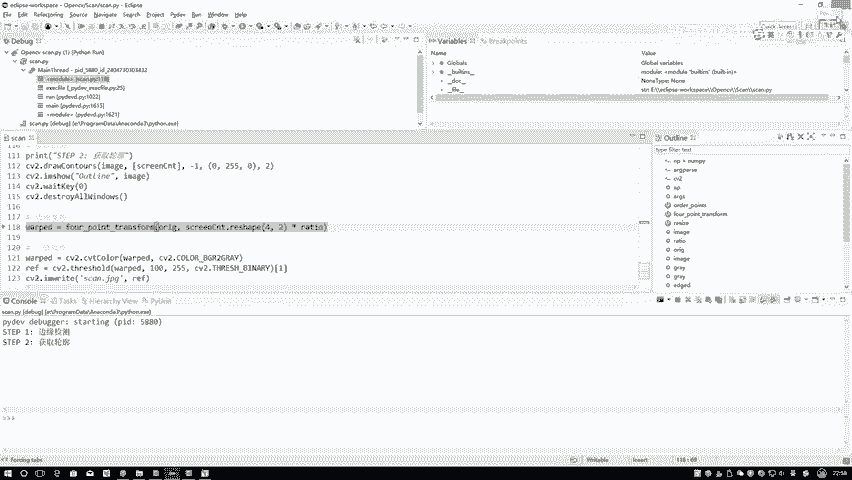
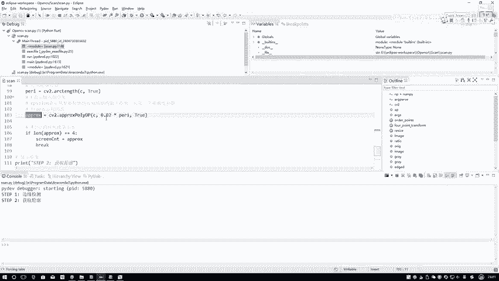

# P37：3-原始与变换坐标计算 - 迪哥的AI世界 - BV1hrUNYcENc

取完之后呢，咱们再来看哎，接下来我把这个把这个关掉，然后接下来咱们要做什么，那你看现在我把这个轮廓，其实我已经给它框出来了，那下面我是不是说给它进行一个转换就行了，让它按照一个规规矩矩从上到下。

就是像是一个电子文档，一个PDF的格式，就像一个你看电子书似的，好好的给你转换成正常的一个形式吧，因为一开始我们角度是随机的，在这一块就涉及到我们的一个透视变换了，在这个透视变换当中啊。

咱们F5跳进去一下，跟大家说一下呃，他都需要哪几个东西，这样先给大家看下参数吧。

我先直接跟大家说吧，他需要两个参数，就是做这个透视变换，透视变换是这个意思，比如说一开始这个图像歪歪扭扭的，在图像当中这个位置。

接下来你需要给它做转换，转换成规规矩矩的，就是这样的一个样子，那在转换的过程当中啊，你需要得到几个几个点啊，就这里比如说我我写我写几个点吧，我写一个A这是B这是C这是D诶，这四个坐标点我需要知道。

也就是说，你当前你刚才不是做了一个轮廓检测吗，是不是近似，咱咱得到四个点啊，就是近似完结果那四个点ABCD，你得给我传进来，还要干什么，这一块它是通过一个矩阵，比如说我通过一个M矩阵做一个变换得到的吧。

咱先不管这个矩阵事，那输出结果是什么，输出结果其实也是这几个点ABCD，我写一个EFGH可以吧，那也就是说啊，现在我需要两组坐标，这是我的第一组坐标，这是我的第二组坐标，第一组坐标就是我当前呃。

我的一个原始输入当中给我框架那个轮廓，它的一个坐标，第二个呢坐标就是你想得到的一个坐标，那我可以问问大家了，你看你想得到的坐标，咱们怎么得到的，那我问大D这个点是什么，E这个点应该是个零零吧。

那F这个点是什么，F这个点如果说一直点00F这个点零二，我说这是个W这是一个H它应该是个0H吧，那H这个点呢H这个点就是第一个点，它是一个，我看下第一点它是一个哦，我看一下第一点哦，对对对，这块写错了。

这块它不是一个0H啊，这块应该是一个W，W什么这块它的一个X应该是个W吧，他应该是个W0，那H点呢H点它应该是个0H吧，这一点呢G点它是一个WH吧，这个就是我们说，我们最终要想要得到的一个坐标吧。

所以说现在我需要算几个东西，第一个原始坐标我有了，第二呢我需要知道它的一个H，它的一个W我就能知道我想去算，我得到最终的一个结果，它的一个每个坐标值了吧，这个就是咱们一会儿要去算的一个指标。

然后再来看一下吧，传来几个数，第一个数第一个数是什么，咱们来看一下原始输入的一张图像吧，你看这是原始输入一张图像之前我copy了一下吧，第二呢，第二个就是我刚才再来可以看一下这个结果。

这也是我得到四个点那个轮廓吧。

那这不是就那四个点吗，这四个点的结果我要拿到手，它是4×2，表示四个点的坐标。

每个点都是XY吧，然后这一块你为啥乘上一个比例啊，real这个东西啊。

再来想一想，哎你再来想啊，就是这个RACHEL这个东西，你这一步得到坐标点是在什么上的。

咱们来看是不是说首先第一步做一件什么事，我对图像做了一个reset操作啊，reset完之后图像大小是不变了，那你得到的这几个点是不是也变了呀，但是呢你这个我该传的这个orange图像，就是原始图像。

原始图像它是不是imagine点copy一下啊，所以说他没做resize吧。

那咱们来想，你没做reset之前，你的坐标点是得这是没做reset之前。

这个坐标点是做了reset之后得到坐标点，你是不是要把这个坐标点还原回去呀，还原回去你这个比例怎么去做的，我就怎么还原数不就完事了，所以说这一块相当于又把我得到这四个点，还原到我原始的输入图像当中了。

这个意思3F5跳进去看一下呃。

我们这个透视变换啊，他是怎么去做的，首先第一步。

第一步这个pd s啊，这是什么，这是我们刚才说了，我刚才做了一个轮廓检测，又做了个近似，我得到了这个AB嗯，咱咱好，咱重新写一会儿。

咱是按这按照这个顺序啊，这是A这是B这是C，这是D啊，咱一会删照这个顺序去写的。

然后先把这四个坐标传进去，指出有四个坐标了，四个坐标分别是什么T这个TL什么意思啊。

top left是吧，我给大家画一下吧。

分别指定一下，这里第一个是一个什么tr吧，top left嘛，第二呢是tr top right，第三个呢第三个是bottom right，第四个呢是bottom left，注意一下我的顺序啊。

我写我还是我还是写1234吧，这1234咱按这个顺序去做的，首先第一步咱们来刚才在在说的过程当中，哎，我是不是说我得计算一下W，还有H它分别的一个值啊，W是什么，我当前的这个区域它的一个宽度H呢。

它的一个长度，因为咱们刚才是不是说你是不是得一方面哎，这这这条线画的不太直，从重画一条线吧，咱们是该是不是说一方面，你得知道当前他的一个W好做这样一个转换啊，因为我一会要我要一会再做这图。

视变换过程当中，你得给我输入两组参数，第一组是原始的，咱已经有了，第二组是要变换完之后的，变完之后，那肯定这个点是002，这个点是WH。

所以说咱需要这个WH吧，在这里要算它的一个宽度。

宽度怎么算啊，我们来看一下吧，其实宽度那不挺简单的吗，只要你有了这两个点是吧，有这两点之后，我们基于两个点的一个距离。

就能把当前的一个宽度算出来吧，比如说这里两个点吧，你看他是什么，我这我再写吧，Top left，Top right。

这是这几个值吧，再来看一下，第一个是BR减bl b r减bl这个东西吧，它的一个什么平方项加什么加上BR啊，这是这是X这是BR这是BR0嘛，这是BR1嘛，这是X之间的一个差异，这是Y之间的一个差异。

加在一起开个根号，这是个什么，这不就W1吗，那上面还是不是还有W2啊，咱是不是现在做了一个近似，你敢保证它就是一个矩形吗，不一定吧，它可能是个就是它可能是个多边形吧，或者或者是一个四边形吧。

那此时你是不是得把W1W2分别算出来。

然后呢我去比较一下，那你说一会儿当你要转换完之后，你说你的W应该用谁啊。

W1和W2当中大的还是小的呀，应该是一个大的吧。

别出现什么问题啊，所以说咱用大的，在这里我们就算了，这一步首先算了一个WAWB。

然后呢我要去比较一下他俩当中哪个，它俩当中一个大值吧。

那这个是我们去算他的一个W，那对H来说是不是一模一样的。

在这里还剩这这几个指标值，范二是一样。

我现在是不是就可以算出来一个max h，还有一个max w啊，那一会儿我要得到的结果当中。

HW我是不是都有了，那接下来咱看一下吧，我要写什么，这是一个就这个东西，这这是PTS我的一个输入坐标，这是我想我想写出来。

我想经过变换完之后，我得到的一个坐标，看一下二吧，这个东西就像刚跟大家说的第一个点是什么，带对应来写D点零零吧，第二点呢它的一个宽度，这是一个W吧，宽度减1-1，是为了咱保证这个东西别出现错误。

所以说又做了一个减一，然后呢第一个也是零吧，那第三个点呢，第三个点它是什么，它也是一个W，这是一个H吧，这个点呢这个点它是一个零，然后一个H就完事了吧。

我是不是把我的目标点写出来了。