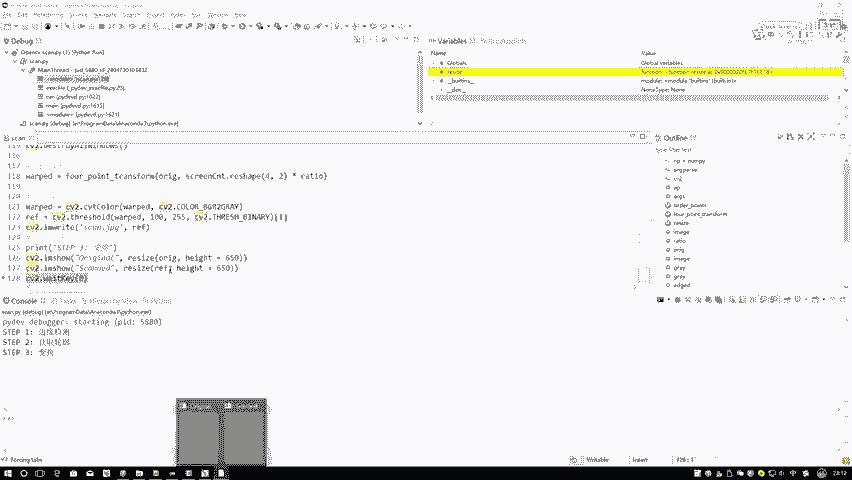
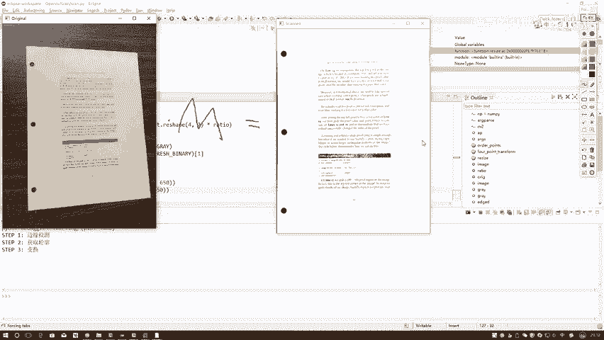
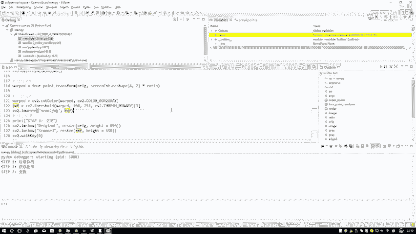
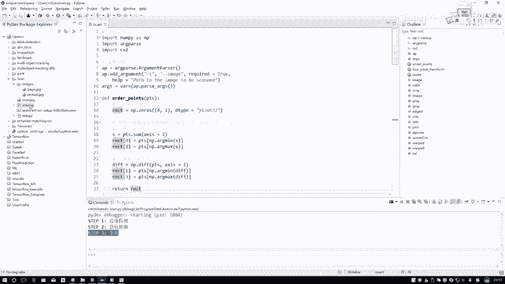
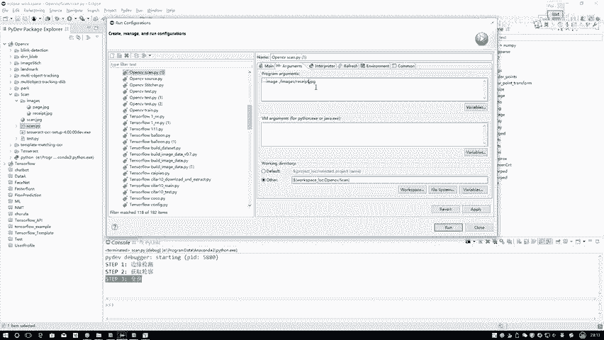
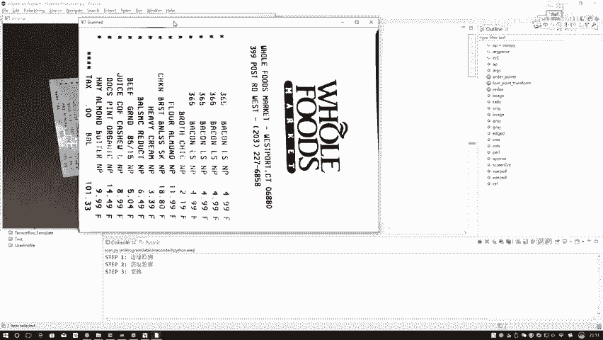
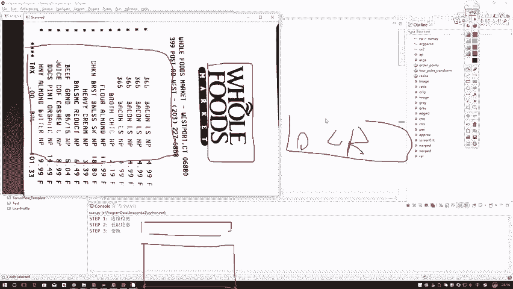

# P38：4-透视变换结果 - 迪哥的AI世界 - BV1hrUNYcENc

想要目标点写完了，有了我的一个就是输入输入的一个四个点，也有了我输出的一个点，我就能去算当前的一个什么，当前变换的一个矩阵了，这个矩阵啊通常情况下就是我们的，因为我们这个东西啊。

它涉及到的是一些投影的一个变换，所以说它是一个3×3的一个矩阵，我现在就是原始坐标，我有了目标坐标我也有了，但是我现在不知道原始这个东西，怎么样能变成目标这个东西，其实呢在这里需要通过一些。

就是平移加旋转加翻转，就是综合在一起吧，那这个说白了就需要一个变换矩阵吧，在这里我们需要去求一下这个变换矩阵，你需要给我两组值，第一组是输入的一个坐标，第二组是你想得到输出的一个坐标。

然后这块是这样给大家简单说一下吧，这个透视变换其实这样一开始你得到什么，一开始其实在这里只有XY吧，但是啊他会把这个XY啊，转换成一个其次坐标嗯，因为是这样，就是一开始咱拿到的东西它是一个二维的吧。

但是呢首先我写个二吧，首先这个变换矩阵它会先变到一个三维，然后呢再从三维上再给我映射到，不是一开始的时候图像它是个歪歪扭扭的，一开始它是个二维，然后呢它会给我映射到一个三维当中。

然后三维当中再给你转换成一个二维，咱就完成了咱当前的这个特殊变换，这其中啊需要咱们一个3×3的矩阵，因为你看这块涉及到三维，所以说通常情况下我们需要先把我们的坐标，咱现在坐标是X吧。

我们需要把它转换成一个齐次坐标，什么叫做一个齐次坐标，说白了就是你往里边再加一个维度，一般我们都得往里添一个一，大家可能会问你添一行能不能填二呢，其实一般是这个事，其次坐标啊。

它跟我们就是跟我们那条直线差不太多，在这里，比如说我写个KX，写个KY，写个K1般都是这种形式啊，但是为了简便，我们通常都写成了一个XY，还有一相当于啊我额外又增加了一个维度。

但是我不去改变当前的一个坐标值啊，就是这个意思，你只添加了维度，但是什么事它都不改变，就是增加了一个维度而已，一般都用一去做的，因为如果说你要写成二，那你这块就得是2X还有2Y了吗。

因为你要跟KSKYK，它的一个就是对应起来嘛，所以说这一块我们一般都是一个XY1，先转换成一个齐次坐标，然后呢这个矩阵怎么去做的，在这里可以给大家看一下，这一块是我的一个X我的一个Y我的一个一吧。

然后左边呢左边的这一块，就是首先会得到个三维吧，那我们就相当于是XY它的一个Z，那你说再由三维XYZ，怎么样去变换成咱的一个两维啊，在这里其实跟跟咱极坐标做法是差不太多的，X比上J这一块，一个Y比上Z。

这个就是我最终要得到我的一个坐标结果吧，那再来看一下吧，左边这个东西是我的一个结果，右边这个东西啊，它是我的一个输入吧，那我中间需要什么中间啊，咱们一般啊需要这样的一个投影的一个矩阵。

这个矩阵一般是长这个样子，就是这里有个H11H12，像我刚才说的，它是3×3的嘛，H13，然后这一块221，然后这块是个二二，这是个二三，这是一个三一，这是一个三二，最后是一个一。

这个就是我们先设有这样的一个矩阵M，然后呢我们来去求解这个矩阵M就可以了，那大家可以看一下，就是哎你说这个矩阵当我们在求解过程当中，你说你需要几组参数啊，就几组方程啊，咱们也给看一下，里边是不是有八组。

你看在这里H1就是这个111213，一直到三二吧，是有几个未知数，咱现在一共有八个未知数吧，那咱一个方就是咱一组坐标能有几个方程，一组坐标里既有X又有Y，所以说就是相当于这个比例一组。

咱第一个坐标等于什么，等于两个方程吧，那你看现在有八个未知数，我是不是需要八个方程，那八个方程需要几组坐标，那如果说八个方程，那显然就需要四组坐标吧，所以说啊就是当我们去嗯。

计算这样的一个就是那个那个就是投影变换吧，或者是做做这样的一个透视变换的过程当中，最少啊，你得给我四组，像什么四组坐标才可以，就像我刚才说的这样的一个矩形框，并且当你做的时候，你说还有什么前提。

他还有最后最小前提啊，就是这个X就是你的坐标当中啊，你最你其中的三三之间你不能是个共线的，如果说不是四边形了，你看这个东西，这是我说这是个A，我说这是个B，我说这是个C，他怎么样了，他是不是贡献了。

这种情况下是不行的，它必须是这样一个矩形情况下，所以说啊当我们在做的时候，我们最好给它转换成一个矩形形状，因为矩形形状当中最好，这是这这就是质，这正好它就是四个点吧，四个点我们就能做这个事了吧。

这个就跟大家说了一下，它基本的一个原理长什么事，然open CV就帮我们做了这样一件事，就是我们把坐标点都给它，它会自动的把这个坐标点方程联立起来，帮你把这个M矩阵给他算出来就完事了。

然后咱可以执行这样代码，看一下，执行完之后这个矩阵3×3等于算出来吧，你看最后一个它是一吧，这个就是我刚才跟大家说的呃，咱们那个透视变换，我们这个矩阵该怎么去算，然后这里啊你看这个东西。

咱们来看一下这个是什么，这是我输入的原始的一个坐标点吧，这是什么，这是我该自己给定的，我想变换完之后得到坐标点，那它俩都是四个，那是不是四组啊，那四组是不是正好你能把这个M求出来啊。

咱们直接用这个open CV，来帮助我们进行一个求解啊，求出来一个变换矩阵就可以了，那有了一个变换矩阵之后呢，接下来我有了矩阵之后，那你说我是不是用这个矩阵对，我当前的一个输入的图像哪去了。

当前这这这个这个图像，哎这呢就传建我当前的一个图像吧，就咱才就是呃对，在这里来看吧，看一下这个函数，我输入了一张图像，在这里，我是不是把这个东西原始的图像输入进来了，那它相当于什么。

它相当于对我原始图像进行一个变换吧，那最后啊返回一下什么，返回一下我最终啊变换完之后，我得到的一个结果，这是不是就完事儿了，这里啊就跟大家说了一下啊，咱的一个呃就是那个透视变换是怎么去做的。

只要你给我输入的四个坐标点，以及你想要得到的四个坐标点，这就完事了，接下来我还把这个东西啊，就是为了显示的嗯更清晰一些，我还把它做了一些处理，先做了一个灰度化，再做了一个二值化。

相当于只保留图像当中一些比较有价值的东西，其他东西啊我就都不要了，再来看一下当前的一个结果行了，最后啊它就显示出来了，我们的一个结果来看一下吧。

这个就是我左边这张图嘛，左边这个图我把这东西给它框出来，是不是有了一些坐标之后，原始图像当中它会根据坐标把这拿出来，拿出来之后经过了一个M矩阵，我就得到了我右边当前扫描完之后啊。

它的一个结果了，这个就给大家看了一下嗯。

咱这个扫描这个工作啊，从头到尾啊，他是怎么去做的，基本原理还是比较简单，就是像我这里给大家写了这么三步，第一步边缘检测，第二步轮廓主要就是这样一个变换操作，变换操作当中啊，大家就记住一点就行了。

就是我们需要两组坐标，但是你知道为什么是要四个坐标点，因为每个坐标点它只有XY两个嘛，每个坐标点相当于是两组，就是相当于两个方程嘛，我要求解那个变换矩阵，它需要的是八个方程，因为它有八个未知数嘛。

八个未知数，八个方程能解，虽然说解也挺麻烦的，但是咱不用关心解的事，你交给open CV去做，这就完事了，最终呢它就会给我返回来那个M矩阵，我的一个特殊变换的一个矩阵。

利用这个矩阵我对原始图像做上一个变换，是不是得到我最后啊扫描完之后，它的一个结果了行了。

这个就给大家说了一下啊，咱们的一个基本的做法是长什么样子，一会儿啊咱们来给大家说一下，就是呃我们怎么样去呃，用咱当前的得到扫描结果去做一个字符识别，这样咱们拿小票那个东西带大家看一下，我给大家说一下。

一会我识别什么东西啊。

咱先执行一下啊，看一下最后的结果，右边这张图是我最后的结果啊。

我要在这张图当中啊去识别，比如说我想看一下这个东西，哎他写什么字，你把这个控制台当中你给我读取出来，然后呢，这些个东西这几个虽然说写的乱码七糟的，它是什么东西，你也都给我读出来，相当于啊。

就是我把一张图片当中的文字进行一个提取了，相当于一个OCR啊，咱要做这样一件事。

一会儿呢给大家再说一下。