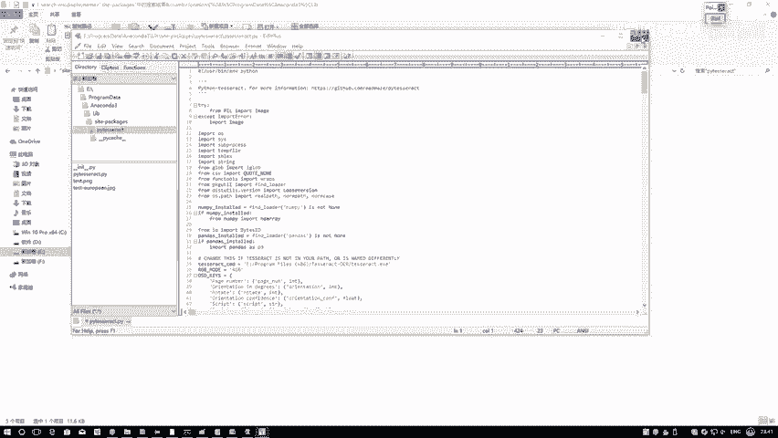
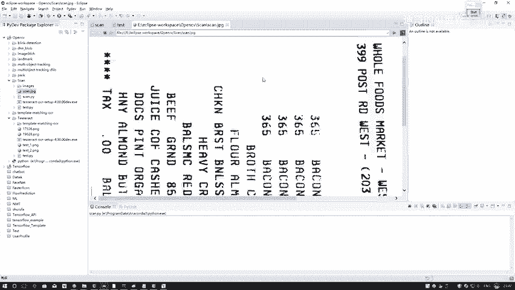
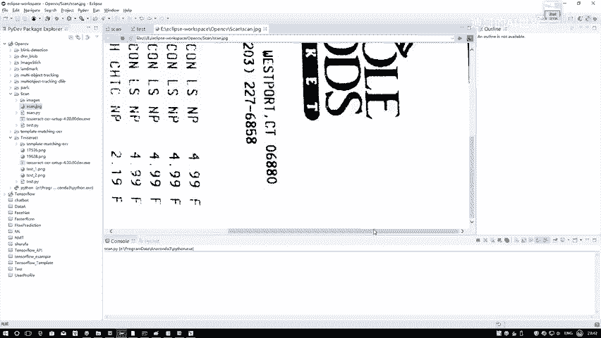
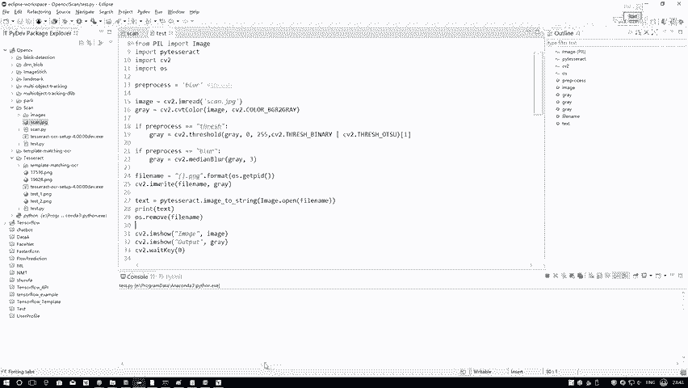
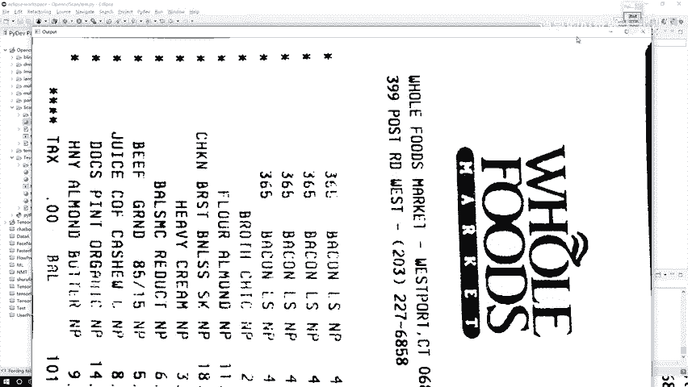
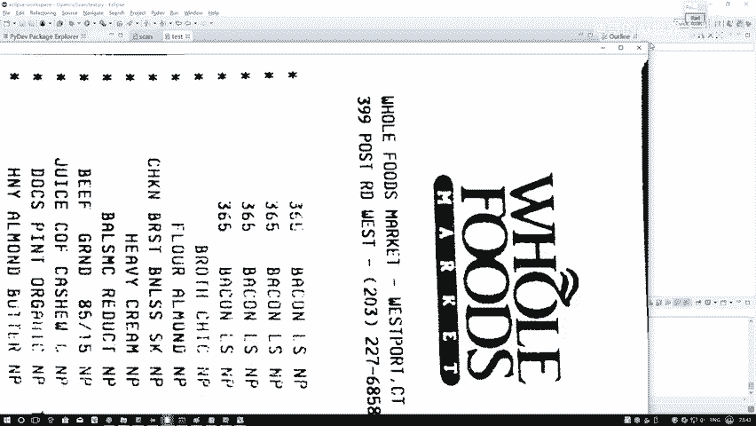
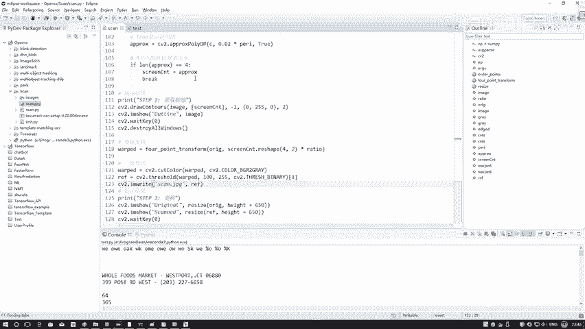

# P40：6-文档扫描识别效果 - 迪哥的AI世界 - BV1hrUNYcENc

安装完之后，我们直接把这个工具包给导进来就可以了，然后呢我们来看一下它的一个基本使用方法嗯，就是你配置完这步之后啊，你想用它这个Python调用方式还是不行啊，我们还得再改额外的一个东西。

这个是我之前遇到的一个问题啊，我估计啊基本上所有的windows都会遇到这个问题，咱们来看一下，就是在这里还需要改个东西。

你得进到你的那个哦Python的目录当中，我们我就是ANICCA当中啊，我找一下呃，在这个呃prom data，然后有个ANACCA3，然后这里边有一个先进，这个第一个先进这个lib文件夹当中。

然后lib文件夹当中有这个就是packages，我们点进去这个文件夹，然后这些玩意当中我们要进行个搜索，我直接复制吧，我把这个就是你安装工具包，然后咱们来这里搜索一下，呃，不不不是带什么0。26的。

是这个他自己这个文件夹名，我们双击进去，数学进去当中啊，有这个点pi文件，我们去编辑一下这个点pi文件表，学校列当中啊，这里看着数比较小算了，这个字体我不调了，简单给大家说一下就行。

在这块大家只需要改一点就行，就这一块它有一个CMD啊，我们把它这个CMD啊稍微改一下，就是默认情况下它是什么，它是直接就是这个点ESE，因为你不是配置了全局变量吗，但是此时啊就是大家一定注意它这个杠。

就是你用IDE去做的时候，这个杠杆他有可能会不认识，所以说啊，最好你把这个东西写成它全局的一个路径，呃，避免咱一会儿执行过程当中需要问题，如果说大家在运行过程当中，哎呀一出现当前你这个东西找不到了。

你一看到什么东西找不到，第一个想法就是全局变量没找到，那你想圈页面为什么没找到呢，是不是说在这里啊，由于一些我们的一个变量当中，就是windows它有这个杠，它这个杠经常会产生一些歧义，所以说在这里。

我们还可以自己再重新的指定一下，它的一个全局路径，指定全局路径，基本上就没有什么太多的一个问题了。

然后呢咱们来看一下下一步，好，现在这一步就在这里跟大家说了，我们改成绝对路径即可，然后下面下面就是一些测试图像了，咱可以来看一下这一块，我写了一个输入输入，就是咱刚才来看一下吧，哦哪儿去了。

我刚才呢刚才那文件，这呢刚才那文件夹，咱们在执行当中就是这个点PY，我们最后执行完之后，我会把什么，你看这有一个sweet two，点imagine white一下。

是不是嗯这里我会把咱当前扫描结果保存下来。

所以说啊接下来我这个呃这个点JPG，这个就是我扫描的一个结果。

这个就是咱刚才执行完了它的一个扫描之后，你看相当于它的一个结果出来了吧。

然后呢我们要再来看一下这个结果，我能不能诶给它就识别出来呢，在这一块我们需要先把图像读进来，然后基本预处理操作先进行一个啊转成灰度图，然后接下来你可以做一些滤波操作，你也可以做一些二值化操作都行啊。

在这里到时候大家可以选一选，对比一下它不同的一个效果，然后呢，然后接下来其实很简单，就是这个东西imagine to string一下，用我的，用我的image工具包，去把当前的一个数据给它读进来。

读进来之后给它转换成一个test，我把这个test给打印出来，这就完事了，这个脚本给大家给大家就是已经写到这里了，然后再来看一下它的一个效果吧，我只选一下，哦这这重新执行一下，执行一下。

这个可能要稍微等个几秒钟，然后他就能够给我返回一个效果。

行了，哎呀我这个图怎么放到这里啊，这个图挺大算了。

咱不看这个图了，直接把这个图关掉吧，然后哎呦不行，还不能关这个图算了，我重新来一下，不能关这个图，咱要拿这个图做对比，这个图我应该给他resize一下。

这个东西有点太大了算了，咱这咱也这也不resize了，直接来看他的个结果吧，哦在这一块这样吧，我们给他。

我看这这这东西没法缩小，咱就来对比一下得了，在这里我找一找他的一个位置算了，就看前几个，就看前几个结果吧。

哦这是哇这刚才好多图都没关哦，行就来看这里就可以了的一个画笔，在这里就看这几个吧，就看这几个词，最咱就看最前面得下面不看了，这个竖着看太用心了，我应该给他正过来，然后重新保存，重新再读。

咱这个事对大家自己去做吧，咱们大家到时候自己全转，自己保存吧，来看一下这几个词识别出来，对不对，是不是跟我们上面这些词是一模一样的，下面这个什么399post什么东西，是不是下面这个东西一模一样。

这个023227，02327668586858，是不是也跟他一模一样啊，下面结果也是一样的，这个我就不给大家一个去看了，在这里啊，咱们就跟大家说了一下，我们怎么样用一个OCR的工具包嗯。

帮助我们把扫描完之后的结果再给它读取出来。

这就完事了，这个就是我们基本的一个做法哦，你可以啊直接去用我的命令行去做，但是我估计大家应该更喜欢用这个Python环境当中，把它调出来，把结果显示出来吧，因为这个test你之后啊，你可以做一些展示。

直接写到图像当中，或者是输出到哪里，就方便咱们进行一个用程序操作，是不是更方便一些，总要比命令还要更方便一些吧，所以说啊大家用的过程当中啊，推荐大家啊我们用一个Python环境来进行一个执行。

那这个就给大家从头到尾说了一下嗯，咱们怎么样进行一个文档扫描，并且呢我们还可以借助一些开源的工具包，把我们的一个扫描结果啊，的一个字符完全的给它识别出来。

