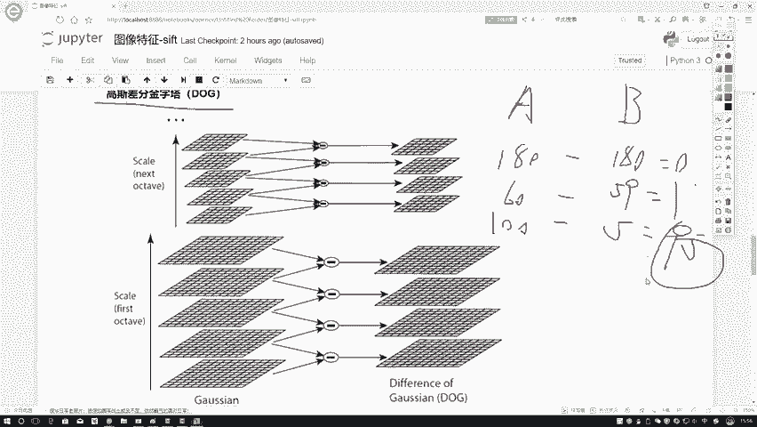

# P47：2-高斯差分金字塔 - 迪哥的AI世界 - BV1hrUNYcENc

那你说光做这个高斯模糊就行吗，像我刚才说的，离挺老远就看见班主任了，往往你这赶了是不是你要跑了，那是不是离挺老远就能看到啊。

那在这里，那你说上课的时候是不是离体力挺好近，你也知道是你班主任吧，所以说啊在这里我们还需要做一个图像金字塔，图像金字塔咱之前解释过了，比如这里最下面一个它是一个400×400吧。

那往上一变什么200×200吧，再往上变成100×100，这个它不就是一个图像金字塔吗，就像刚才说的，你像计算机啊进行特征提取过程当中，你离这近的就是你这个就是你怎么说，你这个比较大的。

你能提取出来特征，你比较小的，你是不是照样你得给我提取出来特征啊，所以说在这里我们在图像尺度空间当中啊，是做了两件事，第一件事我要做就在相同的一个大小的层面上，比如说都是这个400×400的。

在这里我可以做几个。

我可以做六个吧，你看上面这个图，LINA里边我做了六六种，不同六种不同的一个高斯滤波变换吧，所以说400×400里边你做这六个。

那同理，那你说200×200这块，你讲道理是不是要做六个100×100，这块你也要做六种不同高斯滤波变换吧，因为这里啊就是我们不同分辨率的金字塔当中，每一层分辨率都需要指定出来多个啊。

经过高斯滤波完的结果，就像我右边画的图这样，你看这块，比如说这个它是一个400×400的，在这里咱做了几个123455份是吧，右边这200×200的做了几份啊，也是这五份吧，12345也是五份吧。

所以说在这里啊我们的一个啊尺度空间，它是有这样两个层面的，第一个层面是我的一个金字塔，第二层面在金字塔里，每层都要做高斯滤波啊。

这步都比较好理解，咱之前也都说过了，然后呢，然后接下来要说一个dog。

就是difference，我高斯呃，这个东西可能大家以前没见过，大家解释一下，他是这个意思，比如说你想去分辨一个特征，那你说什么特征诶才是有用的，比如说我现在想去分辨两个人。

我说想分辨他是好学生还是坏学生吧，比如说A这个人和B这个人，A这个人有一些属性，他身高180，体重60kg，然后他的学习成绩打100分，B这个人身高也1米8，体重体重这么大，体重是59kg。

他打了五分行吧，那你说你想区分A和B它的一个特征的时候，如果说你用身高来看，那你看也看不出来啥区别啊，长得都挺大，长得都挺高的，都1米8的，是不是说你看不出来啊，你看体重60kg。

五十五五十九公斤有啥区别吗，看起来差不多吧，你再看学习成绩，150比较大吧，所以说啊在这里我们可以用什么来看这个词，叫什么高斯差分金字塔，所以说当我们在进行区分的过程当中，我们认为什么才是有价值的东西。

才是诶比较重要的东西啊，应该是它呈现出来不同的地方吧，100加减180得零二，那没啥区别，这不是个特征，69-50=1挺小的，好像也不足以称为一个特征吧，100-5，这家学习成绩差了95分。

满分才100，是不是说一下子就区别出来哪个好哪个不好了。

所以说在这里啊，我们用到一个点叫做一个高斯金字塔，通常用这个dog来表示怎么做呢。

我们来看在这里，这一层表示了400×400的这层是吧，400乘这400，这层咱说有几个，12345，12345当中，分别是我用不同的高斯滤波得到的结果吧，如果说我一二，首先第1。

12大小规模是不是一样的，同金字塔当中同一层吧，所以说你这五个大小规模都一样一样的时候，我能用减法来去玩，减法去玩小么，相相当于什么，这不是差分吗，当我执行了一个差分之后，我得到一个差分结果吧。

这是一和二的差分，二和三的差分，三和四的，四和五的，这咱就差分完了吧，一共在这里，假设假设我在这块做了五个不同的模糊图像，那你得差文结尾几个是四个吧，上面呢是不是同样的道理啊。

只不过说这一块它是一个200×200的，在你相同的一个分辨率当中进行一个差分，只有得到四个差分结果吧，那这个差分结果用来观察什么，我观察里边每一个点了，像我刚才说的哪些点，它可能是特征啊。

像是我说这个SFT他要干什么，说白了就找特征呗，找特征点嘛，找特征点，我是不是知道什么样的东西，它能称之为一个特征点，接下来我再把这个特征点，用一个向量来做一个代替。

是不是就完成完成咱的一个特征提取工作了，所以说啊咱先说第一步怎么样去找这个关键点，找关键点，我拆分完之后，那大家可以想你差分完之后，是不是它的一个差异性结果了，差异性接触当中。

像我刚才说的A和B那个身高体重，还有一个学习成绩，哪些值会比较大呀，是不是数值较大的差分，结果较大的就是极值里边较大的吧，极值里边较大的，正的较大的，负的较大的都行，反正都是两个极值嘛，两个极值端的。

是不是你就认为它是什么比较重要的东西吧，在这里啊我们就要干什么，做完了我的一个高斯差分金字塔之后，我就要去找了哪些值诶。

它比较大是吧，相对来说比较大，在这里呢再来看一下，我说啊我这个dog该怎么样进行定义啊，在数学上，因为之后可能大家参考资料过程当中，会翻一些东西啊，给大家解释一下，首先我第一个就是储存空间定义。

需要三个参数，第一个X和Y没问题吧，一个点在什么位置。

这个西格玛西格表示什么，你看你这个高斯金字塔还做了各种各样模糊。

你得告诉我，它的一个模糊是用哪个层面上的是吧，所以说在这一块啊，我对于一个D来说，就是我当前得到的这个东西，你得告诉我三个东西，一个X和Y它具体位置，一个西格玛啊，你选择高斯模糊的一个参数。

那这个事咱怎么去做呢，很简单吧，你看这个东西我写在一起了，其实你就是你无论你你乘进去，可能看着更明显一些，第一种第一种高斯滤波乘上什么，第一种高斯滤波啊，乘上有原始图像，得到当前的结果了吧。

第二种高斯滤波就想在这里，这是一种高斯滤波，这是一种高斯滤波，他俩一减法做个差分就得到右边的结果了，L就是相当于直接啊，是我这个高斯高斯模糊完之后的一个结果，进行相减，也是一样的吧。

这一个就是difference组高斯。

