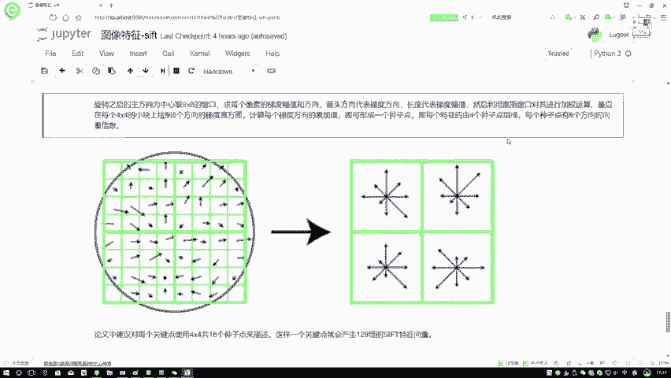
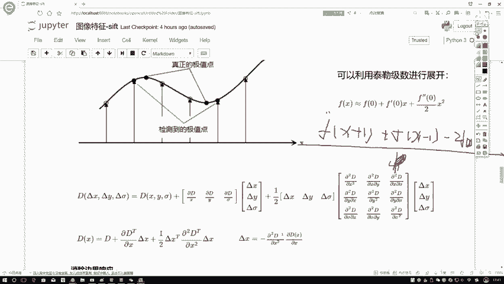

# P50：5-特征向量生成 - 迪哥的AI世界 - BV1hrUNYcENc

行了，我第一步啊，就是我们说先可以通过统计一个关键点周围啊。

它的一个直方图得到这样一个情况，然后呢这个sf t啊，它的一个特征就是特征提取读过程当中啊，他又提到一点，他说啊，就是当我们把图像进行一些旋转过程当中，哎你说你这个图像进行旋转的时候。

你说你特征应该变吗，特征应该是不变的吧，保持特征啊，对它的一些不变性，怎么样保证这点啊。

论文当中提到一点，就是你需要再做一个改变，我们需要以特征点为中心，然后呢把我坐标轴旋转到哪儿啊，旋转到你的主方向上，也就是说你这个图你不管咋样，反正接下来你再给我做的时候。

你也得给我旋转到我的一个主方向，这样呢我就保证了，反正主方向就在这，你原来愿意怎么变怎么变过，旋转到我的方向就可以了，这样就保证了咱的一个结果，它是不变的，相当于特征啊，它是有这样的一个矢量旋转不变性。

在这里我们要做的一件事就是做一个旋转，做旋转其实很简单，我们需要什么，你只需要个角度就可以了吧，在这一块你看我们做了一个旋转。

旋转相当于转过一个角度，那这个角度该怎么计算呢，在上面是不是已经跟大家说了。

我的一个C特该怎么计算，有梯度了，XY梯度算完之后。

它这个C特自然能算出来吧，那旋转相当于干什么，你把坐标系转一下吧。

在这里啊，这里大家给出来了，就是当前我的一个坐标系啊，该怎么样进行一个旋转啊。

它这个公式简单了解就可以，那旋转啊主要大家记住一点就行了，就是保证我的图像呃，保证就是我这个特征啊，它是具有旋转不变性的，因为原始你的图像什么样，不管不管啊，我做的过程当中全给你旋转到我主方向。

这样反正我主方向是固定的，咱第一个结果就不变了行。

然后渲染完之后就是旋转操作，相当于是一个就当做预处理操作吧，然后接下来咱们再说，怎么样把特征给他构造出来，咱们现在得到什么，这是一个特征点吧，我需要在以旋转主方向之之后啊，建立什么，建立一个淋浴区域。

这个淋浴区域啊，到时候大小大家其实呃可以自己选啊，论文当中一会给大家说论文的假设，咱先说这个图吧，这个图选的是什么，12345678，这是什么，这是一个8×8的窗口吧。

首先啊你找到一个8×8的窗口都算出来了吧，各个位置啊，梯度大小方向你是不是都能统计出来啊，然后他说这样一件事，就是接下来你要看了，你想把呀当前的这个特征，你给它映射成多少维的一个维度呢。

咱来先想一想这个事啊，哎你说这个特征啊，它应该是什么，首先第一点我刚才说做了八个方向是吧，那八个方向我在特征进行描述的过程当中，它的长度是几啊，也得是八吧，分别是第一个方向，第二方向。

第三第二一直到第八个方向，分别它的一个值是等于多少的，我要进行一个描述吧，这个是第一点，我首先我得最少得到八个向量，那这一点你说你得到八个向量，那是关于你自己的，那实际上我们真的是求差他自己吗，不是吧。

是根据它的一个邻域来进行计算的，那它的邻域咱们该怎么指定呢，比如在这里哎，我说我统计一下，在这里啊，咱们这样，我说现在啊每4×4的一个格子干什么，给它进行一个统计，可以吧，Z44的哎。

我给它看作一个整体，Z44的看成一个整体，这个东西以及这个东西都看着整体型吧，我得到右边这张图，用这张图当中我写个123412341，这里边是不是对应统计完它这个直方图了，那一这里边它有八个方向。

每个方向上是不是它的一个长短都不一样啊，所以说一这个方向哎，我需要一个它的长度为八的，表示这八个方向分别统计的结果，二这个方向呢你也需要长度为八的吧，三这个方向也是需要的，四这个方向是不是也是需要的。

那加起来多少个，那是不是就是一个4×8，等于一个32维的一个向量就完事了，所以说啊就是你这个中心点，或者说你最终想要生成多少维的向量，是根据你啊自己中心点，然后你选择它的一个领域区域来进行判断的。

然后再来看一下实际情况。

在论文当中啊，他是这么说的，论文当中他说啊使用的是4×46个种子，4×46个种子啥意思，我说这一个区域你就当做一个种子了，这一个区域当做一个种子，这这都是当做一个种子在这里啊，我们可以来看一下。

对于一个中心点来说，如果说呃它整个的一个window大小是1616的，但是在这里每一个4×4的444，每一个4×4的，我就进行什么，咱们在这里就当做一个直方图统计吧，你看这是直方图统计出来的结果吧。

这个结果表示成一个八维的向量，C表示着第一个维度是这个方向等于多少，第二维度这个方向，第三个维度，第四个维度一直到第八维度吧，那你看这有八个维度，一共有多少个，应该是16×1个八等于多少，128吧。

684 18，一八得八，128吧，所以说啊原始的一个论文当中啊，给出来的一个推荐值是128维的向量，所以啊咱们最常用的，也基本上是跟原始论文差不多的，对一个点我可以生成128维的一个向量，那到这里啊。

诶对在这里还有一点我们看一下，在这一块，还有一点就是要用一个高斯窗口进行一个加权，在这里相当于这样，就是你看有些窗口离你的点比较近。

有些窗口离得比较远吧，在这块还有高斯加权啊，指导一下就可以，那这里就跟大家说了一下。

当我们检测到了一个关键点之后，怎么样，基于这个关键点生成一个向量。

其实如果说你不考虑这些预处理操作，这块他做了，为了保证它的一个效果好。

就做了很多预处理操作，如果说你不考虑预处理操作，相当于干什么，就是得到一些种子点吧，进你的种子点去做这样一个直方图统计，进直方图统计它的结果，来构造它最终的一个向量吧，此时让我们得到的就是一个。

128维的向量，通常我们这么去写，一百二八为四逗号，四逗号八飞表示什么意思啊，你这个向量图当中啊，H等于四，W等于四，你的一个每一个位置是由八位，八个方向来所标识的，所以说最终我们说它是有128个值啊。

这个意思，那这样呢我们就由一个关键点得到了一个向量。

一个向量是不是就是它的一个特征了，此时我就能得到啊。

真正的得到每一个点所对应的一个特征了，那这里就跟大家说了一下，咱们这个SLT啊就是一个尺度边性啊，特征匹配它的一个算法，从整体上来说啊，怎么去做的，再大家从头到尾的去捋一遍，首先第一步。

第一步为了使得诶咱得到结果能够更好，得到结果更丰富，或者说你选择的特征点能够更更准确一些吧，首先第一步我需要做一个图像尺度空间。

把我的图像咱就看这个图就可以了，包围图像在这里首先干什么。

做成一个金字塔吧，金字塔当中每一层啊，我要做不同的一个高斯滤波，让我的图像进行不同程度的一个模糊啊，它的一个变换，然后通过差分的方法选择出来。

哪些最有价值的一个点点的选择呢，是怎么去做的。

在这里有及时点检测吧，每个点根据多少个3×3啊，等于392 17吧，就是392 17。

但是不要忘记再减去一个自身吧，一共26个点进行比较，比较完之后呢。

咱得到这一个点，但是啊这个点它有个问题，它是一个离散的，你都要点一个点。

这个点那个点那个点肯定是个离散的吧，那你这个离散点啊，可能相对来说啊不是特别精确。

我们需要对离散点再做一个拟合的操作，在这里给大家举了个例子。

就是在一维情况下，我们怎么样用泰勒展开啊，进行一个拟合，哎之前我说那个二阶导的时候，我是不是少写个东西，这二阶导等什么，我之前是不是写FX加一，再加上FX减一，再减去二倍的FX，咱之前是不就这么说的。

这是为什么，这是因为你这个X加上一个德尔塔，德尔等于等于什么，德尔等于一啊，正常情况下应该比上一个德尔塔的平方，在这里用一吧，所以说一般情况都是用一啊，在这里它就是H方等于一嘛，咱也没写这个东西啊。

这二阶导这个意思，然后接下来还有一些边界消除的一些过滤方法，其实啊，在这里它不光应用了一些消除边界的响应，还有一些其他消除的方法。

在后续的一些改进方案当中，唉呀这些做法就太多了，如果说大家想详细的去了解啊，可以看一下一些改进改进的算法，他们对这些东西啊做的一些过滤啊，判断啊，要远比啊咱们今天讲的要多。

但是啊主流咱的一个SLT算法当中啊，给出来了这样的一是一个黑森矩阵，然后呢以后大家看其他算法，我估计啊只要你能够理解这个shift算法，它是怎么去做的，再看其他算法应该难度啊没有那么大了。

都是做一些改进而已，然后呢我们说一个点我需要得到什么东西啊，咱刚才也看了，你是不是说你要得到八个方向的结果，那你是不是首先得告诉我一个方向，不光有方向，它模值要累加吧，还得算一个模值吧。

这东西咱都得自己去算吧。

然后呢，算完之后，我是不是说这个特征我要转换成一个向量啊。

怎么去做的，转换就是旋转，这个操作是为了满足咱旋转不变性去做的。

这个咱不说了，然后下面就是基于这个点选择一个淋浴，淋浴你会指定一些半径论论论文当中啊，会给你推荐一些值大，感兴趣大家可以看一下，在这个领域当中。

我要找一些种子点，基于种子算出来每一块，你看这里算是每一块它一个直方图吧。

直方图说吧，说白了就是八维的向量吧，把每一个每一个八维向量组合在一起，最终它是16×8，等于128维的向量吧。

这个就跟大家说了一下啊，咱们这个呃SFT算法从本质上来说啊。

