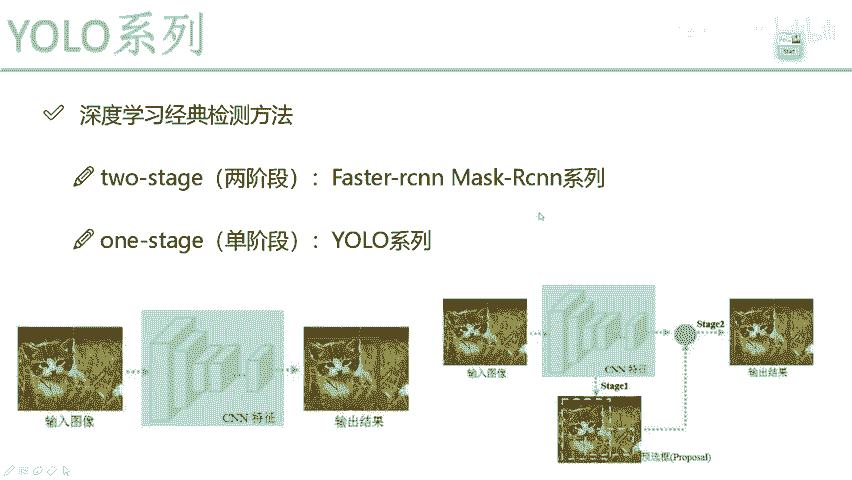
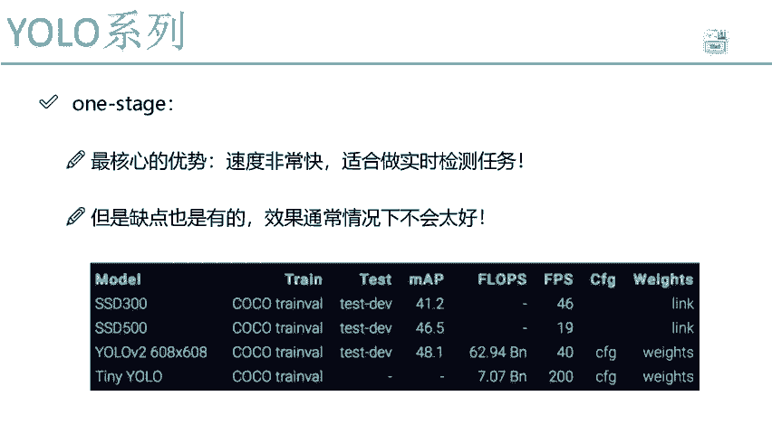
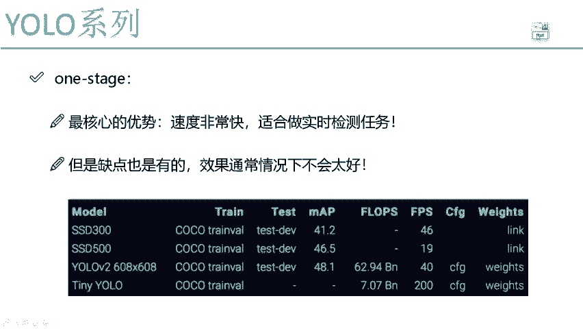
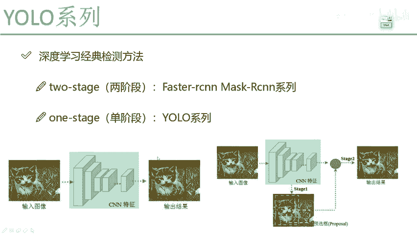
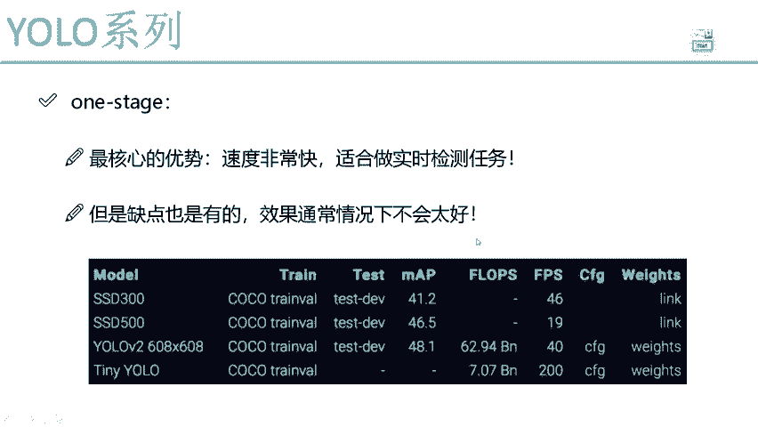
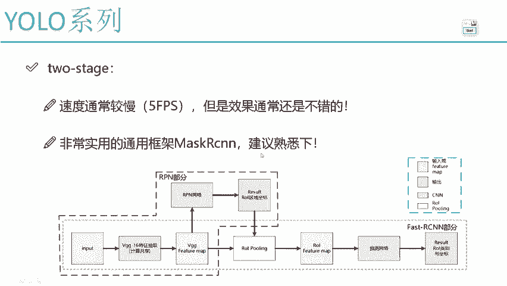

# P53：2-不同阶段算法优缺点分析 - 迪哥的AI世界 - BV1hrUNYcENc

那他们俩之间有什么优缺点吗。

咱们再来看一看，我说这里啊，咱们讲的yellow，它是一个onstage的吧，给大家说了，我们讲的一个网络啊，大家可以放心了，不会太难的，因为只有一个阶段，咱就把这个结果做出来了，是不是。

那它有什么核心优势呢，可以这么说吧，最核心的一点它就是速度会非常非常快，像我刚才说的就是做一件事，一个网络过来，直接一个回归得到的结果了，我中间我就是但凡啊能加一些铺垫的，能加一些补充的东西。

像这些RPN网络东西的东西，我压根儿我全都不要，我一条龙下来直接完事了，所以说啊YOO最大的核心点速度会非常快，那速度快能干什么，现在我们要做这些检测任务，你还你说大部分情况下是基于图片的。

还是基于视频的呀，很多时候都是基于视频去做吧，那基于视频去做肯定有一个要求，咱的速度得快一点吧，FPS值你得高一些吧，好了这里说了一下WESTAGE当中最核心的优点，速度会非常快。

所以说啊以后大家如果说你的任务，你要选yo这些算法好了，你的任务已经非常明确了，要干什么，要在速度上做一个实时的检测，但凡实时的我们都可以用yo去做的，那你说实时的能用这个MASRCN去做吗。

不好意思，不能因为max rc来说啊，论文当中给我们出来结果多少只有5fps啊，速度怎么样。

比较慢吧，哎不能说比较慢，速度还可以，但是根本达不到一个实时的要求吧，好了，所以说咱们这里哎yellow它能做实时的任务，但是呢他是不是有缺点啊。

一个onstage当中，像我们刚才说的，他做的是不是可能会有点粗啊。

中间没有一个初选，那最终得到的结果可能相对不会太好吧，所以说啊用这个yellow系列，我们也得心里有个数，速度是很快的，但是效果来说哎肯定要比一些跟那几个master rc哎。

跟那个too sch方法来说，那肯定要比人家去慢的，这也没问题吧，因为毕竟从整体网络设计来说，我们是完全不同的吧，好了，这里跟大家说了一下，在我们用优菈的时候，它有哪些个优点诶是我们希望用到的。

然后这里呢给大家列出一张图啊，截的不全啊，这给大家截了一部分疑问当中，我们可以看一下这个FPS最高达到多少200是吧，也就是说啊当我们在做这个yo的时候，大家可能觉着哎呀。

我用这个JO是不是说我们固定了，它就是三十五十啊，其实不是的，当你在用这个yer的时候，你可以自己哎去用一些不同的网络，你用更简单的网络，那速度肯定会更快啊，你用更复杂的网络速度肯定会更慢啊。

啊所以说在yo当中啊，比如说根据任务要求吧，你是希望速度到底多快呢，你的一个MVP值诶到底等于多少呢，这一项我们都是可以自己来把控的，相对来说就是速度越快，效果越差，效果越好，速度越慢。

这两个永远是矛盾的，没有什么算法，先说能同时把这两个做得非常高傲，然后这里啊刚才还大还还给大家提到一个词啊，叫做一个MVP值，一会儿我会给大家解释一下这个MVP值啊，它是什么意思。

它呀相当于是我们在做一些检测任务当中吧，经常会提到的一个指标，因为这点我们不会涉及到什么准确率，召回率，什么精度的，这些我们通常不去考虑，而考虑一个综合的指标，就叫做这个MVP值了。

一会我给大家解释一下，咱们这个MVP值哎怎么去算，所以说啊，大家哎现在对算法有的第一个了解就行，我们算法当中啊，通常衡量两个指标，一个是LPS，它的一个速度哎，快还是慢，另外呢就是MVP值诶。

它的一个效果是好还是个不好呢，MVP值越大代表着它的检测效果是越好的，一会儿再来说啊。

MVP值它是怎么去算的好了，那这个two stage当中啊，像我刚才说的，是不是说速度会慢一些，但是效果通常情况下会比较好啊，咱们今天这节课因为是讲yo系列，所以说我不给大家去讲这个RPN网络。

因为咱们用不到，如果说大家比较喜欢master r cn哎，这个网络结构你想做在效果上一些提升速度上，你觉得无所谓，比如说一些离线任务，可以参考我一下我的master rcn课程。

我的master rcn课程当中会给大家详细讲，每一个网络结构唉，每个中间过程以及在开源项目当中，在卷耳当中我们是怎么去做的，这套课程当中啊，因为是YOO系列，咱就不说了，你不用去知道每一个RPN哎。

还有TOC的东西，这些咱们通通用不到啊。

