# P56：5-map指标计算 - 迪哥的AI世界 - BV1hrUNYcENc

综合评价当中啊，我们就得想了我们的MVP值咱们该怎么去算啊，这里呢给大家咱们先举这样一个例子，哎就是在我们实际的一些数据，还有任务当中啊，我们的精度还有召回率分别代表什么，我们来简单看一下。

首先在这里咱们来看我说的一个精度啊，是不是说我的一个检测的，就是这个蓝色框和我这个蓝色的真实框，我希望他俩怎么样越接近越好，是不是这样一件事啊，召回率呢，哎比如说现在这里有一些框，有没有没检测到的。

你看对于这个第二个图来说，第二图来说它的召回率怎么样，肯定就会比较低吧，为什么，因为当前我们的一个预测值和真实值之间，的一个IOU会比较小吧，一旦比较小，我认为它可能是没有检测到的。

这是不是就是一个漏检问题啊，好了这里我们来给大家算一下咱们的一个精度，还有召回率了，这里啊先给大家解释一下什么叫做一个置信度，置信度是这样，比如说啊他现在呃当我们做这个检测的时候，大家可以观察一下。

这里边它是不是有一个0。9啊，这里呢它有0。8，然后这里它有0。7，那这些值表示什么意思啊，咱们后续代码当中啊，也会提到这样一个值哎。

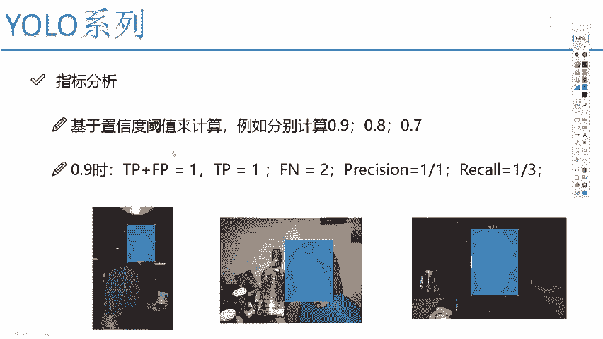

叫做置信度，置信度的意思啊，就是说啊，它描述了当前它检测这个框是一个物体。

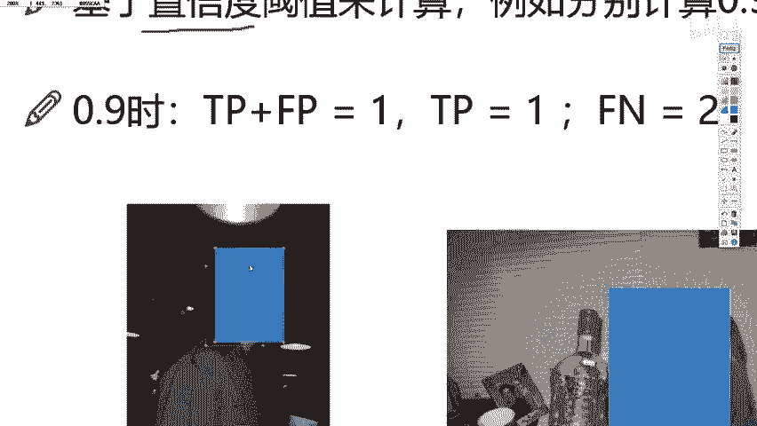

或者说在咱们任务当中啊，就是是一个人脸的可能性是有多大的啊。

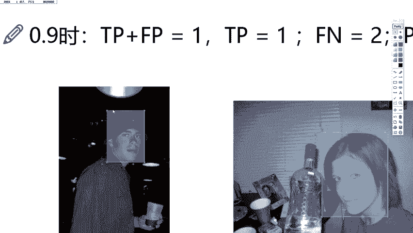

这样一个意思，这个叫置信度，然后呢在物理检测的过程当中啊。

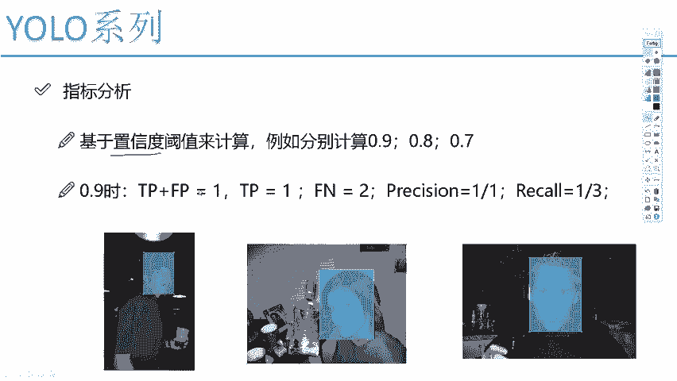

咱们后续要说的可能是我们认为啊，它是一个物体的可能性啊，但是这个人脸检测，我们就是说它是一个人脸的可能性诶。

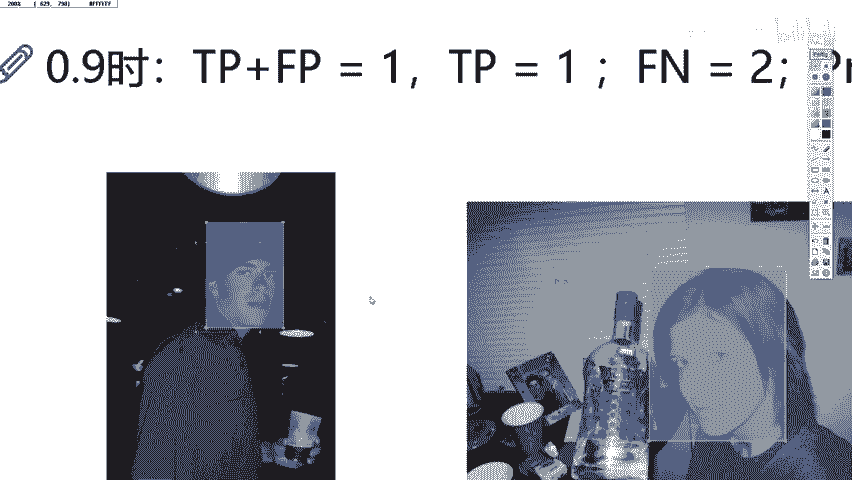

预测结果它有多大的，这0。80。9，0。8，还有0。7，然后呢当我们做计算的时候，我们需要这样啊，你得给我指定一个阈值，比如说我说这样，我说啊阈值大于等于0。9的吧，因为很多，因为当我们在检测完之后啊。

可能会有个现象，我这块会有很多重叠的框，是不是，那我需要做一个判断，哪些个阈值大的，我留下来，阈值小的我就不要了，要不然会使得整个图像当中，你的框是非常非常多的吧，所以说啊我们经常得设置一个阈值。

那比如说吧我说我这个阈值啊，当设置成0。9的时候，我们来观察一下，对于0。9的时候啊，咱们就拿这三个图像，就是我们三张测试的结果，我们来算这些指标了。

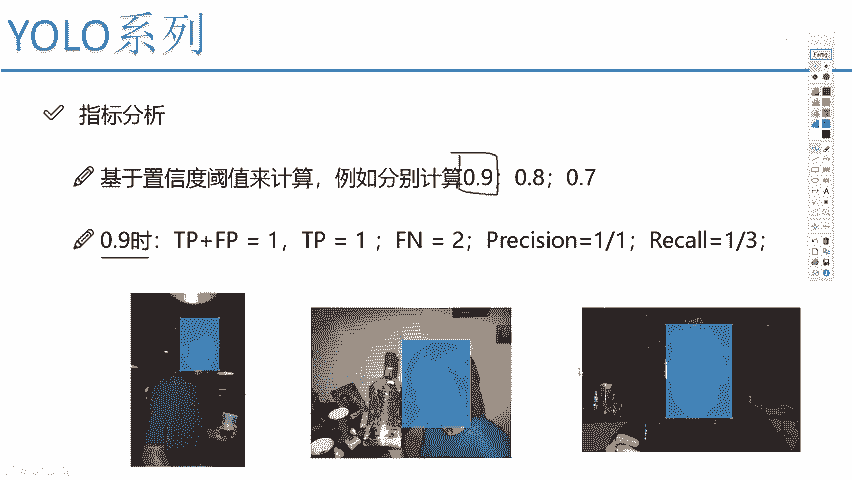

当阈值是0。9的时候，你看这个阈值它是0。8。

是不是这个阈值它是0。7吧，哦这个写的比较小，给大家写一写，这个是一个0。8，这个是一个0。7，那这俩都不满足0。9了，都不满足0。9代表什么，我实际在做的过程当中，它们就被过滤掉了。

就相当于这一块的一个绿色的框，和右边这个绿色的框怎么样，就没有他们什么事了，直接过滤掉了，那只有大于等于0。9的，也就只有第一张图像当中这个框，那此时呢既然啊只剩下一张图像了，我们来看一下吧。

只剩一张图像当中有框只把它保留下来了，那TP等于多少TP，那肯定就是一个等于一啦，因为true partial本身诶，他是个人脸，并且有检测到了第一张图是不是检测到了呀，好了，那我说TP诶。

他是个等于一的，然后呢FP等于多少，LP等于多少等于零吧，这个任务当中我们有一个FPI值吗，false positive本身做错了，错误的把他判断成一个正立了，好像来说是没有的吧。

好此时我们说当前LP值等于零，因为后面两个这样框咱都过滤掉了，所以我只考虑第一个LP等于等于零了，那对于我们这个任务来说，精度等于多少啊，看一下我们刚才给大家写的精度，是不是TP比上TP加FP啊。

那也就是我当前的一个TP1，比上TP加FP一比一精度非常高，是不是，但是呢我的召回率怎么样啊，召回率我们来看第一个当中，你把人家检测到了好，那没问题，第二个当中咱们既然说了，你小于0。9的。

我就全抛除在外了，那第二个你检测到了吗，没有吧，第三个你检测到了吗，没有吧，漏检是有几个呀，是有两个漏检吧，漏减是用什么表示false negative，错误的把他判断成了一个背景，也就是说有人脸。

你没检测到，可以吧，那FN的值就等于二吧，那好了。

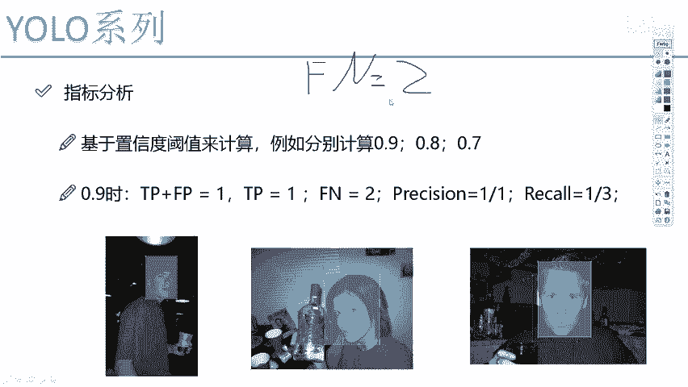

我们来看一下record召回率当中，刚才给公式什么TP比上TP加FN。

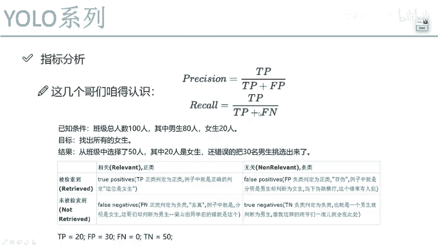

那此时TP等于一，FN呢等于212，也就是1/3吧，这里给大家看了一下啊，第一个例子，当我们的一个阈值诶，执行度吧，知名度是比较高的时候，我们的一个精度还有召回率，我们该怎么样去算。

那你说现在啊我置信度取0。9的时候，我们能这么去算，那0。80。7我们能不能啊，肯定能去算吧，在每一个阈值当中，我都能把它的精度还有召回率全部给他算出来，那大家可能想一个问题。

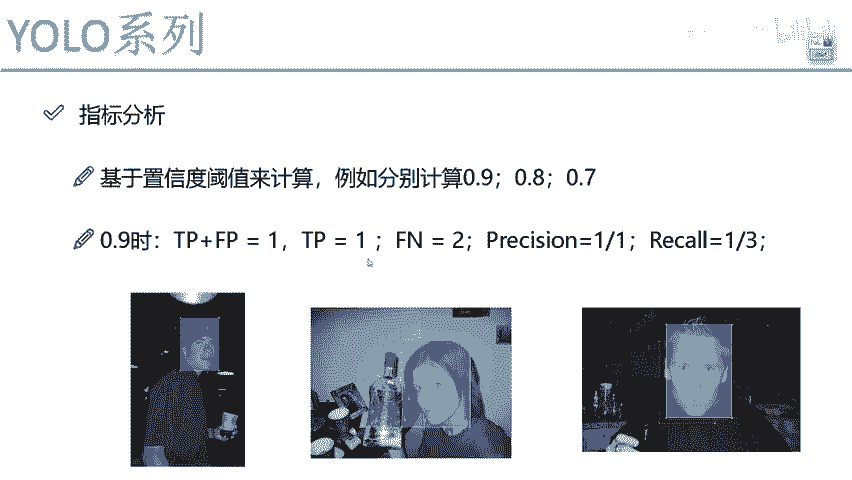

那一旦我全都算出来之后，我能不能画一个图出来啊，可以吧，比如说我是这样，我说啊咱现在这个阈值吧，从这个0~1之间的，你把它的一个P还有一个R啊，就是一个精度，还有召回率，能不能全画出来。

能不能全计算出来，当然可以了，每一个指标值我都能把结果算出来吧，那我们可以构建出来什么叫做一个pr图，也就是我左边画的这个结果，在pr图当中我们也看啊，这里当你的一个就是精度比较高的时候。

召回率通常会比较低吧，当召回率比较高的时候，精度通常会比较低吧，好了，把这个图画出来了，那MVP值是什么，MVP值就是当你把这张图画出来之后，我们下方所围成的一个面积，什么叫下方所围成的面积呢。

比如这里蓝色的，我已经把这个图啊，就是每一个点啊，它的一个结果全部给它画出来了，在各个阈值当中，它的结果这块全算完了，算完之后啊，大家还要注意点，我们要取什么，取的是当前它的一个最大值啊。

然后呢取当前最大值之后，我们算它下方的这样的一个阴影的面积，也就是我右边图当中给大家画出来的，我们这个阴影面积一算就完事了，这个面积的结果就代表着一个MVP值，它是等于多少的。

显然我希望这个MVP值怎么样，是这种情况是最好的，越接近于一是越好的吧，好了这里跟大家说了一下MVP值啊，什么意思。

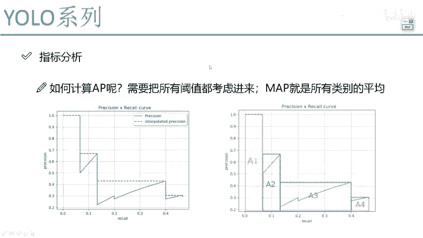

这个不需要大家就是把所有资源掌握，你只需要去知道VP值，它是在不同阈值当中综合的，去考虑所有的一个P和R的情况。

综合得出来一个指标值啊，相当于把我们现在说的这个精度，还有召回率哎，完全怎么样完全的给它综合到一起了。

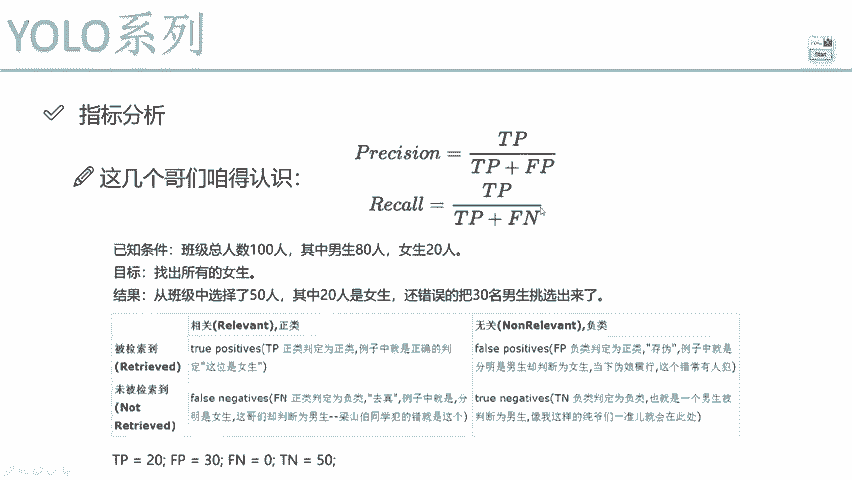

得到了一个结果值叫做MVP哎，就是后续啊咱们实际用的过程当中啊，经常会提到一个指标哎，咱们给大家解释一下MAP值啊，它是什么意思，以及呢当我们在计算过程当中，精度还有一个召回率分别表示什么意思啊。

以及这些个什么TPLP哎，希望大家先能把这些值咱都掌握起来。

因为后续咱们都能要把它们用起来的。