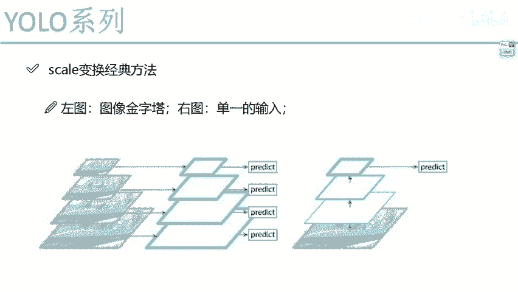
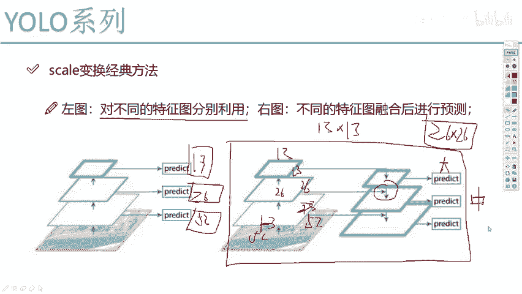
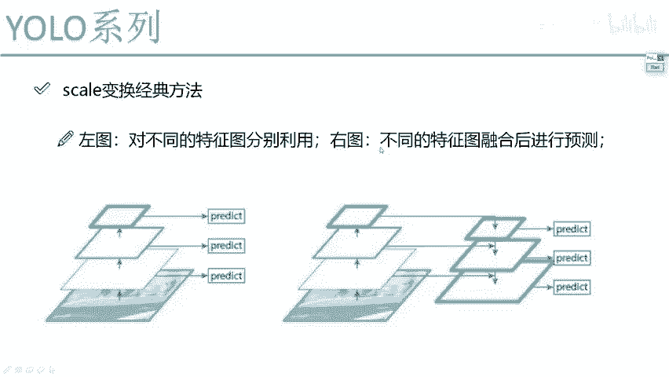

# P64：3-经典变换方法对比分析 - 迪哥的AI世界 - BV1hrUNYcENc

然后呢借这个机会啊，我也顺便给大家说一说啊，就是在这个scale变换当中啊，我们都有诶哪些个常见的方法，然后呢我们来选一选啊，你看一看哪个方法是更合适的，记着我该说那句话了吧，十三二十六，52年轻人。

是不是，咱们来看一看哪个图是符合我刚才那个事儿的，好了，第一个做法，第一个做法很简单，第一个做法他说了，哎呀，你不是要得到这个13的，还有这个26的，还有这个52的吗，他说这样吧。

他说我把这个图像数据啊，怎么样做一个金字塔图像数据，我说做一个resize分辨率，我自己能变吧，那好了，分辨率变完之后输入到我的网络当中，自然我得到特征图大小我就可以控制吧，跟我原始输入是相关的。

诶这个是现在比较不是现代吧，就是之前啊比较流行一种方法叫图像金字塔，但是大家来想一想，这么做行吗，这么做其实行，你你要放到其他算法当中都行，为什么，因为其他算法它可能不考虑速度。

但是今天你说你给我放到yo这里，这合适吗，我们优菈本质出发点就是什么，速度，第一MVP第二吧，好了，本来一件事我一次做完，现在你说你把这个东西给我整三个分辨率，让我做三次，那速度得大打折扣吧。

所以说啊图像金字塔这个事咱能做，但是呢在yo当中我们不适合，速度会比较慢吧，右边这个我就不说了，右边这个就是你就当做是yo v1的一个版本，单一的一个输出，结果哎一张图像做一个CNN。

然后最后预测这不就用了V1吗，单一的结果左边这个呢是一个图像金字塔，但是我刚才说给大家解释了图像，记得打这种方法，为什么我们不选吧。

为什么不合适，速度慢是不是好，再来看下一个下一个当中啊，是这样，下一个当中的左图，左图里边说，像我刚才说的，这是13的，这是26的，这是52的，自己玩自己的吧，谁也不理谁，那就自己玩自己的。

自己把自己摊子做好，但是我刚才说了，自己玩自己的行，13能把这件事玩的很好，26中年人年轻人这件事他未必能玩得好，给大家解释过了吧，所以说左图哎是对不同特征分别做利用，然后呢我们来看右图，右图啊。

就是U鲁V3当中啊核心的一个思想了，他说这样，他说你现在啊这个13×13的啊，你说这个东西啊，哎呦他的一个眼界非常广啊，他做的就是他是最后一步，他知道一个全局的信息了，那他说这样。

他说我呀自然知道全局信息了，我能把我的大目标做好，然后呢我还得帮帮你们年轻人，我说我帮帮你们这个26吧，比如说26，他现在贷款了，买不起房子，那13是不是得帮帮他还完贷款啊，老人在这里，他说了。

我这个13要给你26，我说我给你做一个融合，让大家来想想怎么融合呀，首先第一点他俩的尺度是一个匹配的吗，最后一层是13×13，我中间这是26×26，第一点尺度是不匹配的吧，不匹配的东西。

你说你怎么融合呀，怎么拼呀这个东西，所以说啊在论文当中啊，他提到一点哎，叫做一个上采样，上采样这件事啊，其实做法很多啊，你可以拿繁衍页去做，你可以拿先用差值去做，但这里他是个差值的方法，都是这样。

我把我这个13×13的做一个上采样，做完上采样之后，我可以变成什么，可不可以把13×13的一个特征图，变成一个26×26的，我做上采样，做一些差值的方法，完全没问题吧，所以说这里啊大家注意。

当我这是大目标的时候，这是大目标自己玩，当预测中目标的时候，他是这么去说的，他说哎，我要去把我的一个13×13的最后一个结果，先做一个上采样，做完上采样之后呢，得到26×26的，跟你中间啊。

这个26原就是自身26×26，这个特征图，我说我给你，我说我给你们做一个融合拼在一起行不行，可以吧，所以说这里啊大家注意啊，就是当我们预测一个中目标的时候，我们的特征是哪来的，是26×26。

自身以及后面13×13，再做了一个上采样之后又加过来了，你看这里怎么样，他们这块把特征融合到一起了吧，好了，这是26×26的，然后13×13呢，道理是不一样的，是不是也把上面这个二呃。

不是是不是13×3，这是52×52的，这个52×52的，是不是说也把26×26的，你再做一个融合，这不是现在在先做一个上采样，再做融合去预测什么一个小目标吧。

好了，这个就是yo v3当中啊最核心的一个点，大家一定也理解人家为什么这么去做，当然我跟大家去说的这个13×13，我说的简介广，这个只是我的一个只是我的一个想法，我认为的原始论文当中，人家没那么去说啊。

