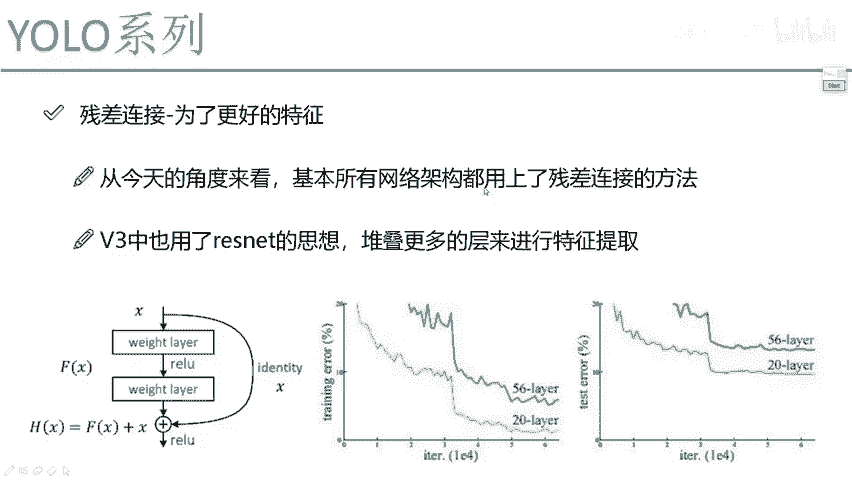
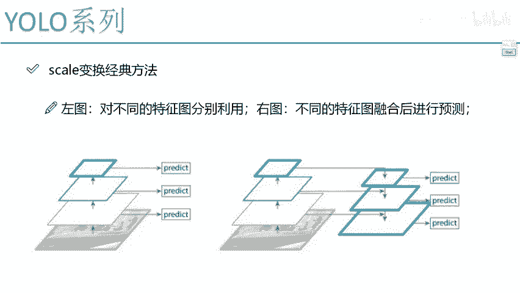
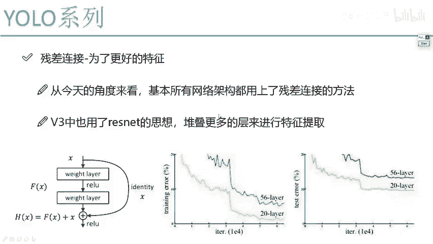

# P65：4-残差连接方法解读 - 迪哥的AI世界 - BV1hrUNYcENc

然后呢这个是刚才啊我们给大家说的诶，加入一点叫做一个scale变换，所以说一会我会给大家看看整体的图，当我把所有知识点给大家讲完之后。

你再看它整体的结构，你会觉得非常容易啊，然后呢我们接下来还有个知识点，叫做一个残差连接，这个大家也知道，因为优鲁V3当中啊，嗯基本上所有的一个结构，就是都是跟这个残渣连接诶是一样的。

大家我不知道听没听过一个网络叫RESNET，哎，就是深度残差网络，从16年开始就非常火的一个网络结构，基本上就是所有吧当下的一些主流算法，全都是基于这个reset来去做的，然后呢我也这么觉着。

就是右路V3啊，说是哎他是把很多地方做了改进，其实呢相当于什么，它相当于啊就是把当年啊一些最优秀的思想，像是RESNET啊，像我刚才说的哎那些特征啊，作为上台上的融合，这些思想其实并不是他自己提出来的。

而是其他任务当中别人用到的，他只是说要把这些诶，融入到我自己的优O的发网络结构当中，使得我效果反而更好了，哎他做了这样一件事，为大家解释一下这个reset它是什么意思。

这东西啊就是哎呀得给大家讲讲历史了，14年的时候就简单说两句吧，14年的时候啊，就是有一个网络叫VGG啊，当年很火，但是VGG这个网络啊当年只做到19层，它就是不断的去叠这个卷积。

那大家反而觉着你卷积层越多，那最终效果大概率越好吧，但是大家发现一件事儿，ABGG这个东西啊，当年啊14年就做了19层，那为啥不想就不想下去做呢，不是说就是你这个计算机性能咋地。

也不是说你这个就是我容忍的训练时间，我忍不了，而是说啊VG当年发现一件事，你的网络层数越深，效果反而会越差，30多层的一个网络，比如34层的一个网络吧，跟19层相比，还不如你19层的网络呢。

这是当年啊RESNET论文当中啊，一个图给大家来简单看一看，这张图当中啊，说这样一件事，你看这是20层的网络，就是继续堆叠V日G，就是全都是3×3的一个卷介，我继续往下去堆叠，然后呢发现这样一件事。

你看啊，无论是在一个train error，这是这是error啊，还是一个test error当中，你看怎么样越多的一个层数，你的一个error值怎么样会越大吧，也就是说这个网络越学越差劲。

越学越回旋了，那你说怎么办啊，当年大家就质疑社会学习这个东西啊，是不是到终点了，19层就是一个上限了，也不能再往下去玩了，因为越玩越差了，至于为什么没人能解释清楚为什么，但是呢我们从直观角度可以看到。

肯定是后面那些层学的不咋地了，越学越快了，是不是，然后当年啊就是respect这篇论文哎横空出世了，他一出世啊，感觉就像个是那个救世主似的，把深度学习又救活了，这是咱们国人啊写了一篇论文。

然后呢我给大家解释解释他论文当中啊，基本的一个思想，这个思想啊不光是在yo系列当中，我用到的master r cn当中，或者是一些其他任务当中，你就你就选吧，就从经典这个角度来看，你就看啊。

就是各大种核心算法，各种流行的算法，全都是基于这个RESNET来去做的，他提出出了一个东西叫做一个残差连接，我给大家解释一下残渣连接啊，说这样一件事，他说呀现在比如说我们就是做到这个19层。

我说从这个19层开始吧，哎从19层开始，然后就要继续往下去做，那比如说啊像我刚才说的19层，那比如这里吧做到56层，19层，你说做到56层，咱整体效果是不是下降了，是不是整体来说不咋地了。

但是我们来想一想，那一定是所有层它都不行吗，就像现在你们班级当中啊，就是像你们班有平均成绩，比如说是80分，然后呢你们老师说啊，唉咱明天班级转来十个同学，转来十个同学之后，你们平均分下降到了70分。

那你想肯定是这几个人当中啊，有几个捣蛋的，有几个不咋地的，把我分拉下去了，但你能说他们十这十个人都是贼差劲的吗，不一定吧，可能还有好的，只不过以平均来看是比较差了，是不是。

那这个reset它思想也是一样的，他说啊，你为了使得我能把好的利用起来，我坏的不用，他说这么做行不行，那感觉是不行的，因为毕竟这中间这么多层，还有能救起来的吧，有的是无药可救的，有的我能救起来用一用。

是不是他说想这种方法，什么叫参加连接呢，他说这样19层拿过来之后，他说我这样我分两步走一步呢，我说继续玩，哎比如这是第20层，我说我做一个卷积行吧，21层我也做一个卷积行吧，那好不好，我不说啊。

我说先把这两件事给我做出来，然后做完之后呢，这有第一条路啊，先就是往下去走，做这个卷积，然后第二条路，第二条路，他说这样啊，就是我19层这个结果，看一看这什么同等映射吧，什么意思，原封不动的给我引过来。

注意这块X，相当于，虽然可能就是大家以后看这块，有什么1×1的卷积，这个咱不管啊，你就当做是先当做是原封不动的给我拿过来，原封不动，拿过拿来，什么意思啊，他说最后啊在这块你给我做一个加法操作。

那这啥意思呢，他说这样，你这个20层啊和21层学的好不好，我不管，但是呢我现在把X也从另一条路拿出来之后，相当于让这个网络自己去选择，什么意思，网络在学的过程当中啊，他会发现。

如果说你这个20层和21层，那越学越差劲，那举个极端的例子，他会把这些权重参数怎么样，那你就压根儿你说怎么调这些权重参数，能让整个网络效果更好啊，那就是不用他俩了呗，你全文参数我都给学成零。

那相当于怎么样，这条路咱就白玩了吧，那白玩了是不是说就不能去做了呢，不是吧，我们还有第二条路，是不是把X可以直接拿过来啊，就相当于啊做一件事，你有两种方案，一种方案是就是一种方案就啥也不做，另一种方。

另一种方案就是你啥也不做，在在这干等着，另一种方案呢就是你做一些事，那最后反正你看结果，如果说你做的事，它结果好了，那你就你做那条路子，如果说你做那件事效果反而差了，咱原封不动的拿过来是不是也行啊。

所以说啊reset当中啊，我听那个黑海明啊，他那个演讲的时候说了这样一句话，他说啊我这个RESNET啊能达到什么效果呢，多高我不敢说，但是呢我可以说至少不比原来差，来大家对这个参数链接啊。

只要你知道一点就行了，至少它不比原来差，因为呢这一块我们有同等映射X，无论你中间啊这块做多少层，那不好我就不要了，好我就留着吧，我们一般啊把这个东西叫做残差的一个block，就是一个就是就一个模块吧。

那实际当中啊，你想我说这个东西它是一个模块，那你说实际当中我可能做多少模块，我可能做20个这样的模块行不行，20个模块当中，那可能有15个，那是不好的，没关系，有五个好的，我是不是都赚了呀。

但凡有一个好的，我是不是都赚了，所以说啊RETURNET当中啊，它提供这样一种思想，叫做一个残差连接，哎其实说白了就是然后网络的效果，提特征效果至少啊不比原来差，诶咋地我都是赚的啊，我永远我永远不亏啊。

这波肯定不亏的这个意思，然后像我刚才说的就是reset这个东西啊，你一定要当做一个就是常识了，当做知识点了，因为后续啊你无论学什么论文，你就看吧啊，满篇子都是RESNET当中啊。

