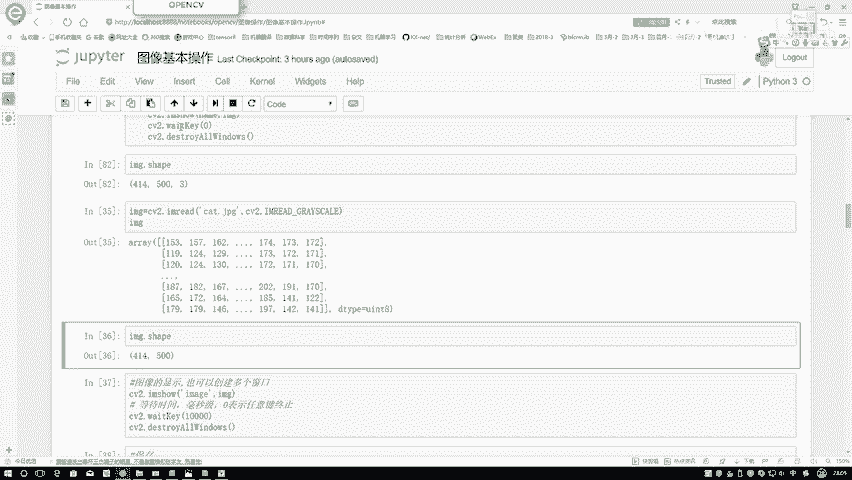
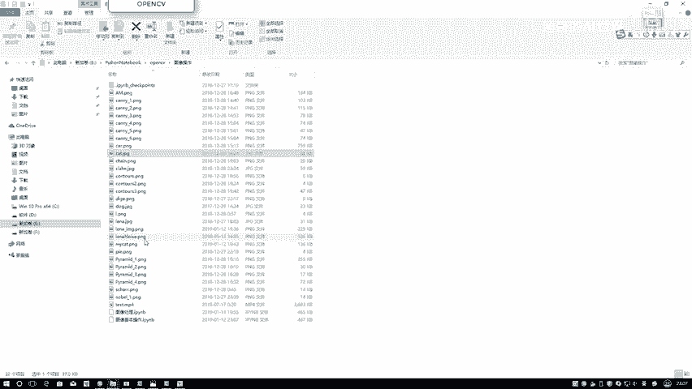
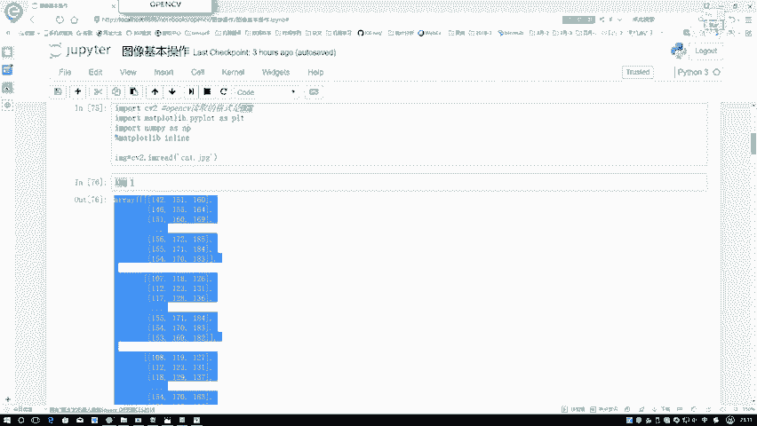
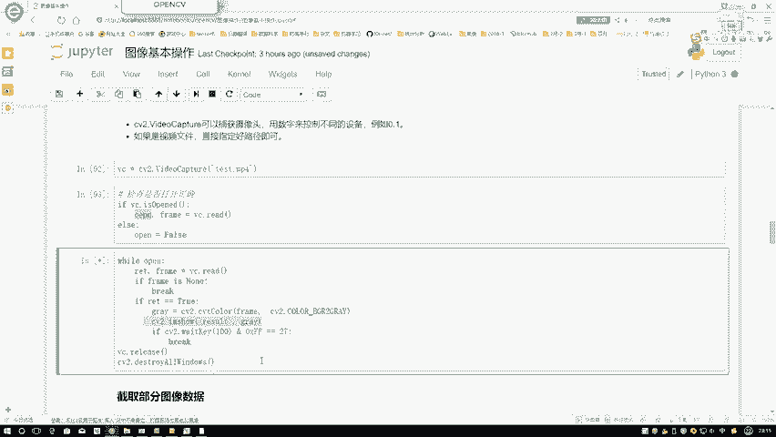

# P8：2-视频的读取与处理 - 迪哥的AI世界 - BV1hrUNYcENc

然后接下来就是哎呀，如果说你每次想显示一个图，都写这么三行，看起来有点麻烦，你可以把这些所有绘图函，绘图的操作放到一个函数当中，在这里啊我们就定义了非常简单的一个函数。

叫做一个CV show，只要传进来一个名字，还有一张图像，然后他就会把前面这三行都执行一下，相当于啊我创建一个窗口，去展示我的一个结果了，接下来接下来就是嗯去看一下。

当前我们读建这个呃读建这个小猫数据当中啊。

它的一些可调用的属性了。

其中啊最常用的就是一个shift属性，在这里啊，我们就可以直接获取到图像的一个H和一个W。

在这里呢咱直接用我的一个mg点shift一下，这样呢我就得到了图像的三个数值，第一个就是一个HW，还有一个C最后啊这个三表示咱当前读取图像，它是一个RGB的啊，这样的一个类型，它是一个彩色图。

只不过说啊在咱们这open CV当中啊，它的顺序稍有变化，它是一个BGR啊这样的一个顺序，然后这个是我的一个彩色图，那如果说啊现在我想进行一个灰度图，我想我想去读一个灰度图该怎么办啊。

咱还是啊对于cat点JPG，还是对于当前这个图像，只不过说呢在读取过程当中啊。

我可以自己进行一些设置，在这里我们来看最上面给大家列出来两种。

第一种就是一个彩色图像啊，比较简单，就是我们刚才说的那个RGB啊的一个彩色图像，第二种呢就是我的一个灰度图啊，Green skye。

它是一个灰度图像，我们来看一下读取进来的灰度图像，它的一个结果在我们就是读取过程当中。

我指定了第二参数，第二参数表示着你读取数据它的一个类型，此时呢我再把数据展示出来看一下，我们来观察一下，这里边有几个中括号啊。

有两个吧，有两个什么意思啊，我们来看一下它这个shape值吧，原来如果说是个彩色图。

它是一个HWC，现在是不是只有一个HW了，相当于啊它只有一个颜色通道，就是表示它的一个灰度值，它的一个大小了，我们就没有RGB啊，这三个感觉了，这个就是一个灰度图，那灰度图有什么用呢，其实啊。

在很多的一些检测任务，或者一些识别任务当中啊，我们都需要先把原始数据转换成灰度图，在灰度图当中啊，对图像进行各种预处理操作，这个就是灰度图啊，它的一个读取做法，其实呢不光在读写过程当中。

我们可以转成灰度图，在任意的阶段，我们都可以把灰度图和彩色图啊进行相互转换。

等之后啊，大家在我们的实际当中会经常看到啊。

要经常进行各种各样的转换，然后呢咱们再来看一下啊，这是转换完的一个结果。

我们来执行一下吧，直接带结果，然后展示一下，这个就是变成了灰度图了，你看这个猫原来有些彩色信息吧，现在又都没有了，只有这样一个灰度信息了。

然后呢接下来咱们再说一下，图像保存比较简单，这个咱们简单看一下就行。

估计前呃，就是前期阶段我们还涉及不到一些保存的东西，直接用CV two啊，你们write一下就可以了，把当前结果你指定成一个名字，或者你指定一个路径，后面呢就是你保存哪个东西。

咱们当前保存mg保存完之后。

它就会在你路径当中形成这样一张图像了，然后呢但对于当前这mg啊，大家可以看一下，其实啊它的底层是一个ND瑞典格式点size，你可以计算一下其中啊它像素点的一个个数，DETAPE值。

你可算看一下它的一个数据的一个类型啊。

这个就是图像当中啊，我们该怎么样进行一个图像的读取。

以及呢图像最基本的一些属性的操作，然后呢他咱们再来看一下，那你说有图像，它是我们可以去玩，那视频能不能呢，首先啊咱们先来看一下一个视频啊。

它是什么东西，在这里呢我随便拿一个，我在电脑里随便找了一张图。

随便找了一个点mp4，我们来看一下，对于随便的一个视频来说啊，你看他不就是这样一个就是随着时间轴的变化，这个视频也在进行一个动吧，这个东西只不过好像给我们感觉，就是图像是个静止的，视频。

是在一帧一帧往下去走吧，其实啊是这样，就是咱们的视频啊，也是由图像组成的，比如说咱们刚才看那个点mp4文件，它里面包含了很多帧，很多帧，每一帧呢，我们都可以把它当做成是一个静止的图像。

我们把这些静止图像连在一起了，就形成咱当前看着像是动的一个视频了，像是我们玩游戏啊，其实也是一样的，咱们在打王者荣耀或者玩英雄联盟的时候，你们肯定要要追求一个值叫做什么，叫做一个就是帧数吧。

玩游戏的时候，我们说比较卡，是为什么，为什么会比较卡呀，是不是帧数比较慢呢，帧数比较慢，就是你这个图像第一就第一张图像，第二张图像还有第后面的图像连贯起来，执行运行速度比较慢了，导致它比较卡。

那为什么说有时候我们说这个显卡不好啊，玩游戏比较卡呀，因为它处理就是咱们这些计算性的比较慢，那你想正常情况下，你要能达到个30帧，就是一秒内有30张图，那基本上咱们人眼就看不出来，它有卡的一个感觉了。

就感觉是个流畅的，那如果说只有15帧呢，你可能就看出来它有点卡，因为每一帧和每一帧之间的连贯，就是间隔有点大吧，你就会感觉到比较卡，所以说在这里啊，当我们读建一张视频文件之后，我们对视频无论做什么事。

还是要把视频进行拆分，拆分成其中的每一帧，再对每一帧做这样一个操作，比如说咱们现在比较常见的，我经常我经常去去那个机场，经常出差机场的时候啊，是不是以前啊在这个上海机场的时候，他没有那个什么人脸检测。

那个东西都是你拿你的一个身份证，往往电影给递给人家，人家看身份证看你吧，但是现在呢它是不是你往那一站，他就会给你脸上框出来个框，然后给你进行一个识别呀，在这里你说这个人脸识别还有检测的过程。

它是基于视频去做的吗，不是它也是基于图像去做的，要对你其中的每一张图像进行检测，并且把检测结果返回去，这就完事了，咱们来看一下我们的视频啊是怎么去做的。

首先我调这个sv two点video capture一下，然后呢把我的一个视频流也传进去，这个就是你指定啊，你视频的一个路径就可以了，然后指定一个VC，然后第一步我们先来看一下。

哎呀你指定这个东西它有没有问题，或者说你当前这个东西啊，点mp4，不管什么点mp4AVI都行，格式它能不能够打得开，我先判断一下，if if b c点is open的，说明什么，它能打开。

能打开的情况下，我就把它怎么样，正常能打开这个open，它会返回一个值，就是这个VC点read，相当于去你去读取图像当中的第一帧，然后呢再VCR瑞的那就第二针，再VCR瑞德得有第三针。

第四针一直就是你可以写循环，在循环当中，只要你不断的去执行这个vcr read，它会从第一针，第二针按顺序给你去取啊，咱当前的每在视频当中每一帧的结果，然后呢他又给我返回两个值，第一个值啊。

它是一个布尔类型的，我也是指定是个open布尔类型值，它就是一个true或者false，如果说这一帧我能读进来，那这个值它是一个true值，第二个呢，第二个就是嗯咱当前的这一帧图像。

在就是把这张图像拿出来了。

图像就是咱们刚才看的这个东西，相当于我把当前第一帧拿出来了啊。

它是这样一个三维数组，然后第二针是不是也这样一个结果，第二参数就是我当前这一帧的图像。

如果说我能打开，那能打开就可以了，在这里啊先来进行一个检查。

那接下来只要能打开，那是不是说我要遍历其中的每一帧，然后好是组成这样一个视频呢，在这里我们可以写一个while循环，因为这个while循环当中啊，我们就给它也不定用指定一个像是一个I值，I小于等于多少。

不用啊，有多少帧咱就变于多少帧就完事了，就是通常情况下，首先第一步我们去read一下，如果说你读到这个东西，它不为空，什么时候为空啊，那你说你一个图像，一个视频十秒的，你这十秒都读完了。

那在十秒都读完之后再下一帧，那是不是为空了，如果说它不为空的情况下，我要继续执行为空呢，你就break出来吧，就不能再循环了，那就是程序要报错了，然后呢咱们来看独建一帧，如果说在咱们这个就是flag项。

它是为true的，相当于我读这帧，它没有毛病，接下来我要对这个图像进行了转换，进行一个处理操作，在这里啊先执行最简单的一个处理操作，比较简单啊，在这里就直接的去给它转换成一个灰度图。

因为我当前咱刚才看那个视频，就是test点mp4，它是一个就它不是黑白的吧，那现在呢如果说我对于每一帧图像，我都给它转成黑白的，那整体这个整体这个视频，是不是就跟老电影那个黑白一个感觉啊，再来看一下。

在这里啊，用思维two点啊，convert下color，把我当前的一个Z帧图像传进去，接下来给我传进来一个转换的方法，在这里呢很简单，就是color啊，什么就是一个RG啊。

就是这个bgr to gre瑞，把我的一个sin的通道，转换成一个灰度图就可以了，接下来去展示我的结果，那下面呢就是在这一块，咱自己指定一个weight key的一个值，这个值如果说你指定太小了。

一会给大家看一下吧，再来看指令一，如果说你职业声太小了，那这个东西可能瞬间就完事了，因为咱们看那个视频啊，它是有一个速度的吧，在这里它你如果说你位的KV1了，相当于什么，你除了就是你的计算机性能有多快。

他处理的有多快，他给你展示的就有多快，咱来先看下这个意思啊，然后后面我指定个27嗯，就是在这个这个27啊，恰好表示的是我们的一个退出键哦，然后到时候大家指定的时候，如果说你不想使用退出键。

你要指定键盘当中的一个Q键啊，快捷键也行，但是一般情况下我们就指定上27就可以了，相当于在视频啊，他展示过程当中，你直接按一下退出键，它就会直接把这个循环跳出来，相当于就把这个窗口就执行。

后面的给他销毁掉了，再来看一下，我先执行一下，哎呀这执行压根儿都没出来呀。

这有点太快了，算了，这个这个这个这个东西我重新读一下。

要不然太快了，咱也只剩十吧，要要是一个一的话，太快了，他都看不出来，就读出来了，只剩个十，再来看一下，这个就是它的结果吧，相对来说你看是不是比我原始视频要快啊，这看着我都有点头晕了。

可能是一个无人机拍摄的结果吧，这只能乘十，再来看下，只剩100，执行成100之后，哎我来哦，重新读一下，该这块读空了，折形成100，再来看这个东西怎么样，是不是给我的感觉是不是有点慢了，就像挺卡的一个。

是不是因为这一块你每处理完一帧，在这等着等这么长时间才能下一帧，等这么长时间才能下一帧啊，这个意思这个就是说我们可以指定当前的一个，你让他去等待多少时间，或者说呢你让它自动退出也行。

但是就是你给它指定成一个按键，进行下一帧也行，但是通常对于一个视频来说，对于视频的一个分析来说，如果说每一帧都你自己去按，可能有点切太碎了，一般情况下，你自己指定一个合适的值来自供自己啊，能够观察。

这就可以了，你看现在就全是一个灰度图吧，这就是我们当前对我的一个，就是每一帧图像读进来之后，我都要把这个彩色图像转换成一个灰度图像，然后呢把它显示出来。

这就完事了行了，然后再按下，再按一下退出，把退出去。

