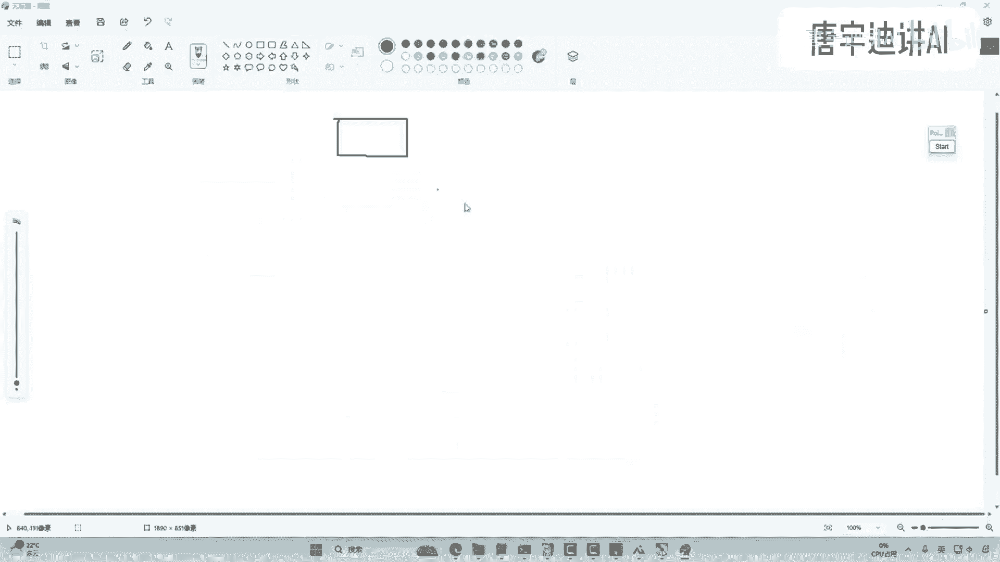
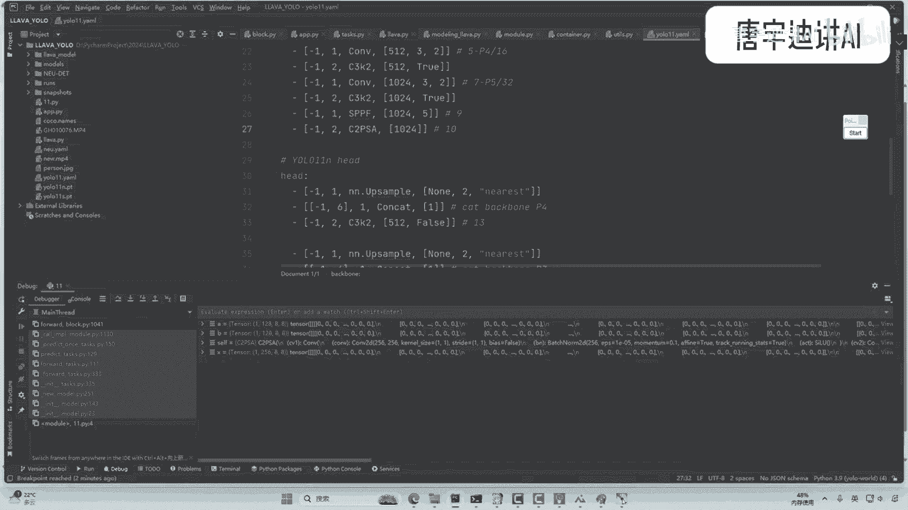

# 全网首发！YOLOv11代码讲解，相比v8v9v10都做了哪些改进？以后默认用v11版本了吗？（计算机视觉／目标检测／深度学习）） - P1：YOLO11 - 唐宇迪讲AI - BV1WYyoYXE2y

华东理工博士出品，优low版本对比。

然后他可能说你这个V11，为啥要咱单独拿它去说呢，那以前好像就是V8，其实我们来先看一下这个优势，它get up个名字，以前的他名字叫什么，以前啊他这个项目名字就叫做一个优乐V8。

但是现在啊他这个项目已经改名字了，就不叫优乐V8了，你看是不是叫了他自己就是优社这个名字了，这是其一啊，其二呢就是V11这个东西啊，它并不是一篇论文啊，可能论文我觉着讲的意义并不是特别大。

因为就加了一点小模块，但是V11啊这东西怎么样，它直接已经是更新成，现在这个优设默认的一个版本，也就是现在优了吧，默认的版本已经不是在用去V8去做了，默认就用什么，默认就用V11去做了，这是优势啊。

官方的一个版本啊，所以说我觉着还是有必要给大家去捣鼓，这么两句啊，以后的基准实验我估计啊就是V8那个东西啊，就成为过去了啊，以后你在论文当中再去写你的对比实验也好，还是你的基础模型也好。

咱就直接啊有这个V8过渡到这个V11了，是不是，然后之前咱们是还讲过这个V9，然后说过这个V10啊，其实这些都是什么，这些都是一些论文，就是一些论文作者他们提出来一个模块。

他们提出的思想让我们去捋捋论文是吧，但是V11呢就是啊可以说在整个代码当中，他应该嗯加模块，其实没加太多东西，一会给大家说一说啊，主要就是整体结构其实没咋变，但是就是啥。

就是可能以后的名字你要发生变化了，你看这个名字叫什么优势，直接把他名字已经改成这个V11了，之前出V9V10压根名没去改，但是呢V11之后是不名字也改了，那我们来看一看它多做了什么东西啊，一会儿呢。

我们就主要围绕着这个配置文件给大家去解读，就行了，并不是一件啥特别难的事儿，然后这样吧我们就直接拿代码说了，因为他也没个论文，所以说我们就先从代码入手。

在代码角度我们去看一看它多了啥东西，那首先第一个就是使用方法，使用方法我们可以说啊跟这个V8来说啊，没啥区别啊，就是一模一样的，完全是让我们先看一下吧，比如说这一块哦，我把所有东西都放一起了。

咱们一今天一块讲的东西还蛮多的，不仅是我先给大家看一看吧，就是不仅是这个呃一个yo，还有一些东西啊，比如说后续你想做一些视觉的大模型啊，我给大家先看这个这个我先给大家执行起来，你们先看一看要做啥啊。

我给你们举一个例子，这个就是拿这个yo v11啊，和现有的一个我们一块说的模型，咱们集成在一起了，我们来看一看做什么事啊，就是但是这个效果很一般啊，但是我估计这个视觉大妈还在发展，他是这样一件事。

就是拿这个优鲁V11啊，集成了一个视觉大模型，视觉大模型可以干啥呢，你可以你可以这么去理解，就是在这个视觉大模型当中啊，我想去对图片数据做一个标注，什么叫图对图片数据做标注呢。

哎我说这张图片当中有几个人出现，这张图片当中可能出现在什么场景，这张图片当中这些人可能是个男的，你看这块，我说这他啊他是个男的，这个没有，是不是她是个男的，还是个女的。

我对这些属性能不能去打上一些标签呢，感觉也行，是不是，那如何去对这些属性打一个标签啊，这个就不仅仅要优咯，比如说我给大家放大，咱们来看这块，咱们一块做这样一件事啊。

就是不仅仅啊我说哎咱们现在啊他说卡住了，我该暂停了，这不仅仅，我说咱们这一块要把这个人给他框出来，我还要干什么呢，我还要对框出来人进行分析，哎我说你分析你是个男的还是个女的。

但是大家可能说这个东西是不是又要训练模型，又要打标签呢，其实我估计大家也看到了，最近也出了，不仅是文本大模型，还有视觉大模型，是不是视觉大模型，我说能不能这样，我说我不给你整个图啊。

整个图可能有点难度大，我就拿优菈V11检测出来的结果，我说穿越数学大模型，我问一下子，哎，我说这里边这个人他是个男的还是女的，我让他自动给我打个标签，好不好好了，这不就是一个小应用吗。

小应用我们一会再去说啊，咱们今天先说这个，先去给大家去梳理啊，这个优路V11，然后呢我们再去看它应用，其实视觉大模型也比较简单，它现在很多都是开源的，其实训练其实蛮难的。

但是我们用起来就比较简单了啊行了，然后咱们先这样吧，我们先说这个V11这个事，在这个V11当中啊，大家来看这个代码，使用方法跟原来可以说是一模一样，没有任何区别啊，以后默认我估计啊就是这个V11了啊。

估计可能一时半会应该出不了这个V12了，好了，首先我们来看配置文件吧，核心东西啊都在这个配置文件当中，其他东西呢基本都是不变的，配置文件里边我们来捋一捋，你看看多了点啥东西。

我给大家啊，就是拿那个V8吧，就是以前那个经典版本，拿那个V8做对比啊，咱们来看多了啥东西，少了啥东西啊，没少其实就是也没多也没少，就是做了一些替换而已啊，来我们看咱们看这个V8吧，在这个V8当中啊。

其实你看这块它很核心的角叫什么，叫做一个C2F。

是不是所有的模块啊，就是你看两个卷接上了一个C2FCRF呢，咱们之前原版当中看过，就是把这个特征图啊也给他做切分，然后呢去走一些残差连接模块，然后最后再拼接在一起啊，这样一个基本结构是吧。

然后我们来对比一下，就是你看这个V11当中，V11当中啊，他把这个名字做了一个替换，它叫个什么C3K2，一会我们来看看这个模块他是做啥的，这是第一个地方，有点不同的，然后呢你再看这个参数。

这个参数当中啊，它有这个false，然后有这个true，我们一会儿反正你这么看是看不出来的，你要想知道具体做了啥，我们就进源码，咱们debug详细去看啊，这是一个东西，然后第二个东西啊。

第二东西又多了一个什么PSC啊，一一看什么A就感觉什么注意力是不是好，我们来看这个什么CRPIC以前也没有，以前啊，就是原始的这个yo当中啊，他也不加什么注意力，就是你愿意加你自己去加。

你自己去加一些什么注意力机制模块。

比如说你看这一块儿这一块，咱们任务当中默认这个UO当中啊，他没有加什么乱马枪模块，不像咱们自己做东西，总愿意去加点啥，改点啥，它默认他也啥也没加，那你说默认的版本当时啥也没加。

但是那是V9啊，V8啊，就以前啥也没加，现在咋样，现在给多加了一些东西，这一块儿呢多了一个注意力好，那我们来看一看这个东西，咱们啊啊都是干啥的吧，然后顺便呢你看一看他注意力加的一个位置，以后。

大家想自己加模块，也是围绕人家的实验思路来，人家实验当中发现了，在这个BB当中啊，最后一个位置加上注意力啊，效果还不错，那以后呢你家的位置也优先，是这个位置附近就行了，其他东西啊基本上没有什么变化。

就是提出来两个模块，那下面呢我们来演示一下吧，怎么去理解这两个模块嗯，其实这两个模块很简单，但是我想给大家去举一个例子，就是当你看到一些不知道，或者说之前没见过的东西的时候，咱们该怎么给他学起来。

怎么去理解这个事啊，首先先去找你看，我说在UO当中啊，我先看他的一个配置文件啊，发现了这块加了新的东西，那新的东西是怎么做的呢，我们得想在哪儿去调用的这些新的东西啊。

其实它所有的核心模块我给大家简单分析一下。

都在它源码里边来，咱们进入到源码源码。

就是你看这一块，咱们不是到时候用的时候需要去pip，把这个包装起来吗，那所有的源码都在包这个包里边，你们要去改这个源码的时候，咱们要加模块。

改模块啊，就是你要去改一些细节的时候，你也要进入到这个包里边啊，拉我们进去，这就是我装的环境，我先进入到我这个环境当中，然后呢我去来，我们先找到它这个源码，它存在的一个位置啊，然后咱们打开这个源码。

看U开头的啊，U开头的我得找一找啊，哎UUUU在哪来着，U是偏厚的，来这儿呢，来我们找到是不是来这一块，大家来看它所有东西啊，都是在它这个啊，对这里边都是在它这个NN模块当中。

N模式当中有个叫做models的模块，都给大家放大一下，这一块就是说他这些源码都存在哪了，就这里边你到时候找完原版之后啊，上这一块啊，它都在这里边了，然后我们来看核心的什么。

核心就是他这个blog当中嗯，它基本模块都是在这个blog当中去实现的，我们打开看一看。

我这边已经打开了，就这个文件这个文件当中啊，我一打开一看哎呀，我说这一块它引出来了好多好多模块，有些模式它也没用上啊，它也写进来了，那你说接下来你想去看啊，就是这些详细的模块，人家是怎么做的。

人家每一步是怎么去搭的时候，咱需要干啥，是不是要去看一看，这里边人家源码是怎么去实现的，好比如说我们来找啊，咱们来找一找，刚才我们要找的这个哎叫啥来着，我们看一看啊，叫这个C3K2。

是不是来我们找找到这个模块，往往下这呢是不是有这个模块，然后呢咱们按住CTRL我们点一下，找到它的实现的一个方法，实现方法当中啊，我们来看他是怎么去做的，嗯一会呢咱们这样一会呢你这么去理解啊。

就是我会给大家咱们进入到debug当中，那我们先来简单分析分析他，首先代码当中你看没有啥特别的东西，就这一块他先有个判断，是不是来，你看他说if如果一个东西是true的，执行这个什么C3K的模块。

如果说啊如果说它是个false，它执行后面这个就是一个残差连接的模块，那这个参数是啥呢，大家来看这一块，是不是有一个默认的一个参数啊，这个参数在哪指定的，来我们看配置文件配置链当中这一块啊。

来C3K2这一块，咱们是不是已经给定好了一个参数啊，就是通过这个参数咱们来指定它是true还是false，它要走收模块，那你看这一块一会默认如果说是true的情况下，他去走这个C3K的一个模块啊。

一会我们再说C3K是啥，如果说它是false的模块呢，就跟之前这个CRF走的是完全相同的啊，这个我我我记得是完全相同的，因为我下午过了一遍，所以说你这么想啊，就是U了VC当中啊。

他真的没有做特别多的一个改进，它就是一点来这一块为处的地方，它多了一个东西嗯，把特征的层级结构多做了一小部分而已，这是一个事儿，然后呢我们再看啊，在这一块呢，我们说这块哎他提出了C3K。

我也不知道CSK干啥，我们CTRL点进去看一看，来这块他是有个实现，他说在这个实践当中啊，这C3K当中哎呀，它引入了一个，又他又继承了一个C3的一个模块，那我们来看一看这个C3的文件当中，它又干啥。

来我们这control在这一块，我们还是给他打上一个断点，就实际forward的会执行的地方，咱都干啥，都给它一会儿去打上一个断点，这样呢我让这个源码执行的时候，我就从头到尾去捋一遍。

因为你我光看这个配置文件，或者让我读这个代码，说实话我读不下去，我也不愿意看这玩意儿，你最好的就一行一行给我走，然后我一行一行去分析行了，那咱们直接看这个事吧，我们直接进入到这个debug模式当中啊。

先看第一个，第一个就是他稍微改的东西，这个C3K2是啥东西，好了，我们来看啊，我给大家说下，暂时打断点啊，我这个优设装的是个新版本，新版本，到时这样这块就是这这就是这一块，我先打上断点。

因为我现在不关注啊，就是整体他做啥，我只想看这个源码走的一个流程，所以说你看我这一块大概150行，这打上一个打上一个打上一个断点，然后你看啊，它是解析这个文件，解析的时候它一层一层走，我们先来看啊。

就前两层卷积，这不看了，这两层卷积我觉得没啥可看的东西是吧，咱就不看了，然后你看这个代码执行的一个顺序，在这一块，你看我把鼠标放在M这，你看他是不是显示出来他在走一个卷积层，卷积层我们不看了。

然后再往下一走，第二层是什么，第二层你看我鼠标放在这儿，它是不是还是一个卷积层啊，那我们也不想看啊，我们再来往下走，来第三层，第三层你看我主要再放在这啊，你看这块也行，来看这边一样的。

这M它是不是变成一个C3K2了好了，那是不是到啥到我关注的一个地方了吧，行了到我关注的地方完之后，接下来呢我们刚才是不是打好断点了，我们往里边去跳，看看他是怎么去走的啊，来大家注意第一个C3K2。

它这个参数是一个false啊，第一个是个false啊，来往下走，跳进去一看这个false，你看跳哪去了，跳到这个CRF模块了，是不是，所以你这么去想啊，就有了V11啊，你就这个为false的。

就这个为false的，它跟咱们那个yo v8的这个C2F啊，CRF大家还记不记得，你要没记着，我再给大家debug1遍，跟这个东西是完全一模一样的，就是没没区别，基本上没区别啊，你看我给你走一遍。

来咱们回到这个原R当中，我给大家来看啊，你看代码现在停到这，是不是他做些啥事呢，再分析一遍，首先呢给了我一张输入，输入之后干什么，走了一个卷积，走了一个卷，积完之后再干啥，再给它切分成两块代码。

是不是这样来我们简单画一画呃，我拿这个画图给大家画吧。

就是你要自己啊，到时候后续你想做个笔记，你要自己折腾折腾，你自己拿画图画也行了，来我们来看，首先呢这个X这是我的一个输入。

我这个输入来之后先走个啥，是不是先走了这个CV1CV1是啥，它就是一个卷积，然后你愿意自己学。

你想做的细致点的笔记，你都可以把这个参数写上去啊，再来分析分析来第一步就先走了一个卷积。

是不是走完卷积之后呢，这块干啥，这块再做一个切分，哎我同学之前给我推荐一个学习方法挺好的，他说他这个代码吧看不懂怎么办呢，他拿这个东西啊去问文心语言，问KAI或者问GBT，我看解释都挺好的啊。

大家你们愿意这么去用也行，就是你看源码挺费劲的，你不知道你就是比如说套着函数，你不知道干啥的，你问问文心语言或者JPT，我觉得解释都蛮好的。

只有同学给我演示过，好这块就是说把我这个特征图啊给它一分为二，就大概这样一件事，在下面当中啊，我们先去做一个切分啊，你看我切分切分成啥，切分成两份啊，来这一块它现在我画个虚线吧，给它切分成两份。

好，切成两份，完之后呢，它把它做到一个利索当中来，大家看现在这个例子里边是不是有两份，你看我一展开是不是两份，你debug都能看到他所有的一个细节啊，然后呢接下来再去走这个什么cf点M。

我也不知道M是啥，我把鼠标往这一放来，大家再看这个M当中它是啥，是不是呃，这个botnet就是一个残差连接的一个模块，你看没啥特别的，就就做了个啥，就做了一个残差连接的模块是不是好。

我看看我看看这个参差连接模块打不打断点呃，来我找一下，我找一找，我记着我好像是打断电了，在这一块哎，我CTRL点去看一看这块，你看我打断点是不是好，然后再往下走啊，他不是在菲亚M吗，走这个模块吗。

来我们就去走一遍，走这个摩尔干啥呢，你看他是对，其中的就是我给大家先回到刚才位置，刚才那位置叫那个C2F是不是哦，来我们再找一下，哎哪儿去了C2F模块，刚才我停到的一个位置呢，啊这儿呢来我们点进去。

刚才你看这个位置当中啊，他是对谁呀，他是对其中的一份，他是一，你看我们刚才这个Y是啥，Y是个例子，切分成两份了，是不是它是对其中一份，再继续往下去走一堆东西啊，好了往下看，在这一块，你看他哎呀。

我这手快跳出来了，手快跳出来，没关系，我们回到刚才那位置吧，回到刚才位置，我给大家看一下，哎呀我这个手欠了，手快了，来我找一下啊，找一下这个B开头的B开头的啊，这一块来，你看这块要干啥。

他是不是对我们当前特征图这块干啥，走了一个卷积，然后再走个卷积，再做一个加法数，蛮简单的一件事啊。

你看我给你画啊，它又对其中一份对其中一份干啥，来走了一个卷积，然后呢再走一个卷积，然后再干啥，再往下它这一块是不是又做了一个加法。

哎，是不是挺简单一个事儿，然后你看我们回过头来啊，回过头来我看我现在我现在这个代码在哪儿呢，应该在那个cf这个模块当中来，你看我现在代码调到这了，是不是接下来他把这个结果干什么。

把它当前结果放到这个例子当中，你看他是不是放到list当中啊，那你看我现在这个Y里边有几个，现在这个Y里边它是不是就要有三个了，但是这一块你还没完，它针对我们这个结果M当中M给大家看啊。

他接下来还有一个卷积的一个模块，来我给大家展开，你看这一块，你看走完这个波net之后。

它是不是还有再走一个卷积啊，来接下来在这一块走完了这些东西之后，他要再干啥，再去走这么一个卷积的一个操作，其他地方卷积我就先不写了啊。

然后走完之后呢，下面下面干啥，把这东西啊存在绿色当中，最后呢我说哎，把它们这些Y当中所有东西给它拼在一起，你看Y里边是有几个，这个Y里边是不是有这么三个呀，这三个分别是啥来着。

大家记不记着前面这一块得到了两个，然后呢这一块我又刚才得到一束流的结果。

再把它们做拼接来，我们看是不是这块这是第一个，这是第二个，然后呢这一块得到的结果，这就是我第三个再把这三个干什么，再把他们三个，我说接下来咱们给它做一个拼接，是不是就行了，这一块我写个看看的操作。

就是做一个拼接，拼接完之后你再走卷积，再有啥也无所谓，你看这是不是一个基本模块就给他列出来了。

然后呢我回来看，你看这一块这个Y当中，这个Y里边，他们是不是把这三个给他拼在一起啊，好16个十六十六十六十六，P完之后是48，是不是，然后呢你再看我们这个卷积当中，把这48个特征图给它。

通过64个卷积核去做，那是不是到64个特征图了，好你看这一步执行完之后，这就是啥。

这就是你那个C3K2当中啊，它为false的一个模块，基本的结构是怎么走的，其实我觉得也蛮简单的，就是卷积完之后，一分为二，然后呢他做了一些就是针对其中一块吧，他做了一个残差连接这个模块。

然后其他模块呢原封不动拿过来，我们去做一个拼接，是就行了，好这是第一个，然后第二个呢我们再看它这里边还有一点啊，就是你看前两个这有false，然后第三个为true的，一会呢我们再看这个为true的。

他又怎么走的，这一块咱们还是要这样，就是我再进入到这个C3K2哎，这也不是false的，这这这也这也不是true的，这也是个false，然后再来一个这个源码不看了，跟大家一模一样的来。

你看现在现在这一块，他现在应该走到这里了，就是走到这一块了，这一块他是不是一个true啊，我也不知道处干啥的，那咋办呢，进去看看行不行，来我们进去看看这处到底到底是干啥的，首先你进入到处之后。

你发现这块还是走啥，还是先走CCRF模块，是不是，但是接下来就有点不同了啊，这个M当中我给大家再看它有一点变化，你看这回是M什么，不是刚才那个botnet那个东西，是不是，你看这是啥。

这是一个C3K的模块，也就是说为true或者为false。

就是当前这一块就是你看我刚画的就是这一块，这个二它走的东西不一样，这是刚才我给大家写，这是为这个false的模块，他去走的一个结果，然后接下来咱们再说啊，如果说它为true的情况下。

他走的一个结果就是他俩走的东西不一样，其他东西是完全一样的，就是V11就做了这点事啊，然后我们进去看他又是单独列了一个什么啊，这个这个你看这一块儿来，我给大家找这一块儿里边儿诶，我看看啊。

这一块我找一下这个C3是吧，来大家看这块他做点不同的东西，你看刚才没有走这个C3，是不是现在怎么样，是走这个C3模块了吧，来我们看他怎么走的，首先呢他针对这个S干啥，来我把手上这一放，它针对这个X来。

你看先走什么，先走这个botnet模块跟刚才差不多，但是走几个是不是走两个，你发一发现跟才不一样，区别是啥，以前是走一个，这一块是走了两个。

是不是，所以说来回我们给他稍微画一画啊，这一块就大概这样一件事啊，比如把它这个这个二我给它复制过来啊，以前他就是走这么一个啊，走这么一个，然后做这么一个残差连接就拉倒了。

但是刚才大家是不是看到他这块不是走了一个，他是走了几个，他是走了两个这种残差连接的模块是吧。

好这是这一块，你看我点我点出来，他告诉我的，然后第一个前面走卷积，这个这个不写了，你看他这一块是不是走了两个一个，然后两个去做的，这是一个区别啊，然后走完这两个之后，我们看看接下来接下来干啥。

接下来他又做了一个拼接，把它走完，这两个和他原来的一个结果，这S原来输入是不是原来输入经过了。

再走一个卷积，跟他做一个拼接来，我们来画，其实应该这样，这块应该这么画，这个是一个二，他这个二来之后是先走了一个卷积，这边走了个卷积，然后往这走，然后这边他可以再走一个卷积，然后接下来谁俩去拼。

他俩干啥，他俩再去做一个拼接的一个操作，这一块再去做一个拼接，这是不是就把这个结构画出来了，所以说就是为true的时候啊，它多了啥东西啊，它多就是他多走了一些模块，就把这些层级特征，我给我的感觉。

好像就是说把这些层级特征拉的拉的更长了，以前就是相邻的层，就是离得没那么远的去做拼接，现在呢把不同层级结构，因为离得远了。

我叫不同层级了，把不同层级结构拼接在一起，就做了这么个事，然后拼完之后呢，再去走个卷积就完事了，你看再走个卷积是完事了，走完这个卷积完之后啊，这这个BOOTNG不看了，这是看我们说的其中的一个细节模块。

来这个咱就给他往出跳啊，来这块他走了两个，是不是往出跳两次，然后呢咱返回这个结果，返回完这个结果，你看下面还是干什么，还是跟它左边这一块是完全一模一样的。

还是他们三个干啥，我直接我不写了，复制过来，他们接下来你们再去做拼接就行了，这就是这个右手V11当中啊，他说多加了一些东西，但是你要问我为啥啊，多加这个东西能效果好，我我真就觉得这东西就是实验做出来的。

你好像没有啥绝对性，凭啥你就加两个，你就整一个true，整一个false，然后稍微做个变换，就要加两个效果号了，就是实验室出来的，我觉得就是实验室出来的，应该很难有特别强的一个解释性。

你要让我，你要让我硬讲这个东西，我就觉着你可能把层级的结构拉长了，让层级结构做得更多而已啊，你看因为前面两个都是false，这个它又引入一个true，然后后面又引入了true，在浅层的时候没有用。

在深层的时候把层级结构拉长了一点啊，这个是他做了个改变，后续大家啊就是你们要去做那啥，比如说你想在这个yo，不论是V级里边加模块改东西到底是一样的，也要先干什么，去捋一下它源码它是怎么去做的啊。

然后还有一个就跟之前不一样的，就这个CRPSA是不是来，我们再往下看这个CRPIA，你看这个名字啊，等我们这个M名字到这的时候来，这还不是又来一个这个啊，这个我再再走一遍，来还是来再往下来。

大家来看这到了吧，CRPIC我也不知道这个玩意是干啥的，但是我也懒得去看他的解释，说明我就喜欢看源码，咱们看源码当中啊，它是怎么定义的啊，还是在这里边我打开这个blog当中，我们去找啊。

先去找它源码的一个定义，这儿呢来C2哎，不是我看是不是这个叫啥名来着呃，C2PIC来我们看啊，C2pi这呢来我们点进去，点进去完之后啊，咱们在这个forward上是不是也是打上了断点啊，那进去看看呗。

看看他做啥东西不就得了吗，打开断点我们给它跳进去，跳进去完之后啊，然后大家再去看你的输入是啥，你的输入当前还是X1个特征图，是不是它首先把这个特殊干啥，这两个C是相同的，就是给它平均的做了一个切分。

我们来执行，你看结果就是还是把我这个特征图，然后你看这个X这个X是256，就中间维度还是沿着这个特征维度，这是切128个，这是切128个，把256个图给他切两半是不是，然后关键啊他对这是比如这是个A。

你看这是个A，这是个B，这是A这是B，然后A呢A你等着等着一会儿就做拼接B干啥，就其中一部分让你去走东西，哎我现在就发现这个结构吧，这个yo就贼愿意去用，你当你发现一个特点，就优菈他都是这样的。

它每一个模块吧都有这种比较保本的一个思想，就啥事儿，就比如说你说现在这个股票涨了，你说啥，你说你就直接梭哈吗，不能梭哈，我梭哈一半好不好，拿出一半去玩，另一半在这等着，等好了，跟它拼接在一起。

这个优菈吧就大量用这种思想，这种思想啊，估计大家就你们后续啊，可以在自己任务当中也去做一些尝试，就后面你你就第二个B这个结构，你做的花里胡哨，你加各种各样乱码七糟的东西往死去堆。

然后呢对完之后你还把它还原成一个特征图，然后接下来你再跟这个A整合在一起，这招吧，现在就让优菈这么一说，我就感觉好像很通用的，因为现在啥论文都在去用这个方法，以前吧还很少这么去做。

现在优菈自从你从从YLOV几就开始有这个事，从优LOV4开始就有这个东西，从优洛维斯开始有这个东西之后，大家就比较喜欢做这个事，那你接下来我觉得尝试其他任务，也可以去照搬这些思想啊，好了。

然后我们再看你看这个B它是咋做的啊，他这做法吧简直太简单了，我估计后续大家里面改进的空间还是蛮大的，因为你看我这个把鼠标放在这个M上，M这哎我展开看一下它就是个啥，它叫做pc block。

是不是来我们去找啊，找它这个定义psc block，然后呢打上断点，是不是来跳进去天然卷啊，咱们来看这一块是走两个，一个叫attention，一个叫fit forward。

那这两个东西再然后X加就不用说了，你基本啥东西都有残渣连接，你看这个tension，大家说FEEDFORWARD是比较简单，这就是我做了个WI加B就是做个全员阶层，那前面这个tension做啥呢。

我也不知道，点开鼠往往里边一点，我打上断点看一看呗，来点进去之后，我们现在打上断点去看这一周走，哎我一走，我咋发现你看先去这个东西，我觉得不用解释了，咱之前讲什么transformer，讲VIT。

那源码给大家看多少遍了，都大家都很清楚，是不是哎，你看他这个tension，大家说他这个tension，你看你就光看这个代码，你看他做没做啥特别的事儿，啥特别东西都没做，我本以为这个yo啊。

他得用一些乱码七糟的东西，但是啥用都没有，就是给你提供提供啥提出基础基础框架啊，就等着你们自己去改呢，反正他把哪块要改什么东西，哪块可以改什么东西都告诉你了，以后你可以去替换这些模块，它就是啥。

这我都不想给大家看了，就是一个最简单的一个tension计算方式，你看看先算QPV啊，一预算，然后KTV展开展，开完之后做这个多头多，投完之后做内积，内积完之后做salt max，再把V做加权。

再连全连接，就标准的注意力机制是不是，然后再去得到执行结果，你看这是第一步，Attention，attention做完之后再连个圈，再连个啥，这里边fit forward就是再连个卷积层。

再连卷积层完之后呢，返回去就好了，你看这一步操作简不简单，所以说就是从这块开始啊，以前的优菈当中啊，它默认是没有啥注意力机制的，但是从以前都是大家愿意自己去加，自己加啥东西，但这回就也说了。

就是在你这个输入层之前呀，咱们最好去整合一下这个特征，用注意机制呢，去把一些重要的特征多放大放大把，不让特征给它缩小缩小，那在什么地方去用的呢，不是在前面去用的，是在backbone当中最后去用的。

因为前面是题特征，最后去整合特征，前面已经把特征提的挺好了，但是你还没有个侧重点好，最后一步我说给你做个加权，给你点侧重点，让你输出的时候能把这些特征更好的去利用，利用好不好。

所以说你看这块是给大家过了一遍，就是V11当转嗯，你要说它有啥特别大的改进吧。

也没啥，因为他连一篇论文都没有，他就是V社啊，把这个东西已经默认的更新进来了，所以说以后呢就没有yo v8这个基础实验了。

基础实验就是用这个V11去做了行，这块给大家捋了一下啊，就是他这块模块当时怎么去改的，我顺便给大家这个东西也是给大家去解释，解释大家以后啊，做自己的东西，如果说你论文看不懂，论文看不懂吧，谁你也看不懂。

我也看不懂，那论文东一句西一句整的，把论文都是把简单的东西往复杂了说，但是代码是什么，代码，就是说把复杂的东西用简单的方式去呈现出来，我建议大家就是按照这种debug方式去捋一遍，我一般看论文也如此。

我不太喜欢看，我一般就喜欢直接上源码，源码到时候自己捋一遍，然后选再看论文，那我就十有八九都差差不多，知道了行了，这是今天第一个事。

