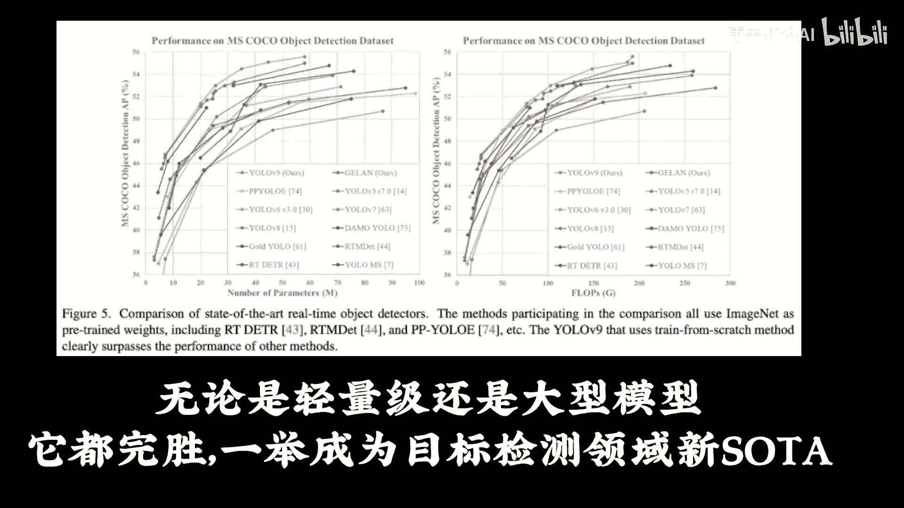

# 全网首发！YOLOv11代码讲解，相比v8v9v10都做了哪些改进？以后默认用v11版本了吗？（计算机视觉／目标检测／深度学习）） - P2：YOLOV9 - 唐宇迪讲AI - BV1WYyoYXE2y

距离优菈八发布仅一年的时间，V9诞生了，此次YOO9由中国台湾，台北科技大学等机构联合开发。

研究者提出了可编程梯度信息PGI的概念，来应对深度网络。

实现多个目标所需要的各种变化，主打用可编程梯度信息，来学习你想学的任何内容，此外研究者基于梯度路径规划，设计了一种新的轻量级网络架构，及通用高效层聚合网络，Blo，该架构证实了。

PGI可以在轻量级模型上取得优异的结果。

无论是轻量级还是大型模型，它都完胜，一举成为目标检测领域。

新SOTA与基于深度卷积开发的SOTA方法相比，GON仅使用传统卷积算子，即可实现更好的参数利用率，对于PGI而言，它的适用性很强，可用于从轻型到大型的各种模型，用它来获取完整的信息。

从而使从头开始训练的模型。

能够比使用大型数据集预训练的SOTA模型，获得更好的结果，your love9论文代码不方便下载。

我已整理好，还有YOO8岛YLOVEV全套课件代码已放置网盘，对于新发布的yo9，曾参与开发了优乐七等的作者给予了高度评价，表示u love9，优于任何基于卷积或transformer的目标检测器。

将优lob9与其他从头开始训练的实施，目标检测器进行了全面的比较，使用传统卷积的yo love9，在参数利用率上，甚至比使用深度卷积的yellow ms还要好。

为了探究u love9中各个组件的作用。

