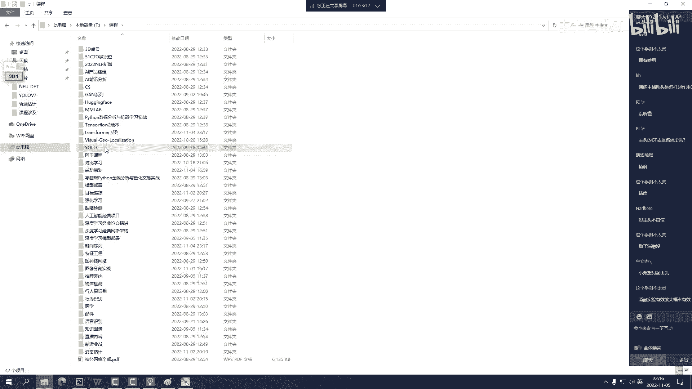

# 全网首发！YOLOv11代码讲解，相比v8v9v10都做了哪些改进？以后默认用v11版本了吗？（计算机视觉／目标检测／深度学习）） - P4：YOLOV7 - 唐宇迪讲AI - BV1WYyoYXE2y

然后呢咱们今天这样啊，今天咱是咱咱今天是这样啊，就不可能说是从V1开始，然后一直讲到V7，那我们时间耽耽搁不起，可能咱们之前有的东西啊，大家需要刷一刷我们的历史故事，然后今天咱这样啊。

我先给大家去梳理一下优路V7当中，核心知识点，以及他怎么去做的，等咱把这个事儿，等咱把咱们主线任务讲完了之后，咱们再去讲我们的分支啊，再去讲你们的那个什么附件任务啊，咱们给大家梳理梳理V1到V5啊。

那咱后再说主线任务，我们先完成今天主线任务，咱先把优OV7给他干掉来吧，回到我们这个任务当中吧，大家先听我的故事。

听完我的故事，然后咱们再慢慢去讨论之前版本啊，首先呢我先来说这样一件事啊，就是在讲V7之前，我们想说一说V7当中带来最大的一个改变，其实这件事呢我跟大家这么去说，不仅是V7可以去用的，基本上放眼市面上。

但凡你的任务是跟卷积相关的，你是都可以去做的，是一件什么事呢，先跟大家讨论一个故事啊，来问问大家，就是玩玩游戏，有没有老大哥老大姐比较喜欢玩游戏的，就是比如说对我们这些上岁数的，可能30加的。

可能咱们这还有40家老大哥，你们喜欢玩什么游戏，我先说我吧，就是对我来说啊，可能新出的游戏我觉得我玩不下去，我觉得我玩不懂太难了，我只能玩一些比较老的游戏，大家想一想，我们那年代有什么有魔兽世界。

是不是魔兽世界后来又出了什么，出了一个怀旧服，为啥说魔兽世界出了个怀旧服呢，因为新的东西啊，可能大家都已经觉着比较卷了啊，新的东西大家觉着认知起来啊，都是一些拓展的东西，可能我们不是特别喜欢。

但是一些经典的东西，却会成为一个永流传的一个感觉，所以说在AI这个领域当中啊，我们有哪些个经典呢，那下面我们来回顾回顾历史，在历史当中啊，曾经出现了这样一个哥们儿，他叫VGG啊，曾经的一个哥们叫VGG。

但是我们之前说啊，VGG已经永久退出了历史的舞台，为什么，因为14年这个VGG啊，他怎么样，14年我们叫昙花一现的感觉，它给我们告诉一件事啊，卷积可以用多层，可以用3×3做的更好。

但是每一年他就被比下去了，被谁被respect，所以说给我感觉就像昙花一现的事，但是今天我们要什么，我们要缅怀先人，我们要回顾历史，在历史的长河当中啊，我们来看一看能不能把VGG，我们也做一个怀旧服呢。

魔兽世界干怀旧服了，咱AI也做一个怀旧服，我们看一看VGG我们还能不能给他抢救抢救，我们今天不说高大上的东西，我们就说经典的东西，任何最新的什么以fashion ne呀，什么RESNET这些东西啊。

哎后来就后起之秀，咱们抛开不谈，我们先回顾经典。

回顾经典过程当中啊，来先给大家看这篇论文，看看人家是怎么去说的，先看啥呢啊先看这个论文题目，题目我不说了，题目干什么，题目是这样一件事，VGG这个哥们成为历史的哥们，他有歧义了，棺材板压不住了。

为什么他说对象论文说这样一件事啊，我们只用VGG，能不能打败你们一些最新的东西呢，啊就比如现在我上战场，我没有什么机关枪，没有什么迫击炮，我就拿一个三八大盖，我就上战场，我让我的三八大盖特别强。

就这样一种感觉，所以说首先呢我们来看一看它的摘要啊，简单了解这篇论文非常非常简单，所以说我们只去读一个摘要，然后我给大家去讲这个故事，JL当中啊，他说这样一件事啊，他说我们提供提出来一个非常简单。

非常有效的一个网络结构，这网络结构呢只有卷积来组成，它就像VGG一样，都是3×3的一个卷积结构，还有这个软路，这大家说这不是太简单的一个事吗，我们都学过，但它有什么效果呢，我们来看他说我们这个模型啊。

跟其他模型相比，最大的特点是什么，我们没有任何的分支结构，我们没有任何花里胡哨这个东西，什么叫花里胡哨这个东西，大家我估计花里胡哨，你们常干吧，你们搞论文，搞研究的那往死了套啊。

我看大家就有同学给我发啊，就你们改那个网络结构图，我都我都我都震惊，我说这这啥东西啊，这一条线一条线是干啥的，那作业真的是花里胡哨的，但这篇论文他要这么说，这样一件事，我们抛开一切花里胡哨不谈。

我们只做一个最基本的主干网络结构，能打败你们所有花里胡哨的事儿，这就是这篇论文要去解决的一件事儿，他说呢在我们做任务当中啊，他要分成两个阶段，我们分成训练阶段和我们的推理阶段，在训练阶段。

你说你渴了劲儿，花里胡哨来，你往死了整，你往多了去加，但是我们要考虑一下成本，你训练过程当中啊，你这个网络结构做的特别复杂，就会导致一件事，就比如像大家，你们想想你们那个论文真正能用起来不。

你们那个网络结构都快复杂到咋说呢，一张图都快画不出来了，这加东西，那加东西就导致一件事，那我们说训练能训练出来，真正测试起来非常非常慢，是不是，所以说这两人说了，我们在训练的时候，你们尽可能发挥。

你们想玩啥都行，但是我们在推理的过程当中，在实际去用的过程当中，我们就一个主干结构，就没有任何的分支，一条线从上到下往下去走，这就是最经典的一个VGG，但是他说了。

我们所提出这个方法在imagine ne当中怎么样，不仅说是速度快，而且我们的top1的一个准确率，超过了80%多，目前大家来看一看，top1准确率超过80%多的，都是一些比较强悍的。

都是一些比较大型的网络结构，VGG何德何能能跟他们去竞争呢，一个14年的东西，我们今天让他什么重返历史舞台，这就是这篇论文要做的一件事，所以说当大家读这个摘要的时候，你有没有这种感觉。

你就感觉挺新鲜的一个事，VGG真能做到这个东西吗，他凭什么，他怎么去做的呢，那我们来接下来看一看，他是怎么样帮我们完成这个事儿的，在任务当中啊，来我们继续来想。

他说呀要去考虑几件事，我们要跟谁比呢，我们先跟reset去比，之前VGG怎么样，比不过RESNET呀，我们说VGG你比reset那可差了不是01：30点了，因为reset它是一个残差结构。

哎他去考虑了什么，在残差结构当中，他说我们要考虑一些分支，而且我分支可以做很多，我们可以连1×1的分支，可以连3×3的分支，可以直接做加法，也就是分支我们可以做的花里胡哨，千奇百怪。

但是你在做分支的时候，可不可能会遇到一些问题呢，兄弟们想一想，你在做分支的时候遇到最大的问题是什么，来我们先不看这效果图，最后我们回来再去看这个效果图，来我们先看这里，先想一想我们之前的故事。

之前故事当中啊，respect他这么说的，他说我们正常走这个卷积，然后呢为了使得我们特征学得好，为了使得咱们层数堆叠的多，我们说连个什么连一个加法过来，然后就是说叫做至少不比原来差吧，兄弟们想一想。

我们说叫之前咱们叫做至少不比原来差，问题是什么，至少不比原来差，最爱带来最大的问题，就是说我们自己家里呀，咱家也没那个条件，显存都有限，是不是在有限显存上，大家来帮我看一看，如果说是一条龙。

就是从上到下没有任何分支，我们来看它这个显存占用，这是X我说经过33连完之后，X等于比如说这个卷积完，然后这个X然后我说这个还是X，然后这东西它也是X继续走这个卷积，也就是说我们这个显存它多了吗。

没有多呀，我没有引入新的东西啊，这哥们儿做完他的事，你可以走人了，这哥们再去做，再得到他，再得到他，再得到他，始终都是它，是不是诶，大家帮我想一想，我们任务当中是不是始终都是它呀，这是一条线的一个结构。

但是我说左边这个respect呢，reset一般怎么办，我们说一会儿咱们要做个加法，那你是不是要先给他存出来，我们先这样，我先假设说我说这一块啊，我先不写个Y，我写个X1哦，X1等于这个X好。

然后接下来哎再对这个X走这个卷积，再对这个X走这个卷积哎，反正他还是得到这个X，但是我们说在得到X的同时，我X1是不是一直要保存下来，大家想想这个事儿，X1是不是一直要保存下来，那我们说现在任务当中。

不仅我们要得到这个X，我们之前保存这X1了，那怎么样，那你就翻倍了呀是吧，你之前只需要保留一个X，你现在多了一个分支结构，你需要再给它复制一份，再复制那一份也要保存下来，因为一会我们要做个加法。

最后大家来看中间这个操作，我们是不是显存又翻倍了，显存翻倍啊，在我们这个任务当中，那肯定是不好的一件事，所以说VGG要解决第一个问题，我们要省显存，咱家没这个条件啊，显存能省即省的感觉，这是第一件事。

怎么样，我们用一条龙的网络结构来去做这个任务，来接下来再看，这还没完，这还不是重点，重点是什么呢，其实我们来看一看当年啊，他告诉我们的事，14年的时候，VG也说了，3×3的卷积是最好的。

其实3×3的卷积之所以是最好的，一方面来说是这个卷积结构啊，它比较小，体验特征比较丰富，另一方面呢，其实英伟达对它的优化，这是离不开的，我们现在只用N卡，是不是啊，其实说我们主要依赖谁。

就是人家依赖人家底层的一个优化，底层的计算呗，英伟达他们怎么优化的这个事咱们抛开不谈，但是人家也觉着3×3的是计算速度最快的，优化最好的一件事，所以说后脚大家看我们各种各样的网络结构，永远离不开什么。

永远离不开这个3×3，其实这是历史已经告诉我们一件事，以及英伟达显卡优化，也会把这个优化速度做得最快，那所以说我们接下来，咱们还是3×3的一个故事，但是我们现在一旦做了分支怎么办。

我们任务当时我说训练时候想做这个分支，但是我说咱们能不能把这件两件事分得开，我说训练是一件事儿，测试又是一件事儿，我问问大家，训练的网络结构，可不可以跟测试的网络结构是不一样的呢。

我们今天能不能画个不等号，兄弟们想想这个事，我们今天可不可以画一个不等号，这个东西想一想，训练网络结构能跟测试网络就不一样吗，哎你你见过这个事儿吗，就是大家觉得一个常识来说。

就是训练的跟测试的它得相同啊，要不然网络怎么去走呢，但是我说训练的过程当中啊，今天我们就要改变历史，不是我去改变历史，是人家要改变历史，我们说训练的可以跟测试的是不同的，我问问大家。

咱们可以从哪几方方面做思考，以前我们说这个卷积完之后一定要连什么，卷积完之后，大家帮我想一想，一定要去连什么，一定要去连BN吧，这东西我觉着都是一个常识了，你吃完饭你不喝，喝口水吗，不噎得慌吗。

吃完饭一定喝水，卷积完之后一定连BN，这都是所有人再去做一件事了，就家喻户晓的东西，哎但我问大家一件事啊，BN这层他也需要训练的，是不是BN这层他也需要去走，他多走一个BN，他是不是也消耗了一些时间啊。

呃我问问大家，卷积能不能跟BN连在一起呢，BN1会给大家说，我们叫拜神VIZATION，你就当做是归一化的一个操作，你说卷积我们能不能跟BN连在一起，哎或者说卷积能不能跟BN做一个合合并。

我说我现在不是吃完饭再喝水，我边吃饭边喝水行不行，来兄弟们想一想，我不我不是说把它先做成一个顺序，我俩一起去做，我边吃饭的时候把水不就喝了吗，这不就省事了吗，我吃完饭我就不喝水了，是不是速度就变快了。

所以说接下来第一件事儿，我们说卷积啊，想办法，咱们要跟BN做一个合并，这是第一件事啊，就是咱能省钱，能省则省，这省省那省省，我们就省出来很多东西了，好这是一个点，还有什么点在咱们这个任务当中啊。

其实不仅说我们BN我要给它做一个合并，我问问大家啊，就是这一块我们连出来一些3×3的一个卷积，我们又连出来一些1×1的卷积，唉还有一些比如说直接拿过来啊，直接做一个同等映射，我问大家这些能不能做合并。

大家帮我想一想，哎你说我这个分支，我咋看这个1×1这么膈应人呢，就比如说它是要它是这样的，我给大家举个例子，正常的特征图来了之后，而我们说咱们先走个3×3，哎，为了做的花花胡哨，为了特征做的更好。

哎我们说咱们再额外走个1×1，额外走1×1会导致件什么事，就是大家这么想，你说我们现在做一件事，我干的挺快的，但是我们说这个分支我们是同时做多件事，你同时做多件事，你的效率可能就会降低一些吧。

哎呀那我说咱能不这样，你1×1这个卷积能不能合并到我这个3×3，当中呢兄弟们想一想1×1的卷积，咱能不能合并到3×3当中，我说想想招呗是吧，1×1你能不能合并到3×3当中，感觉是可以的。

一会大家说具体怎么去做，唉那你说咱们直接把这个X拿过来，你直接做个同等映射过来，哎，我说你这个分支我能不能也加到3×3当中呢，就相当于我们下面要做这样一件事儿，你走了N个分支。

我能不能把所有的分支做一个合并呢，我就得到一条主线路呢，而且我跟你是个等价的这块，大家注意，我们不是做减脂，不是做蒸馏，我们要做一个等价的等价这件事能不能去做，如果说等价的这件事能去做。

那不相当于我一个顶你们仨了吗，一个顶你们仨，我自己把这事干了，和你们仨一起干这个事，那肯定我自己干得快呀，但是大家注意什么时候干这个东西，我再给大家去强调一下，咱们什么时候去干这件事儿，声音怎么样。

大家听声音清楚吗，咱们什么时候干这件事，兄弟们，大家帮我想一想，我们是训练阶段干这个事，还是测试阶段干这个事，兄弟们想一想，咱们这个任务当中，我们是训练的时候去做，还是测试的时候去做。

哎我看大家告诉我测试的时候去做，是不是这个大家不要不要想多了啊，大家说老师我训练时候做这个东西，你训练能把这个东西做出来，那你要起义了，这训练你做不出来啊，我们说是说你训练好了这个模型之后啊。

我们实际用的时候，咱们把它做一个合并，但你该训练咋训练，你训练的时候你往死了，花里胡哨，你往死了墨迹，你整任何的分支不影响，为什么训练是训练，训练的时候多花点时间，咱好好玩，我是测试的时候。

咱做个合并是不行啊，所以说接下来我们在任务当中啊，要去做这样一件事，在我们测试的过程当中，怎么样把这个结果我们来去完成一个啊，完成一个整合，是不是来这一块给大家去梳理了一下啊，就是说我们整合的时候。

咱们要去做这个东西，那此时问题又来了，你说这件事该怎么去做呢，我们一个来来兄弟们，大家想一想，我们今天任务当中啊，咱们一个一个就来先干什么，我们先说卷积跟BN怎么去玩，说完卷积跟BN怎么玩之后。

咱再把不同的分支给它融合到一起，其实卷积跟BN融合这件事还是什么秘密吗，那大家想想，你说卷积跟毕业融合还是什么秘密吗，我估计有同学你们做实际任务作为部署的时候，常见的事是不是已经比较普遍了。

所以说这一块用了V7当中啊，它也是如此，我们来看怎么去做的，首先呢我们来稍微回顾回顾，回归回顾啊，这个BN当中啊，他是干什么，我先说为什么要BN，有的同学可能之前没了解没了解这个东西啊。

我给大家举个例子，举个例子啊，比如说啊就就就就我小时候吧，我小时候长大，我小时候这样，我小时候比如这是我，我是一个特征图行吧，然后呢我经过了一些卷，积完之后来我再慢慢提特征，可能我的特征慢慢变小。

小时候啥样，就小时候不好好学习啊，调皮捣蛋是不是很正常点事啊，我爸揍我一顿，我能老实几天，我爸再揍我一顿，我能再老实几天，是不是大家想想，你们是不是都是不是这么回事啊，所以说啥叫做BN呢，我应该这么说。

就是大家都知道数据啊，一开始我们要做一个预处理是吧，就来了数据之后，我们要做一个预处理，让数据呢各个维度你别有太离谱的东西，你别有太离谱的特征，有我给大家举个例子，就有些特征。

我说哎咱们正咱们正儿八经的特征啊，正经特征都在这个范围当中，哎有些特征就就就比较特的，有些特征在这啊，在这老远在这老远啊，在在这老远就比较特的，你说这些特征是好特征吗，那么特的特征那可能是个离群点。

可能说你异常点，你的一些就是比如说错误的数据，异常的数据离群点所导致的，所以导致你的特征就有的七扭八歪的，就拉的范围比较大，那什么叫BN呢，我说啊哎咱们往往中间聚一聚啊，你别太离谱。

就比如说我说这哥们儿啊，我说你好像学跑偏了，咱大部队在这呢啊，你跟我们中间靠拢靠拢啊，这些也是你往中间凑一凑，你别那么离谱啊，这样一件事好了，那我们说哎咱们先做个边，做完一次边之后完事了吗。

我是说一开始哎你做了别人之后，模型我们说数据还挺好的，哎这低训练也拉回来了一些了，但是有个小问题有个小问题是啥，哎你说咱模型经过了一次卷积，哎，比如这块经过了一次卷积，得到这个东西了。

哎得到第二层这个结果，那你说经过了一次卷积完之后，他可不可能把有些特征又学的很离谱呢，哎你说第二层当中有没有一些特征，反正经过一层学习，他又学偏了，又跑偏了，那又跑偏了，怎么样，又跑偏了之后，哎。

我说你是不是也得回来回来，也就是在每层我们训练的过程当中，每层去走的时候都可能会有一些特征，他学跑偏了都学的，就咱也不能说学的比较差，就可能咱们就说学的挺离谱的，而不是一个常规的东西，那我怎么办呢。

咱这样吧，我说每一层啊，我都给你往回拉一拉，是不是这一层你学好偏呐，我教教你，我说你回来呗，大部队在这呢，你往中心靠一靠，然后第三层也怎么样，而第三层也是如此，也就是说啊，咱们这边音者操作啊。

是每一层我们是都需要去做的，那问问大家编这个操作我们需不需要训练呢，大家可能说老师这就是个归一化，归一化这个东西，他为什么要训练呢，其实这并不是简简单单单单单的一个归一化，还有什么在我们这个任务当中啊。

其实丢掉不行吗，怎么丢，你知道哪个好哪个不好吗，这东西其实很难去规范的，就是我们学出来特征之后，你不知道这个特征好不好啊，这个特征我说学的数值比较大，你能说数值比较大的特征就是不好的吗。

你能肯定这个事吗，谁都左右不了这个东西，所以说我们只能让他往回拉一拉，你别太离谱啊，这样好模型好收敛，然后接下来你说我们这块引入两个东西，一个是伽马，一个是贝塔，我问问大家，这两个东西干什么呢。

这两个东西什么意思啊，就是大家来看一看啊，我们说现在做这个归一化，归一化操作其实很简单，X减缪第一步来给大家稍微捋一捋，X减mu啥意思，第一步我们说X减mu咱们叫做一个去均值吧，去均值简不简单。

会给大家画一画，可能今天有很多同学对这东西都忘了，数据以前不是以原点为中心进行对称的，我说去掉均值，那都去均值了，那给均值干上多少了，把均值去掉了，均值不为零吗，那再比上一个标准差呢。

比比上一个西马方根号下哎，比上咱们这个都相当于啥，是不是让各个维度取值范围小一点，给你拉回来一个操作呀，那问大家这是啥，那就用这是啥，我给大家举个例子，这可能是一个十的六次幂分之一啊。

就16负六次六次幂，它是个很小很小的一个数，那这很小很小的个数代表什么呢，哎万一你这个东西是零呢，是不是防止你除零这个东西，所以说这个东西啊你不用去管它，在代码当中就是很小的一个数，它啥也不影响。

你就知道它是防止出零就得了啊，它屁用没有它贼小的一个数好，那我们再来看为什么说要学习呢，每层BN我问大家他们做的事一样吗，每层BN它要解决的东西是一样吗，来比如说第一层BN，第一层BN发现了哎呀。

你这玩意儿怎么都往左偏了呢，哎你看发现发现它都往左偏了，哎我说你这个BN啊，你们做完这个规划之后，你们咋都往左偏了呢，哎大家你们好像站错位置了，我说你们往右偏一点啊，往右偏点怎么办，加上常数项。

让他们再归归位，是不是你们再往右每一个你都往右去偏一偏，行不行，来大家想想行不行，然后这块有这还有蛤蟆什么意思，这嘎们比如说哎你们现在我就随便画一个，来这个特点，再给大家随便画一个，比如说这个蛤蟆。

他说啊，你这个点哎，你这点怎么都这么小的数值啊，都全接为零了，哎我说不行啊，你们太小了，这些数值我说给你们稍微大一点行不行，那或者有时候哎说你这东西你这东西太大了，你再稍微小一点。

所以说咱们引入两个什么，引入两个参数，这两个参数怎么样，这两个参数啊我们是可学习的，也就是伽马和贝塔这个东西，它并不是个固定值，我们这个边层怎么样，他要去学的每一层，他要寻思寻思我这层哎。

我应该往左边点呢，还是往右边点呢，哎我应该稍微让它数值大一点，小一点，也就是说咱们当我们再去做编N的时候啊，它并不是简单的一个归一化，它里边还有两个可学习的一个参数，通过这样可学参数。

还能让我们数据分布变得更好一些，更有更有利于我们去做一个学习，来兄弟们想一想，是不是它更有利于我们这个学习啊，其实问大家一件事，那偏离零点能咋的呀，偏离零点能怎么样，我们做规划的目的。

其实我们希望找到最好的一个特征，我们做一件事就是希望找到最好的一个特征，它是大一点合适啊，它都往右偏合适，那怎么了，我模型就觉得他合适，我就要这么去做，其实大家可能说凭什么，你说它是有利于学习的。

这件事，我跟大家说，你别说问我了啊，你把爱因斯坦挖出来，他也解决不了这个东西，我们只能说模型在学的时候，在计算机眼中，在他眼中什么特征合适，他就怎么去学这个东西，你把数值打印出来，你把哥们别的打印出来。

对于我们人类来说，我们理解不了这个东西，因为是计算机去干这个活，除非有一天啊，大家你们钻到计算机脑子里边，你才能知道人家为啥这么去做好了，这给大家去看了一下啊，就是说咱们任务当中啊。

这里边哎给大家看了一下，咱们要干什么，对我们的数据啊做一个变换，这叫做一个BN操作，而且这个BN操作不是做一次，我们做多次好，接下来我们做个展开这个这个公式很简单吧，兄弟们，这这个不用我多说吧。

来展开一下，展开一下，你看我们说把这个贝塔拿右边，然后你把上面这两项做一个展开，大可能问老师，你展开这个东西，我们要去干啥呀，所以说这个任务当中哪个问题啊，兄弟们哪个问题，当我们把这个东西展开完之后。

是不是相当于一会儿我们要做一些化简啊，一会儿在任务当中我们要做一些化简，你们说哪个问题，兄弟们哪个问题，就这里边大家不用纠结于它会把特征变成多大，它会把特征边偏移成多远，就像我刚说的，偏移了能怎么样。

就像我说偏移了能怎么样啊，我们要得到得到什么，我们要得到的是特征啊，特征偏了能怎么样，就大家想一想，唉有利于我学习不就好了吗，咱班平均分儿往高了整，那是件坏事吗，咱班同学个头就往高了，长，体重就往轻了。

就往瘦了，往苗条整，这没有什么具体的一个答案啊，在我们任务当中，不是说原点是一个标准答案，而是我们说怎么样得到计算机，他眼中合适的一个东西，所以说这一块啊，就这里边就大家不用纠结它到底是什么。

只不过说我们科学家已经证明过了，BN加上这样东西，它是确实有效的一件事儿就可以了啊，好了这块我就跟大家这么说吧，就是为了把特征给拉回来，以及我们再做一个形变啊，乘上一个伽玛，再做一个偏移。

加上一个贝塔就完事了啊，贝塔是平移，伽马是缩放啊，大家先这么理解，然后接下来我们做了一个展开，展开完之后呢，大家来想哎，你说我们展开这个任务当中，哎哎兄弟们再再给大家忘忘说一件事，沿着哪个维度去做的。

来问大家这个xi是啥，这个xi是啥啊，兄弟们想一想这个事，咱们这个xi他是要去干啥的，xi是什么，哎说兄弟们有没有之前大叔觉得是数据的呀，注意啊，BN是沿着哪个维度，沿着china维度做计算。

兄弟们沿着china维度做计算，每一个china你得到180特征图，每个channel自己算自己的不同channel之间没有关系啊，兄弟注意点，每个拆总自己算自己的通道，每个通道自己加。

把自己家事解决了啊，你别别别掺和人家那个事，把自己家事解决了，这是注意啊，这是xi啊，比如说你的特征数128个，那你就是X1这么做，然后X2，然后X3，然后点点点，一直到X128，单独的哦。

自己家做自己家的事，自己家学自己家的一个参数啊，是这样一件事，然后接下来接下来我问问大家啊，就是你看我们任务当中，哎我们说这个贝吉塔和卡尔玛是学出来的是吧，哎对我们任务当中这是学出来的啊。

接下来大家再看在我们这些任务当中啊，问问大家诶，你能看出来它像什么吗，来猜兄弟们，我们为什么要展开，刚才我们说一件什么事，刚才我们是不是说，咱要把卷积跟BN做一个整合，我说卷积和BN做整合。

能不能合并到咱们的一个卷积当中呢，来大家想这个事，卷积跟BN做合并，我们能不能合并到一个卷积当中，接下来咱们现在要去想，怎么样把卷积跟BN整合完之后，我们要合并到一个卷积当中，这件事怎么做。

卷积是啥X啊，就是这个XW再加B的一个操作，是不是咱们是不是一个啊，就WX无所谓，内积C在前面，再前后无所谓，来大家想一想，你说我们这个任务当中能不能做这么件事儿，你寻思寻思能不能做这么件事儿。

这个下面我说哎呀，好像也不知道，那我们凑一凑吧，咱凑一凑试一试行不行，反正我现在就有哎，我框里这个东西我们来试一试，看看能不能把它凑成一个卷积的形式，哎如果说能把它凑成个卷积的形式。

那这个东西看起来不就比较容易去做了吗，所以说这一块啊来大家看一下我们任务当中，我们要把它给它凑到一个卷积的任务当中，来，大家看一看嘶哎呀，大家说老师吃东西能凑卷积，来我们先展开啊。

我们说现在咱们有呃C个channel，这个C啊表示的是啊，我们现在有C个channel，一共咱们现在有的特征图的个数是多少个的好，这是咱们得每个channel，每个china，我说他自己自己做自己的事。

所以最终得到结果哎第一个channel，反正你做完B做完这个规划了，第2china第啊一直到第四个china，每个channel都算完，这归一化了，然后大家接下来再看啊，你看我们任务当中这一块，这有啥。

这是乘上一个xi，是不是来我们看你看把它放到哪儿了，在我们任务当中哎我说一会儿哎，再再给大家看来，兄弟们，这是两页没没放一起啊，你看我说这个东西嗯，这东西，然后把xi写外面这东西。

它是不是成了一个XI哎，所以说我说它是我们的一组权重行不行，反正他要跟xi去，他要承认xi，那我说哎那它应该是一组权重啊是吧，因为他一会儿跟我的数据扯到一起了，那我们说也展开呗，来把它展开。

再来看这里边，你看我们把它做一个展开，然后问问大家，为什么这块是为零呢，一会你们看这个计算结果就知道了，为啥做成这样的矩阵来，你看我们是不是展开了每个channel分别，咱们现在给它全部的都给它展开。

完了都给展发完之后乘什么呢，数乘上我们这个X啊，大家注意啊，这个X我们这么来表示带heat是我输出，不带这个heat的，它是我的一个输入，就是我们该说这xi只是说我们先把xi改成F1。

F二F三F31至FC表示我们有四个特征图，C个channel分别去做这个东西，那接下来大家看一看，你看因为这些都是零，所以说我们第一个拿不同颜色，第一个跟谁做计算了，跟第一个做计算。

是不是第二个跟谁做计算了，跟第二个做计算了，第三个，而不是第三个，就这个吧，跟这个最后这个黑的跟这个黑的哎，问问大家，跟我们刚才看的公式是不是完全一模一样，是不是完全一模一样啊。

只不过现在我给它做个展开呗，啊给他做一个做成个矩阵，为啥做成一个矩阵，一会儿我为大家能猜出来，我们现在套什么呢，我们现在是在套卷积呢，所以说我们现在要把刚才那个公式，往卷积上去套，但是他俩乘完没完事儿。

你看他俩传完没完事啊，在咱们任务当中，他俩乘完了那个探传完没完事，还加上什么东西，来问问大家，加上的这个东西它是啥，蓝色这个东西它是啥，贝塔是我能学出来一个东西，伽马也是我能学出东西啊。

这个缪这个西格玛还有这1P系统，就非常小的东西，这些我知不知道这些我知不知道，这我学出来，我知道这也学出来，我知道这缪你给了我输入，我说我能算均值，这我也知道你西格玛这东西你给我输入了，我算标准差。

我也能知道，这无穷小更不用说了，所以说大家来看我们蓝色这个框当中，对我们来说都是什么，其实都是已知的呀，那都是已知这个东西来，我们暂且把它当做一个常数项，行不行，当做一个常数项，那我说加上它不就得了吗。

只是这块大家注意啊，我们是贝塔一伽马一，为啥每个china自己学自己的，那你看我们把右边这个式子给它做展开，你看看右边这个式子做完展开之后啊，就是我们现在加热角标，因为每一个channel你得到结果。

自己加上自己的啊，所以说咱也展开完之后，是不是也是有C个，你看这是C个，这是C个C的特征图，个数是不是，就是我们现在是个W加B的一个过程啊，哎那你说这个过程像什么来着。

跟我们之前说的卷积这个操作咋样来着，像不像卷积这个操作，它不就是这么去做的吗，所以说我们现在把咱们的卷积，而不是把咱们卷积，把咱们BN我说我做了一个拆解，拆解完之后，它恰好哎能够给我做成。

就是一个卷积的一个形式，你看看这不就是卷积形式吗，那下面我要想一想，咱们该怎么合并呢，怎么去用这个东西呢，来我们暂且把这个叫W，这个就叫做我们的一个B啊，好我们再看再往下任务当中啊，这块先有点绕。

咱们来慢慢去捋这个东西啊，我们说这个BN当中啊，咱们现在有啥，我们说这个BN当中有权重参数，这个权重参数大家来看一看，它是呃，它就是就这里边啊，大家先看看这个数吧，它是一个C乘C的。

哎问大家他为什么是一个C乘C的呢，全数参数是C乘C的，这个C乘C啥意思，来咱们上去数一数，哎呀你看啊，我们说一共有四个channel，那你说我们的行是不是C，我们的列是不是也是C啊。

所以这块C乘C没问题吧，来这是说我们的一个权重参数C乘C，这没问题吧，好再再看来我们再看这个BNBN呢，我说哎他就是个列向量啊，它就是只有这就是C个，就是C个数吧，你看为啥说它这个这这个BBN啊。

是BN的一个偏执，这个WBN是这个BN的一个权重啊，是这样一件事，哎你看为啥说他是个C啊，它不有它不就一列数吗，来在任务当中，你看他是不是死一个，你有四个特征图，那这个东西就就是C格呀。

就加STE格偏执呗，所以说在我们这个任务当中，它是不是这一块也是在这个任务当中，哎你看这是C，这是C方，没问题吧，好了，这是第一件事，来我们的BN当中，哎我们说由我们刚才任务啊。

我们说哎它是有一个权重的，它有是个偏，它有还有个偏执，来咱把我们的权重和我们的偏执，咱们现在是不是都拿到手了，好这是说啊，我们刚才哎把这个BN这个操作做了一个展开，那接下来接下来呢我们说在任务当中啊。

我们还得把卷积做展开，你都拿出来，量上都摆在台面上，是不是咱到时候看看到底咋合并这个东西，来接下来再看再看我们任务，到时候大家再再看这个卷积，卷积怎么做呢，我们先说卷积有全数参数。

卷积全数参数不用我给大家去强调了吧啊，输入china，输入china，然后你的卷积核大小，卷积有效数参数是大家都知道卷积有边界参数，卷积有多少，偏执是跟你输出特征图个数是一样的，你输出第一个特征图。

我们卷积的偏执他也是C个，这都不用说，这都是现成的东西啊，接下来大家来看，我们说要把刚才我们是先走卷积，再什么再走BN，那是不是BN要套在卷积外面来，大家想想流程，先走这个卷积。

再走这个BN是不是这样一个操作，如果说这是X卷积对XN操作了，然后再去执行到这个BN这个公式，是不是这样的，所以说我们来把它做个展开展开，我们这个任务当中，大家来看，我们先说啊。

就你看这里边里边做了什么，里边做了W加B这是什么，我拿不同颜色来画吧，这里边咱们任务当中，你看啊，这是不是一个卷积，哎，哎兄弟们，这不这么想啊，这这FXI啥意思，这是个窗口啊，这是卷积核权重，这是窗口。

我们先说提一个特征啊，咱别说那么复杂些来，这是不是卷积做操作W加加B这没问题吧，这是不是卷积，红色画这个卷积卷积做完之后干什么，外面你还要做这个BN呢，那我说外面再套这个BN呗，来问问大家。

咱们任务当中哎你说这些东西是不是已知的呀，你看WBN我知道吗，BBN我知道吗，哎看看这个任务当中，咱们刚才写的哎W这个东西，哎BBN这东西是不是有啊，来这样东西是不是已知的已知的呀。

所以说你看哎我说这咱先给他展开了呀，这我说一会也给展开了呀，那卷积这两个我说我也知道啊，来接下来我们要做一个合并，咱把它先展开，哎，我们说先把这个括号给他打开，行不行，来我们把这个括号也打开啊。

我们来打一下，比如说这个任务当中，我说这是一个WBN，然后呢按照打开呗来呗，再点上什么哎，再点上我们这个W卷积这个东西，反正这样东西我都知道他俩长什么样子，展开个括号啊，然后接下来唉还有这个FIJ。

我这我这这这我这鼠标点有点抖啊，然后你看这展开了再加什么，再加上一个WBN啊，这边N起点大W后边乘什么，乘上一个B的这个东西来拍，乘上一个卷积的一个偏执，然后不要忘记还有这个东西啊，还有加还有还有什么。

还要再加上一个加上什么，再加上一个B的一个BN，没问题吧，兄弟们看看，这是我们做的展开，我问大家一件事儿，展开完了之后嘶这东西是什么呢，那我问问大家，你看这样东西，这是什么。

这两个东西一个是之前卷积的卷积核，一个是偏执啊，一个是BN的一个卷积核，大家来看一看是不是一个是卷积卷积核，一个是BN的卷积核，VER尔塔做完之后，这个东西我说我得到一个新的盒行不行。

你别管这个盒里边数值啥样，反正我就说它就是，我得到一组新的全数参数行吧，那你再看这东西呢，这仨我是不是也知道，我说这仨哎，他既然我也知道，我把它当做是我的一个偏执行不行，我的输入变了吗。

大家看我的输入变了吗，我们的输入X它是不是没变，兄弟们想一想，我们这个输入X这个东西它是不是没变，在今天任务当中不还是FFIJ吗，这个东西乘上了这个和加上了这个偏执。

那我说接下来我能不能定义一个新的卷积核，我的新的卷积核是什么，来问问大家，我们新的卷积核的权重参数是啥啊，看看这里新的卷积核权重参数有没有WBN，你知不知道刚才咱们是不是整出来了，那卷积核的权重。

我这训练完之后，我知不知道，这也知道啊，你这训练完之后我也知道啊，那我说你俩做个点乘，咱是不是新的卷积核的权重来了，那新的卷积核的偏执，这仨知不知道你模型都训练完了，你W也知道你B当然也知道了。

我做合并行不行，是不是也可以啊，大家想一想，在我们这任务当中，所以说现在来，大家看，我们是不是说可以用一组新的卷积，去做这个东西，新的卷积由什么呢，由哎我们刚才训练出来的卷积核的权重，和我们偏执的权重。

新的偏执呢，是不是这三项合并到一起就行了，所以说在我任务当中啊，我们现在是解决了第一件事，卷积跟BN怎么样，你只要训练完了，我为啥说要训练完了，兄弟们为啥说要训练完了，你不训练完之，你要没训练完。

你这都是啥呀，你都知道这个东西吗，你得训练完之后，你有这个什么BN的嘎玛贝塔啊，你有这卷积核的WB，你都有了之后，你才能做合并，那你看一看我们都有之后，咱们是不是现在就可以做这样一个合并了，好。

然后如果是大家，你们对具体细节，咱们待会代码我们源码已经给大家上传了，源码时候其实我也讲，我也讲这个事了，到时候可以看一看源码当中每一步怎么去做的，其实就是按照我这每一步的拆解拆出来的。

就代码当中就是这个操作一模一样的啊，半点都没差，我这是结合代码给大家写这些东西好，这里我们干什么，咱们梳理完了，我们第一件事，卷积跟BN，咱们该怎么做合并，这只是我们第一步，卷积跟BN合并完了。

但是这个事儿还没完，我们事还有什么事呢，哎问问大家，我们这提升啥呢，咱这不是提升效果呢，兄弟们，yo v7的第一个大点yo是要干什么，优斗它是这样的，他说我检测错了行，但是我不能速度慢，这是优菈的特点。

所以说我们在说第一件事儿，咱不是说为了提升效果，我们在加速啊，兄弟们，这还是这这是加速呢啊，这跟这跟效果没关系，等价的等价的效果一点没变，但是速度快了啊，这是做一个提速啊，它跟效果没关系，来再玩，哎呀。

我们之前说英伟达优化啥优化的好来着，大家帮我想一想，英伟达，你说它优化哪个卷积优化的好，3×3是不是兄弟，我问你们，你们打不打篮球，我好想打篮球呢，但一直没时间打篮球，你说你要打哪个点。

你说是不是打你们的强点是吧，你说谁是你的强点，那个儿高的体重大的强点，可是强点往死了怼，往死了打，是不是，那我们说卷积呢卷积3×3是个强点啊，那1×1是个弱点啊，咱能不能把1×1的变成这个3×3呢。

咱行行，这个事儿，这事儿感觉冷不丁一说好像有点抽象诶，你说1×1的能不能变成3×3的啊，大家说一个1×1的，一共一个数，3×3的九个数，我这个一个数能变成九个数，复制粘贴吗，能不能做这个事呢。

来首先一个肯定的答案，这件事是可以去做的，我们先来看怎么去做这件事啊，来我们来捋一捋怎么去做的啊，首先第一步大家来看，我先给大家解释这图啥意思，我估计大家大部分同学应该看挺理解的。

输入是有两个channel，输入是两个chino，两个chino是不是两个卷积核，这是第一个卷积核，这是第二卷积核，这能看懂吧，然后呢，我说第一个选课当中，哎，这个三你是不是应该一会儿跟这个位置去算啊。

然后你这个二你是不是一会要跟这个位置去算，是1×1等，哎呀，那你说咱反正三要跟这个位置算，二要跟这个位置算，但是我们现在是个1×1的，我怎么样做成个3×3呢，我们不是说要复制粘贴，大家看下面这个图。

我说我哎卷积核，我做一个padding行不行，哎以前也听过这个事吗，以前你说卷积核，你听过这个东西吗，卷积核掰做排顶，以前没咋听过，但是今天他来了，可以的，我说在卷积核原来是1×1的，我加一圈零。

它是不是3×3的，呃大家可能说老师这个东西没用啊，是没用啊，就是结果是不变的，但是我们师傅说他把1×1的变成3×3了，3×3是可以做合并的，所以说首先第一步，咱把11的我们加上padding给加一圈零。

那加一圈零它能对应吗，其实正常情况下，你卷积核加一圈零之后，原始图像对应不上了，我们也需要在原始图像当中，怎么样也加上一圈理由，那此时大家来看，大家注意啊，原始图像我也做了个拍顶。

你翻发现左边也胖了一圈，也加了拍顶了，来我们来找第一个位置，来我问问大家，第一个位置咱们算完之后，结果等于多少，你就假设这个位置是三吧，之前1×1的是不是3×3，直接就算了，然后算下一个位置。

那现在呢我们来看一看呗，这这这都零二，这都零二，这都零二，零乘的数都得零二，那他不还是等于这个3×3吗，那是不是就中间这个位置发生变化了，那第二个位置呢来我们做滑动窗口，做滑动窗口的时候。

接下来我说哎咱们第二个位置还跟着去算，是不是就他参与计算了，接下来我说你在第三个窗口去算，是不是还是他去参加计算了，所以说在我们这个任务当中啊，第一件事来我们说卷积核的大小，我们可以DIY了，1×1的。

没毛病啊，你不总爱在分支链路哎，跟大家说，为什么咱说这个1×1啊，因为现在大家有个习惯哎，就觉得这个特征做的不太好，哎我说我再来一条路，这条路我来个1×1的哎，然后有时候什么降维又什么哎。

兄弟们见没见过这个东西，拿个1×1的哎，升维降维，然后再回来，哎兄弟们这个事常见吧，常不常见，1×1这个卷积干什么用的，1×1的卷积不就经常说我们去升维吗，啊比如说你这输入是250个特征图，我觉得少了。

我说这一块你输入的反正也是256个，我说这块来升V我得干到1000个，然后这边再降呗，你再降回256个，是不是很常见的1×1卷积不就干这个事的吗，那我说现在我先把1×1变成3×3。

为啥我们先说最本质的一个原因，因为英伟达对3×3优化的好啊，就你要问为啥优化的好，我那那你打个电话给英伟达吧，这是这咋说呢，就是人家人家说出来的，但是底层这个东西咱谁也没见过他怎么优化的。

我们只是说常识来说，人家3×3优化好，所以说我们需要把1×1的变成3×3的，这样能在我们部署在推理的过程当中，做一个加速啊，这是第一件事，第二件事我们主线是什么，我们主线是3×3的，你这个辅助的。

他先是个1×1的，跟谁走，跟主线走，跟大哥走，是不是跟大哥走一会儿，我想办法把这条分支链路也合并到主线当中，怎么合并，你1×1的能跟我合并吗，不好意思不能，但如果说把你做成3×3了，你就能合并进来了。

所以说在咱们任务当中，我们要解释两件事啊，就是第一件事为什么做成33的，因为效率好，因为大家说的第二件事我们要合并到主线当中，你主线是3×3的，我们这里边它也得是一个3×3的，来兄弟们两点啊。

给大家解释一下，然后接下来那你说1×1的，咱能给合并33×3的，没毛病吧，加一圈理由行了，哎那问大家这个东西咋做，那有时候咱还这样呢，有时候我说任务当中啊，他这一块左边正常去走，左边正常去，走完之后。

然后接下来哎我说这块他啥也不连呢，嗯他这块啥也不连咋办，我说你啥也不连呢，你不能也给我干成个3×3吧，来兄弟们想一想，啥也不连啥意思，啥也不点怎么办，兄弟们想一想，增加不了多大，这个参数量增加不了多少。

这个东西来兄弟们想一想，你啥也不点怎么办，啥也不连这个东西咱们该怎么解决呀，你啥也不连，我说不行啊，我说你不行，你也得给我变成3×3，因为咱们的主线任务他还是个3×3，那怎么办，你哎兄弟们。

大家可能觉得挺离谱的，好家伙，啥也不点，你给我变成3×3，那啥也不连，不就一吗，来兄弟们看这个数，给大家说一个成语，啥叫啥也不点，我们叫一一得一啊，大家可以玩成语接龙一一得一，那一一得一怎么做呢。

其实很简单，大家来看我们卷积核，如果说你要做成一个这样一得一的故事，那是不是说我们有我们有两个啊，你看这是一它乘这块任何位置都等于这个一，是不是来乘任何位置，它都等于这个一。

相当于把这个灰色特征图原封不动的搬过来了，然后第2channel第2channel它说它是零，为啥，因为你不能，因为你要是两个，它如果这块也是一，那不相当于做个加法吗。

那相当于做个X加Y是不是就这块它得是零，那下面呢绿色这个呢啊，这蓝色这个呢蓝色这个他说你第一个它都是零，我不要不要绿的，不要灰的，我只要这个绿的是不说上面还是灰的，下面还是绿的呀。

所以说在我们这任务当中，你啥也不，你不连我们说也给你硬凑成啥，硬凑成我们的一个卷积核，只不过说卷积核当中参数是固定的，永远是这几个数啊，就永远是这几个数，这些数不会变吗，不会变，啥也不连。

就是一一得一的故事，原封不动拿过来了，那所以说我们先来看一看啊，我们说故事当中啊，咱们有这个3×3的，哎我说有这个1×1的，我说我变成33了，有原工波拿过来的，我也变成3×3了哦。

我估计大家有没有说5×5的子弹咋办，兄弟们，别你别说5×5这个这个事啊，这事不好解决，但是咱讲道理啊，正常人家嗯到现在为止，我也没见谁家玩这个5×5的，所以说咱不考虑那个东西，咱只走常规的东西啊。

常规的都是3×3的，所以到现在为止，我们一切都是3×3了，那既然都是3×3的，咱接下来要怎么办呢，全是3×3了，既然我说诶你都是3×3的，咱能不能对最终的卷积核做一个合并呢。

所以说最终啊咱们实际在做的时候，哎你卷积核都是33了，我说既然你们都做同样一件事，那干嘛咱们不合并呢，所以说到时候大家会看到，实际在我们任务当中啊，就这里边大家就看这个图，这个图当中呢。

我们会把所有的参数最终都加到一起，加到一起，形成什么，形成最终的一个3×3啊，大家可能老师这个加法怎么做，到时候代码里我给大家详细去说，这个直接说有点抽象，我到时代码里边给大家去看啊，把哪些做了加法。

其实就是做了加法，最终我们合并成一个卷积核就完事了，最后大家来看这个图啊，这个图就是呃那篇论文当中啊，我有直接截论文那个图，他就是说把不同的分支哎都给合并起来，BN也合并了，加上个BN。

所有东西我都放到一个卷积核里边，一件事解决你所有东西啊，其实这个东西啊大家当做以后，我们要做模型部署，做模型推理要去用的，所以我觉着用了V7当中，第一个点他是考虑到了啊，就是21年，这是21年的一件事。

然后尤鲁维奇寻思，那我得延续人家优菈的思想啊，优鲁什么思想，优菈就是拿来吧，你啊所以说这个66V7也是拿来吧，你就把这一招给用上了，这是我觉得他加的挺有道理的一个东西啊，在推理的过程当中用了V7。

可能跟V5V3其他版本是不一样的，它需要多做一件事啊，这个到时候大家会看到在我们代码当中，我会给大家详细说的，原版已上传了嗯，大家别让我白录高低刷一刷啊，看一看好了，这只是我们今天的第一个任务。

完成什么，完成第一步操作，但是优菈为妻啊，他要做些事儿还远不止如此，优洛维奇，接下来我会给大家去梳理梳理叫什么呢，叫做正样本分配策略，其实大家可能说老师用洛维奇啊，究竟做了哪些创新点呢。

我们今天给大家说的该第一个点是我认的是，我觉得是个创新点啊，我们再说第二个点样本分配的一个策略，其实我家这么说啊，优菈V7这块不能叫做T点创新点原版，我过了一遍啊，就是挺早之前也过了一遍。

他是把优菈V5跟yo差结合了，就是反正我看的代码我觉得特别熟悉，但是跟优搂V5也不一样，跟这个优O叉也不一样，那我一寻思，我感觉好像都是这有一点那有一点的，所以说接下来这个样本分配策略他怎么样。

就是做了一个结合奇偶函数不变，奇偶函数，激活函数不变，激活函数该玩玩它的啊，激活函数不变这个东西啊，没没影响它，你激活函数凑什么热闹，你激活函数还还想合并进来，结果函数又没有，又没有权重参数，它咋合并。

它是后面该该咋玩咋玩的啊，来再看这东西很重要，我给大家解释解释什么叫一就是这个正样本，因为大家问我的最多的问题，就是老师啥叫个安克啊，就这个问题我听了好久好久了，来给大家梳理梳理啊。

就是大家要掌握这个优菈的本质，其实说要非常关键，就是他是怎么训练的，它是怎么工作的，我给大家画个大图吧，可能这一块就是没有基础的同学，你会觉得很难了，但是没关系，我尽可能给大家去梳理一下。

从优菈不仅是yo这个系列啊，但凡去安可这东西，它应该都是这么去做的，来大家看一看呃，为大家画大一点啊，就是我们说这是一张特征图行不行，特征图行吧，然后我们说特征图当中啊，可能是有一些物体啊。

我来我我我先我先我先我先画点吧，特征图上有很多点，我们稍微画的纤维稍微大一点啊，我给没有基础的同学稍微带一带来，都是正方形啊，我手抖，你就当正方形，我们手里有很多点，然后呢。

我们说现在啊有一个啊有一个这有个标注吧，我用绿色画这个标注来，兄弟们，大家看一看，我们现在去用绿色画一个标注来，我说这是一个绿色的标注框，这个标注框它现在落到这儿了，我们给它画个中心点来。

这是绿色框的一个中心点，此时我想问大家一件事，一会儿啊，这个绿色这个框咱们要去学它，谁去学它呢，谁去学的，什么叫谁去学的，我们说特征图当中有很多特征点，是不是啊，我给大家举个例子。

我拿红策划这一块有很多点，每一个点它都会产生什么，每一个点它都会产生，先来先产生一些候选框，我先给大家点上啊，咱不是下围棋，也不是下五子棋呢啊我这是个特殊图，我为了好看点来咱装修装修。

我把这个点都给他点上，哎呀咱咱们说这样啊，就每个点是干什么的，每个点都会产生候选框，我给大家举个例子，我先上边上画，比如这个点这个点婶婶和我们混一块呢，这个点他说了，他说我就管我自己家这块。

我自己家这一块，我说我就找我周围，咱们就先看这个点啊，这个点周围他是这么说的啊，就是候选框，大家知道吧，我们有这个大小大小来，黑子赢了行，咱们有这个大小大小，啥意思呢，就是说哎我们说这个候选框。

它是有这种正方形的，他说有的物体可能长像正方形啊，有的物体可能长得像这种竖条的，比如一个人吧，有哥们可能长长成这样子，他就是这种竖条这种框，有的哥们儿可能长成这种的啧，这就是有有哥们能长成这种吗。

长成这种哥们可能不太容易，这家里得挺有条件的，咱们假设说吧，有的哥们长这个样子，就是说反正不同物体吧，咱得用不同的框来去表示是不是，然后当前这每一个点，每一个点都说说，我自己只管自己减不下这个事儿。

我就拿这个点举例子，这个点说哎他说我要找在我这眼当中，哎，我说我这嘎达范围画矩形框，我说矩形框我有没有能跟我匹配的，ground truth呢，我这个矩形框要不要学习呢，哎他说我这一块不仅有矩形框。

长条竖条，我说我都有，然后这个矩形框他说我也是，哎我也当然我这块画的比较小了，实际当中它的形状是千奇百怪的，你可以自己定义，我们就暂时拿这种去画啊，就是说每个点它都要干活，每个点都干什么。

就是大家说的这个anchor这个东西啊，每一个点它都需要去考虑考虑，哎，我们跟周围的一个就是跟呃，我们这个点要去检测哪个标签，但是我问大家一件事，我们绿色是gt绿色这个东西。

它是我们ground truth，绿色这个ground truth它应该让谁去学呢，就是我们说现在有一个标签啊，标签我们就一个兄弟们这块，大家注意啊，我们说现在我们就有一个标签，这是我给大家去补补基础。

因为我不补基础，后面都你们听不懂我，所以我大家竟然一顿问我啊，有没有基础，能不能听懂，我说我给大家为大家补一补啊，让家放心，来，大家扯清这个东西，这是本质啊，那问问大家，对于这个gt来说。

你说轮得着他俩吗，轮着着他的呀去来，你和我这个gt吗，你说轮到他俩，我轮不着，为什么你离我也忒远了，是不是你那旮瘩没有一个真实的标注框，你那旮瘩你学不到东西，所以我们说这些叫什么，就这些东西它都叫什么。

兄弟们想一想，咱们任务当中它叫做一个负样本行不行，我先下定义模型要学他得知道哪些地方是物体，哪些地方是背景，是不是大家注意下哪些地方是物体，哪些地方是背景啊，那背景靠谁学背景，我说这你们就负样本。

我说你们这些框啊，你们就是学学，你们知道你们是个负样本就行了，但是负样本不是关键的检测，要找到正样本检测这个正样本该由谁去找，哎我我问问大家，ground truth落到这了，落到谁家院子。

就是你来问问大家，你们家里有没有就是乡下的，比如说我们老家村里边的，有人来我们家村里收树卖，我家把这个树卖掉，这个树你说归谁家呢，就在谁家，在谁家，弟弟在谁家地前面就是归谁家的，所以说我们这儿也如此。

那你说这个广告truth应该由谁去拟合，是不是由当前我们说这个点为大家化，是不是由这个点，它所对应的这些个框来去拟合啊，那我说这个事没完，哎我说你这他有三个框来，大家注意。

比如说它这一块它有这么三个框呃，问问大家，这三个框它都是正样本吗，来兄弟们想一想，这三个块都是正样本吗，我们说现在要去学哎，谁更可能成为这个ground truth，谁去做一些形变，谁去做一些调整。

他能成为ground truth，其实这一块我们是有条件的，要看什么，来兄弟们想想看什么，看IOU，是不是你跟我们的真实框重叠比例比较高，哎我说你好好学一学，长大后你就能成为我，训练完之后你就能成为我。

是不是这样一件事儿啊，是不是说哎你跟我的比例比较匹配，你跟我大小跟我长宽都挺像的，我说长大后训练完你就能成为我了，但是在我们建设任务当中啊，什么叫IOU给大家画一个IOU，在我们任务当中。

这是我们的一个候选框，这是我们的一个ground truth，他俩的一个重合比例，他俩交集比上一个并集，这叫做一个IOU，就是交集比并集，我们说交集比并集越大的，比如说我说大于0。5的哎。

这你才能当做我的一个正样，本来兄弟们现在有没有理解咱们，什么叫做一个正样本，什么叫负样本，其实往简单来说，负样本就是其他地方的正样本，就是跟这个ground truth，它交集比较广的，但这是什么。

这是以前啊，这是以前的yo，他是这么去做的呀，那yo v7带来了什么呢，yo v7在这个任务当中，他是这么说的，他说呀，你当前这个点虽然说哎你跟这个真实框，他是落到你这个点上了，他的他的一个中就真实框。

这个中心点离你这个点比较近，但是是否就说明我其他位置就没机会呢，他能不能说我其他位置就没机会了呀，就可着你这点来啊，有个好事全让你这个点做了，其他点一点机会都没有啊，所以说优洛维奇啊，他说这样一件事儿。

他说你要给其他点一些机会呀，怎么样给其他点一些机会来，大家想一想，你为为大家说优路围棋的本质，他说我们对这个点干什么，挖墙角，对这个点大家注意啊，我们说这个单元单位是一啊，比如说我说做这。

咱这坐标这是零，这是一啊，这是二，这是三，这是四，我们这单位是一样，234我不拿，我就给大家画，我觉得我画的还更好去理解，然后他说对对对，怎么样呢，对这个点我们做一个偏移，偏移到谁呢，我们说给他偏移0。

5个单位啊，就是比如说往上下左右都分别移动0。5单位，也就这个点，我们说你给周围点机会，是不是别好事，全让你一全一家干了，有好事大家分享吗，来对这点我们说给它往哪，给它往周围去偏移，偏移0。5个单位来。

我们来画啊，咱们就拿十一零。5去画这个点，往左0。5是不是到这儿了，来往左0。5到这儿了，往上0。5是不是到这儿了，再往下0。5，注意0。5啊，是不是到这儿了，往右0。5是不是到这儿了，我们说给他做个。

给他往周围看一看，给别人点机会，那此时我问问大家给谁机会了，给谁机会了，兄弟们想一想，在这个任务当中给谁机会了，这个问题谁兄弟们想，是当前这个点左边右边还是上面，下面就四个方向给谁机会，大家想一想。

由于我这个点你看是不是偏到谁家了，偏到谁家就给谁机会呗，是不是给这一块机会了，也给这一块机会了，那这是谁家的，兄弟们想想，这是谁家的，这是不是他家的，他家的那好家伙，哎，我说给你们两家机会了。

你们两家啥机会呢，这块他是越界了啊，实际当中就是假设我不越界，那我说这他俩家当中是不是这家，他说我有这个获奖框，唉我有这获奖框，我也有这个候选框，哎他说好了，现在我们家也参与到这。

这个正样本的争夺当中了，然后上面这个他说哎，我也参与到正样本周活当中了，我这候选框也要跟你去算一算，也要跟你去拼一拼，咱们有没有可能成为这样本，所以说大家注意啊，用了围棋当中啊，他是做这样一件事。

不仅说是当前一个点，要跟我们的ground truth去算，而且他做了一个偏移，它的偏移在代码当中是0。5个单位，0。5个单位相当于什么，相当于我们是左边和上边，是不是，我问问大家，为什么咱没给它。

下面咱们换个位置重新来，我们换个位置重新来，如果说是这样一个位置呢，如果再给我，我再画一个ground truth，再画一个ground truth，他是这样的啊，这是实际的一个物体，它中心点在这。

如果说它中心点在这儿，我们再给它偏，他再去都偏0。5个单位，你看看他是给谁机会了，在我们这个任务当中来，大家看这是给谁机会了，你看是跟谁相关的，是跟这个中心点它落在哪有关系。

是不是你中心点你落在是我左上角，那你就跟左上有关系呗，你落在右下角了，那你就跟右下有关系，所以说啊大家注意一下，优菈V7当中我们是几个，我们是三个哪三个，当前这个点要么和他的左上，要么和它的右下。

大家注意是要么你不能上下左右通吃啊，这是UOV7当中，我们说他在选正样本的时候啊，为了能够使得我们正样本更多一些啊，不是说更多一些吧，为使正样本匹配可能性更多一些，机会更广一些啊。

以及你的候选框也可能更多，就大家想你机会越多了，你说哪些学得好，最后咱把学的好的留言行不行，就相当于把机会咱给他做的更多，这要问问大家能提升什么，就是科学家怎么想的，我想不到这个东西，我只能给大家去讲。

我这个水平我只给大家去讲，你让我想我想不到这些东西，但是我但我问大家一件事，提升什么，这个任务当中最后还要做ms s提升啥，提升了精度，还是提升了召回率呢，我们检测当中最怕的问题是什么。

其实我们在做很多实际项目的时候，跟这个甲方做那个啊，就是做交接的时候，他可能会跟我说啊，你这东西差点没关系，你起码得能检测得到啊，你这东西连有都没有呢，你这给我看啥呢，你差点行，但你得检测到是不是。

所以说优菈当中啊，大家想一想，他的目标是不是迎合我们实际的问题的，我们要提升什么，提升召回率呀，提升召回率是不是想一想，如果说咱们多一些位置，有机会是不是能更好的去匹配呀，就相当于一个点搞定不了的事。

没准我们三个点就能能搞出来呢是吧，是不有这种可能啊，所以说这就是围棋当中啊，说的我们的正负样本匹配，咱们要干什么啊，好了这给大家去说了一下，我们的一个匹配的一个机制，就是相当于先给大家去捋一捋啊。

他是怎么去做的，我希望大家数一数这个，因为你要不属于这个代码，你会觉得很难的，因为代码定说实话挺大的啊，它不像我给你怎么这么句话的，代码就比较直接了啊，然后到时候你没看到0。5啊，看到0。5就知道了。

它是偏移0。5好找我们哪个点这样一件事行，咱们课间休息一会儿吧，来咱们课间休息一会儿，他是看大家这个点落到哪个格子，以左上角为基准啊，来咱们这样课间休息一会吧，待会上厕所，是不是我们课间休息个5分钟。

兄弟们，课间大家歇一会啊，歇个5分钟吧，优菈V7的故事其实挺多的，我觉得更多的点还是在卷版当中啊，我觉得讲这个东西还是比较容易理解的，但是关键需要大家去后续把源码，源码我已经录完了，给大家上传上去了。

V7的优化点似乎比V5少，嗯嗯嗯这东西咋说呢，V5V5优化了多少年，V5优化了两年吧，V7才多久啊，V7才多久啊，为啥不是一会一会一起给大家总结总结哦，我也喝口水去，给我留够呛，我也我喝口水去啊。

一会给大家回答问题，水论文啊，我跟大家说，水论文最好的方法就是应用到自己的数据集，你尽量别公开数据集，公开数据源码，录完了源码讲，我录了好长时间，这标签分配我差不多录了快两个点吧。

因为他内容我一行一行给他录的，因为我觉得这块挺绕的，网络结构那块贼简单，你看我们现在讲V7网络结构了吗，兄弟们看一看V7网络结构我都没给大家去说，是不是，其实大部分人上来会先给你讲网络结构。

他可能都不讲边的分配，不讲他那个什么推理加速那些东西，但是网络结构真就没有啥呀，网络节目啥也没有啊，你就看正常人，他讲V7绝对是给你讲网络结构啊，他做什么拼接，做大地的，你说那拼接谁不会呀。

那拼接有有啥呀，我真就觉得尤鲁V7说出来几个点没啥意思，都是一些拼接相关的东西，拼接这东西就谁都这么做了，已经原版，大家看看啊，就是在那哪儿都是大家可以用的，没讲美团那个不是因为我的原因。

是大家都这么说啊，大家都这么说，但是实际上还得还得再看看这个多个格子，对同一物体检测数数重复，没关系，我们最后有大筛，我们最后有NMS大筛啊，没关系，前面机会先多一点，那个算格子合并，你就同参数吗。

那个算子的合并对的对的，那个算子的合并就部署说要去做的东西，也是我们推理时才会做的，整自己数据集，哎呦我双目图像中，这这这个是个热门方向啊，现在点云跟图像做融合，做那个配准做对齐的，这现在好多呀。

这是现在做研究方向挺多的呀，我看过好多了，点云的跟图像做配准的呃，用公开数据行，用开数据集，你就能发个好论文，但但它不难吗，它不难吗，咱就说难易程度，红点是像素位置，红点不是像素位置，红点是特征图。

原始输入图像是640×640，你的特征图上它可能是个20×20，我们在特征图上啊，说的是特征图，这是pr分配法，这肯定不是他首创啊，这他咋首创优菈这一系列就这么去做的，你就这么理解优菈。

以前人家玩一个啊，他玩了仨嗯嗯你说这能他叫他原创吗，就他多多了个东西呗，他多了一个偏移量，多考一点东西啊，发刊啊，哎发顶刊啊，发顶刊，我再跟大家说个好招，你公开的数据绝对能发顶刊的。

我现在看到顶刊顶会的都咋说的，说跟大家唠2分钟，我歇一会啊，有点累了，因为我说的一直也比较累，然后发热顶，看你要能公开数据集，那下次我给大家说一说，我给大家选一个，有同学跟我说的。

他是做一个视觉定位的一个任务啊，做城市视觉定位的，他给我发了一篇论文，就是就是这个论文其实很简单，就是用了一个非常简单reset的网络，但是人家发CVPR啊，人家咋说的，我们引领了一个方向。

我们弥补了研究领域的一个缺陷哇，这东西你看谁摘要能写出这东西，那没有，那就不用说，那就感听起来都牛，是不是引领了一个方向，弥补了研究领域的一个一个一个空隙吧，为后续为后人就哎呦，我去这又是啥。

这就是你公开的数据集，你就可以往大了去吹来，咱马上开始啊，我看看有那个论文吗，下次给大家说一说引领研究方向的，我那同学跟我说了，我想给大家讲一讲的推理训练的时候，对推理的时候就是我们刚才说的东西。

合并是推理的，训练的时候是放一起的啊，训练的时候是分支的训练该咋训练咋训练，训练时候你合并不了训练，你咋合并训练说合并不了，V7之前是不是只有充电，其实V5也提到这个东西了，V5后续的版本已经提到了。

V5后续的版本也要这么去做的，因为我之前看看过V5的源码，V5源码当中也要去这么去做的，V7只是咋说呢，V7就跟V5的某个版本挺像的，就挺像的这个东西啊啊数据集特殊EI好发。

EI会议相对来说好发一些额数据，faster r u鲁V7，咱一会说吧，一会给大家说吧，不太理解，faster r c MVP非常高，哎一会给大家说这些指标，哎对对，我一会我一会我要给大家说下指标啊。

呃咱们讲完这个分配策略，我给大家说一下指标，因为同学们大家知道物体检测兄弟们问我问，问我最多的问题是啥吗，我大家多多唠两句啊，歇一会问我最多的问题就是老师啥叫我MVP，啥叫MVP，0。5，啥叫MVP。

0。5，冒号0。95，这是问我最多的问题，啥叫P啥叫R，啥叫做一个pr曲线，哎我就发语音啊，我给家发太多东西了，我再以后我可不不发了啊，再谁问我，我就让大家看咱们这节课录播了啊。

一会我给大家说说这个事啊，因为天天发天天发，哎呦这这这这些东西啊，一会给大家一起总结总结啊，还有就什么VOC，什么coco啊，什么什么11个关键点啊，什么做那个什么下方曲线积分哦。

一会一起给大家说说这个事，咱好好捋一捋啊，把这个东西给大家整明白了，嘶EIEI说实话咋说呢，有点low，因为EI太容易了，我就说句心里话，EI不就是稳发稳中吗，你发EI会议的。

其实基本上就是稳发稳重的一个感觉，我去有家里称呢，首杀兄弟，家里啊，学校称呢预算1万，预算1万，能能搞啥，预算1万嗯，预算1万，你连个卡，你连个4090你都买不下啊，直接百度查。

大家来一会给一会给大家说说这个事，yellow统计图片优low不太适合数量数量，你可以做一些密看密集的，他就不太适合优菈，不太适合做密集检测，来咱们继续说啊，行了来刚才我们第一件事。

第一件事在我们任务当中啊，咱们说一下分配，是不是我给大家画画画着画这个图吧，来为为啥这个点落在这儿，分配的是我们的一个右边和下面啊，因为我们要偏移啊，左边偏移0。5，上面偏移0。5，下边偏移0。5。

这边偏移0。5这一嘎落这了落，这归谁管了，归他的左上角，左上角是不是归这个管了多，这归谁管了，归这块去管了，是不是相当于我们的右边和下面，那如果说刚才你说你这个点落到这儿了，你再偏移完之后。

是不是就是偏左上了，那个不就是右下吗，啊所以说这个给大家梳理一下啊，来吧这个V7啊，你看我这边写直接是一个三杀，为了能让这样本更多一些，为啥说为了能让这样本更多呢，你训练的目的是什么。

我们负样本是无数的负样本，就满大街都是啊，大部分点都是负样本，但这样本少，为啥这样本少，你的一个一个一个样本数据当中啊，就标了一个ground truth，那这标注信息太少了呀，我们这样本少啊。

所以说这一块人家提出来三个啊。

对大家说下三杀是啥意思，来再往下再往下接，给大家画了画就是分配策略，我要给大家说的是具体了，怎么样能成为一个正样本啊，下面咱们来说怎么样成为一个正样本，不是说谁都能成为一个正样本的。

不是说这个点落在你这旮旯，你就能成为一个正样本不行，我们来说这是ground truth，来这时候gt我们来看啊，呃我我我拿绿色画吧，我拿绿色，我说这样我画了一个gt，是这样的。

你这块虽然说哎咱们有一些高度重叠的，但是我要看重叠的一个比例，重叠比例在多少范围当中呢，大家来注意一下，yo v7在这里边是跟之前的版本是不一样的，因为之前版本它是直接做处理的，他这块分了两步。

一个我们叫初筛，一个我们叫复筛，也就是说你要选拔人才，像我们考研似的，先初试，初试能过了，再有复试，是不是来咱们也如此，我给大家解释解释他怎么去做的，嗯代码里边其实这东西挺难挺大的，但说起来不难啊。

首先我们说第一件事儿，初筛要保留什么呢，初筛我们是不是说第一步啊，我们尽可能多的去保留啊，初筛你别说你全筛掉了，你上来说给我IOU就大于多大个阈值，你整那阈值贼高的，上来全给我删没了，那我觉得不合适啊。

我还有复筛呢，是不是，所以说初筛先把贼离谱的那些咋样给筛掉，啥叫贼离谱那些呢，我们说这如果让处死，我们还有很多anchor，每个点都会产生三个anchor，是不是来我们说这一块啊，咱有三个anchor。

这是一个anchor，这是个安or，这是安科，这是anchor，这是anchor，它又保留什么的，什么样呢，大家注意ground truth与安or的长宽比，在一定范围当中，什么范围呢，小于四大于0。

25啊，也就是第一步出差，大家看没看到出差，你看这个比例设置的其实挺大的一个数啊，为啥挺大的，因为我们一会儿要做复筛，先尽可能把特别离谱的筛掉，这是我们第一步筛的特别离谱的。

哎就是你们跟我的伤员长宽比例啊，比如说我我这个框尝试，比如说啊咱们得在相对一个值长100的，你这个值长是一个24的，那不好意思，那你就不满足了呀，那拜拜了，就啊就是说满足这个条件唉，你给我的比例。

要不然是你比我大，要不然是你比我小，咱们在1/4到四之间，这是我们做一个初筛，第二件事，我们还要算这个IOUIOU，一般常见的我们拿0。5做，可以拿大家当这个0。5吧，I o u。

这个东西不仅说你这一块要满足这个条件，这个条件太宽松了，那太多了，是不是基本都能行，你这哪有长宽，那么离谱的很少，是不是，来再说我们这IOUIOU这个比较关键，这块是筛选的核心了，你这嘎达跟我都没交上。

你怎么成为我，你最后要拟合，你要通过偏移，通过缩放，最终我们说候选框要成为一个真实框，要预测出来真实框在什么位置，那你给我偏那么多，你偏得越离谱，你是不是学的越费劲，你可能学起来越难。

你越不应该去匹配我，你可能适合匹配其他样本，但你不适合匹配我，所以说我们说IOU这块也要怎么样，也要去算这个东西，再往下再往下来个候选框啊，这嘎达有一个挺完美的候选框，是不是，这后仰框说啥。

这后仰框说哎我这旮瘩预测是个狗嘶，但我们一看咱这个标签是个猫啊，哎我说你这不扯呢吗，你预测狗的，你这虽然说跟我重叠比例高，但咱俩说的不是一个事儿，我说那你也上一边去好，咱们还要考虑什么。

还要考虑哎咱们的类别是否是一致的，所以说大家注意啊，到时候代码里边我们还会要看三点，咱们这三点是做什么，这三点我们是要做一个加权的，也就是说，接下来我们要给这些候选框做一个排名。

啥叫给这个候选框做个排名呢，我给大家举个例子，比如说在任务当中，我们现在有三个候选框来，这是个候选框啊，这也是个候选框，这还是个候选框，这三个候选框我们说咱们要算一个损失的总值，损失总值怎么算呢。

你的长宽跟我实际ground truth，它之间的一个差异，你的IOU跟我ground truth之间的差异，你的预测的类别跟我ground truth之间的差异，我们要把这差异加权啊。

加权到时候大家代码当中会看到有些系数的，有些权重项的可能，IOU我们觉得是更重要的一些，是不是，所以说IOU的权重会更大一些啊，做加权，那这样大家想一想，是不是每个框它都有个损失了。

比如说第一个框跌块损失十，我说你挺离谱的，你差了十，这个框损失是五，哎我说你稍微比他强一点，这个损失是15，那我说你最差劲啊，反正就给大家说一下，对于我们每一个候选框，我们都会算出来一个损失，算出来。

这个损失呢，就是我们一会儿要做筛选时候用到的，所以说我们说初筛啊，给我们每一个啥，给我们每一个咱们的anchor，也就是特征图上每一个点，它产生的一个一开始初始框都要设置一个损失。

这个损失是由这三点所综合决定的，这3。1起决定了你当前这个框。

它的损失是等于多少的啊，好再往下来给大家举个实际例子，咱们这个任务当中啊，来看看这一块这一块任务当中，你看一看啊，咱们现在干啥，你看我说现在假设说啊，假设说啊，你别说这样本了，假设说我们这个gt吧。

这块手写的不对，你当当做gt吧，这个我们是gt我们有三个广告truth3个啊，我们标注好的一个框，三个标注好的框之后，我们说呀，咱们现在假设有13个候选框，就是去掉特别离谱的之后，我们有13候选框。

然后呢，我们是不是得到13候选框，跟这三个ground处子之间的关系啊，因为我现在不知道哪个候选框，你是匹配哪个ground truth的啊，这个ground truth它可能有些重叠的。

比如在这个任务当中，哎我们说咱标注不也可以标重叠吗，我说这是个ground truth，这又是个广告，猝死，那时咱们现在很多候选框，这候选框，这候选框，这候选框，这候选框，那你这会选框，你跟这俩都重叠。

你到底匹配左边这个还是右边那一个呢，所以说我们现在要考考虑的是这样一件事啊，来这里大家来看候选框，假如说我们说咱去掉那些别人太离谱的之后，我们现在有13个来，咱们现在有13个，13个之后呢。

那我说咱们算啥呢，咱能不能算第一步来，大家注意啊，第一步我们算了一个IOU的损失，IO损失，比如这一块它是个3×13的一个矩阵，为啥是3×13的矩阵呢，候选框有13个，每一个候选框都要算一算。

跟你三个标注之间的一个差异是有多大的，来兄弟们，这样能不能理解为啥是3×13的一个矩阵，每个候选框都要算一下哎，你跟这三个标注之间的关系，比如这是第一个，这是第二个，第这是第三个，哎。

算一算咱这离谱程度有多大啊，IOU值我们算出来了，接下来接下来在任务当中，我们说用了V7的源码，这个这个源码这东西吧，它不叫它的创新点，我再给他捋他的个流程啊，他是选了十个。

因为我们说咱的呃候选框可能很多，实际当中你的你的正样本很少，但是你的后选化非常多，那我说每个样每个正样本你最多选十个，我说为啥最多选十个，你太多了，其他都不好啊，那其他都不好，这样本宣出来效果也不好啊。

别整太多了哦，我说一个咱先暂时选十个行不行，一个三人选十个选top k，把那些特别离谱的，你就当做这一块是IUIOIIOUI大小排，这是跟我最重叠的，然后我说按大小个排呗，慢慢越不重叠的。

你慢慢就给我扔掉，这是咱们按顺序来做筛选，我说在这块做个阶段，排序完之后做个阶段啊，你就不能多多多十个，我们暂时当十个，但是接下来遇到个问题，这个问题我觉得优洛维奇解决挺巧妙的啊，就有这样一件事儿。

大家想想，你说留了十个，你看第一个样本，你看第一个样本，他选这十个候选框，你看看最后咋样了，能不能呈现出这样一个趋势，前几个都贼拉好，后面就跟那个那个这这这种趋势似的，哎前面都特别好。

但是我说比如这是前五个吧，这是后五个，你说可不能出现这样一件事，前五个跟我的IOU那都0。9的呀，弄得贼好的，那后五个跟我都0。2，那都不好的呀，但是没没筛掉，为啥说没筛掉呢，我说取前十没筛掉啊。

那你说有一种断崖式的下降，有没有这种东西啊，那比如老师，咱们老师说找咱班学习成绩前五的第一一百，然后第二九十九九十八九十七，然后然后然后然后第五个哥们打打打十分，你说选前五合适不。

是不是感觉这玩意有点不合适了，那咋办咋办，兄弟们，这事你说咋办呢，所以说优OV7这块他做了一点，就代码时候，大家可能会你带看代码可能会挺离谱的，我给大家强加的解释一下他要干啥啊，他这块要做这样一件事。

在我们这任务当中，他做了累加，和他这样做累加和他把这些和加起来，等于比如说等于五这个数吧，这里边加起来可能比第一个大一点，它能等于七这个数，这里边它可能再加起来，我看看可能等于六这个数。

给他做个累加和是啥意思呢，给咱这这已经筛完了啊，这已经筛完了，我们我们都我们都取个top k了，都取top10了，我们在top10里面还要复筛呢，啊兄弟们，咱们还要复筛呢，这是复筛的过程了。

问问大家为啥要做累加呢，其实累加就像我刚才说的这样一件事，我们选择top10只是我们选的一个经验值，但实际当中有多少，每一次迭代是不一样的呀，我们实际当中到底选谁，到底谁是，其实要看一看你到底达不达标。

比如这一块加起来累加和等于五，大家想一想，我们选前几个最合适，累加二等于五，意味着哎呀，我们整体反正有十个东西，有大有小的，反正加在一块应该有五个一，是不是加一块有五，那是不是说这里边我们匹配五个。

是比较合适的呀，这是动态匹配，就是类似动态匹配的一个过程，大家来看一看我们第一个广告truth，你说他匹配五个行不行，那第二个呢，那假设说第二个它累加和等于七哦，那我说他匹配七个吧，为啥第一个小。

大家想为啥第一个小，因为在第一个当中，这这这后面几个这滥鱼充数呢，这在这害群之马呢，它非常小啊，那我说你累加和你由于你非常小，所以你累加和也小，那所以说你取的就是前面这一些。

那你这个呢你这个后面解稍微大一点啊，你对集体空间稍微多一点，那我说这块你就取稍微多一点，你取七个，那第三个呢，第三个我说你取六个，所以说在我们这个任务当中啊，这里边他又多做一件事，他做累加和。

你要问我他做哪价格，为啥，那我只能跟他这么说，就像我还说了这样一件事，有可能会出现啊，像我刚说的，就是后面啥也不是的，但是前面还挺好的，所以这一块他说来做一个累加和累加，和完之后他做个截断。

截断啥意思呢，就是5。7嗯，就五个啊，7。6你就七个，5。8，你就五个，大家可能说老师为啥不四舍五入呢，人家没四舍五入，人家就是直接代码，就是直接求求个整啊，你就是你第一个正样本啊。

就第一个ground truth，你就匹配最多有五个这样本，第二个ground truth，你最多匹配有七个，所以说这块也是有差异的，它不是说对于每个口号truth啊，你就都匹配十个。

那就像我来说可能有些不好的吧，所以这一块就像来说的，就有一些IOU，你虽然说排名也在前十，但你可能啥也不是的，啥也不是的，复筛怎么样，复筛给你踢出去啊，复筛我说我选好的。

每一个这样本咱匹配的可能是不同的一件事儿，好了，兄弟们注意一下，每一个可能是不同的啊，这是他实际匹配的一个方法，但是匹配完说还没完，批判之后我们还有个原则，这个不是他创新点了，这是yo1贯的原则。

优O1贯原则是这样的，我问大家一件事啊，有没有时候一个候选框，它跟两个ground truth都有关系，而且关系都很紧密，我这个复筛一筛完之后，不好意思，没筛出去，有没有这个情况，你说一个管一个候选框。

跟两个广告数字都非常匹配，那有啊，那你说这个ground truth啊，然后这也是个ground truth，然后我们说这个候选框它可能是啊，这个候选框它可能是这样的，他可能跟两个都差不多。

还有说他两个都满足这个条件了，那到底学谁呢，他到底学他还是学它呢，那你说拟合的时候，我们说它有形变，它中心点要偏移，它的HW也要也要也要缩放，那到底学谁，到底学上面这个还是下面这个，那那就不行了。

所以说yellow1贯原则就是，对于我们每个候选框至多咱只有一个正样本，你要学的东西是固定的，你不是说今天学它，明天学他的，你要固定一个，所以这一块大家想怎么学，看啥就看呃。

往简单说看你跟谁的IOU最高。

或者说咱们刚才是不是说这样一件事，每一个我要算的损失是由三项决定的。

看你这三项损失加在一起，谁低。

谁逼你学谁，你更像谁，你就学谁就完事了，这任务当中给大家说唱一下，这个大家减掉也行，你对于唉有这种情况下，你就更像谁，你就学习学谁就完事了啊，所以说这一块大家注意，我们对于最终啊咱们分配完之后。

还多加了一个筛选好了，这给大家说了一下，我们只选其中一个，然后这边再给大家说一件事，就是V7当中啊，其实这个他是参考V5呃，我我不确定他是否跟V5是完全一样的，但是呢我感觉是差不多的一件事啊。

就是V5后来的版本也提到这样一个东西，大家先来看这个图，大家不陌生吧，我们要预测什么东西，首先呢我们来说老版本V3V4，V3V4当中就是预测我们的偏移量，啥叫偏移量呢，这是我们说初始位置。

那我们说这是实际位置，我们是不是让他去学当前这个点，怎么样偏移到跟广告数字重叠的，那是不是说让他去学，由当前点这个位置它得偏移量啊，所以这东西是偏移量，这东西偏移量CXCY是啥，写坐标呗。

012012啊，0123，这0123这个点这CX是多少，咱们拿这个图说，CI就是1CY就是一以当前这个点一一坐标下，怎么样偏移，得到一个ground truth啊，这是学TX和TY是学出来的。

这个这块是个CMO的函数，为啥说四是个CMO函数呢，我们说这个任务当中他要去偏移啊，它要偏移的大小你不能说超过这个格子，因为它是由这个候选框所决定的啊，由他这个点的候选框所决定所决定的。

他的后选框在这呢，在这呢啊，所以说接下来他要学这样一个偏移量，然后这一块呢这个WH也如此，这个比较简单了，咱们之前给大家说过这个东西，W也是要学一个缩放比例，你的现在ground处的蓝色这个东西。

他比我小一圈儿，我现在这个候选框是黑色的，咱黑色这东西怎么样，黑色这东西我说我比你大一圈，那我说我要你给我缩放一点，比如求缩放因子，求0。9啊，HW都是0。9，我都往里缩一圈数就行了啊，这是V3V4。

咱简单说一说啊，大家估计都知道了，然后咱们再说V5吧，V5这块我把这个代码直接列出来了，代码这一块其实我第一遍看的时候啊，我不是特别理解，不是特别理解他为什么要这么做啊，其实这块我当时想了半天。

大家来看一看他的公式当中是这样的，就是他还是要预测这个偏移量，但是它偏移量怎么去做呢，这东西是个西格玛，他是二倍的西格玛，再减0-0。5，哎兄弟们，我问问大家，就冷不丁，你看到这个代码你会怎么想。

就你看到这个代码你会怎么想，加上这个cs c y以哪个点为初始做偏移，这不用说了，这跟之前一样，这啥意思啊，哎兄弟们，你们看到这个代码，你们会怎么想，这东西啥意思，其实我感觉很难去理解这个问题啊。

你感觉这个东西是不是挺难去理解了，但是哎你说他表达一件什么事呢，在我们这个任务当中来，大家想一想，你说这个任务当中，他表示件什么事，能不能想出来，来来来，咱们去咱们给大家捋一捋啊，你看看啊。

这个SIMA是什么意思来着，他是cm的函数，是不是，咱们先说取值范围，我现在这块拿这个角度给大家切入，取值范围二，这个mod取值范围多少，0~1之间是不是cm的取值范围，0~1之间是不是0~1之间。

我再乘个二，再乘二多少，0~1之间乘二，是不是0~2之间，0~2之间再减减0。5呢，是不是取值范围在负的0。5，到正的1。5之间啊，来大家想想是不是这样一件事，是不是在负的0。5到正的0。5之间。

是不是这样一件事，那我问大家一个问题啊，你说负的0。5和正的1。5，这都有啥用呢，想一想yo v7当中我们该说做啥了，对于它当前这个点，我们要对它干什么，我们是不是对它做了一个偏移，往左边移动0。

5个单位，往右边移动0。5个单位，往上边移动，0。5个单位往下边也去移动0。5个单位啊，大家来想一想是不是这样一件事啊，当我们这个点移动的时候，你算一算它的取值范围最大能多少，它是取值范围最大多少。

我们这个点这个点可能不太合适，我们拿这个点说吧，这个点等它偏移完之后，你想一想它最大的偏移范围偏的最远是多少，偏最远就在这个点开始呗，这个点偏，那到这儿，这个点偏到这儿，这是一，这是0。5，这是一。

这是0。5最远偏多少，兄弟们最远偏出多少，1。5是不是最近偏多少，最近就这个点呗，最近是不是这个点，这个点偏多少，这个点要在这儿，这个点在这儿最近偏多少，那就左边上面呗，左边上面是不是负的。

右边下面是不是正的，是不是负的，0。5到正的1。5之间啊，想一想，由于优菈V7我们来个三杀，选了它的一个偏移量，所以说导致我们最终的一个结果应该是在什么，应该是在负的0。5到正的1。5之间吧。

所以说大家来看一看，既然我们说偏移量它有个取值范围，咱们在预测的时候，我们是不是要把预测值限制在这个范围当中，是最合理的呀，你预测范围比这个大了，是不是就错的更多了，那比那比这个负的更多。

是不是也错的更多了，所以我觉得这个写代码这哥们就厉害，为啥说这个东西厉害呢，遥相辉啊，大家有没有感觉，就是像你们那个写作文，我们之前写作文经常要求一件事，咱们叫首尾呼应，是不是。

那你看这块人家是不体现出的点了，其实当时看代码我很难理解这个东西，但是慢慢想慢慢想，你就先为啥两倍的减0。5啊，因为他要做这个取值范围，是不是这一块把它取值范围做出来了，我们再看H和WH和W这一块。

我们再来说啊，再说HWH和W任务当中来，这是限制了啊，就是限制你的取值范围，因为stick mode只在0~1之间，你的预测值取值范围是固定的，你的偏移量是固定的啊，就固定上一个数来。

兄弟们再看这一块也是遥相呼应，咱们来看啊，就是TW咱不管是啥，这是个西格玛啊，这个这是个西格mode，这是西格mode，是不是一个西格mode，完之后问大家等于什么，0~1是不是二乘上，0~1等于多少。

2×0到一来，再它还乘这个二，是不是0~2来，兄弟们想想这是不是0~2再平方向呢，嗯这这这来平方，当时我也挺纳闷，为啥整个平方向来再平方向多少，是不是0~4来，兄弟们想一想，这是不是00~4啊。

0~4啥意思，0~4啥意思，啥地方出现过0~4呢，唉这东西挺离谱啊，为什么说给他限制到四倍，哎为什么说给他限制到四倍，这个东西啊，它不可能比四倍大吗，比不可能比四倍大吗。

因为我们在学之前，大家记不记得我们有一个初筛呀，出差的时候咱咋说的，小于四，大于四的，你都完蛋了，大于四你都上一边连过去了，没有大于四的，是不是我们初筛也筛掉了。

有大于四的吗，没有大于四的呀，没有大于四的，你预测出来大于四的，那凭什么我们都没有大于四的，你不可能出大于四的，所以说由于初筛我们给他限制范围了，所以这一块它也起到了一下作用，我们的取值范围在多少。

你最大就是个四倍，你不可能比这个多了，所以说啊就是这一块，我觉得人家挺厉害的点啊，其实并不是论文当中所提出来的，而是在小细节当中所体现出来的，这就是细节当中嘛，人家做的东西啊。

就是代码里边告诉我们一件事，首尾啊遥相呼应的一个感觉啊，其实这些论文当中都没有，只不过说看看代码的时候挺多疑惑的东西，我想了很长时间，然后就就我觉得也是挺好的东西，给大家列出来了好了。

这是遥相呼应的感觉，其实论文他没有去说，我觉得论文当中他把没用的东西一顿强调啊，他觉得挺有用的东西，他没强调，觉得挺奇怪的一件事，来再看再加这个东西，现在这个东西当中是这样的啊。

就是为什么加这个CMODE啊，就是哎问问大家不加CMODE行不行，以前是不以前我们看这个任务当中没有加CMODE，以前没加SMODE，现在我们为什么加这加上这个东西了啊，这给大家画个图。

你看这个图当中加上一个CMOD，能让我们的取值范围怎么样，你看用了V3没有加这个东西，优路V3没加co mode，预测一个预测一个就是直接的一个值，但是我们说咱们通过一个co mode，再通过一个乘法。

问大家为啥要做这个东西，为啥要经过sio mode，因为sio mode这东西平稳，你看这画这个图，无论是CMODE这块算c mode的平方，这玩意就算西格mode的一个1。6次方。

这个任务当中它是不是平稳，你看这个蓝黄橘色的和这个绿色，它是不是比较平稳的一个曲线，这种平稳的曲线是更适合模型需收敛的，为啥说大家V3也不一定吧，反正V3我这边写，他梯度直接炸了，有这个趋势。

有这个趋势，梯度直接炸了，是不是太大了，你再往高了整，那这一个点上来没学好，直接就炸了，这梯度直接炸了，有可能吧，但是V5和V7开始啊，其实都开始加入这个CMODE，在V5后续的版本。

他在做来做完去更新这个东西啊，这给大家梳理一下啊，咱们这个倍率也是首尾遥相呼应的一个感觉啊，好了这块给大家去看了一下，就是我们的样本分配啊，以及我们的公式计算啥，人家又做了什么东西，还没完还没完。

说啥呢，在我们这个任务当中啊，这一块我们还要说一个东西叫AU差，什么东西叫做AU差呢，就是我们要做一个辅助，啥叫辅助，我给大家举个例子，就是比如说呀，比如说我想让一个人他DOTA玩的特别好。

我说我就光训练他打刀打刀塔诶，你说我能不能加上一些辅助，唉，我说也训练训练你打英雄联盟，因为我觉得英雄联盟和DOTA差不多，你英雄联盟能打得好的，你DOTA也能打得好，我说我同时宣两件事行不行，可以的。

其实现在很在这个咱们之前论文讲过无数次了，老规大家都老同学应该都比较熟悉了吧，咱在任务当中用了V7，也是提出来这一点我们在训练的时候啊，他强调一件事，我一点也给大家说啊，他是辅助这个东西是怎么去做的。

嗯其实做的东西并不难啊，源码里面会给大家带啊，这东西怎么玩的，来大家看这里边这个任务当中，首先啊他说输入更大，原始的用了V5是多大，640是不是它第一步啊，哎我问他，他说他要做个1280。

1280有点太大了，你说1280大咋办，1280，我说这东西太大了呀，你这输入这么大，一会这计算量都海了去了，你的显存能hold住吗，那优我说这不是yo的特色呀，yo他不是说把分辨率往死了。

大把模型往死了大呀，yellow是要检测快的，同时检测好啊，但是他做了一个1280怎么办，我给大家举个例子，比如说在我们任务当中，这是个1280哦，我们简单点来说啊，这是一个1280×1280的。

它有好多不同的配置文件啊，这1280是带辅助头的配置文件，比如1280当中有很多特殊点，我给大家画12345678，然后12345678，然后12345678，我快画不下了，我随便画1。345678。

他这么说的啊，大家来看，他说这样哎呀，他说我现在做个下采样，但是我不是做一个池化啊，他不是做一个池化，为什么不做石化呢，因为池化完之后特征图个数是没变的，这点大家知道吧，池化完之后，特征图个数没变。

长宽变小了，那就直接的就是硬狠狠的给他做了一个选，最大的特征，他是这么做的，他这块做类似pixel shuffer的感觉，他是这样哎，他说我选择这些绿色的点间隔着选啊。

我说诶他说这个绿色的点我们拿出来当特征图，间隔为一，此时问大家一件事，绿色点间隔为一，都是间隔为一去选特征，我们能得到多大的间隔为一，是多大，就隔着取呗，那隔着取，那就是各减半呗。

那我说这个绿色的好得多少，640640吧，这没问题吧，兄弟们，绿色点，我说640640哎，我说接下来这样，我说我说我蓝蓝色也取蓝色，他说这样，他说蓝色我们任务当中咱们这么取哎，这块点一个这块点一个。

这块点一个这块点一个哎，这是蓝色区，那蓝色多大呢，按我说蓝色它不也是个640吗，是不是，然后接着再来，我们再来点啥呢，我再来点黑色吧，他说黑色这样啊，他说黑色哎，我这么选哎，这么选，那黑色多大呢。

那黑色也是个六四顶，那接下来我再来个sir，再来个黄色儿吧，他说黄色哎，这么选，这么选怎么选，这么选，黄色多大呢，那黄色说他也是一个640，是不是，所以说接下来咱把一个1280×1280啊。

你就当做一张图，我们给它拆分成640了，但是我们得到几个14个了，他是把这个结果拆到哪个维度上，把这个结果，虽然说我们是虽然说我们大小变成640了，但是它不是一个max ping。

它是在china这个维度上去增加了，它，在chino维度上去加了这个东西，跟math ping比优势是什么，麦秃顶太绝对了呀，你上来直接就把不好的全给干没了，不是把那些数值小的人全干没了，他说不带。

他说我都留着啊，但是我放到不同的图当中，这是人家做的第一件事，我们说输入更大的，但是其他上来先做640，因为他不想改变优菈的传统，Yellow，yellow不是说越大的模型。

yellow不是说要做越大的模型，yellow是要做小而精的一件事啊，就是第一步来他做640这个东西没有丢失吧，理论上没有丢失啊，但实际上实际上丢不丢这个东西，你就你都间隔去做了，但实际上可能也丢一点。

是不是，但咱不管这个东西了，但是我们当做没留太多，然后接下来辅助头兄弟们，大家注意一下辅助头，他说我们可以做几个输出层，大家注意啊，在它这个AU插盘当中啊，他是做了四个输出层传统啊。

其实从这个yo v3啊，YLOV5啊，其实我六六我没咋去细看啊，我估计都是三个输出头，是不是，但在优鲁V7当中，他说我们做了四个输出层，每层还是三个安，可就是大家想以前我们是大中小目标啊。

他可能是小的中小中大大啊，就是它有四个数值层，四个层级特征图，但是这块没完，你看我这块儿一个2×4得八，啥意思，我们现在有个辅助头啊，这个辅助头是干什么的，这个辅助头大家这么去理解。

我们要额外引入四个输出层啊，就正常这个yo哎，他走这个卷积也走卷积，然后呢去走输出啊，比如这是它三个输出层，我说接下来咱没完啊啊，他四个吧，我这边画四个，它四个输出层，我说在它周围。

在它附近这一块还有什么这块附近，还有个辅助头，辅助头做的是一样的一件事，一样的一件事它也有四个，所以说咱们有几个输出层，现在是有八个输出层来，兄弟们，大家注意这一块，我们任务当中它就有八个输出层。

然后接下来问问大家，每个输出层他是不是都会去选择它的正样本，都会去更新它的安or所对应的一个正样本，他要多样，让他的安科越接近这个样本越好啊，所以说无论是你的辅助头，我们来写啊，上面这是主头。

上面这是我们的主头，然后下面呢这是我们的一个辅助头，无论我说你是我们这个主头也好，是我们的辅助头也好，都要去匹配正样本，是不是，但是这回大家注意我们为什么有个主次之分呢，其实这块当我们看到的时候啊。

我是挺吃惊的一件事呃，就是代码说当时我想了半天，大家想就是你要拿这个预测结果唉，去跟你的那个呃ground truth去做对比，是不是，然后巧去更新你的预测结果，但是我问问大家，为什么咱们有主辅之分。

其实这块它代码当中做了挺巧妙的一件事儿啊，也是它比较有特点的，他在辅助头当中正常，你主头你拿我是P预测值啊，你拿主头的预测值是不是你辅助头应该用什么，你辅助头的一个预测值啊，但是我问大家。

辅助这东西是干什么的，辅助谁的，辅助是主啊，辅助这个东西是训练时候有啊，我们测试的时候还有主辅助头了吗，兄弟们想一想，实际应用，实际测试的时候，你还有这个辅助头了吗，没有这个东西啊，这东西被砍掉了呀。

所以说这个论文当中他是做这样一件事啊，辅助ADC的辅助头当中，他问谁，虽然他叫辅助头，但是他的预测值，我们在用的时候也是用的主头的预测值，这就是最大的一个差异了，就是论文当中他一直强调他是一个啊。

就是lead的一个操作，论文当中总用这个词力的一个操作，当时我就很纳闷，我说lead这个操作是什么意思呢，它代码当中就这样一件事，就是为啥让大家看代码，因为看论文我也看不懂这个东西，我也看不懂。

你光说个例子，我哪知道你啥意思啊，在谁戴耳当中，他就做了一件事，仅仅一件事而已，就是在他的辅助头当中，也用主投的预测值去做啊，这就是他辅助投的一个意义，但是他们层级特征是不同的，层级特征不同的。

我们匹配东西可能也是不一样的，但是他都用这个主头，其实他就是意思说额外我额外再引入这四层，这四层你主头你也参与参与训练吧，但是你要更新这个损失，但实际测试的时候咱是不用这个东西的啊，不用这个东西的。

其实它加上这个辅助头啊，就是为了能够使得你的P的主投预测结果，能够预测的更准呗，不就为了这样的事吗，我跟大家说有啥不同，它不是完全一样的，在辅助头当中，我跟大家说他做了件什么事。

辅助头他希望让我们的主头预测的怎么样，你说让他主头预测的召回率更高呢，还是它的精度越高呢，辅助头起到作用，其实我觉着优鲁维奇当中告诉我们这样一件事，我给大家画一画他的辅助头。

我估计大家应该是大家都给我说精度，但其实当时是不是的，我给大家说它有区别的，主头辅助头在代码当中是有差异的，我给大家画一画主头，我们刚说了，他是选啊，三个是不是辅助头选几个代码当中。

当时我都都我都拿放大镜去看的啊，我看代码一样一样的，我就没找着区别，最后找着区别了，主头的偏移量是多少，主头代码偏移量是0。5，辅助头代码偏移量是多少，是一只有这一点不同，其他完全一样。

我真是拿放大镜找了，我找半天，我都不知道他为啥写两份代码，什么叫一呢，我问大家这个东西如果偏移0。5是左上啊，就是左边上面是不是如果偏移一呢，来大家看偏一是多少，偏一是不是自己加周围四个等于几个。

等于五个，所以说在辅助头当中，他是花了更多的一个成本让他去训练周围的，也就是说我们要使得什么，还是在召回率这个维度上要去做这样一件事，这是论文当中啊，论文当中虽然说没有这么说，但是你看他确实这么件事啊。

代码当中实现就是这样的，就是这块他选了一个呃，就就还是针对他，你这个你这个点只要干什么，就你这点做偏移呗，只不过它偏移的是一个单位，那他就是偏移是一个单位而已，但是这招啊你说有没有用的。

人家论文当中说是有用的，但实际当中嗯我我我我说句心里话啊，我觉得这东西好像是真的没啥太大用啊，他就是多加这个recall，我觉得主头你加这两加这两个了，变成三个了，是不是已经差不多了。

但是它是有两个配置文件的，后续大家也看到，我给大家看一眼，他是有多个配置文件的，后续大家可以玩一玩，在这个右手当中啊，我的源码已经给大家传上去了啊，在这个优菈当中，它这里边大家来看啊。

我为大家找一下嘶哪儿去了这个东西，优鲁V7，它这个CFG吧，我看看啊，哦不是这个贝斯拉，应该是它的啊，应该是这里边大家来看它有多个配置文件的，有的是没有辅助头的，有的是有辅助头的。

当然也来自己选带W这个是带这个辅助头的啊，这一块我只需要大家去了解就行，但是我估计够呛，它是都有用的啊，只需要了解，因为论文当中啊，他提出来这么一个点啊，提出这么一个点，因为他做的实验是有效的。

但是对于大家自己任务来说，不知道不好说，我觉得悬的乎的，但是大家可以试一试，这人家加了一个辅助头，这个东西有了辅助头，相当于他最终结果就可以干什么，相当于人家说啊，他最终结果是能够做的更好一些行了。

这回大家看了一下，就是优菈V7它的一些细节点，然后我们再看什么，其实我们还有一个东西没有去看，还有没有东西去看什么的，来大家再看这个这个任务当中，我们叫它的整体的一个网络结构。

我是不是没给大家说整体网络结构啊，为啥刚才一直没说整体网络结构呢，因为你看到神经网络结构，相信大家会有所失望的，什么叫有所失望，我没有看到太多，我门之前没有看过的一个东西啊。

网络结构从yo v1V二V3V4，除了V4做的花里胡哨一，点完之后，其实呢我们说V5到V7啊。

大同小异，是不是来大家看网络结构，这图不是我画的哈，这是找的这这这哥们画的。

来大家看一下，这里边输入没有看到什么不同，来大家看这里边有这个b cover，那这这这就在这块给大家画出来了，就是他啥。

然后这个卷积BN，然后软路有区别吗，没有区别，录音当中花了好长时间说这东西。

这东西啥意思呢，他做这样一件事，他说我们现在要去得到一份特征，怎么得到呢，输入是个特征图，这特征图他说他走不同的一个链路，走不同链路干什么呢，他是去对最终结果做拼接，到时候代码里我会给大家详细去看的。

但是我总觉着啊就是拼接这个东西啊，其实太常见了，是不是你说这东西就不同层级的呗，啊你还有深层和浅层，把最终结果做一个拼接，论文当中说了好久好久这个东西，但是实在是想不出来太多可讲的事儿，你看他都做啥了。

不就是把不同层级的特征图拼接到一起吗，只不过它是几个层级的，大家注意他是四个层级的，你到时候看那个配置文件，他会给你写好，有什么一负二负三负四的，把前面几层都拼过来了啊。

这一块是人家做的一件事，就是把不同层级特征图做了一个拼接。

然后再看这个这一块，他也是做了拼接，就是他基础模块，以前呢我们总说咱们用ping做这个下采样，是不是，但是哎你说铺岭做下采样一定合适吗。

我问大家一件事吧，你说你用ping做下采样合适，还是用卷积你的stride为二做下采样合适，来这两个东西大家你觉得你觉得哪个好，就这个东西大家你觉得哪个好，你说卷积材都是下载样。

就是得到东西可能是类似的啊，啊这反正得到得到得到的shape shape吧，就是我们得到特殊大小是类似的啊，但是你说你说做哪个好呢，你做卷积啊，以前不是做这个石化吗，哎那你说我们能不能卷积啊。

你觉得VR不是我们说作用相同的吗，哪个好，耶鲁维奇他做这样一件事，他说我不知道哪个好。

那我咋办呢，我都做是吧，我都做总行吧，来大家看你看这一块呃。

人所提出来的这种卷积的一种啊，这种下采样的一个结构，上面是max pooling和卷积。

下面是两种不同的卷积，接着大家来看一看，你说在这个结构当中啊，有什么太大的改变吗，没有那就是把俩事都做了，然后做个拼接而已啊。

再看这s TP app，你看咋说呢，跟yo v5来说有啥太大的区别吗，其实就是他的优乐V5可能咋样，yo以前可能就是做三个不同的max ping，是不是就做三个不同max ping啊，他说这样吧。

他说我再连一个卷积吧，我这四个哥们最后拼接到一起行不行，是可以的一件事是吧好了，所以说这一块他又列了一下啊，就在网络结构当中都是去做拼接。

但是真的没有什么太多能我觉着能讲的东西吧。

就是拼接而已，网球大家都非常熟悉了，但是这个这一块我估计大家也比较熟悉了，咋办，你看任务当中是不是说啊，我们刚才说的把1×1的，到时候推理的时候，1×1的3×3的全部做成3×3的啊。

就是原封不动也变成3×3的。

然后最后合并成一个3×3的就完事了，然后卷积和这个BN做了一个合并就可以了，所以说啊从它的整体的网络结构来说呀，咱们这一块啊，就他俩这这这东西为啥不一样。

我给大家看一看，你看不同颜色啊，它是这个有的是克隆size是11的，然后threat1有的科隆set是33的，threat是一，这个是克隆size33的，然后threat是二啊，就这些不同。

然后他用不同颜色去画了啊，有些地方是要做下采样，所以说它的有些地方是要做那个，额外连一个分支啊，所以说这样有1×13乘三。

还有这个thread为二的，然后呢上面这些嗯，你看这个结构来，兄弟们，我现在这个结构大家都能看懂，有啥难点吗，没有啥难点，跟UOV3跟YLOV5相比大同小异，是不是你看常规的结构还是什么。

还是这个三个输出层吧，所以我觉着啊就是在网络结构当中，论文里边，就如果大家你们看论文，你真的不会觉得有太多你能兴奋的一个点，但是如果说你看源码可能就像你说到的啊，首什么首尾呼应啊。

这些可能让你能想通了之后行为理解点吧，但是论文当中啊，你看我都没给大家去说这个论文，因为论文当中能让大家去学的东西，真的不是特别多啊，他大量去说啊，就是它这个结构啊，主要做拼接这个东西嗯。

大家我觉得这都了解即可吧，啊好了，今天这块给大家继续梳理梳理啊，就是咱这个用了V7吧，到时候大家过这个源码吧。

源码当中它的配置文件是一样的，为大家看一看所谓的优鲁V7就是干啥，就是把这个优鲁V5的原码给他拿过来了，在他基础上改吧改吧套吧套吧就完事了啊，所以说给大家看这个配置文件，配置文件都一样的。

你说有啥不一样吗，完全相同的，我给大家看这里边嗯，给大家找一个吧，比如看这个它基础这个版本啊，你看配置文件，当时我打的时候，我我我都我怀疑哎，我说这是V7还是V5啊，那配置文件都一样的呀。

所以说在他任务当中啊，都是相同的啊，都是相同的一个东西行了，这给大家梳理梳理咱们这个V7吧。

然后大家看看对我们内容有啥不熟悉的，而不是对我们内容，对咱们今天讲的东西有啥不熟悉的，我给大家唠唠唠咱们的问题吧，源码别忘了玩一遍经典的东西啊，还是值得大家去学习的啊，yo跟他这么说吧。

嗯以前你面试唠V5，这回你面试时候唠V7啊，你面试跟人唠V7时候别说这个特征拼接了啊，就啥都特征拼接都一样的东西，0。5和1。5啊，0。5和1。5就是我们偏移量呗，我问问大家原来取值范围是啥样。

来给大家再画一画，原来我们说这一个点它的偏移量是多少，原来是0~1，为啥0~1，最近的就当前这个点这个位置呗，最远的就这个位置呗，它不能越界吧，那这个单位都是一啊，原来0~1是不是。

但是我们说现在现在我们考虑两个极端的场景，我哎我这画笔呢极端场景，比如这个点它都是往偏移0。5吧，来往左往上，往右往下各0。5，是不是这是一个点，那这个点还可能落到这呢，这个点也也会呀。

因为我们说咱们ground truth落在这这里边，任何一个点都是有可能的，所以我们找两个极端情况，这个点极端情况往上往左往右往下，你把所有最基安全员算算，这是多少，-0。5，是不是相对这个点来说。

相对中间这个点来说，这是不-0。5，那那那那这多这这这是多少，这不就正0。5，这这不是1。5吗，是不是1。5啊，那你看这，那你看这个点和你这个点那不一样的吗，啊所以说那个取值范围是这样的啊。

辅助和作用吧就是让训练的更好呗，论文当中就是说让训练更好呗，作为一个服务器啊，你12G以上显存呗，现在谁更有潜力啊，咋说呢，嗯你搞论文，你搞论文就是transformer更有潜力。

你搞项目就是yellow更有潜力呗，是吧，就看你搞啥啊，就让你搞啥，你水个论文就transformer呗，当然你用优菈去水也行，也是加transformer这个这个这个网络图。

没有这个网络图，人家没画，我没画这个东西，这是给大家找了一个啊，我没画这个东西，哦咱辅助头，到时候那个配置文件里有配置文件给大家说了，一开始MVP这咋还能咋还能负的呢，啊负的，你说科学计数法是吧。

那是不是你的你的数据有没有检查，不对啊，你先检查数据和标签，对不对啊，这个东西他四个输出层图上为啥建仨，那个四个输出层是他的那个大版本啊，他的大版本比较吃显存的，这是经典版本。

我估计17也不会用那个大版本的，就带辅助头的那东西训练起来费劲，贼吃显存三杀没看懂，来兄弟们有没有给给DK兄弟，给死亡骑士讲讲啥三杀的，当前这个点不仅考虑你这个最合适的，最近这个点还要考虑周围点啊。

周围不有两个点吗，卷积和池化放一块效果有提升吗，人家说有人家说有人家做这个东西，当然有提升啊，人家说有V7，今年啊三个月了吧，有三个月了吧，兄弟们有三个月了吧，那，简介里发一起了。

辅助头在训练的时候输入尺寸大一些图片没有，就是你实际输入的是一二，它它把它是做到1280了，但是第一步就给下采样了，第一步就下采样了，还没还没没走，卷积呢，就变640了，所以说实际计算是一样的啊。

V6咋评价V6大家评价吧，V6因为原版我没看我，我我我不好评价这个东西，但是你说V6和V7同时出的，咱讲啥VV6和V7前后脚吧，真就是前后脚这东西啊，然后下次我跟大家说一说啊。

下次我们可能是咱检测说完了，下次可能给大家讲一个分割领域当中，现在比较火的，也不能说特别火吧，但是它是基于transformer去做的，叫做一个mask former，大家可以提前看一看啊。

一个222篇论文吧，一个源码我已经录好了，然后下周传一个是mask former，一个是mask to former，哈哈就是就是啊两代版本吧，其实挺经典的东西啊，现在再来说说这个几个指标，下次说吧。

咱们几个指标，下次下次下次我给大家捋一捋吧，下次我给大家找几个例子给大家捋一捋，最经典的肯定是V5啊，我跟大家这么说，你们跑11下午还是V5，为啥V5更新换代两年了，而且V5是个团队去做的。

你V7他也不是啥多大的团队，多少个bug，说实话你等他优化一年都不一定能优化完的，这个现在还没整过，你要玩啥，这个还没整过，辅助头变四个，640之后维度是变对的，你可以这么理解啊，你可以这么理解的。

Anchor free unchfree，我们之前讲过一个center net安，or其实UNCHFRE瑞就是一个UNCHOR吗，我们讲过center net挺经典，这个东西，V50。5的偏移。

这个样本操作有用吗，肯定有用啊，没用人家做这干啥肯定有用啊，辅助头在四个之内吗，你变成四个之后，他要走卷积，你的辅助头只是说多了几个输出层，它跟你前面没关系，你前面该走啥走啥，他只后面多了几个输出层。

V7点要传的方法一样啊，你你你中间输出层之前啊，以及BACKB之拜克棒之后是不是都可以啊，马苏form吗，可以做细胞分吗，可以啊，维基水论文行嗯，反正你就认你要认准水论文啊，你就找个自己的数据集啊。

你就别找公开数据集，公开数据集你咋水啊，你公开数据能水论文，那就厉害大了，为啥偏0。5，这只有两个，因为偏移0。5，他他会有他不越界的，还有自己界限当中的呀，自己界限当中，那还是自己啊。

前面做下采样那一部分和V2的pass哦，我忘了V2是啥了，我V2已经太久远的故事了，V7原版啊，V9版量不大，你自己敲一遍，我天兄弟们，你们自己敲一遍，你咋想出来这个事的，你能把V7敲出来。

那我那我那我那我兄弟，我说你也厉害了，你这东西都是参考前人的，人家都是在fast r cn最早基础上，然后优咯，然后一代一代来这，这没有yo v5，我跟你说，他一步鲁V7也写不出来。

你自己写的yo v7，哎呀咋说呢，你就晚上洗洗睡了吧，不太可能的一件事，嘶不要说自己写哦，自己你写不出来这个东西咱能debug，能属于源码会改就行了啊，公开数据集，你咋水，公开数据集，你做的效果好。

你不就发顶会了吗，那就不是水了，anchor boss固定的，根据你的配置，文件当中直接生成的是固定的值啊，自己出去怎么搞啊，问问你导师呗，拍呗，检测还不简单，检测拍呗，检测检测数据拍就行了。

手刹是有时间啊，这自己首录V3啊，你自己多少个bug呀，你自己写完这个东西，哎呀你能跑通是一个事啊，你能收敛又是一个事，你能没有bug还是一个事，人家这开源项目是经过几百个ISU4来回改。

才能形成现在这个版本啊，Anchor free，有的我忘了四期直播回放吧，应该是四期直播回放，一个讲center net的，应该是行人搜索之类的东西，你可以看看四期直播回放或者三期直播回放啊。

都好老这件事了，一好像19年的一个算法吧，V5也有了，是啊肯定V5肯定也有了呀，我要跟大家这么说，V7他就是V57。0啊，V7就是V57。0，下周must former，Mask to former。

手撕代码我也写不出来嗯这东西我也写不出来，谁能写出这东西啊，你有一年以上的时间经历性，下次课咱们分割两个must和former，Mask to former，这样东西是因为那啥。

因为那个商汤m m lab，人家里边收录了，人家里边把它实现了，我反正我也不太愿意做检索，我就觉得人家能收录的东西，而且思想挺好的，大概率会流行起来，要不然商汤人家费那劲干啥呢。

他2022年就选这一个哦，自己录代码咋说呢，你工作当中哎，我跟大家这么说吧，就是写代码啊，不是写一辈子的一件事，写代码是应付眼前的事，我觉得这样就是你的知识面更广，你了解的东西更多。

比你具体会写一个代码，是你能混的更好的哦，刚刚哎呀，可明天吧，兄弟们，我累了，我是兄弟们，你们可以试试，连说两个小时啊，而且我是一口气不停的，而且嗯不像大学老师讲课能提问人，我是纯一口气。

我这现在已经我跟你说，比我打一下午球都累，咱下个说下一个人说，Im alive，im alive挺好用的，挺好用的啊，但是现在对又对大家来说，我们现在是学先是练啊，先来说给的代码重要啊。

以后大家来说拓展知识面额，MML哎，im lab出那啥了，出来m m yo了，收录是啥意思啊，就是复现了就是复现了，MM出优漏了，哎兄弟们，你们你们看没看他那个那有一次他直播啊，M那他也直播的。

他们是自MM优喽，有了我不不知道为啥他们出个MM优喽，有有有兄弟可以给我解释这个事吗，他为啥出MMU漏啊，yo这东西开篇已经做的很好了，他们自己搞了个MM优O哎，我觉得挺挺奇怪的一个东西啊。

好像是由于什么开源协议不一样，他们自己搞了MMU咯，还没围棋是吧，我我我不清楚，我没看，我觉着不用看MM优O，因为优菈已经做的很好了，优乐V5做的多牛了，已经用微博做的多好了，人家更新迭代这么长时间了。

而且艾泽里边哎呦，我他们那个团队啥问题都回答的，GITHUB一个项目多个Python代码先后顺序，怎么判断找min啊，从入口函数开始啊，重参数化收益放在模型蒸馏之后再单独做。

反正训练完之后你就可以做的嗯，可以啊，蒸馏完之后有个小模型也行啊，巧模也可以的呀，对ml搞论文，搞研究，搞实验比较方便，不知道不知道为啥m m lab改过MM优菈，我觉得挺奇怪的一件事啊，今年啥都卷。

今年啥都卷，开发也是如此，百度分享挺好的，做OCR挺好的，我就觉得他们做OCR挺厉害的，直接上手就能去用的，其他的我觉得还是优先考虑配套是吧，哎对兄弟，我再给大家说一件事，咱们那个哎有有没有认识我。

我我我们这个老哥的哎呀，可能大家之前对我们这个老歌不太熟悉啊，他可以帮我们录了一个，嵌入式部署的一套东西呃，他那个东西吧，说实话我还不算特别熟悉，就什么小车，我不知道大家你们有没有搞这个东西的。

跟一些小车啊，跟一些硬件相关的东西啊，就比如说跟docker，他他这这大哥这大哥的，他好多大厂都干过好多年了，老大哥这老大哥级别啊，专门搞服务器的，搞那docker那一套的，他给大家录了一套。

有我们已经上传了，上传到我们那个五七里边了啊，目前在576件没上传，在五七那个我模型部署那模块，咱们加上那啥硬件的一些相关的东西了啊，硬件相关的我不是算特别擅长，就他讲的这些东西我大概能理解。

但你让我上手去做，我挺多细节还不太熟悉啊，因为我不太熟悉东西啊，所以说我就找那啥，找老大哥给大家去录了一个硬件相关的东西啊，因为硬件的我真是讲我真是做的少啊，硬件这个找我们米布大哥给大家去录的啊。

SKK慢慢来吧，就是陆续来TENSRT的，慢慢来，完了米布朗哥多大了呵，不好说不好说啊，应该应该挺大了，他之前跟我说过，在阿里啊，华为啊，这都干过好长好多好多年的，应该是满大了，应该是满大了。

算法不需要C，但是部署需要C的，部署需要C的啊，哎DK可能也不也不是，我讲嘶还DK这个东西啊，后续我也得也得也得找人，就是咋说呢，Z呀和java呀，这两个东西啊，我好多年我是不用，而且我不想去用啊。

不想去用，因为现在时间太紧了，没没有时间我去学这个东西，也是后去找找我们找人吧，老板找人，老板找人弄这个东西，然后明天不是明天了，下周啊，master和former，Master to former。

大家感兴趣，提前看看那个论文啊，提前我们看看那个东西，然后反正提前看完之后，你能好理解，因为抽象嗯有点抽象，它不像yo yo这东西大家都知道，但是明天这东西大家可能都不太熟悉了。

建议大家提前也说看一看吧，行今天到这儿来，兄弟们今天到这三场啊，我们下周继续，大家拜拜，我们到这。

