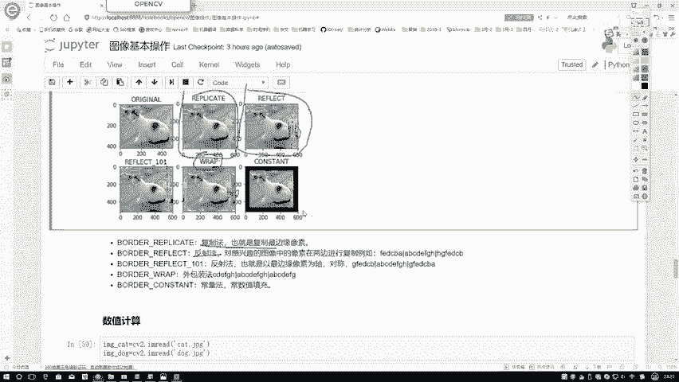

# 比刷剧还爽！【OpenCV+YOLO】终于有人能把OpenCV图像处理+YOLO目标检测讲的这么通俗易懂了!J建议收藏！（人工智能、深度学习、机器学习算法） - P10：4-边界填充 - 迪哥的AI世界 - BV1hrUNYcENc

接下来我们再说一下我们的一个第二个啊，下一个问题叫做一个边界填充啊，这个也比较常见，边缘填充啊，就是说当你对我们的一个图像进行一些嗯，变换的过程当中，可能这个图像原始位置在这里。

现在我想对它进行一些填充操作，让它怎么样呢，让他给我扩大一圈行不行啊，这操作也可以，比如说啊咱们不知道大家听没听过一个词啊，叫做一个卷积，咱们在课程的一个稍后的一个区域啊，应该也会提到这个东西。

所以卷积啊，就是要对图像当中进行一些特征提取，咱们到时候还给大家详细说啊，然后呢只不过说在提取过程当中，我首先会先做一步，让我的图像先做一个padding，先做一个边界的一个填充啊。

所以说在很多算法当中啊，都会利用这一点的带大家来介绍这样一个函数，首先需要你指定一下，就是你看啊咱们这边缘填充，你说你填的时候，你是不是也跟我说，你上面得添点东西，下面得添点东西，你左边得添点东西吧。

右边也添点东西，你这样你把这一圈都填完了，才相当于你填就是整体填完整了吧，在这里啊，我们先需要指定一个参数，就是你在上下左右分别填充的一个大小，注意点是上下左右它的一个大小值啊，在这里我分别指定了一下。

都是一个50啊，随便指定一些值就可以了，然后呢再来看一下我填充的一个效果。

在这里啊跟大家就是演示的是嗯，对于不同的一些填充方法，其实呢我们用的函数啊都是一样的，都是用咱当前的去copy一下，咱们make咱一个一个边界的一个函数，这个函数当中啊。

其实第一个参数就是我当前的一个呃，我的一个输入图像，然后这个就是我该指定的，你的一个上下左右分别要填充多少，只不过说最后的一个我的一个type值，它相当于就是你需要给我指定出来啊。

你要按照什么样的方式进行一个填充，在这里可能就是你看这些方法，哎呀CV two点一叉长串子。

我也不知道什么意思啊，咱看这个东西什么意思啊，比较麻烦算了，咱直接看一下他演示的结果。

然后给大家解释一下嗯，他是怎么去做的，在这里就是其实啊代码当中很简单，只去做什么事，就是函数都是一样的，只不过说我的type是不同的。

咱分辨，这里给大家演示一下，然后呢，我用这个MAPLOT他画了一个子图，在图图当中演示了我们几种不同的一个。

填充方法，咱们来看第一种。

第一种呢在这里咱们来找一下吧，它就是这个东西，这东西要管它叫做一个复制法啊。

原图咱就不看了，原图直接拿过来了，复制法是这个意思。

就是直接复制我最便的像素了，你看这里比如说这个东西它是一个最边缘的，你看再往下加的时候是不是挺奇怪的，因为什么你看都是一些一样的东西吧，相当有最便的什么，它就往下不断的复制什么东西了。

这是第一种最简单的一个复制法，然后呢第二个第二个它叫做一个反射法。

反射法是这样为大家看一下吧，就这一块，你看我写了一个ABCDEFGH吧，这是什么，这是A是其中一个边界，H也是个边界，它是这样，在A这边离谁近呢，它就这么样进行反射，你原来不是ABCDEFG吗。

这回你写ABCDEFG，只不过说它是一个反射的一个方法，这样来进行构建，大家在看这些函数过程当中啊，你也不用去记它的名字，你也不用去记啊，他的这些type值了，你就记住它是什么方法。

以及呢哎他是把这个ABCD啊，这些值哎怎么玩的，知道这些事就行了，然后第二个再一个反射法，这是另外一种反射法，这个反射法当中啊，咱们再来看，你看我原来这块有个A然后这块也是A吧，只不过现在这个A。

他为了让这个反射看着更对称一点，你看他怎么样了，BCDEFG它没有这个A了吧，右边呢HG就是这个H这一块GFED，它也没有这个H了吧，啊这是一个另外一种啊，我的一个反射方法。

然后呢还有一个叫做一个外包装法，外包装法啊也是比较简单，再来看这个是ABCDEFGH，右边呢ABCDEFH，ABCDEFH啊，都是这样的一个就都是这样的一个顺序，一个一个一个来去来就完事了。

最后常量法比较简单了，拿常数值进行填充行了，这回再来看看效果吧，第一个这是什么，这是我的一个复制，直接复制最边缘的，第二呢，这是我的一个反射，你看你看就是在相当于什么，在这一块。

是不是相当于做了这样一个镜面的一个感觉，你看这个猫屁股在这儿呢，这猫屁股是不是在这呢做了这样一个反射吧，这个也是做了一个反射，但是呢边界可能就是做的更好一点，因为这个边界可能就有些重复的感觉。

然后呢这个就是外包装法，外包装法就是这一块，它这个东西在循环再循环啊，不断玩下去。

然后最后一个拿常数值，我看这是拿零进行填充的，你看这里我应该写了个零，你看指定一个方法，还指定一个value值，前面几种方法你都不需要去指定这个value值，当你指定成一个constant。

就是一个常数的时候，你需要告诉我你这个常数填充啊。

拿谁去填，如果说拿零，那就是做了一个黑框啊。

这个就是我们的一个边缘填充啊，它是啊怎么去做的啊，比较简单。

