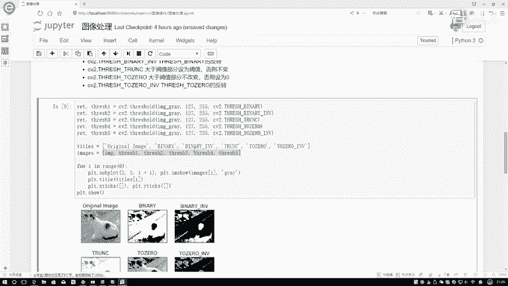

# 比刷剧还爽！【OpenCV+YOLO】终于有人能把OpenCV图像处理+YOLO目标检测讲的这么通俗易懂了!J建议收藏！（人工智能、深度学习、机器学习算法） - P11：图像阈值 - 迪哥的AI世界 - BV1hrUNYcENc

这节课呀咱们来说一下关于图像，它的一些阈值操作，可能大家一听到阈值这个词啊，第一个想法就是现在哎我拿到一张图像，它是由像素点组成的，在这个消耗点所组成矩阵当中，我要对其中的比如说有56，230一页。

17，还有个28，对于每个像素点值啊要进行一个判断了，如果说哎56这个值它大于阈值了，我对它怎么处理，小阈值又对它怎么处理，这个就是我们这个阈值函数啊，它要做的一件事，我们先来看这个函数吧。

就是CV two的swift的函数当中需要四个输入参数，第一个输入参数啊，就是你原始的一个图像，通过文CVR读进来图像就可以，第二呢就是你指定域值它是等于多少的，嗯这个阈值啊它不是一个什么0。7，0。

8不是一个百分比啊，而是实际的一个值，比如说比较常见的127，因为我们所有相同点，取值范围不是从0~255之间吗，经常这个判断值啊，就是以127啊为界进行判断的，然后呢第三个参数，第三个参数啊。

是我们最大的一个可能值最大值啊，一般情况下就是255了，因为我们所有图像数据啊，都是从0~255之间嘛，然后主要啊就是第四个参数，第四个参数啊，表示着你要去做这样一个阈值这样一个事儿。

然后呢你选择这个功能，或者说你选择的方法是什么什么方法，说白了就是怎么样去判断阈值，判断阈值之后怎么处理，完全是由第四个参数这个type所来决定的，那我们先来看一下吧，在这个tab当中啊。

它有几种情况嗯。

这五种情况就是以后啊大家可能会用到的，在这里都给大家列出来了，咱们先说第一个，第一个啊咱们这么点先不说第一个吧，先说这个这个比较简单啊，啊这也是第一个这个阈值啊，就是这个意思，我们来先看它的一个解释啊。

首先它是什么，它是一个二值法吧，所谓一个二值法什么意思啊，就是我大于这个阈值，我要取一个值，小于阈值，我再取一个值，在这里啊，它大于阈值的时候会取到我们设定的最大值，比如说在这里我传接几个参数。

我写这是127页，我写这是255type，我指定成我当前框架这个东西，它就会对我图像当中啊每一个像素点进行判断，如果说当前像素点值是大于127的，怎么办，大于的部分我会取最大值，它会变成255。

那你看什么值比较大呀，通常情况下在我们图像当中啊，是不是越亮的地方它值越大呀，在这里越亮的地方，我取255，是不是相当于把它放到极量，那相当于就是一个白点了吧，这个意思吧，然后呢，否则的话怎么办。

否则的话就取零，我比较暗的地方，那它小阈值了，小于值我就直接给它取零，相当于啊是一个黑的地方，咱这样来看一下这个结果嗯。

在下面我分别写了几种不同的情况，咱们先来看第一个图啊，原始图像就是这只小猫，然后呢我分别先做几个操作，这里咱们先说第一个，第一个你看我指定tab值什么，CV two点我的一个二指法吧。

在二指法当中啊，它有两个返回的参数嗯，这两个返回参数啊，其实上来说我们并不是全需要啊。

在这里基本上我们只需要一个就可以了。

就是这个东西这个就是第二参数啊，大家注意记住一点就行，第二个参数或者说在这里。

第二参数它是我的一个输出图，第一个参数它是我的一个阈值。

所以说我现在写个threshold，一就是表示第一种哎我阈值定义的方法，第二种，第三种，第四种，第五种以及呢五种，它返回的一个结果分别是多少。

在这里呢我把它们都放到一起了，然后呢又画了一个图，画了这个子图当中啊，咱们先来看第一个，刚才咱们是不是这么写的，这是一就是第一函数当中，这块它不是写127嘛，所以说啊咱来看一下。

所有大于127的怎么办了，比较亮的地方，你看猫身子白色比较亮吧，全变成白色了吧，你看这个这块比较黑，这块也比较黑，它小于127的，是不是变成一个纯黑色呀，也就是说啊。

现在我把图像当中诶进行了一个20处理，处理完之后，大于127的量的全为白暗点的权威黑。

这个意思，这是咱们第一种方法比较简单，咱们再来看第二种方法。

第二种方法其实就是在我第一种方法后面，加上了一个关键词，我们来看一下，在这里它加什么，加一个inverse，一个东西，相当于啊对我前面的那个方法进行了一个反转，反转什么意思啊。

以后啊大家会经常看到这个尾缀点ANV，依靠点2NV啊，你就要想到它俩是一种反转的方法，反转什么意思呢，之前我说我说大于127的比较亮的，取多少，取255吧，那你反转一下，是不是说现在就是小于127的。

取255啊，那也就是说啊现在我比较暗的地方，原本比较暗的，你让它变成个白点，原本比较亮的变成一个黑点。

他应该跟咱们刚才看过那个方法，是正好相反的吧，再来看在这里，这个是第三个图，是我实验的结果吧，在这里就是对应着这个函数，这个函数啊，就是呃其实所有的函数，你发没发现我写的参数啊都是一模一样的。

都是127，逗号255吧，只不过说啊我指定的类型是不同的，当我指定类型加上了一个20的反转之后，现在呢你看咱们就不说，咱就不光说这个阈值对比啊，就拿跟他前一个图做对比，是不是黑的变成白了，白的变成黑了。

是跟原来完全不同了吧，这个也比较好理解。

咱再来说下一个下个当中啊，就是我可以指定一个截断值，截断值什么意思呢，比如说咱现在还是指定127吧，结论者他是这个意思，就是说如果说呀我大于127的怎么办，所有大于127的，那不好意思。

你就等于127了，我现在指定这样一个阈值，在这里做了一个阶段，好比说啊这样一个序列，从0~255都行，现在我中间卡了一刀，我说你最大的，那你只能是就是127了，这个意思做了一个截断，再来看一下吧。

就是大于的他也做了一个截断，大阈值部分就设为阈值小一部分呢，他就不进行改变啊。

再来看一下，在这里这一块儿就是我进行了一个阶段吧，所有比较亮的地方，那就围起来本身了，所有你看当前这些黑色的地方，是不是一点没变啊，因为黑的地方是小于我的阈值的，它不会进行一个改变。

然后呢这块还有第三种，我看这有没有反转。

这个啊这个没有反转，然后下面下面有个two zero，再看这个to zero to zero软件该更好理解了，现在啊就是我大于一值的部分保持不变，那小于零怎么办，你看他的名字吧，他都给你说了。

to一个zero，也就是说现在所有大于127的，那你可以保持不变，所有小于等于127的，那不好意思，你就全为零了，全为一个黑的，相当于啊原始图像当中啊，比较亮的那些，哎我不给你变化比较暗的那些。

不好意思，全给我变成一个黑点。

在这个图当中，我们可以明显看出来稍微的大于127的，比较亮的地方，它是不是保持不变啊，然后呢所有小于127的地方，那也就是说比较暗的地方，比较暗的，原来比较暗，现在是不是更暗了呀。

因为我会把所有小127的，转换成一个零吧，在这里啊。

这个就是我一个two zero，那你说two zero能不能反转一下，是不是也可以啊。

再反转道理是一样的，再来看结果吧，是不是跟原来正好相反的，现原来比较亮的，现在全为黑了，原来权威原来比较暗的，现在没白了吧，这个就是一个反转。

在这里啊跟大家分别说了一下，我们图像一些阈值操作该怎么样进行一个定义，主要就是这五种方法，彭云边给大家举例的说明了一下，当我们的一个类型选择是不同方式的时候，我们得到结果是长什么样子。

在这里就给大家对比了一下啊，我们阈值选择方法不同。

