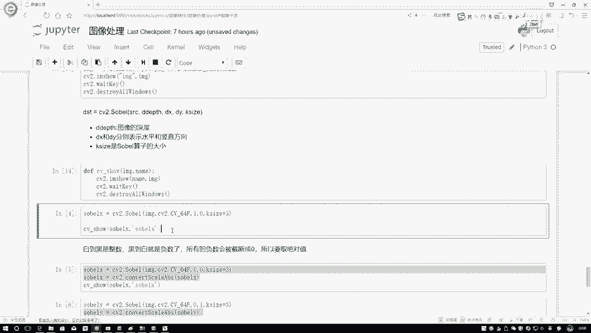

# 比刷剧还爽！【OpenCV+YOLO】终于有人能把OpenCV图像处理+YOLO目标检测讲的这么通俗易懂了!J建议收藏！（人工智能、深度学习、机器学习算法） - P12：1-Sobel算子 - 迪哥的AI世界 - BV1hrUNYcENc

这节课呀咱们来说一下关于图像，我们该怎么样计算它的梯度，首先我们先介绍第一种方法叫做一个SOO算子，我们先来看一下，就是啊这个算子从整体上来说啊。

做些什么事，那我先问大家第一个事吧，比如说哦在这里咱们先读取一张图像。

就我该画的这个圆，在这个圆当中啊，梯度什么意思啊，也就是说我的一个边界点吧，那我们来看，比如说白色的，我现在我就随便框起来一个区域，我你说它有梯度吗，好像没有吧，左边的也是白色的，右边的也是白色的。

我画个框可能有点太大了，这样我画条线吧，但在这条线啊，它的一个左边和它的右边，是不是都是一个白色的，都是一个白色，那这条线这条线上吧它能产生梯度吗，没有吧，左右两边都是同样一个事啊。

那什么样的位置它会产生梯度呢，应该是一些边缘位置吧，我们来看表演，这里在这里啊，对于这个点来说，左边它是个黑色的，右边是个白色的，在像素层面来说，它的数值完全不一样吧，那我们来想一想。

如果说啊两个点就当就当这个边界点来说吧，这两个边界点一个是255，一个白色的，一个是零，一个黑色的这样这么大的一个差异，我们是不是说它梯度应该稍微大一些啊，所以说啊我们现在啊就要第一种方法。

怎么样去计算在图像当中，它的一个梯度是等于多少，或者说你把哪些地方有梯度给我找出来啊，咱要做这样一件事儿，说白了其实这个事像什么，像不像是我们做一些跟边缘检测相关了，因为只有一些边缘地方在图像当中有。

就是比如说在这里吧，那就是一个白和黑，那放到要正常正常图像当中呢，它应该就是有一些这是一个主体，那是一个主体，主体和主体之间肯定它是有一个连接的缝隙吧，这些缝隙啊我们都是一些边缘嘛。

所以说我们现在可以通过这个搜索因子啊，来做这样的一个检测，那我们先做第一个任务，就是先把它的梯度啊给计算出来。

那这个任务当中我们该怎么算梯度啊，像我刚才说的，我们算的过程当中顺便算一算，比如这个点左边是什么，右边又是什么吧，那怎么样在图像或者在像素点层面上，执行这样一个操作呢，咱之前啊在讲一些形态学操作的时候。

是不是都我们都是拿一个卷积，或者说你拿一个核函数吧，拿这样一个filter，拿一个核来对图像当中某一个点进行计算啊，在这里啊也是一样的，我们分别写了一个GX，还有一个GY，其中啊JS什么意思啊。

我们现在来看哦，一刚才我说的一个左边和右边，左边和右边进行对比，那这像什么，你看左右的感觉，它是不是个水平的一个梯度啊，所以这一块我标了一个GX，那除了GX呢还有什么。

还有一个你在下面和上面之间的一个差异吧，那你说下面和上面之间差异，那是不是一个数值的，所以说啊当我们在进行梯度计算的过程当中啊，主要啊是要考虑两个方向，一个方向我叫做一个GX，一个方向叫JY。

分别表示一个水平，还有数值这样一个感觉，那我现在要问大家个问题了，既然我们已经把任务明确了，就要算左右和下面和上面，它们各自之间的一个差异，那我们这个filter或者是我的一个盒，该怎么定义啊。

在这一块直接把和把这个盒给大家列出来了，其实挺简单的，你看啊他的一个他的一个算法，碳算二怎么去算的，这是正一正二正一负一负二负一，假设我一个图像数据来了，图像数据当中我选了一个3×3的一个区域吧。

对于这3×3的区域，比如说我说这是这个点，我要看这个点什么，我要看这个点左边我这边标一下吧，比如这个点来说呃，一个picture，我说这是P1，这是P2，这是一个P3，然后这不是一个3×3的吗。

它是不是得有P4P5P六是吧，我刚才这个点就点到P5这个位置了，然后呢这个P7P8，还有P9，按照咱这个卷积核，然后咱们来看一下当前这个任务，该咱们该怎么去算，是不是对应位置相乘，然后加在一起就完事了。

把它们整合在一起的结果等于什么，那你看P3对应的是正义，那是不是P3加加过来吧，加谁啊，这一块应该是个P6吧，加上一个就是咱们不这么写，写P3加P先加P6可能没那么直接，但这样这是一个P3。

这一块是个负的吧，那负的是不是减法，所以说P3-1个P1吧，然后这一块是不是二倍的一个P6啊，对应位置相乘吧，减去什么，减去二倍的一个P4吧，然后再加上什么，再加上一个P9，再减去一个P7吧。

哎咱整体流程就是这么样进行计算吧，那大家可能问了哎，这块为什么是一这块为什么是二啊，现在我们来想一想，当前你要算的点是哪个点，是P5这个点吧，你点到这里了，P6和P就是P6。

这个点相对来说它是不是离P5更近一些，而P3和P9，是不是离P5相对来说更小一些啊，所以说在这一块是不是像一个高斯的感觉，离得越近的值它越大，离得越远的值它越小啊。

那最终啊我通过这样一个就是呃减法的操作，相当于是我右边去减左边啊，这里是右边减左边，通过右边减左边，我对比了一下左右两边，它就是左右两边一些边缘区域，它的一个什么像素点的一个差异值吧。

我通过这样一个差异值啊，就把它当做是我水平方向的一个梯度了，我标成一个GX，那JS啊，咱们这么算的，你说JY到底是不是一样的，在这里要不给大家一个句话了，JY我们就看一下它的一个filter。

我的一个盒当中啊，它是怎么定义的，首先JY当中我是用下边去捡上面这个操作吧，下面那就是正一正二，还有正一上面呢就是一负二，还有一，通过下面减上面这样一个减法操作，我就知道了，咱们像素点之间的一个差异吧。

这样我的一个JY我的一个数值方向就都有了，在这里啊就跟大家说了一下啊，在图像梯度当中，我们第一种方法搜索算子怎么去算的，道理非常简单，右减左下减上就完事了，在这里啊，咱们先来做第一个实验。

就是还是要先把咱们当前这个图像读进来，就是一个圈，然后中间是白色的。

周围啊都是一个黑色的，那我们来看一下在open CV当中啊，我们的函数怎么去用，通过CV2点SOO一下啊，直接把这个函数调进来，第一个我们要传进来的就是你当前这个图像。

第二个你要传进来是图像的一个深度嗯，通常情况下就是我们图像深度，你指定成一个一啊，这就完事了，这是通常情况下，然后呢有的时候还是这样，就是有些时候啊，像我们刚才说的，你看啊。

在这里我们在做一些减法操作过程当中，你看是不是用右边减左边，你说一定得到一个正数吗，不太一定吧，有时候我们可能得到一个负数，那得到负数怎么办，通常情况下就是默认啊，这个open CV它的取值范围是什么。

0~255吧，取成负数，它还给你做一个截断操作，相当于小于零的，全等于零了，所以说啊，在这里我们一会儿要做一些额外的事情啊，大家先知道这样的事就行，一会儿咱们用到手来跟大家去说。

然后默认啊就是一般情况下所有的函数当中啊，它的一个DETAPE值啊，都是一个呃一就是它的一个深度值，表示着我输出的深度跟输入的深度，它是一模一样的，下面呢有一个DX和一个DY，分别表示着你要算X的方向。

还是去算Y的一个方向，这个意思，然后最后要k size，K size，就像我刚说的，你指定的这个和它是多大的，咱这里画的是一个3×3的吧，通常情况下绝大多数时候都是一个3×3的，或者5×5也可以啊。

但一般都是一个3×3的，那下面呢我们来看一下吧，当前我用这个函数能得到的效果是长什么样子，这样我在这一块，就是我刚才发现我总去去创建一个窗口，然后去读图像，挺费劲啊，写成函数吧，这样咱用起来方便一些。

这样我先把它都执行一下，然后下面咱们来看这个，我通过cp two solo一下，当前imagine就是这个东西。

咱读进这个圆嘛，我把这个东西传进去看一下他呀。

经过我搜索因子完之后，得到的结果是长什么样子，然后这一块我写了一个CV two cv64F，相当于是这个意思呃，一会儿我要能算下结果，它是不光是有正的，还有负的了，就像刚才说的，然后open CV啊。

它会默认的把一些负值截断成零，但是你说有负值，那是不是正常情况下它就是一个负值啊，我们自我们就是按照道理啊，我们需要干什么，取一个绝对值吧，我们算的只是左右或者是上下，它们之间的一个差异吧。

至于具体差异是多少，其实我不关心啊，我只关心差异它是有多大的，所以说我们现在这块要取个绝对值，那你还没取绝对值之前，你需要做的一件事就是怎么样，就是得把这个东西啊转换成一种带负数的形式。

所以说在这里啊我们用了一种更高级的写法，相当于我的位数更多了，能表示一种复数形式，这个意思，接下来接下来这里我要指定DX和DY了，呃首先咱们先看什么，先看DX吧，我先指定DX它等于一，DY等于零。

表示的是我现在要算的是水平的，我不去算它的一个数值的啊，谁为一就算谁，咱先来啊。

看一下当前的一个结果啊，这是我第一次执行完的结果，在执行完结果之后啊，它是不是得算出来梯度啊，哪块会有梯度啊，大家来想一想，只有边界的位置上才会有这些梯度吧，所以说啊他这块描述的这些白点。

它就是边界位置。