# P15：1-Canny边缘检测流程 - 迪哥的AI世界 - BV1hrUNYcENc

这节课下来跟大家说一下卡内边缘检测算法，关于candy这个词啊，他是啊一个科学家在1986年啊，写了一篇论文，然后呢他就以啊以自己的名字来命名啊，这个检测算法了，我们接下来给大家说一下。

就是当我们想进行边缘检测的时候，我们的几个流程是长什么样子，在这里啊，我们写了五步，第一步啊，其实这五步啊，相当于是对我们之前所讲知识点，再进行一个复习啊，会用到我们之前所讲到的穿插进来。

然后第一个就是我们要用一个滤波器在这里啊，candy检测算法当中啊，它使用的是高斯滤波器，滤波器的目的是什么，之前啊在给大家演示的时候，我们是不是跟大家说了，原始图像当中啊，可能有一些焦耳的噪音。

通过一些滤波器，我们可以对图像进行一个平滑处理，相当于啊第一步我要过滤掉噪声，大家可以想一想，就是当我们在进行检测过程当中，肯定是要算梯度吧，那你算梯度的时候，那些噪音点。

你是不是它也会发生一个梯度的变化呀，所以说啊为了使得咱边缘检测能做的更好一些，第一步我要做一个去造，也就是说我在这里要去滤调，咱们这个噪声使用的是一个高斯滤波器，第二步，第二步，你说要进行边缘检测。

那咱之前是不是刚讲完梯度这个事啊，你肯定你得把梯度都给我算出来吧，只不过说啊在这里我们要算TU当中两个值，刚就是之前咱们讲的只算一个，就是大小就可以了，但是现在呢我需要再知道一个方向这个东西啊。

所以说现在我们要计算两点，一个是梯度当中的大小，一个是它的方向，第三点，一个非极大值抑制，那什么意思啊，比如说啊当我算完了梯度之后，那有些可能梯度稍微大点，有的梯度可能稍微小点，在这里啊，我要做什么。

就是比如说在一个盒当中吧，33盒当中，我需要把一些小的啊一些梯度值给它抑制掉，只保留一个大的，相当于啊把最明显的给它体现出来，在这里一会儿会给大家说一下，什么叫做一个极大值抑制。

现在大家可能对加急日益智，这个东西以前没用过，但是我估计你要做图像做多了，会经常提到这个词，我先说一个最基本应用，比如说一个人脸检测，在人脸检测过程当中啊，比如说人这个脸在这一块。

你说你要检测这个人脸的位置，那你可能得到多个结果，你可能这一块得到一个框，这一块也得到一个框，这一块又得到一个框，你可以得到很多人脸的位置，那你说啊最终人脸在什么位置，咱们自己在用相机去拍照的时候。

是不是，咱现在很多相机都有人脸检测那个东西啊，他检测出人脸是几个，就一个吧，在这里啊他又取什么获取最大值。

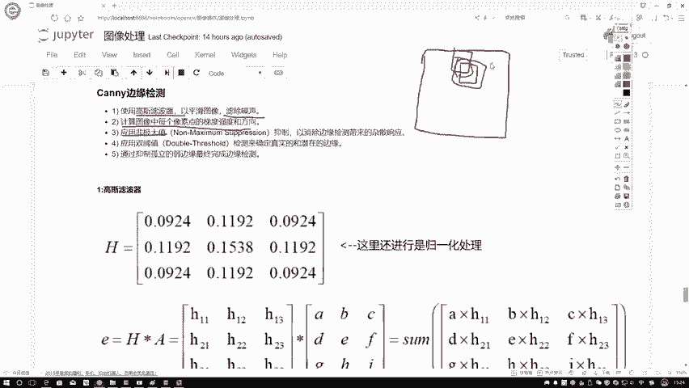

比如说我写个AABC哦，这画的比较小，这样我画的大点的，这是人脸，这是A框，然后换一个颜色，这是一个蓝色的，蓝色的是一个B框，然后呢再画一个黄色的黄色的卡，这是一个C框，现在我就说哎呀。

A框检测到它是人脸的可能性是99%，可以吧，然后呢这个B框，这个B框它可能是一个97%，那C框呢C框它可能是一个96%啊，这C颜色比较浅，咱不管了，在这里你说我们要取什么。

如果说啊它的重合面积都比较大的时候，好像就是反正这三个好像大致都快重合了，取它们三个都谁都行，在这个前提下，我们取谁啊，肯定是取可能性最大的吧，在这里我会只保留这个99%的而去，一直掉这个96%。

97%的神庙一直掉啊，就把他们丢弃了，把它们扔了啊。

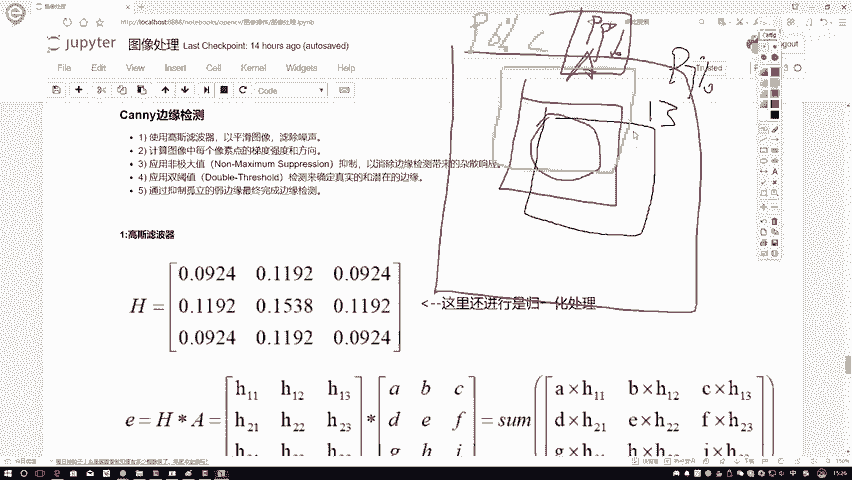

就是叫做一个抑制在这里啊，一会儿我们也会用到非极大值抑制这个东西啊，一会会给大家讲一下，就NMS那下面第四点，第四点还有一个双阈值，双预是什么意思啊，现在就是在我检测过程当中有一些啊，可能不是一些边界。

或者是有一些边界候选值吧，我要再对这些边界候选值再进行过滤，找到啊，真实的啊一些边界，相当于对一些所有可能边界再进行过滤，只保留最真实的那一些啊，这个就是我们整个这个抗体边缘检测，它要做的一件事儿。

给大家在这里啊说出来几点，那最终啊就是相当于把我这点组合起来，最终完成我的一个边缘检测的任务行了。

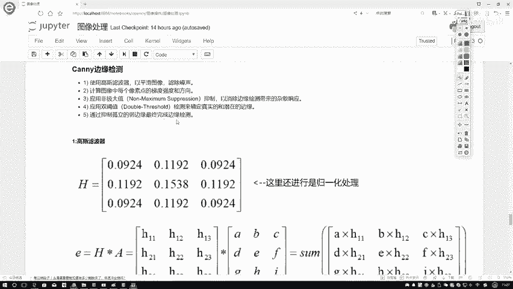

然后再来看一下吧，在这里咱们就一步步说呃，第一步我要用高斯滤波器，高速滤波器咱之前讲过了吧，什么中间点比较大，越边缘点越小吧，这个意思在这里啊，我们可以直接对高斯滤波器当中的这个高斯核。

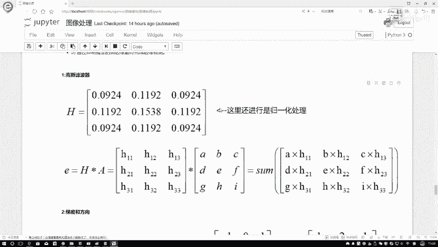

进行一个归一化的处理，然后呢报纸数据拿过来。

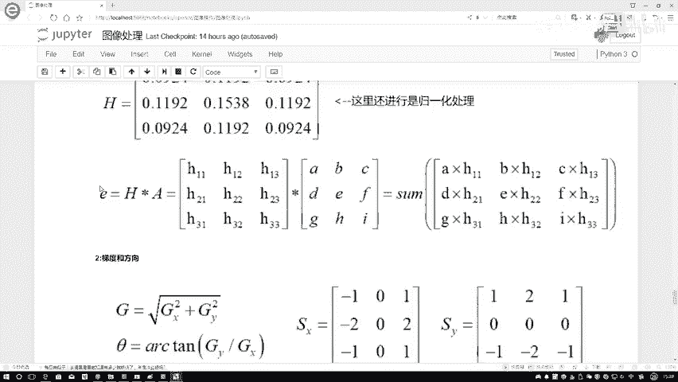

报纸数据啊，按照你高斯滤波器的方法，是不是啊，我就知道了中间这个点它等于什么值啊，再把这个结果给它sum加在一起，我就知道了，当前哎我的一个中心点，它第一个值应该是什么，当所有的像素点都完成了滤波。

就是高斯滤波操作之后。

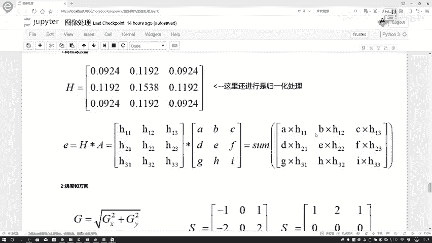

就相当于啊我完成了一个平滑的处理，跟咱以前啊讲的方法都是一模一样的。

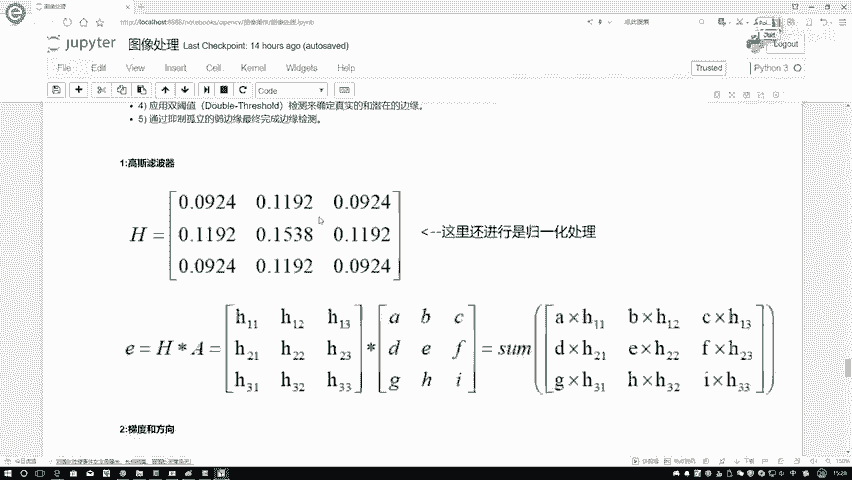

这个can尼亚编辑检测当中，他用的是高斯滤波器。

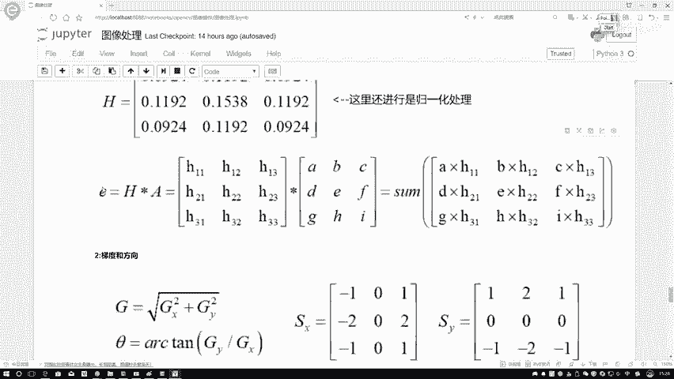

第二步方向嗯，当咱吧就是哎这里方向再说一下，就是他用的算子是这个SOO算子啊，所有算法当中啊，它是有一个X，有一个Y吧。

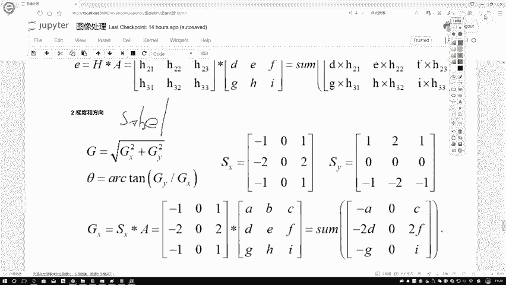

所以说我们可以先把GX和GY啊分别算出来，算出来GX和GY之后啊，我们要算一个方向，而这个方向其实很简单，你知道GX，你也知道JY了，那一个方向就按弹进那一下是不是算出来了。

然后GX就是这个xx还有XY，我的两个和都是给它写出来吧，一正一，还有一个就是一个从右到到左，一个是从下到上啊这样一个意思。

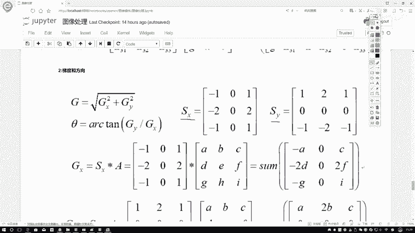

然后呢，接下来接下来我就算我GX值GY值很容易吧。

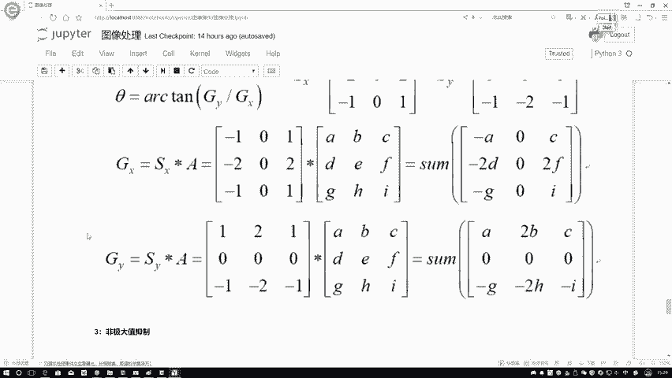

我就可以把GX值GY值啊给他算出来了。