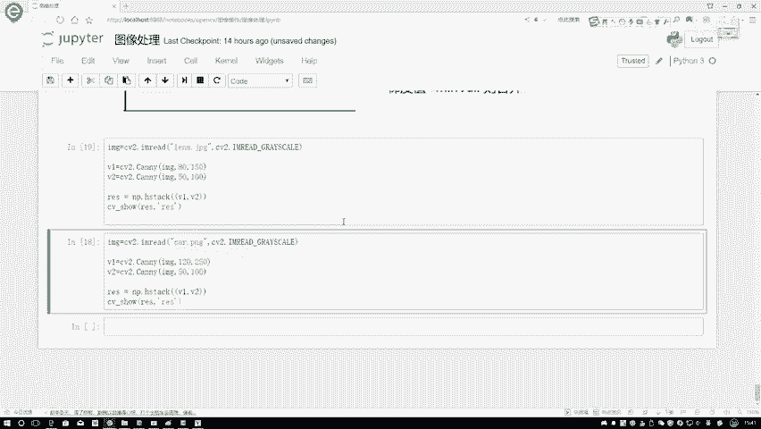

# P17：3-边缘检测效果 - 迪哥的AI世界 - BV1hrUNYcENc

第四点第四点啊，就是这个呃，咱们的这个边缘检测当中又提到一点。

叫做一个双阈值呃，什么叫双阈值呢，这个也是我们之后啊，一会要用这个open CV函数当中啊，要给它指定的两个参数，一个呢是叫做min value，一个叫做max value，是这个意思啊，咱们先来看吧。

嗯就是max value，max value是这个意思，比如说你现在算出来的梯度值，我现在假设这个max value是100吧，如果说你的一个梯度值比这个max value值要大。

就是梯度值大于一个100的情况下，我就会把它处理成为一个边界，比如说这个A点A点我算完之后，他这个梯度值怎么样了，他的梯度值是什么，它是一个大于100的，所以说A点它就是一个边界，那你看这个B点呢。

首先啊不是这个B点，假如说这边有地点吧，假设说这块有地点dd什么样，不管了，这块有个地点，这个地点它是不是小于了我的一个密value啊，如果说小有小于我mi value的，那我就会给它通通的进行舍弃。

反正就是min value，就相当于是你梯度值最低最低的一个标准了，你要比这还小，那就说明你可能不是一个边界，所以说此时啊这个D我就给它省略掉了，以后啊，就没他什么事了。

那剩下的呢剩下的就是我这个梯度值啊，在这个取值范围中间，就是这个min value和max value中间，比如这里除了A之后啊，还有个B1个C吧，在这里我需要对这个B和C啊，分别进行一个讨论了。

如果说这个C如果说啊这个C它怎么样，它能够连到一个边界，你看这个C它跟A是连在一起的吧，如果说啊C这个点它连有边界的情况下怎么样，我就可以啊，把这个点进行一个保留，就是C和边界是连在一起的。

虽然说它阈值上没有超过最大阈值，在这里咱刚才不是说了吗，如果说它超过了最大阈值，那肯定说它这一点这一块啊它比较突出，哎，这左右两端完全不一样的，所以说它应该设个边界吧。

那这C相当于是在最小的和最大的之间啊，相当于是一个候选的吧，当候选的它是在连有边界上的，比如说C诶旁边是一个AA是一个边界，此时呢C啊虽然说诶它没有达到一个最大值，那我也认为它是一个边界这个意思。

但是如果对于闭眼来说，它有它的左右两边，你看他也怎么样，它左右两边他的个点左边没电了，右边这个点他也不是超过一个最大值吧，此时啊我就说B这个点怎么样，它没点有边界。

MELIL边界它没有满足到我最大的一个值，并且呢它的一个旁边也不是一个边界，此时对于B点来说，我就要给它进行一个舍弃了，在这里啊，咱是分别讨论了三种情况啊，梯度值我大于max value的时候。

直接处理成边界小于min y6的时候，不好意思，直接给它舍弃掉了，当梯度值在这个中间的时候，我还要自己做一个判断，看一下他俩是否连有边界，如果说连有边界的情况下，我把它保存下来，如果说没有联有边界。

直接就得舍弃掉了。

这个就是一个双阈值检测行了，在这里跟大家说了一下啊。

就是最后是不是说当你检测完之后，这一步一步的相当于进行过滤吧。

过滤完之后啊，就是我们最终的一个结果了，在这里啊我们是分了四步啊。

做了一下咱的一个啊卡内边缘检测，然后呢剩余时间啊咱们来看一下，就是当我想要open CV来完成这个事。

咱们该怎么去做，其实啊就是说原理说了挺长时间啊。

但是呢在这里我用这个open CV去做的时候，非常简单哦，只需要我们把图像读取进来，很简单，咱还是去读这个LINA这个图像，然后呢，我们一般情况下边缘检测灰度图就可以了。

在这里第一步我用什么CV two点CY一下，然后呢把数据传进来，这个八十一百五什么意思啊，它表示着在这里你该不是设置一个min value，还有max value吗。

min value和max value在这里啊。

就是需要我们自己来进行指定，那大家可以想一想，就是这个mi value和max value，指定的大一点和小一点会有什么影响，我们可以先来说一说，如果说如果说呀你这个min value指定的比较小。

你看我这块写一个min1，这块写me in2吧，你这个mi value啊指定的比较小的时候，是不是说你的要求没有那么高啊，一个原来比如原来这个点，原来这个点他现在直接现在原来就是正常MIY。

六一的时候直接被舍弃了吧，但是在mi value2的时候呢，它是不是要候选的，它可能哎也成为一个就是比如说这是一个E点，这是一个F点，它有可能也成为一个边界点吧。

所以说啊当你的一个mi value取值较小的时候，相当于啊你把这个条件放松了，意味着你希望检测出来哎越多的边界越好，但是呢可能就是这个边界没有那么特别边，没有没有，就是完完全全的就是是一个边界。

可能只些候选值你也加进来了，尽可能多的去拿到这样一个边界，那你说你把这个值设稍微大一点呢，我写个M3，这个mi value3啊，写MN3吧，这个面Y63什么意思啊，当你把它设置成越大，你看原来怎么样。

比如说设置到这吧，那你要说到这的时候，你说这个C点原来它是个边界，现在也不是了吧，说明的要求非常高，只有极有可能成为边界的时候，我才拿出来，一般情况下你全给他一直掉，是不是这个意思啊。

那max value有道理是不一样的，你指定的越大，是不是说你的标准越高，你指定的越小说明你的标准越低吧，所以说在这里啊我们也可以啊。

通过根据自己的任务来进行不同的设置，如果说你这两个值都设置的比较小，你看在这里我第一个就是一个呃，这样吧，看下面这个，第二个你看五十一百设置比较小吧，上面八十一百五设置比较大吧。

这块再来对比一下不同的一个参数啊，在我的一个candy啊边检测算法当中啊。

它得到的结果是长什么样子，咱先来看一下，在这里我一直行。

我们可以看一下左边这个图是什么，左边这个图啊，它就是一个八十一百五的，相对来说是什么意思啊，稍微大一点的吧，右边这个呢，右边这个是一个五十一百的，稍微小一点，那你看稍微小一点的，得到的一个咱就看头发吧。

你看这块的边缘的信息是不是更多一些啊，但你值得更大的时候，你的边缘信息是不是更小一点啊，但是你再观察一下，当你这个值水量越小的时候，你看这一块和这一块像这相当于像什么，像不像一个找别扭的一个游戏啊。

咱找找不同哈，在这一块你看得到的信息是更多吧，都有可能也会把一些噪音点的东西要考虑进来，这个就是你指定阈值它大和小支架一个区别，这个是LINA这个图啊。

然后下面我们再来看另外一个图，下面呢还是要这个方法，然后我把这个结果差异的设置的更大一些，我导进来一个呃这个这个car点PNG再来看一下吧。

哦这个图比较大，在这个图当中啊，左边这个我看左边这个是应该是额，左边这个值它是比较大的，右边这个值它是比较小的，你看这个偏大的值，对偏大值来说啊，这个基本边缘的信息全都检测到了吧。

但是呢可能没有那么细致，是不是你看在这里咱就看这块这些楼吧，这块正常应该是一些楼房吧，这楼房的信息和这个楼房信息之间，它还是有些差异的吧，右边相当于给你检查的更仔细一点，这个啊就是我的一个阈值啊。

mi value和max value它指定大一些和小一些，它具体的一个差别，当你指定的更小一点的时候，它可以啊，你看这块它检测的多全，这个所有逻辑信息数全出来了，这一块它就没检测到吧。

这个就跟大家对比了一下啊，咱不同的一个阈值啊，对结果的一个差异的指定的越小，那你希望检测出来的边界越丰富，指定越大，你希望检测出来的边界啊，它是越怎么样，就是越少吧。

或者是只有特别是边界的才能给你检测到，相当于你看这块所有楼最上面和最下面，全检测到了吧，这个就跟大家说了一下啊，咱们在这个open CV当中啊。

怎么样进行一个边缘检测啊，非常简单，用CV two点看了一下就可以啊。

把相当于是它综合了，把这几点全加进去了，加进去完之后啊。

