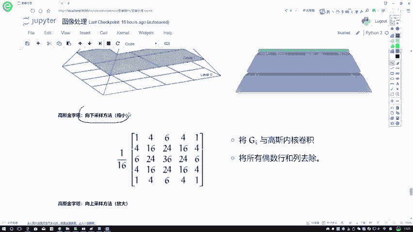

# 比刷剧还爽！【OpenCV+YOLO】终于有人能把OpenCV图像处理+YOLO目标检测讲的这么通俗易懂了!J建议收藏！（人工智能、深度学习、机器学习算法） - P18：1-图像金字塔定义 - 迪哥的AI世界 - BV1hrUNYcENc

这节课呀来跟大家说一下图像金字塔嗯，这样咱先给大家解释一下什么叫做一个金字塔，这块能列出来一个图，我们可以看一下金字塔的形状当中啊，是不是说底层啊，我们是比较大的，然后越往上会越小，那我们图像金字塔。

就是说呀，要把我们图像诶组合成，像金字塔一样的一个形状，比如说咱在这里举个例子啊，我说底下这张图像，它是一个800×1个800的，可以吧，这是我们说现在有一个比较大的图像，是800×800的。

然后呢我们可以给它进行变换，比如说在这里我给它往上层变换，往上层变换的过程当中啊，是不是说越离金字塔尖的，它应该会越小啊，所以说第一步我也变成了一个400乘上，一个400的，那接下来呢它再往上走。

越来越到尖的地方，是不是变得越来越小啊，那这一块它就是一个200×200，这一块呢它就是一个100×100，最后啊这块它是一个50×1个50的，这样我们就把一张图像变换成了多种形式。

但是呢每种形式当中啊，它的大小是不一样的，大家可能会问了，我们现在做这样一个图像，金字塔有什么用呢，其实啊它的用法还是挺多的，比如说以后我们要做一些图像特征提取，在进行特征提取的时候，我们可能不光啊。

要对一张原始输入进行特征提取，可能呢还要对它呀一些整个金字塔，比如这里我们做了好几层金字塔吧，每一层当中我都要进行特征提取，可能每一层特征提取出来的结果是不一样的，我们再把特征提出来，结果总结在一起。

是不是也可以啊，这个就跟大家说了一下，我们图像金字塔可以做哪些个事情，然后呢在这里要给大家主要讲两部分，第一部分叫做一个高斯金字塔，第二部分呢叫做一个拉普拉斯金字塔，其实啊它的道理都是一样的。

就就道理都是差不多的，都是啊，要把我们现在啊，要做这个金字塔形状给构建出来，然后这样下面跟大家说一下。

就是我们的高斯金字塔咱们该怎么去做，这样咱们先做第一种方法。

第一种方法它叫做一个向下采样，哎我问大家一个问题，你说向下采样啊。

它是从上往下走，还是从下往上走，在这个金字塔来看，向下采样，在这里向下采样，第一点应该是越采样越少吧，所以说啊给大家画个方向，这个方向叫做一个向下采样，因为我们线下采样它是一个DOSIMPLE。

就是一个让我们的一个形状慢慢往里去缩，所以说沿着金字塔往尖儿去走，这叫一个向下采样。

所以说此时啊我们要做的目标，大家一定注意啊，向下采样，我要做的目标它是一个缩小操作。

在这里怎么去做呢，嗯看他的名字叫做一个高斯金字塔，那既然名字人家都告诉咱了，叫做一个高斯金字塔，是不是说我们得用高斯的方法进行一个滤波啊，线所以在这一块我们拿到的一个卷积核啊，这里边就是一个高斯的形式。

不要忘记啊，这块还有这样一个规划的展示。

然后呢接下来看一下我们的做法，首先第一步，第一步啊，就是正常的去做，咱们的一个用内核做一个卷积操作嘛，就是对应位置相乘，再加到一起，再除上一个总数，做一个归一化嘛，跟之前都是一样的，第二步呢。

第二步啊就是我们怎么样进行缩小的。

大家可以来看一下，像我该说的，我说这一块啊，嗯往上点。

咱说这块，我说这一块它最底层它是800×800，要说往上一变的时候，是不是变成了个400×400啊，这块比如说来看只有1234哎四个小格子吧，这块只有122个格子吧，所以说啊，无论它的长度和宽度。

是不是都变成原来的一半了，在这里啊，我们长度变成原来一半，宽度变成也是原来一半，但最终啊我的一个面积才最大，面积数不是体积，我最大，我最终我的一个面积。

是不是变成原来的一个1/4了，在这里我要做的是不是说原来两行的。

你要给我合并成一行，原来四行先变成两行，原来八行你给我变成四行，这个意思吧。

所以说在这里啊，我们第二步操作就是第一步，我们用这种高斯盒去做，第二步呢，我们要把偶数行和列通通的给它进行一个去掉，在这里你看原来是八，那我有四个偶数行，四有数列，那圈完之后是不是变成一个4×4了。

这个就是一个高斯金字塔，它是怎么去做的，做法很简单啊，用一个高斯核，然后呢把偶数列全给去掉，这就完事了，偶数行和偶数列，然后啊这是我们线下采样，那线下采样大家一想，那你做完之后，你一去掉。

相当于是一个呃，就是最简单有压缩吧，那这个比较简单，那向上采样怎么去做啊。

不光说我们可以由这个底儿到尖儿，我能不能从这个尖儿到底啊，也是可以的吧，画这样一条线，这样一条线叫什么，叫做一个向上采样吧，因为我们这个上下形容的就是你这个图像，它这个大小如果说图像变大，那是一个往上。

如果说图像变小，那它是一个往上啊，跟我们这个屏幕当中啊，上下可能正好是相反的。

那这回咱们来说一下我的一个上台啊，咱们该怎么去做向上采样，线上采样，也就是说现在比如说是一个2×2的，那你变换完之后，你得给我变换成一个4×4的吧，在这里啊，他的做法其实也挺简单的，咱直接来看这个图吧。

这图当中我写了十三十五十六九十六，反正就是四个像素点嘛，你现在需要做的就是把这个四个像素点，2×2的果变成4×4的，变成16个像素点吧，首先我第一步，第一步我需要在每个方向扩大为原来两倍，你看这个点。

这个点在它的一个X就是这个，比如这个十拿出来吧，你需要原来它是一个1×1的，现在变成2×2的吧，怎么扩充啊，扩充出来了之后，我要以零为填充，所以说我第一个十这个位置它变成什么了，变成十000啊。

这个意思，所以说现在就是对于图像当中啊，每一个点要扩充成原来的长宽各变成两倍，我们呢要补充一些值吧，因为扩充完它是空值啊，补充值就拿零进行填充就可以了，所以啊填充完之后，我得到了右边的这样一个结果。

得到U盘结果之后，那接下来你说这个结果我该怎么去做啊，其实啊就是再拿它进行一次卷积吧，还用什么核，还是用同样的一个核在这里啊，给我们的感觉像什么在这里啊，给我们的一个感觉。

是不是说像是诶你这样扩充完之后，又把这个相同点，像是也就大概是一个平均的感觉，分给周围的一些这些点了，大概这样一个事儿吧，这个就是我们的一个向上采样，它是怎么去做的，在这里啊就给大家分别解释了一下。

我们的一个向上，还有向下咱的一个做法，然后呢其实道理很简单。

就是你就只要知道它往下是不是要缩小，往上是要放大就可以了。

做法很简单。