# 比刷剧还爽！【OpenCV+YOLO】终于有人能把OpenCV图像处理+YOLO目标检测讲的这么通俗易懂了!J建议收藏！（人工智能、深度学习、机器学习算法） - P19：2-金字塔制作方法 - 迪哥的AI世界 - BV1hrUNYcENc

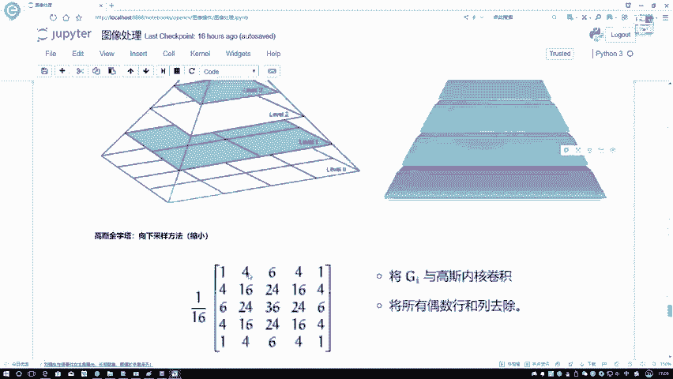

然后呢跟大家来说一下，就是嗯咱们在这个open CV当中啊，应该怎么样执行这样一个操作，首先要读一下这张图像，我们展示一下这张图像长这个样子，这是谁，应该是个敌法师吧，不知道同学们认不认识。

然后呢接下来啊我这块打印了他的个shift值，首先shift值是442340啊，最后一个china3，咱不管了，就看前面两个，那接下来第一步我要执行一个呃，就是你看我接下来我得的结果是不是变大了吧。

那应该是个上采样吧，得上采样，我写一个什么金字塔up，是不是注意点啊，就是你要做一个上采样还是下采样，其实啊就是前面咱的primate就是金字塔吗，金字塔你这个都是用缩写pr来缩写就行了。

只要你写一个up，就是上采样，这块呢你看我写了一个down还是pr up上采样，那down不就是一个下采样吗，在这里再来看看结果吧，还注意点它的一个大小，只是这么大的吧，咱也不用管它具体值了。

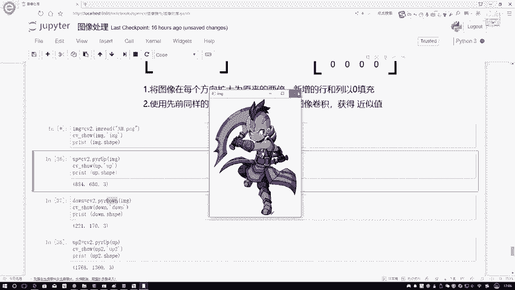

就看一下趋势就行，然后呢我执行一个上采样，再来看一下，此时啊这个敌法师他是不是变大了呀。

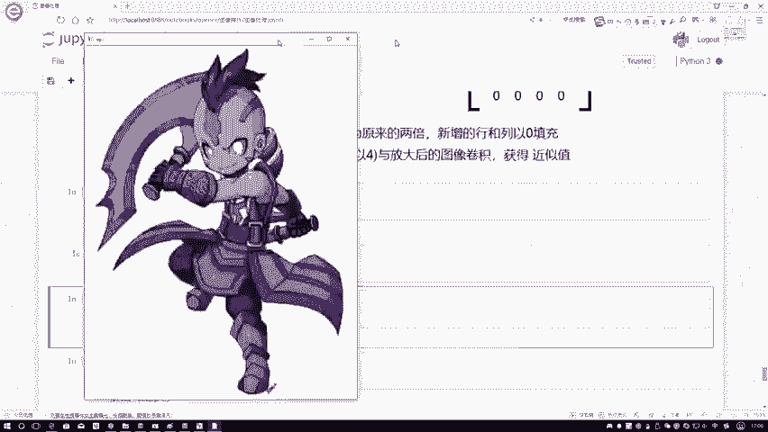

变到大概这么样一个长这么大一个大小了。

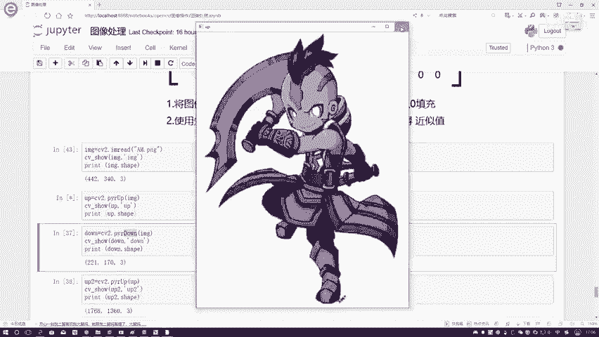

你看我打印出来是不值，是不是都变成原来的一个二倍了，这是什么，像我刚说的，这就是执行了一个啊咱的一个上采样的方法，然后呢我还可以执行一个下采样的一个方法吧，咱再来看在这里还是同样原始输入数据啊。

我执行一个下载的方法，那你看现在变小了，变到这么大点了，然后呢，看一下它的一个shift值是不是211703，是不是原来的一半的呀，那这一回我执行了一个什么下采样吧，那这回大家可能想诶。

你只执行了一次上采样，能不能执行多次呢，也行吧，你看我上台上给我返回出来的up，这是什么东西啊，它也是一个三维的，那它不也是个图像吗，我能不能再对这个up再执行一个上采样也行吧。

你看我primit up里边我再创建了一个up。

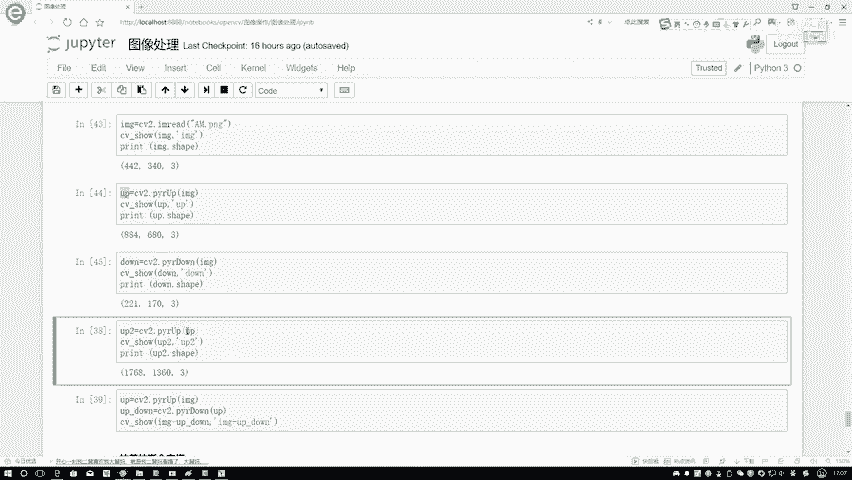

执行的又是一个上采样吧，这回咱再来看非常大的一个图吧。

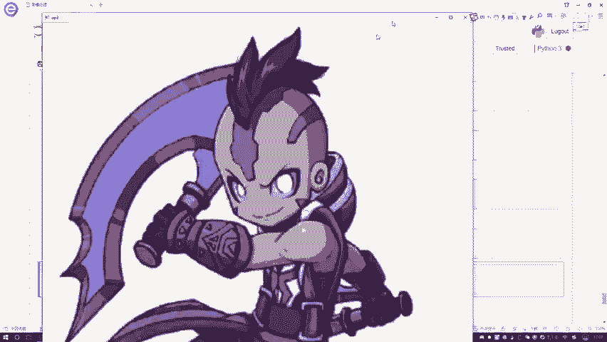

至少大我都快装不下了，这回咱得到结果就是相当于什么把它又进行了，就是放大两倍吧，也就是说你的上采样下采样都可以啊，重复的进行下去，然后呢我问大家一个问题，哎你说咱现在啊我执行了一个上采样。

我又执行了一个下采样，你说是不是如果说这样一张原始图像来了，我咱们这么的，我说我先执行什么，我先执行一个，我看这块先执行啊，先执行上采样吧，先执行上采样，然后咱变道了这么大。

然后我再执行一个下采样又给我变回来了，你说咱得到的结果会是跟原来一样吗，应该不会吧，为什么，因为首先在上采样过程当中，你是拿零进行填充的，相当于有一些平均的感觉吧，在下载过程当中。

你又损失了额外的一些信息吧，那里外里是不是说上采样你损失一些信息，你自己编出一些零嘛，下采样你又损失出了一些信息，那你执行这两次之后，比如这是一个up，这是一个down，咱得到的结果跟原始结果一比。

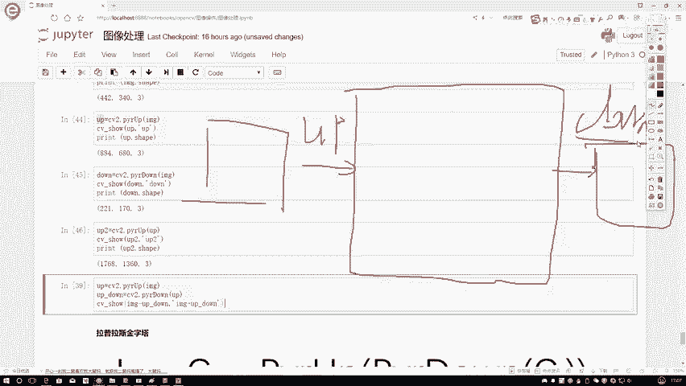

肯定是不如原始结果好吧，咱可以来看一下，在这里诶。

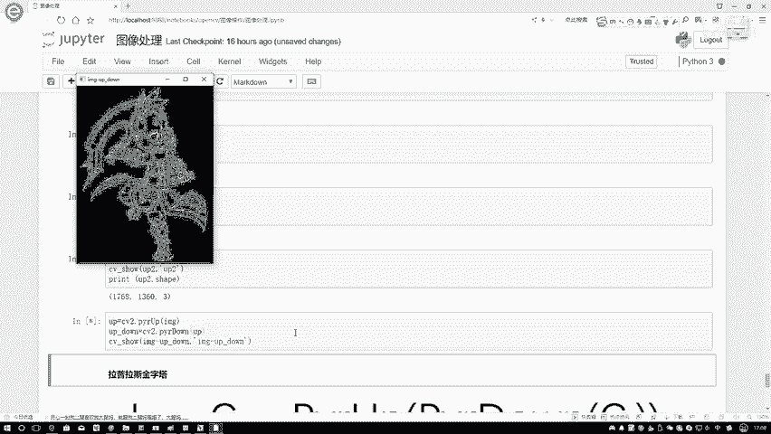

哪去了哦，这块不是我看一下呃，啊这块做了个减法，这样咱重新再执行一下，重新写一下，在这里，首先我对这个东西执行一个上采样，然后呢我再对它执行一个下采样，在这一块我直接去展示，我不展示这个减减法。

咱也不展示减法，咱先直接把它进行一个展示，直接把这个东西复制过来行，再来看一下呃，可能从这张图当中啊，还看不出来特别明显的一个效果，在这里我再看一下，效果应该挺明显，是不是这个你看它是挺清晰的吧。

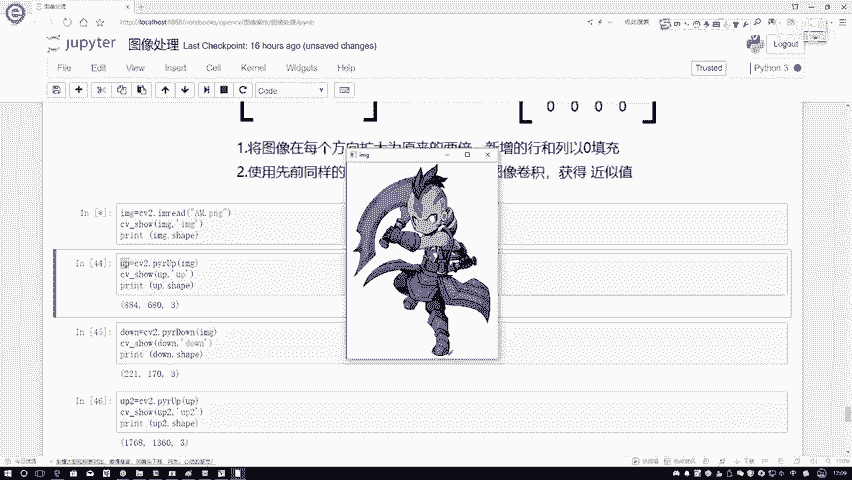

然后呢到我合到一起之后，你看怎么样了，他是不是有点感觉变变得稍微模糊啊，在这里啊，我可以给他wait，wait放到一起吧，wait放到一起展示一下，这样应该看起来更直接一些。

分派点h this stack一下，h tag里边，然后我看一下，在这里我传进来的应该是一个原始的原始加mg，一个是原始的，然后呢一个是我现在的一个up down的结果，然后再把这个东西去show一下。

行，再来看一下结果对比吧，左边这个它是不是有原始图像，就写个A吧，右边这个他是不是我UPDOWN完的图像，那你看啊就是原始图像它是不是挺清晰的，然后然后呢你这个up down完的图像。

感觉就给我第一个感觉，他是不是有点稍微的变得模糊了一些啊，所以说就像我刚才说的，里外里他损失了两次，每一次都损失，所以说它现在色彩和清晰度就不如左边这个。

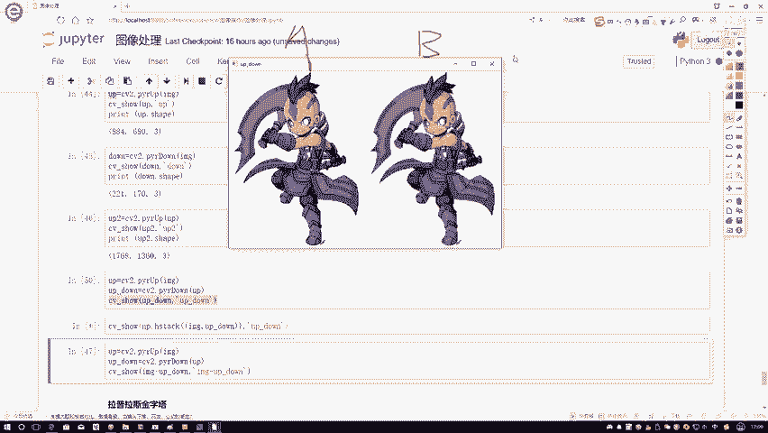

好吧，这个就跟大家说了一下，咱们这个对比，然后呢下面再给大家说下一个事，下一个事叫做一个拉普拉斯金字塔嗯，这个拉普拉斯金字塔做法稍微的有点特别啊，咱们来看一下，首先来看这个公式嗯，公式其实挺简单的。

拉普拉斯金字塔它也是分好几层啊，它每一层都是这么去算的，这个公式列出来了，就是用什么这个G表示着咱的输入，就是刚才说的那个IMG嘛，然后呢用它原始图像减去什么，减去了。

你这个up就是先执行down再执行up完的一个结果，所以说咱是先执行down再执行up完的一个结果，让他俩之间啊做了这样一个减法，看它们之间这样的一个差异在这里啊，就是每一层都是这么去做的。

给大家解释一下，比如说第一层，第一层这个G02是什么，这个G02它是我原始的一个输入吧，原始输入来了，然后我先经过1212，什么意思啊，一二就是我这个低通滤波相当于我加卷积核嘛。

然后呢再给它进行缩小的尺寸，所以说这是一个down的一个操作，在这里写上一个down的操作，然后三三我是放大尺寸吧，这一块是一个up的操作，然后呢我把原始图像这条线连过来了，这块是个G0吧。

这块是个减法，它减什么就减去你down，你给我写个D，然后一个up减去DU这个值，这就得到了LP1啊，我的第一层，那你说不管第一层还有后面一层吧，后面一层其实做法都是一样的，只不管这东西执行多少次。

但是你注意一点，就是你传见谁捡的，那一定是把这个东西，就是他在第二层的时候是用谁去捡的，就不是用原始数据去剪了吧，而是用第一层的结果去剪了啊，这样一个事，用第一层结果减去第一层的结果。

执行完down up之后的结果啊，它就是这样一个事，然后呢这个大家简单了解了解一下就行了，这个就是拉普拉斯金字塔，它是怎么去做的，然后呢做法其实很简单。

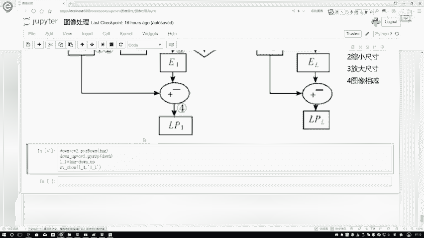

在这里啊，就是我们可以看一下它的结果，它的结果在这里就是首先我执行down操作，再执行一个up操作，用它俩就是用原始数据减去执行完down，up完之后操作就是我拉普拉斯啊，金字塔变完之后。

我第一层的结果在这里啊，我们暂时给大家列出来第一层的结果，如果说你想继续去做，那你也可以继续多写几层，但是这个观察起来就没那么直接了，看起来像是一些轮廓的一些信息似的。

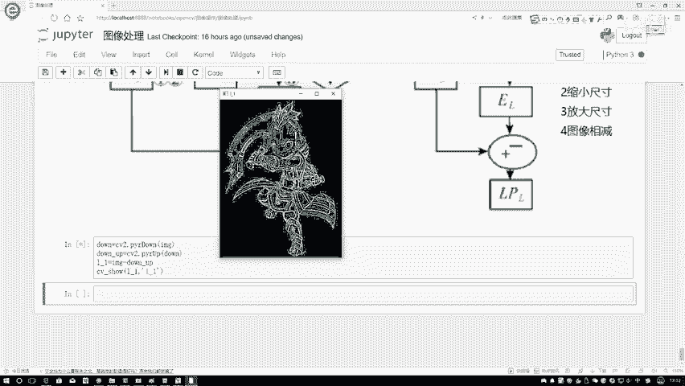

大家先简单了解一下行就行啊，还有这样一个拉普拉斯金字塔通过啊。

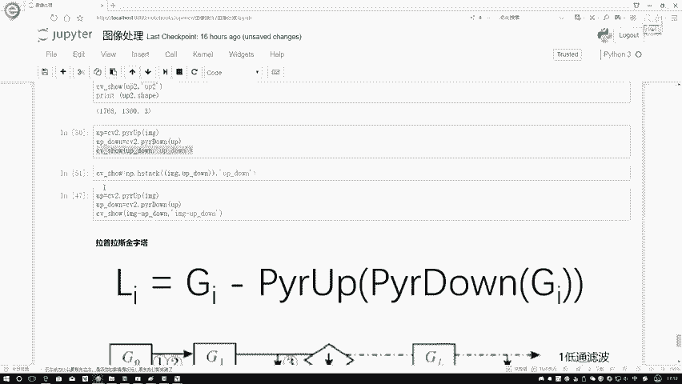

就是这些做法，我们就可以让数据更丰富一些是吧，等之后我们在案例当中啊，可能也会用到一些对图像数据先做金字塔变换，然后呢通过金字塔当中不同一层，我要抽取出来不同有价值的信息了，这里先给大家介绍了一下。

在图像金字塔当中两种啊，两个比较常见的一个是高斯金字塔，另外一个呢就是拉普拉斯金字塔啊。

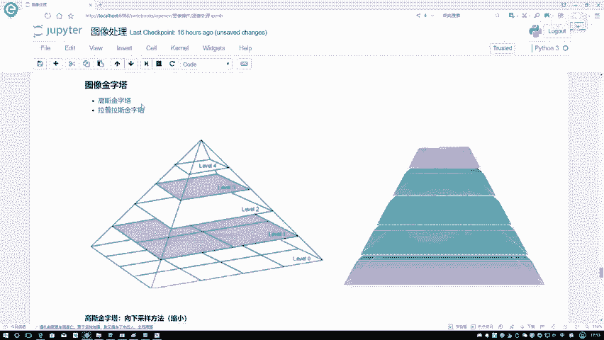