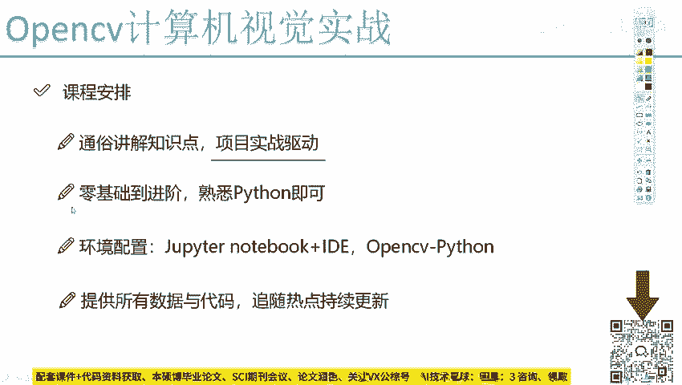

# 比刷剧还爽！【OpenCV+YOLO】终于有人能把OpenCV图像处理+YOLO目标检测讲的这么通俗易懂了!J建议收藏！（人工智能、深度学习、机器学习算法） - P1：0-课程简介 - 迪哥的AI世界 - BV1hrUNYcENc

第一节课呀，先跟大家说一下，咱们这门open CV计算机视觉实战课程，整体的一个安排。

首先啊咱们的课程风格是一个通俗易懂的，我是准备啊用一种最接地气的方式，向大家通俗易讲解，其中啊那些比较复杂难懂的知识点，并且呢我们的安排啊，是用项目实战来进行驱动的，在我们课程的一个讲解过程当中。

讲解了几个知识点之后，咱们俩要动手做一个稍微大型一点的项目，在项目实战当中啊，一方面让大家练练手，掌握一下，咱们之前讲这些知识点该怎么去用，另一方面呢从业务流程上去熟悉一下。

当我们想实际完成一个项目的时候，一步一步啊应该怎么去做的。

这个就是我们整体的安排，然后呢我们这个课程难度啊。

相当于是一个从零基础到进阶的，一开始的时候，会给大家说一些计算机视觉当中啊。

最基本的操作以及open CV当中啊，怎么样用这些函数来构建一些小的案例。

并且我们要把这些东西啊，融入到一个更大型的项目当中，相当于啊课程难度从啊简单点开始。

然后呢逐渐逐渐在变难，但是啊这个逐渐的过程可能相对来说啊，速度有些快，难度提升稍微有些大，因为呢在后续的过程当中啊，我又给大家准备了非常丰富的项目实战的内容，这些个都需要大家花一些时间。

花一些精力来进行熟悉的，然后呢我们的一个需求就是不是一个需求，是一个前提吧，需要大家掌握一下Python语言，因为呢不论是我们的实战的案例，还是我们要做的一些大型的项目。

还是啊咱用用open CV当中的每一个函数，都是用Python去做的，咱相当于啊所有的东西都用python1条龙搞定了。

所以说最基本的要求大家得熟悉一下Python。

这个不要求大家对Python多么精通，只要熟悉诶，能用能看懂就可以了。

如果说大家以前对python1窍不通，或者是以前压根都没看过，可以参考一下我的一个Python快速入门的一个教程。

然后呢我们的环境配置，这个在下堂课课程当中啊。

会给大家详细去说，我们该要怎么样去安装open CV，怎么样去配置一下我们的notebook。

还有相关的一些带有debug功能id，这个等待下节课当中为大家详细去说啊。

以及我们不同的一个功能，能给我们带来的一个效果，最后呢再强调一点，就是在我们的课程当中啊，会给大家提供啊所有的一个数据，还有代码，并且呢咱们的课程还会持续的进行更新下去，我们的一个数据还有代码。

就放在我们的课程资料当中，大家直接点击下载就可以了，那这个就是咱们这门课程整体的一个安排，下面呢就教给大家先去按一下open CV。

