# P20：1-轮廓检测方法 - 迪哥的AI世界 - BV1hrUNYcENc

这节课呀，咱们来说一下跟图像轮廓相关的一些知识点呃，咱们要说的第一个事就是一个轮廓的检测啊。

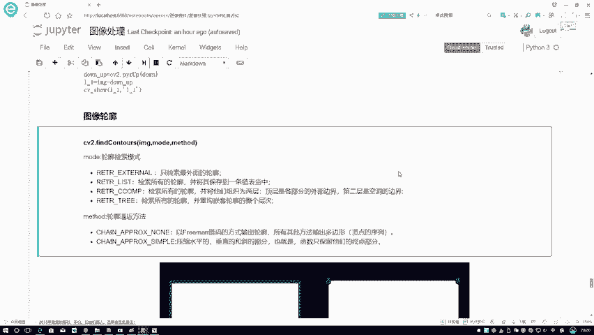

我们要先把轮廓给它拿到手，那我们先解释一下什么叫做轮廓，咱之前是不是说了一些图像跟边缘检测相关的，那咱们来看一下之前我说的那些边缘，是不是有一些零零散散的一些线段，也可以当做是一个边缘啊。

反正就是梯度之间发生一些事情，我把这个边缘剔出来就可以了，那你说这零零散散的一个线段的，能叫做一个图像轮廓吗，应该不行吧，你从啊这个轮廓定义角度，咱们就会发现它的一个基本的出发点，首先得是一个整体的吧。

它得连在一块儿的，我才能叫做一个轮廓吧，这个就是我的一个轮廓和边缘啊。

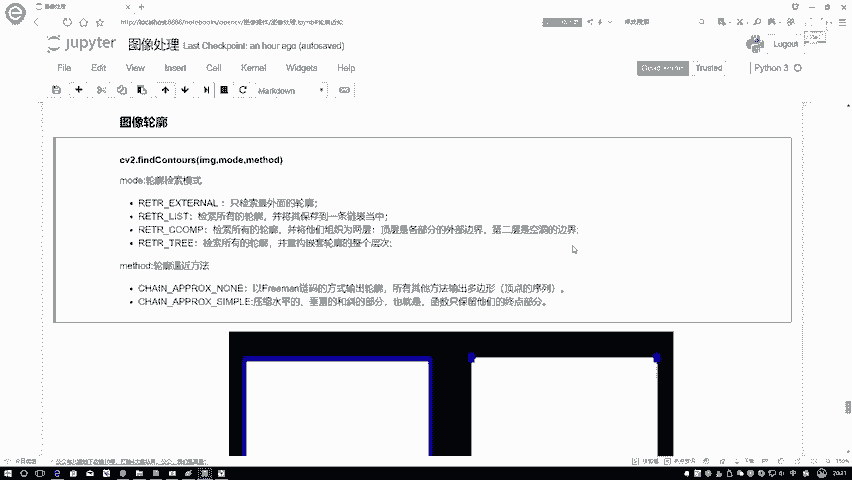

它之间的一个区别，边缘呢零零散散的轮廓，它是一个整体，那咱们先看第一个事儿。

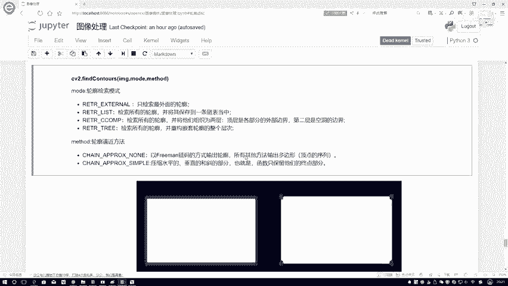

怎么样进行一个轮廓检测，在这里要给大家介绍一个函数，就是呃CV two啊，还是用open思维去做啊，在这里咱们来看一下我们的一个轮廓检测，函数当中啊，首先第一个要我输入的是当前的一张图像。

以及呢当前的一个模式，还有当前的一个方法分给大家解释一下啊，这三个参数啊都是什么意思，第一个参数很简单，就是啊让我输入啊一张带测试图像就可以了，然后呢它的模式里边呃，有几个可选的值在这里啊。

就给大家说一下，先说最常用的吧，通常情况下我们都是用这第四个，第四个是最常用的，因为有些时候你看这些不同啊，它这个模式的一个定义，有些的是只检测最外面的，有些呢是检测所有的保存到一个列表当中。

有些啊还分一些层次的，但是我觉着啊以后大家用的时候啊，直接用最后一个就可以了，它相当于啊就是默认是检测所有的，并且呢按照一种嵌套的结构给你保存下来了，说白了这里边给你所有轮廓都存下来了以后，你要用哪个。

咱就往出掉就行了，所以说啊，建议大家在用这个轮廓检测过程当中啊，你就选择最后一个就可以了，通常情况下我们是只用这一个就足够了，然后下一个点，下个点就是有一个叫做轮廓的逼近方法。

那我们可以想一想轮廓是怎么样构造出来的，得是由一些点慢慢构建出来的吧，在这里啊我们列出来两种方法，其实啊在这里编方法不止有两种啊。

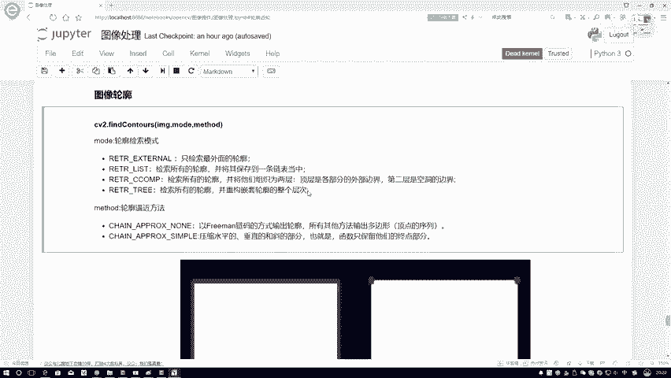

在这里我们只列出来最常用两种就可以了，给大家看一下，首先第一个第一个就是呃，你就是看最后一个尾缀吧，一个是乱值，一个是一个simple，那个意思啊，相当于就是我们正常去画。

比如在这里你看这是一个呃长方形，长方形轮廓，自然它就是一个长条啊，就是四个长条，第一个长条，第二长条，第三个第四个长条，诶，把它组成一起了，这是一个轮廓，那我们再来想一想，你说这个东西啊。

我能不能就是精简精简，有些时候啊对于一个轮廓，可能我要保存的信息点太多了，内存计算起来啊都是一些负担，我们能不能把这件事简单的画一画呀，在这里啊，就是这个simple，它是这个意思，我们可以进行压缩。

压缩一下水平的，垂直的，斜的，这些我们都可以进行压缩，比如说在这里我们现在画的一个长方形，那你说压缩完之后是不是四个点，我就能代表一个长方形了，在这里啊，这四个点就是我压缩完之后它的一个结果啊。

就是就该说的咱们可以进行一个压缩，得到咱们更精简的一个结果。

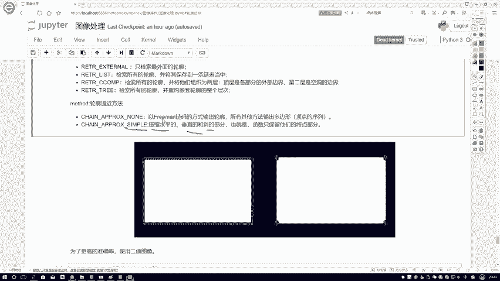

然后呢在这里先跟大家说了一下，我们怎么样去嗯得到这样的一个轮廓，然后啊他的做法其实还稍有点麻烦，咱们来给大家说一下。

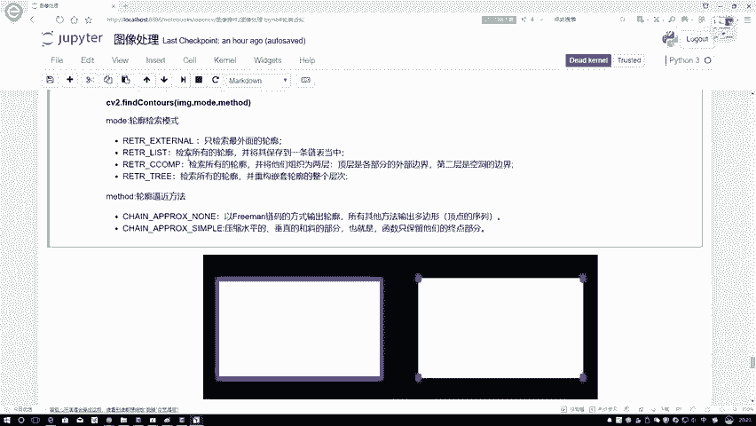

就是我们该怎么样进行一个轮廓检测，在这里第一步就是你要做这个轮廓检测，它得有前提啊，你看我上面给你书建这个图像，首先第一点它是什么图像，它是一个二值的吧，当我们啊要做一个轮廓检测的。

就是要做一个轮次检测这个事的时候，我们得分几步啊，第一步我们先把数据读进来，在这里啊，我把数据啊直接读进来了，一会儿给大家看一下，这是我第一步先读数据，第二步呢我把数据转换成一个灰度图啊。

这不要忘记咱的一个几步流程，第一步读数据，第二步转换灰度图，很简单吧，转灰度图咱之前也见过，第三步，咱之前是不是讲过图像阈值这个东西啊，我们现在啊就是什么，就用一种二值的方法，二值的方法。

那就是零和一嘛，确定一点啊，在这一块我就说大于127的，那它就是大就大于127的，它就是取一个值小一百一百二十七的，取另外一个值，这不是二值吗，默认是什么，默认这里我是不是写255了，那大的就这个值。

小的就这个值，那什么意思，零代表一个黑，二五，五代表一个白吧，所以说在这里啊，我们已经得到了它二值的一个结果，相当于啊我第三步要对数据，就是要对我的图像数据进行一个二值处理。

这样呢咱可以来看一下我当前得到的一个结果。

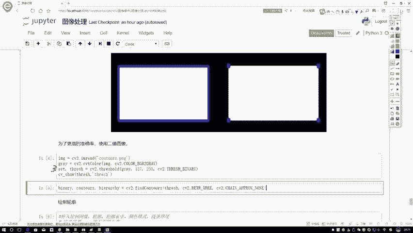

哎来看一下，这是我当前的结果。

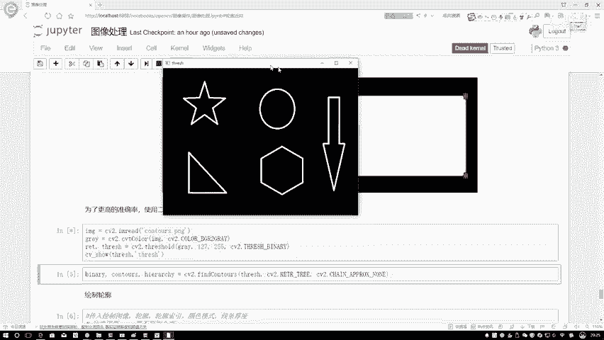

哎呀这个结果可能看着不是那么明显，这样吧，我换我换一个。

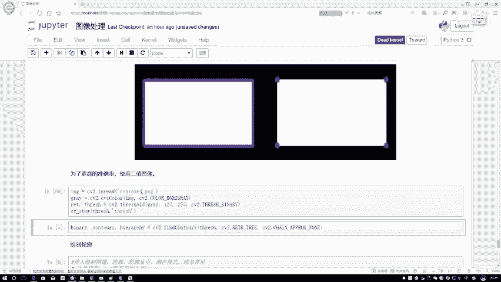

咱用一个car来去做吧，来看一下这里，这个就是正常情况下。

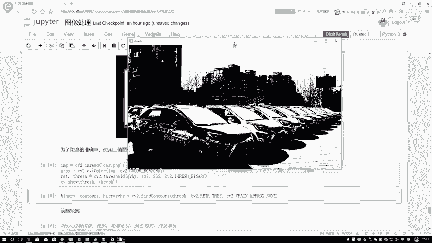

咱们之前哦估计还好像还没给大家看这个图像，看一下吧，在这里边有一个东西叫做一个car哦。

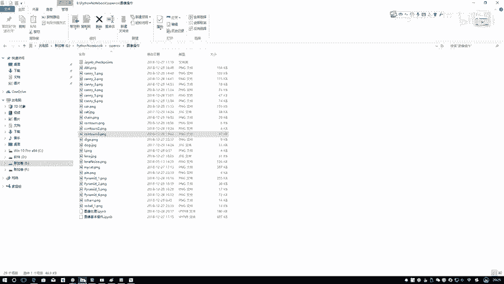

这个东西这个是它正常的一个图像长这个样子，第一步我是不是说先给它进行转成灰度图，然后再转换成一个20的。

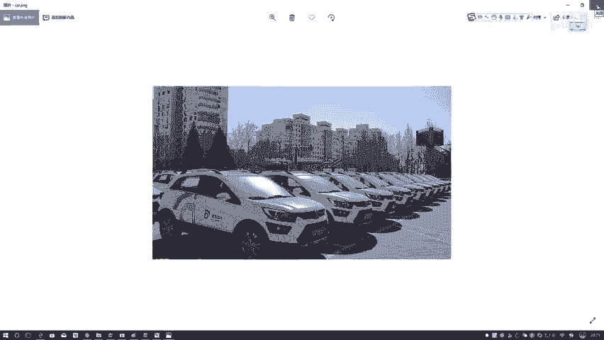

转完之后啊，就是在这里的这个结果了啊，这就是我的一个二折结果嗯。

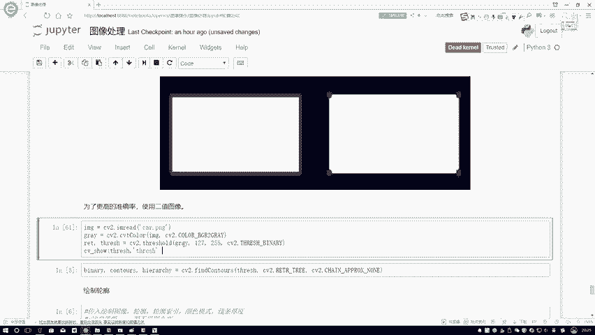

在我们的20接口当中啊，我们可以来去执行一下，来看一下啊。

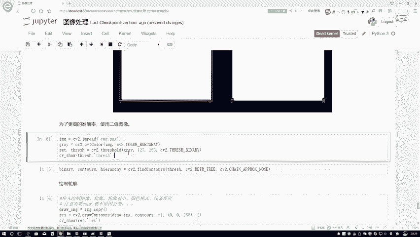

就是在这里这就做完了，做这个二值结果主要的目的就是在于嗯，让我们能够更好的去进行这样的一个边缘检测，然后呢我们再来看啊。

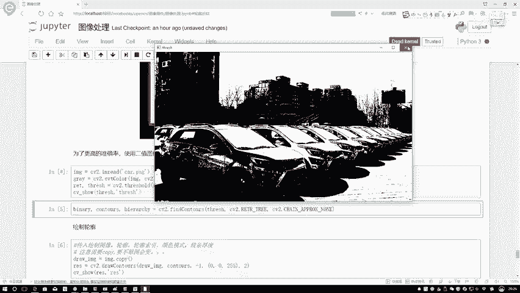

我做完了这样一个20结尾之后，下面我才能再用我的一个检测函数来去做。

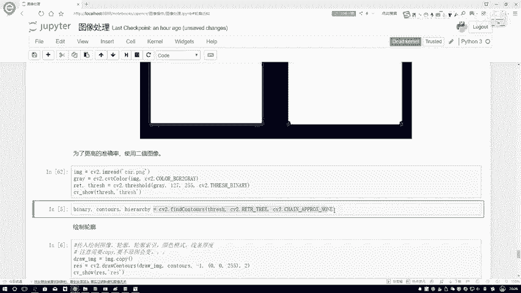

所以说啊大家一定啊得知道这样一个前提，我们在做之前我们得干什么，对数据啊先做一些适当的处理，处理完之后呢，我才能啊。

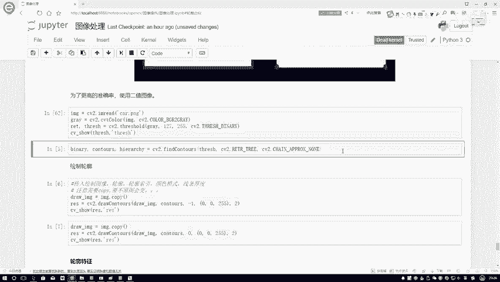