# 比刷剧还爽！【OpenCV+YOLO】终于有人能把OpenCV图像处理+YOLO目标检测讲的这么通俗易懂了!J建议收藏！（人工智能、深度学习、机器学习算法） - P22：3-轮廓特征与近似 - 迪哥的AI世界 - BV1hrUNYcENc

那你说我现在啊当我得到了一个轮廓之后，我可以对这个轮廓干什么呢，咱们也想，就是你对咱们这些图像做各种各样的分析，也做各种各样的建模，无非啊是要得到图像当中各种各样的信息，以及呢各种各样的特征向量吧。

那在这里啊，对于轮廓来说，我们照样可以进行计算的，首先先跟大家说，第一个就是当我们要进行轮廓特征计算的时候，首先就是呃open CV当中啊，给我们提供了很多个函数，但是咱们先来看第一个事儿。

我把这个复制过来，这个是算面积啊，你说算面积过程当中呃，我看一下刚才轮廓在哪儿呢，哎这是该得到轮廓结果吧，我把轮廓结果直接拿过来，你说我能直接算面积吗，他说不行吧，这个东西他说啊。

现在啊这个这个就是反正结果也报错了，他是这个意思，就是当你啊要去算一个轮廓一些特征的时候，我们需要把具体的轮廓给拿出来，在这里呢这是我刚才轮廓吧，我整形成零二，相当于第零个轮廓，第一个第二个第三个。

我可以把每一个轮廓都拿出来。

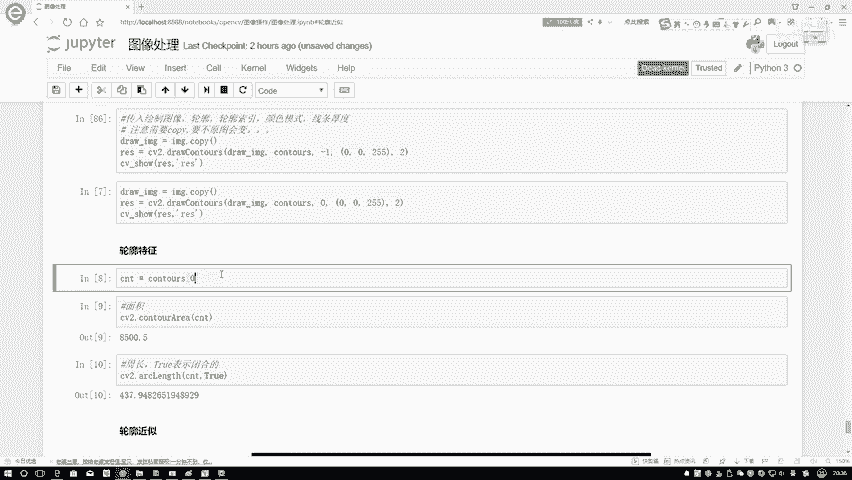

所以说啊到时候大家在用的时候一定要注意啊，就是当你用一些辅助函数，帮你做计算特征的时候，你需要把各个的轮廓啊都拿出来。

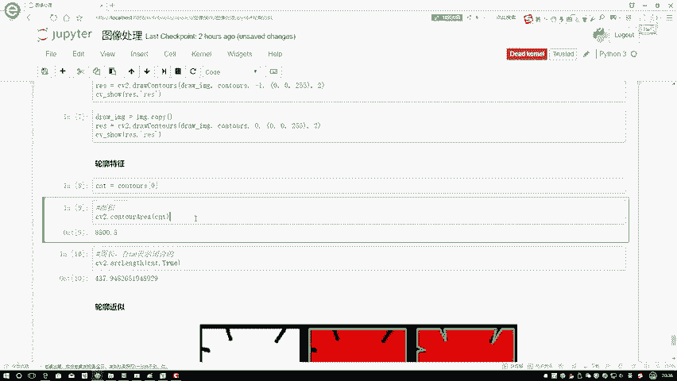

才能再进行使用的，举几个例子啊，这些例子我觉着到时候大家以后用的时候，肯定用的不止这些啊，咱们先往简单的说，第一个就是面积很简单吧，你把这个轮廓转进去计算它的面积，完事了，还有什么可以计算周长吧。

周长啊，就是你可以指定一个true和一个false。

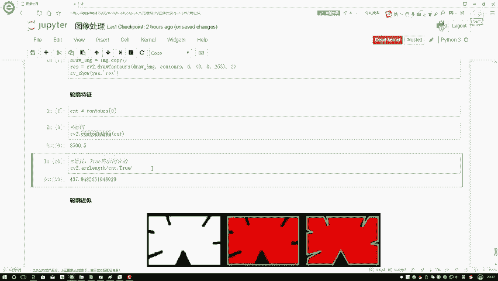

一般情况下它都是一个true，表示的是它是一个闭合的轮廓特征啊，咱们暂时简单看看就行了，反正没什么太大难点，就是啊去掉你的一些API，然后去得到一个结果就行了，这个咱就不多说了，之后等大家用。

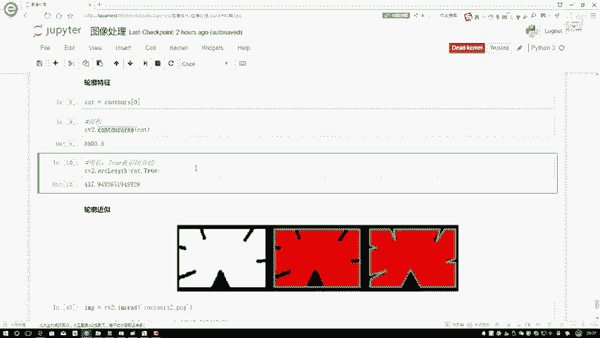

等咱们用的时候再跟大家多说一些计算方法，然后呢下面一点下面一点叫做一个轮廓的近似，哎，啥叫轮廓的近似啊，咱们可以看一下，比如说左边我写个AABC吧，ABC这个图啊，如果说A这个图拿出来之后正常算轮廓。

那就是外面这些圈吧，那大家可能想了，如果说这个轮廓啊现在是不是特别不规整啊，我能不能让这个轮廓近似成一个比较规则诶，比较好的一种形状啊，不能说好吧，就是比较规则的一种形状做一些近似，别让它毛毛刺刺的。

全给我划分的开，可以做这样一件事吗，可以的，这叫做一个轮廓的近似，这一块就是B和C是两种不同轮廓近似的结果，其实啊我们是可以设置参数，来对这个A这个嗯得到轮廓进行一些改变的。

嗯这样吧我先跟大家说一下这个轮廓近似，轮轮廓这个近似啊怎么去做的，其实道理挺简单的，轮廓近似，你看这块是不是也曲线曲线怎么近似的，用一条直线做了一个近似吧，在这里画一下吧，我说现在呃就就就就就这样得了。

后面这个没有了，我说现在我说这块哎重画一个吧，就画这样一个得了，我这一块有一个A点，这一块有个B点，现在哎这个ab这条线它是不是一条曲线，那我要近四，我可以拿一条直线做一近似吧，怎么办啊。

在这里我说的现在是AB这个曲线，你怎么做近似呢，在这块我先把AB啊，这两点我也连上啊，这块假设吧，你就当我画的是一条直线得了，我画不了，那么直这一块我先把A和B连上，然后呢我在这条曲线上去选一个点。

比如说选到这个C点吧，我选了这个点之后啊，我就是这个这个点怎么选这个C点，它有些说法就是你在这个曲线上要找一点，使得这点你要到当前这条就当前ab这条直线，它这个距离必须是一个最大的哦，C点你这么选。

找曲线上一点，使得该点到AB所在这条直线的距离为最大，如果说啊这个点他能小于咱们的阈值啊，刚才按了个快捷键，让这个让这个画图中断掉了，然后再重新画一下，在这里这不是ABC的点吗。

然后说这块我说选了一个C点是吧，如果说啊这个距离这个D哎，它小于了你指定的一个阈值，我写个T吧，那怎么样，你小于阈值意味着没毛病啊，那就可以做近似呗，此时啊这个ab我就可以把这条线当做这条曲线。

它的一个近似了，那但问题来了，那你说如果说这个阈值大，就是这个D如果是大于你设定的一个阈值，怎么办，没满足你的要求，面对这个要求啊，你就需要把这个曲线就是当前这个曲线，它就不能用这么一条直线来近似了。

而得用先得用两条来试试，在这一块我会我把这个放的再大一点，哎这样吧，这样式的画起来更更舒服一点，这样这是一个AB，然后呢这是最大点这块吧，这是一个C点点点点点点下来，此时啊我需要再连几条线。

我需要把这个AC也给连起来，BC也给它连起来，接下来怎么办，接下来就是说不能用AB代替了，那我看看这条曲线，我AC这条这条段的曲线，能不能用AC这条直线代替，BC这段的曲线能不能用BC这条直线代替。

还是找什么，还是找这样一个距离吧，你看刚才这个是第一，我说现在这是第二，第二肯定小于第一吧，那D2在小于第一的前提下，我再去判断这个D2怎么样，它是不是小于我这个阈值，小于我这个阈值。

我用AC来去代替AC这段曲线行吧，BC段是不是也一样的，那问题来了，如果说这点比如说个地点吧，那还不满足咋办啊，还不满足，那咱就继续来继续在这划线这一块，照样是不是继续划线啊。

接着去判断在这里能不能进行代替，所以说啊就是咱们整个的过程，就相当于是感觉像不断二分似的，把我这条曲线分成，尽可能就是尽可能少的一些线段，如果我能用一条线段去代表，那就用一条线段不行。

用两条三条慢慢往回去多，这个就是我的一个轮廓。

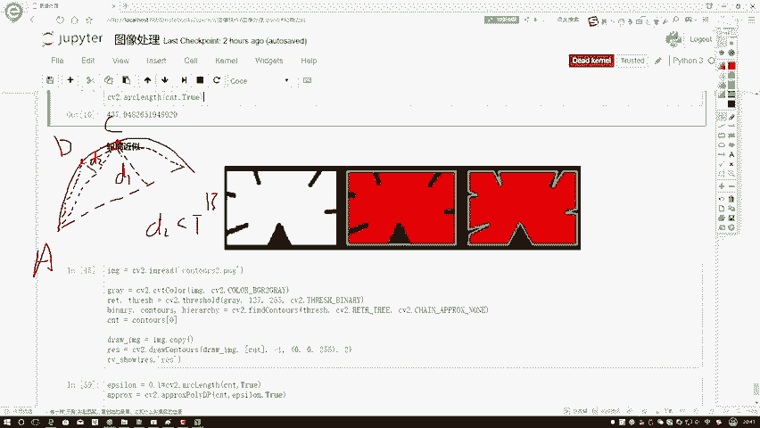

金色基本的一个原理啊，原理比较简单的，然后再来看一下，像我刚才说的这个事，说着好像挺费劲的，其实啊做起来特别简单啊，再来看一下怎么去做的，在这一块，首先我还是呃先读进来一张图像，一会大家一起看吧。

然后第一步做一个灰度图，第二步做一个二值是吧，那下面去找一下它的一个轮廓。

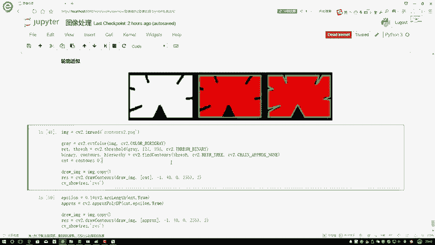

然后把它轮廓画出来，咱可以看下结果诶，这回我换了一个图，换了一个图啊，我故意啊给他画的稍微特别一点多了，什么多了些刺儿是吧，此时啊我就想看一下他这个近似诶。

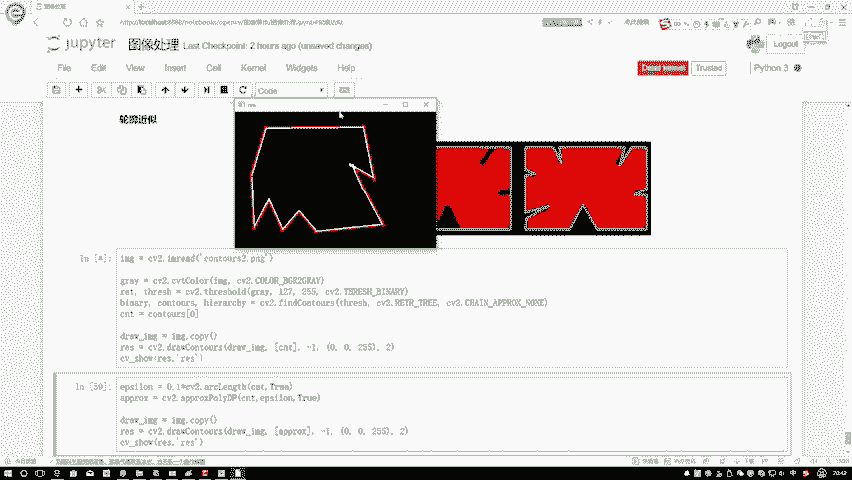

你能画成什么样呢，再来看一下怎么去做啊。

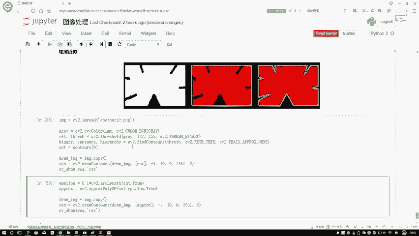

在这里呃我们指定了一个近似函数，这个近似函数当中啊，我给大家说一下，它都需要额传进来，主要两个参数，第一个参数就是你得告诉我哎，你要做哪个轮廓呀是吧，你把这个轮廓传进来，第二参数就是像我刚才说的。

你得自己指定一个值来进行一个比较的，这个值啊，通常情况下就是嗯我们是按照周长，就是这个这个当然这个值你自己设置也行啊，但是一般情况下是按照你周长的一个百分比，来进行设置的，一会儿给大家看一下。

它的一个就是选择不同大小，它对结果的一个影响，在这一块就是你看这个函数说我们算什么，刚才我们去算它的周长吧，然后呢，在这块用0。1倍的周长，来做一个它的一个阈值，然后再来看在这里啊。

就是我们看一下这一块，我这个CNT是拿到了其中的什么其中的一个吧，哎注意点，这是其中的一个什么一个轮廓吧，然后在这里做了一个近似，做完镜子之后，我又重新的进行展示，哎你做完镜子之后得到结果是什么。

得到结果是不是也是个轮廓啊，所以说我接着不能直接画，你也得把这个结果这个轮廓照一下是吧。

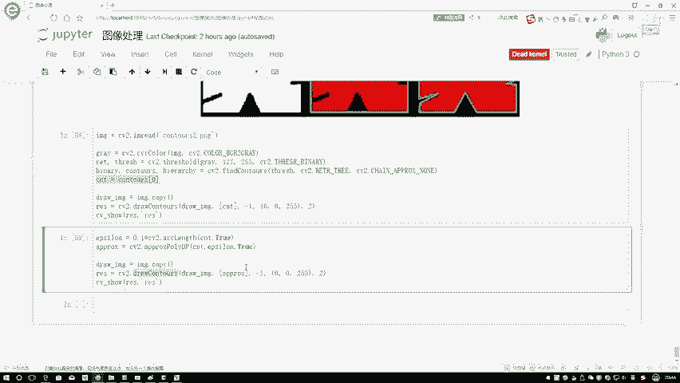

把照完之后才能显示出来，这样呢咱再执行一下，看一下它的一个结果行。

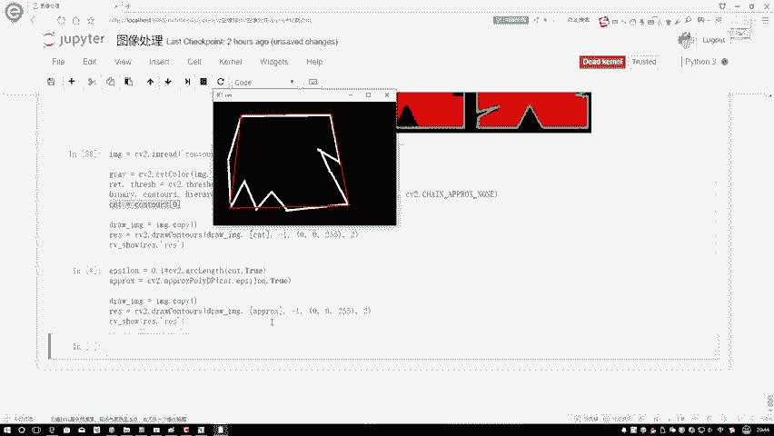

然后现在就是我当前得到了呃，这样吧。

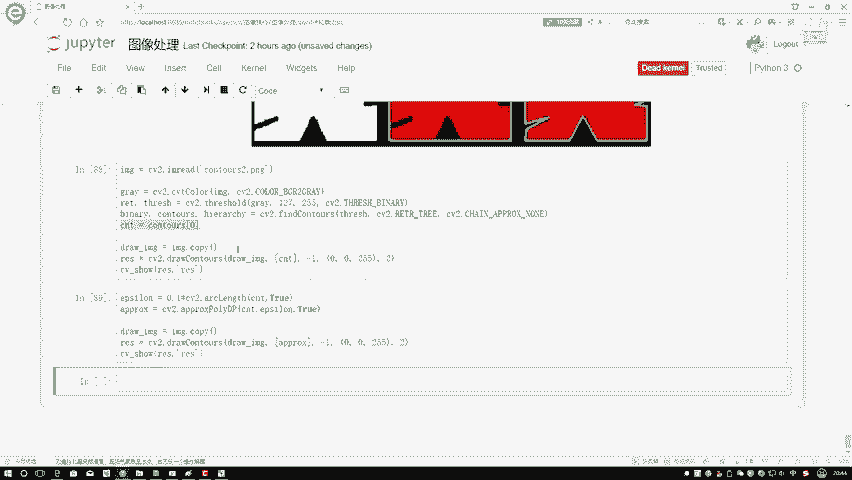

要不不我不去改那个数函数，这样咱先看原来的结果，原来结果边也在在这里吧，然后在这里我们再来看一下，此时啊它的边界发生了变化吧，是不是做了一些近似啊。

这个就是咱们近似完它的一个结果，那大家可以想一想，你说这个值指定的越小会怎么样。

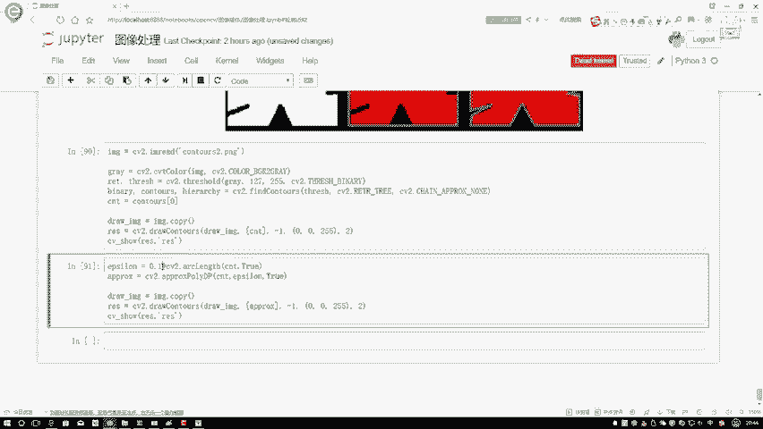

咱们来看一下吧，你指定的越小相当于什么，你这个值啊指定的一个越小，咱得到的一个轮廓怎么样。

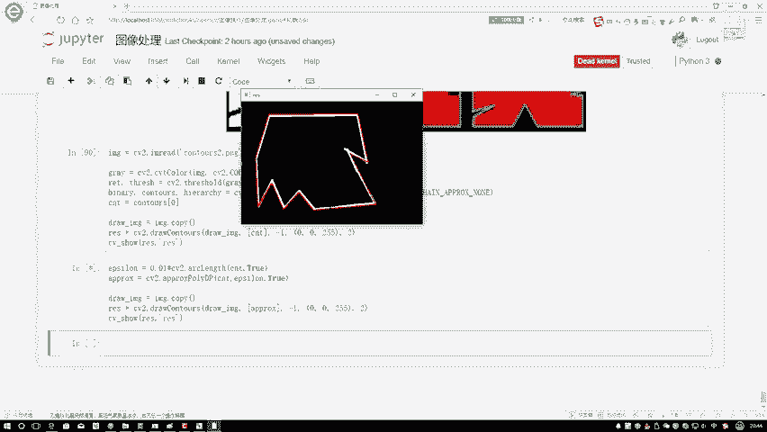

得到的轮廓好像跟原来一比没啥变化是吧，但是呢当我这个值指定的稍微大一点。

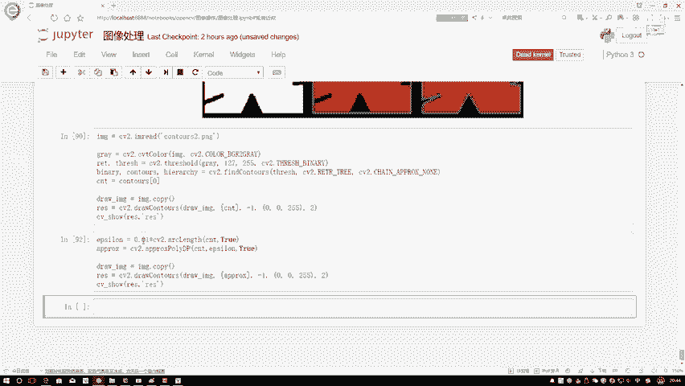

你看0。1的时候，我的轮廓怎么样，哎轮廓近就是变化程度比较大吧，然后或者说再整大一点，我看看0。2，当你指定成0。2的时候。

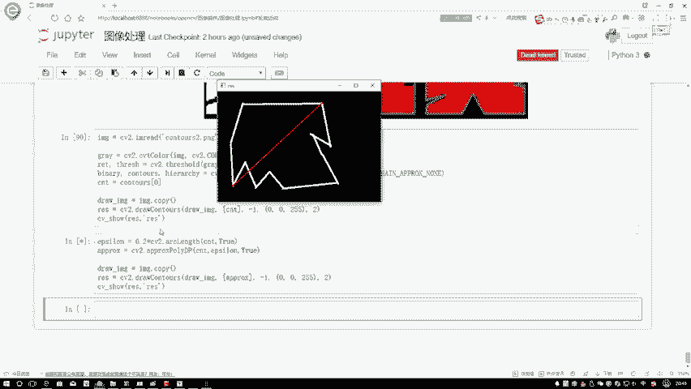

哇，这都指完了，这进子成一条线了不行，这个值一五吧。

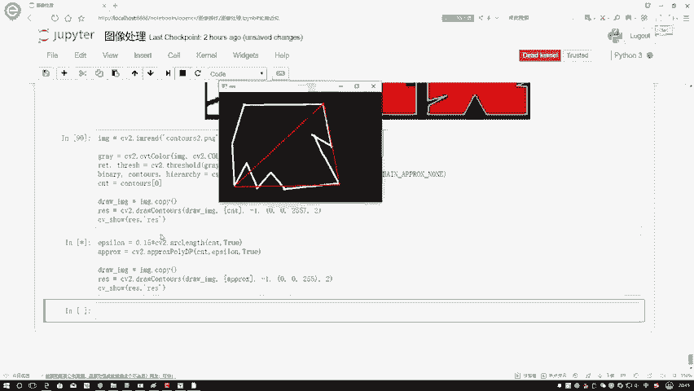

哎这回就近似成像是三角形了是吧，所以说啊就是当前我们这个轮廓近似啊，是受一组参数来控制的，到时大家自己玩的时候，你得设置一下呃，什么样的参数才是你最合适的一个近测结果。

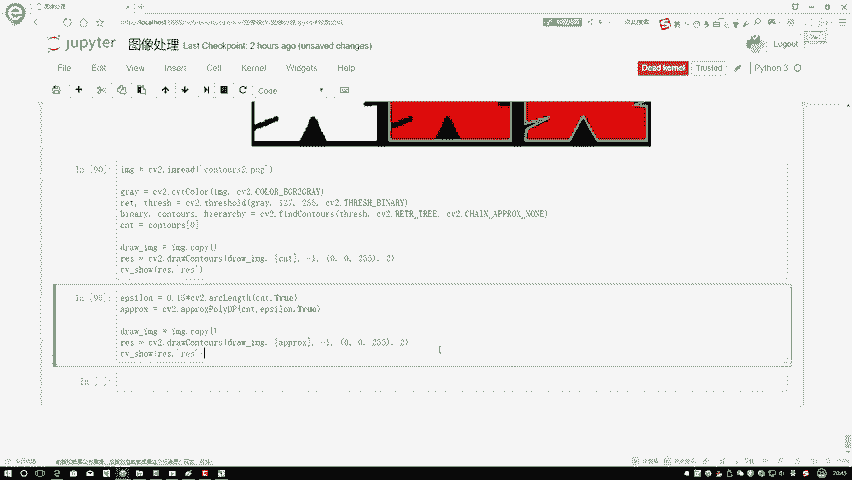

当然啊就是这个轮廓近似啊，大家现在现阶段就是先了解一下就可以了。

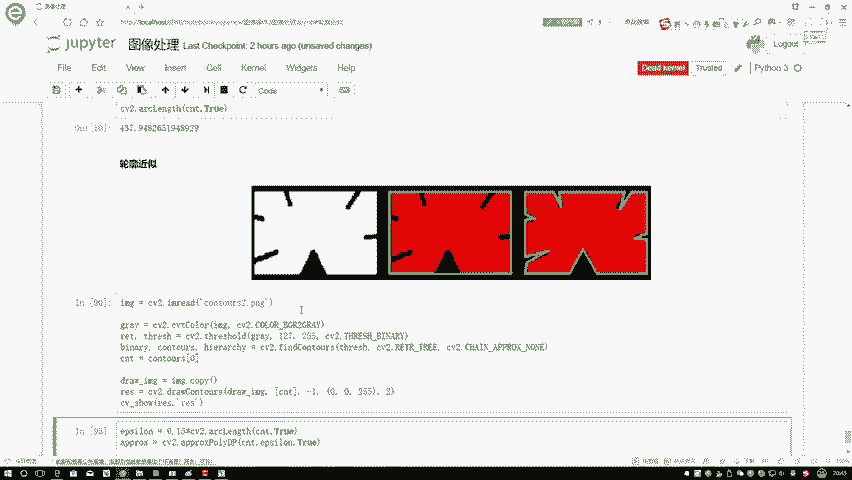

等我们之后后续啊我们有机会用上的时候。

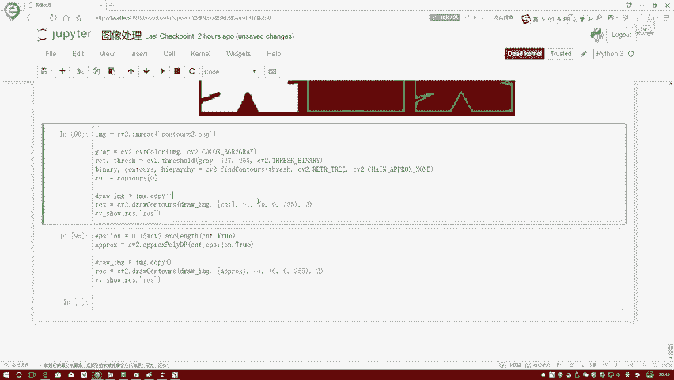

咱们再详细去分析啊，也来得及的，在这个轮回当中啊，我们还可以做一些额外操作，比如说对于轮廓来说，我们可以做它的一些外接矩形啊，外接圆甚至能做一些外接椭圆都可以的，这些啊对open CV来说啊。

只是我们调用不同函数就可以了，其实啊做这些操作无非啊，就是想得到更多的特征，我给大家展示一下，就是它的一个外接矩形是怎么去做的，其实啊就是做了一个bounding，然后一个矩形吧，非常简单。

我们把这个轮回信息啊，就是你看这个不还是我们得到这个轮廓信息吗，这里我先写个零，然后呢我把轮廓信息传进去，咱们现在可以来看一下它的结果，然后下面这样啊，就是哦当我得到它的边角矩形。

实际上它有返回的值是一个XYWH，那有了一个XYWH，是不是相当于我这四个坐标点也就知道了呀，那我用这个四个标，四个坐标点在原始图像当中，我就可以把那个矩形给它画出来吧，这一块选的是一个绿色啊。

然后就是BGR嘛，这个这是个G，所以是绿色，再来看一下画出来它的一个结果长什么样子。

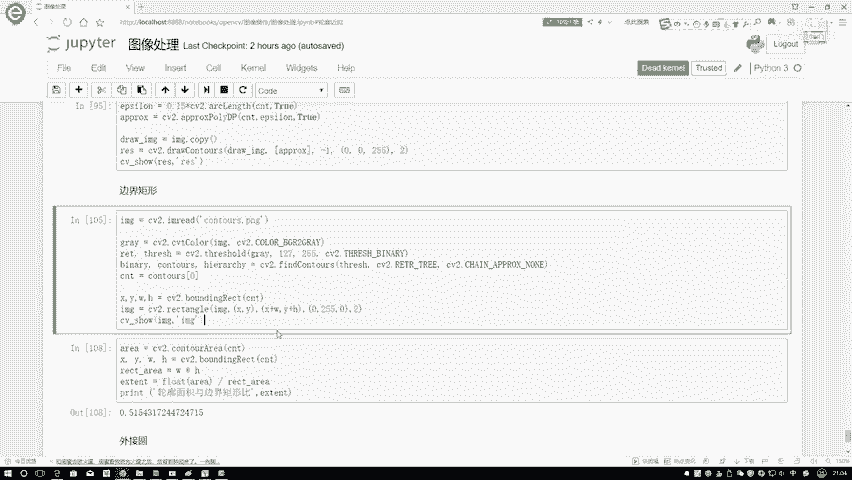

这个这个就是它的轮廓，正常情况是三角形吧，但是对于三角形来说，它的一个就是外接的矩形，那轮廓的外接矩形肯定就是长这个样子吧。

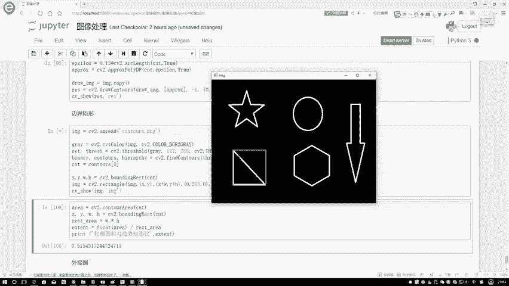

然后我可以换一换轮廓，在这里咱换个轮廓看看吧。

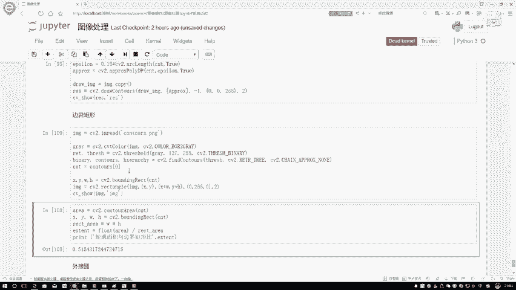

零一然后我换一个二看看看二是哪个轮廓，二这个轮廓是吧。

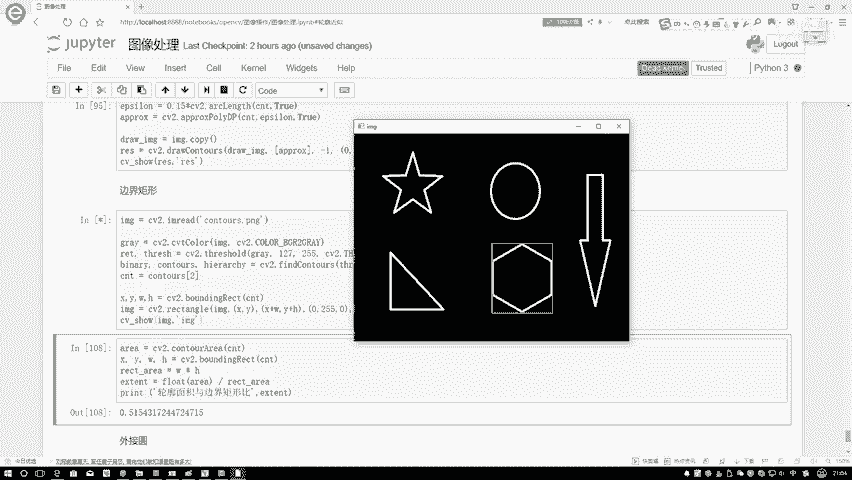

这个就是我又新换了一个轮廓，然后他当前的一个结果，然后呢可以再换一个。

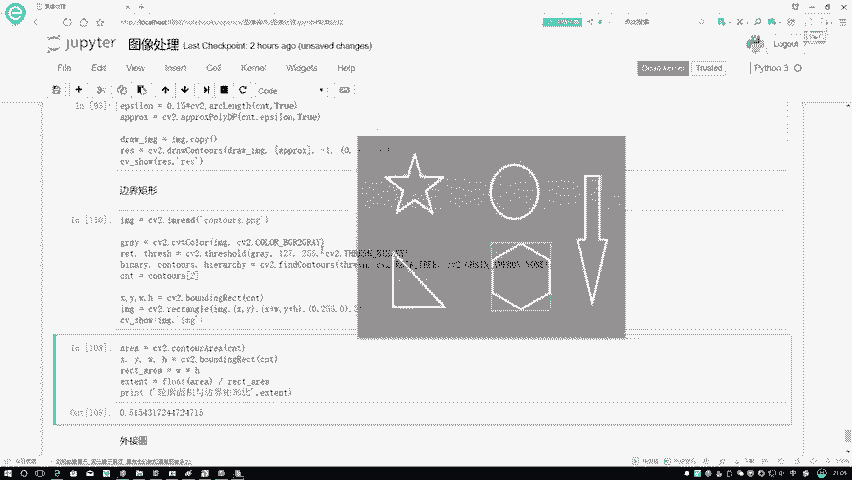

再换个三，哦换这个三换这个三，哎，这个三你看为什么说感觉好像有些东西出来了，因为此时啊3D轮廓是什么，3D轮廓是底层，这个啊它是底层的，所以说这块它不是出来了，你的轮廓就是底层的。

所以说咱得到结果就是这个样子的，然后呢这个就是我算了一些外接矩形。

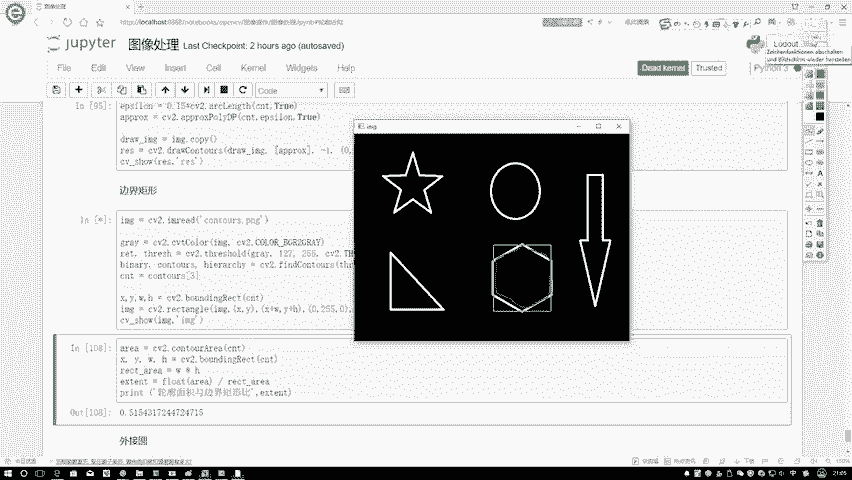

那你说算一个Y矩形有什么用啊，你可以啊算一些面积比，或者是基于啊这个VA矩形，我再构建一些额外特征，这也可以的，咱可以来看一下，在这里我可以先把它的外接矩形算出来吧，外接矩形当中是有WH啊，W乘以H。

那不就是它的面积吗，那刚才咱这个轮廓面积在这里，我是不是也能算出来啊，我这个轮廓面积肯定小点的，比上它这个外接矩形面积，我就能够知道我这个轮廓面积与边界矩形啊，一般我们叫做边界矩形吧。

比边界比形它的一个比值等于多少了吧，所以说啊就是当你啊去做一些轮廓相关特征啊，我们能想到的东西还是蛮多的，这些啊在这里只是暂时要跟大家先提一点，等后用，到时候咱们大家再回头看就可以的。

其实呢不光有外矩形，像是外接矩，二是不是也可以去做啊，在这里，那我换一个，我换一个谁呢，我这个选一个零吧，选第一个再来看一下它的一个哦，得执行一下。

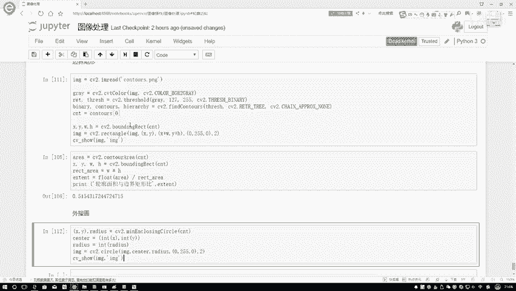

再来看一下它的一个外接圆哦，这个它是执行一个外接圆。

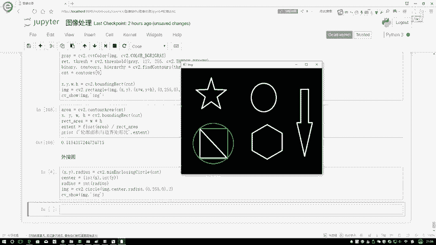

你看这个圆就画出来了吧，所以说啊我们对这个轮廓啊能做的事还挺多的，还有一些什么图形检测之类的这些啊，由于我觉着用处可能没有那么特别大。

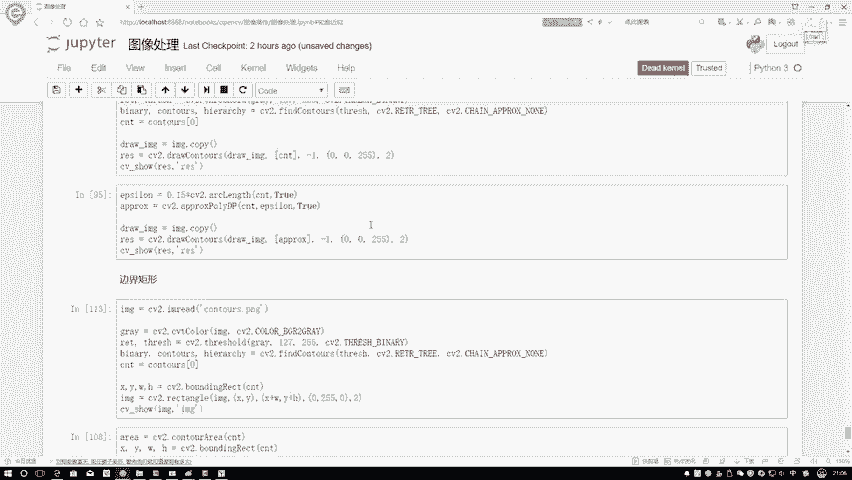

在这里啊只是简单的跟大家进行介绍，等我后续如果说能用到。

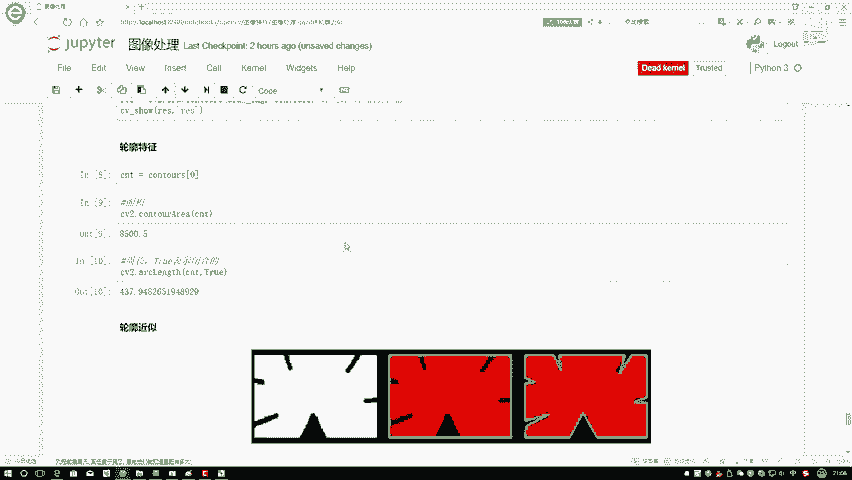

咱们再回过头再进行详细的分析，在这个轮廓就给大家先说到这里了，主要就是一个轮廓，我们该怎么样把它的一个轮廓边界得到，然后再把它边界画出来。

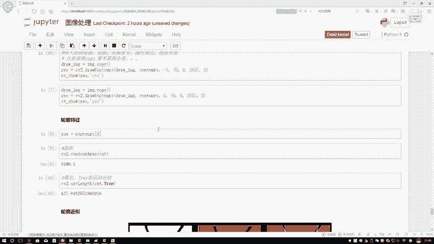