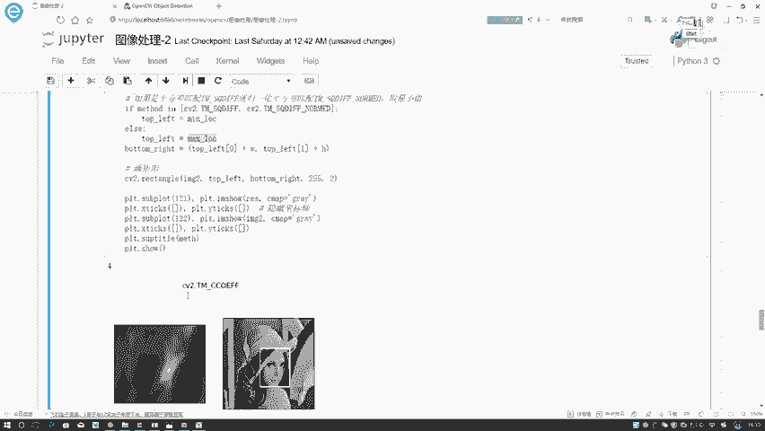
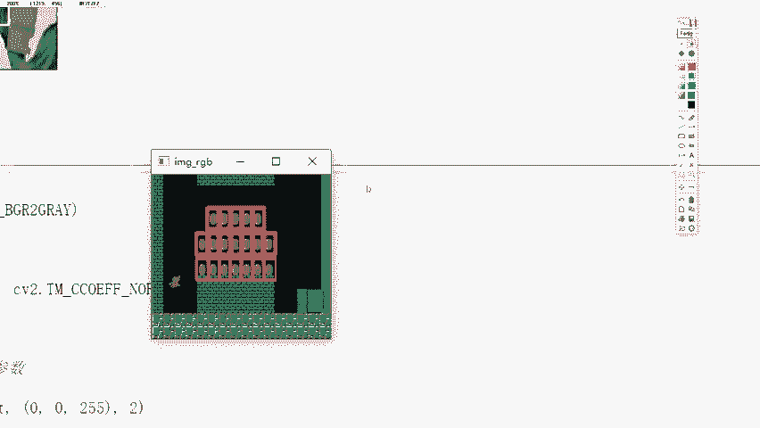

# 比刷剧还爽！【OpenCV+YOLO】终于有人能把OpenCV图像处理+YOLO目标检测讲的这么通俗易懂了!J建议收藏！（人工智能、深度学习、机器学习算法） - P24：2-匹配效果展示 - 迪哥的AI世界 - BV1hrUNYcENc

接下来啊咱们再来看一下嗯，这六种不同的方法，然后它得到结果之间有什么样的一个差异，在这里呢，我用CV two match template当中啊，把咱们的图像模板以及method给它传进来了。

这里method到时候大家可以这样，就是呃你给他传建一个数值也行，你传建一个CV two点，哎他们的一个后面结果也行啊，这些都是行的，但是你不能传进来一个字符串，现在这块EVO一下。

一会儿你会看我打印出来EVO的一个值，它是一个数值，你传进来它对应的一个符号的数值也行，但是你不能传string的一个字符串，你不能啊把这个东西复制过来，哎像是这样，咱咱给你试一下这一块。

我的意思就是这样，你不能把它写成一个字符串形式，因为我之前看同学跟我说，这个报错为什么不对，然后所以就是因为你这块，写成了这种字符串形式，这种方法不行，你可以指定成CV two两。

它实际的一种方法在这里呢，然后我们进行了一个判断，判断过程当中，就是如果说它是算小值的，我就取小值，如果说你的method当中是取大值的，那我就取大值，你看这里有一个me location。

有个max location，刚才都都给大家讲过了吧，然后呢这一块像我刚才说的，我们是不是取左得到的结果当中，它是给你左上角这个点，那我们这个任务是不是相当于一个检测任务。

在任务当中你要把它的框给我画出来吧，最好的匹配模板，那最好平行模式当中，HW这里指定出来了，是不是我检测到了最好的一个位置了，就是这个意思，然后下面呢我要画一个矩形，画矩形就没啥说了，CV凸点。

我一个矩形把图像传进去。

把对应坐标点传进去，这就完事了，下面呢就是打印当前的结果。

再来看一下吧，这俩就指定了不同的方法，而这一块就是这个是你传回来的result结果，画出来的那result结果是这样，它会伪造结果，它就是根据你不同指令的方法，然后计算出来当前每一个窗口所在的一个。

结果值吗，这里对于最亮的一个位置相当于什么，就相当于它找出来。

最接近于这样人脸框的一个位置了，下面就分别展示了一下不同的一个效果。

你看有些效果得到结果可能不是那么特别好，但是啊基本上只要带归一化的啊。

结果都不会特别差，你看这个结果为什么差。

哎哪个结果去了，有的结果挺差的啊，这个结果稍微差一点，是不是因为他没有加一些。

就是那种规划的操作吧，所以啊建议大家在用的时候，我们尽量都用归一化完了之后，结果就是这里它尾缀加上了一个，归一化的一个操作。

加上之后啊，基本上啊要比之前都稳定一些的，这个就跟大家说了一下啊，咱们怎么样用match template去匹配出来。

这样一个对象，那一个问题来了，比如说现在啊哎我现在想做一个人脸检测，虽然说人脸检测，我们一般用机器学习的算法去做，在这里咱就是这样，我说啊现在这一块哎呀有这么一，这是第一个人，这是第二个人。

就俩人吧行吧，然后呢，现在我说这个人脸我有一个模板，我写个T这个图，我画一个A，那你说这里正常情况下，我是不是应该找到两个最合适的人脸位置啊，按照咱刚才的算法，是不是你找的是最合适的一个位置。

那此时我想找最合适的多个位置该怎么办啊。

这个我们就得用一个多模板的匹配来去做了。

相当于啊就是你不用啊，用人方法去找出来一个最小的，找出一个最大的，而是呢你自己去选择一个合适的范围值，咱们来看，首先第一步啊都是一样的，我读进来咱们的一个图像啊，把图像读进来，进行一个灰度图转换。

跟之前做法都一样的，然后呢进行一个模板的匹配，匹配完之后啊，我指定一个阈值，但我指定完阈值之后，你看我又安排点where，就是去找位置嘛，我在result当中，这result是我刚跟大家说了。

它返回的是每一个窗口得到的结果值吧，在这里你说什么去做的，用相关系数去做的吧，那相关系数应该是越接近于一的越好，那此时我取0。8吧，如果说诶哪个位置它的一个结果，它的结果的阈值是大于0。8的。

这是每个窗口的结果吧，对于每个窗口结果进行去啊，判断如果是大于0。8的，要给他留下来，留下来之后呢，在这里我把这些location拿到手了吧，location拿到手之后。

接下来我把这所有的location，所有的位置都画出来，是不是也可以啊，相当于就像我刚画的，在这里有多个人脸，有多人脸过程当中，只要它满足了我一个要求，我就会给它画出来。

这里再来看下结果，我来执行一下，结果出来了，在这个结果当中啊。

就是这个意思啊，这有点小，是不是呃，放稍微放大一点，这就是这样意思啊。

就是我选的那个模板，它是这个金币给大家看一下吧，在这里这里咱指定的模板是这个东西。

非常小吧，就是一个金币啊，这个东西，然后输入图像呢，输入图像是超级玛丽，然后这里边有这么多的金币吧，那我是不是想把每一个金币都能够找到啊。

那这个咱们是不是有多个对象啊，所以说此时啊我们做的是一个多个对象的，这样的一个模板匹配的工作，当你要执行多个匹配的时候，需要你自己啊指定一个阈值，此时啊，就是不是咱们用一个最小值或者是最大值，来去做了。

而用多个值啊去找一下最合适的那些个。

把这些个全框起来就完事了，这里啊非常容易，我们就把当前所有的结果都框起来了啊。

这就是咱的一个多对象怎么去做的。

在这里跟大家介绍了一下咱的一个模板匹配啊，基本的方法啊，其实从道理来说都是挺简单的，跟卷积原理很像，从我们的左上角原点开始，一点点滑动计算，咱的模板和匹配的一个，除图像之间的一个差异程度，对差异程度。

the open CD当中有六种方法，我们返回的结果是这样的一个结构矩阵。

结果矩阵当中我们可以用max，还有一个命值来去找他最合适的位置，如果说你想匹配多的，我们也可以自己来去指定一个阈值，那这个就是open CV当中啊，怎么样进行模板匹配啊。

