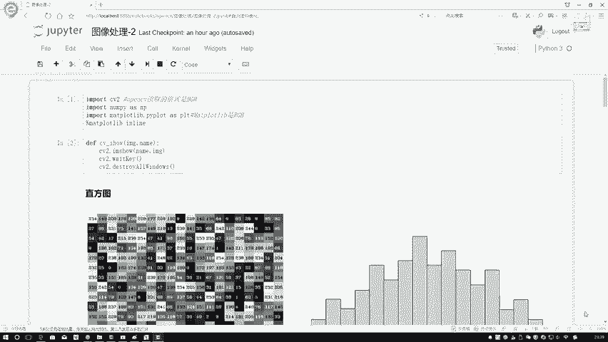
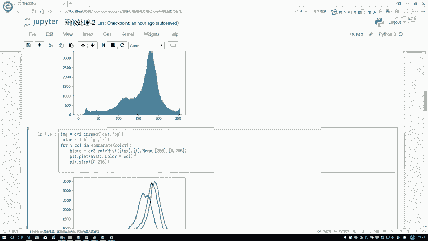

# 比刷剧还爽！【OpenCV+YOLO】终于有人能把OpenCV图像处理+YOLO目标检测讲的这么通俗易懂了!J建议收藏！（人工智能、深度学习、机器学习算法） - P25：1-直方图定义 - 迪哥的AI世界 - BV1hrUNYcENc

这节课呀咱们来说一下图像当中的直方图概念，可能啊大家第一次听到直方图的时候。

觉着啊我们要统计一些数值出来了，但是呢我们现在拿的是个图像，一张图，我们该怎么样进行一个统计啊，这回啊，我们就得把图啊分解成一个一个像素点了，我们要统计的对象，就是图像当中的这些个像素点嗯。

可以看这里啊，就是我左边这个A图吧，这A图啊就是我现在把这个图像拿出来了，里边都是像素点，大家可以认为啊，就是我们现在读取建一个图像图像，它是一个灰度图啊，灰度图当中的像素点在这里都给大家列出来了。

那直方图长什么样子，右边就是个直方图，那这个直方图和我们的像素点支架，是怎么样联系在一起的，我们在这里啊可以找一找，比如说现在有一个点等于109，那这个109是这个点唯一的吗，不是吧。

可能啊在其他位置还有一个109，这里啊就不给大家找了，但是哎我看着有两个120了，这是120吧，这也是一个幺零吧，所以说啊在相同点当中啊，肯定会出现重复的值吧，因为一共才有二百五二百五十六个吧。

那在这里我们要统计的是什么，我们可以说一下我们的横坐标和纵坐标，在这里我们把直方图画一下，我的一个横坐标其实很简单，那第一个点那肯定是零了，第二最后一个点呢肯定就是255了，在这里啊，正常情况下。

它就是从0123点点点点点，一直到255，相当于啊我要去统计一下，在我的这个图像当中啊，每一个像素点啊，比如说像素为零的，它出现多少个，像素为一的出现多少个，或者说呀我们可以把它叫做各个灰度级。

说白了就是在这里每一个点，它对应出现的一个个数。

那这样咱们就统计出来一个直方图，那先跟大家来说一下在我们的open CV当中啊。

我们该怎么样进行一个统计，嗯等咱们这样，咱给大家先看一下我们统计的方法，然后再跟大家来说一下我们的直方图啊，都能够应用哪些能用应用在图像当中啊，能做哪些事情，我们现在说这个函数，这个函数名字很简单。

计算一下它的一个直方图。

我先给大家解释一下它几个输入参数啊，分别是什么意思，第一个imagine，我要输入一张图像，通常情况下我们都是转换成灰度图进行输入的，然后呢，这个channels如果说你没有进行一个回复的转换。

你在这里可以指定一下，就是正常情况下它不是一个BGR的格式吗，open CV当中你可以啊分开进行统计，比如说我想看一下B这个通道的G这个通道，或者R这个通道分别啊，你可以用012来进行表示。

第三个一个mask这个东西啊，我们管它叫做一个眼膜，什么叫做一个眼膜啊，说白了就是现在比如说上面这一张图像。

我正常情况下把这张图像输入进去，它会对图像整体进行统计吧，但现在我不带我说你现在这么的，你只给我统计这么一部分，可不可以啊，相当于啊要给我传进来呃，就是一个mask值。

相当于啊就告诉我我要去统计哪个部分，你可以统计画画这个红框的，你也可以统计画这个蓝框的这个框，到时候我们可以自己来进行指定的，这个就是一个掩码啊，一会我为大家看一下我们掩码它是长什么样子。

然后呢第三个参数啊，第几个第四个参数，第四个参数啊，就是说咱们现在你看这里一共256个吧，你可以啊，画出来256个beans，就像我刚才说的，在这里0121直点点点到256。

或者说呢你想把这个取值范围压缩的小一点，比如说我说这个第一个变它是个0~10的，第二是11~20的，然后21~30是不是也行啊，你可以啊，自己去指定一个bans，就是咱们直方图它的一个size大小。

由大家可以自己进行指定的，然后最后一个就是像素啊，它取值的一个范围嗯，这里通常情况下就是对于要后两个参数，基本上都是固定的，如果说就是一个BS，我们正常情况下都是256的取值范围，那肯定也是固定的。

就是从0~256之间嘛，一共有这么256个数，0~255之间是吧，这个就跟大家说了一下，我们几个参数啊。

分别表示什么意思，在这里啊，我们都有注释啊，到时候大家用的时候可以先来看一下，这样咱们给大家先演示一下，就是我们计算完的结果，它是长什么样子，第一步我独建一个数据啊。

就读建那个小猫的小猫图像，咱就不看了，然后跟大家看一下，我们当我们去使用嗯直方图啊，计算函数的时候，它的一个用法，大家只需要注意一点就行，这句话挺特别的，它必须要把你的参数外面加什么，加上一层中括号啊。

这个大家不要忘了，如果说你没加，他可能会报错了，所以说在这里不要忘了第一个参数，我输入的一张图像读进来了，然后读进来这里我写个零二，就是它的一个flag值啊，标志位置，如果说你至于零二。

表示着它自动啊给它转换成一个灰度图，这个意思独见是个灰度图，然后呢第一个对于灰度图来说，那我也没有什么可说的，通道数就一个嘛，选第一个通道数，这个乱值表示的是我不用mask，不用那个掩码。

现在你对我整体的图像进行一个统计操作，然后接下来要做一个beans，还有它的一个取值范围，这些我们都是自己给定义好，然后呢咱们来执行一下。

执行完之后啊，它又打印出来了256，逗号一表示什么，一共在这里有256个可能取值，那不就是0~255之间吗，一个一什么意思啊，相当于我们得到这个东西，它是个二维的啊，表示的就是呃每一个值里边就是零。

它出现多少个一，也出现多少个，255又出现了多少个这个意思，这样我们就先把当前最基本的一个计算方法。

给它统计出来了，呃函数啊用起来还是比较简单的，就是一个统计的操作。

然后呢我们可以啊，先把这个结果给它画出来看一下，在这里就是new my plot去画也行，open CV换也行，这里就反正就是如果说你不展示图像，我觉着反正又怎么画都一样，你不展示图像的情况下。

你还不如用MAPLOT呢，因为这个化简我觉得更简单一些，但是啊如果说你一旦涉及到展示图像的层面上，你得注意点，my plot它是什么，它是一个RGB的open CV呢，它是BGR的。

到时候咱们得自己进行一下转换的操作。

然后这样就是呃现在给大家可以看一下。

就在这里啊，分别展示了不同的一个结果，在这一块就是我独家的彩色图，读彩色图的时候，你不用指定flag为零啊，它默认情况下它就是一个彩色图的，读进来之后，就是默认情况下它是什么就读建什么。

读进来之后它是不是有BGR3个颜色通道啊，在这里我写了一个for循环好，这是一个枚举的格式，在枚举格式当中啊，是不是遍历每个颜色通道啊，通过一个I，什么A是不是表示着是它的一个索引。

我就把颜色通道这个BGR当做我画，接下来画图它的一个颜色了，可以吧，你看color等于每次编列color i呢，012正好当做我的一个颜色通道，它的一个索引吧，按照BGR的格式，一定注意是BGR。

然后后面啊我们指定的参数都一样，这样呢，我就把咱们嗯三个颜色通道，在我们直方图统计结果给大家呈现出来了，非常简单，我们就得观察一下它的一个统计结果。

在这里啊，大家可以先来想一想，我们现在看这个直方图好像有点有点特点啊。

这个直方图比如说让小猫这张图像有什么特点，你看它直方图的分布是均匀的吗，给我们的感觉好像不是吧，在这里好像150~200之间，呈现出来了绝大多数，而其他部分呢是不是都比较少啊，那你说在这里诶。

我们能不能对直方图做一些改变啊。

一会儿咱们就来。