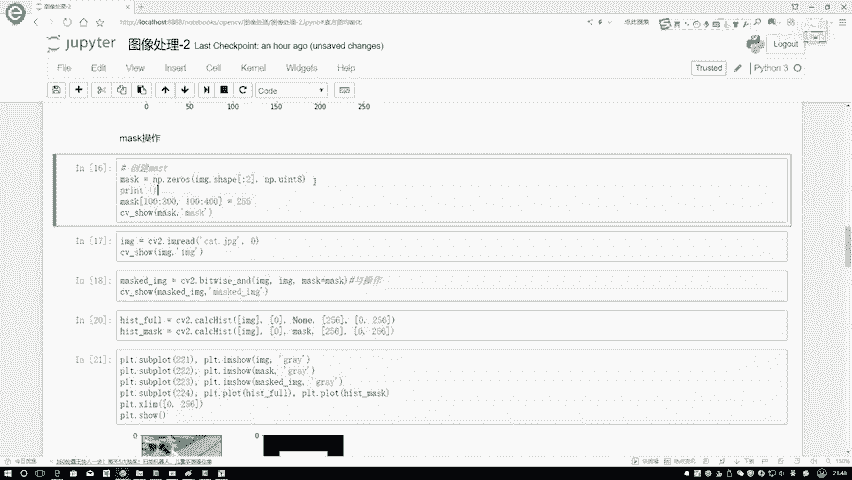
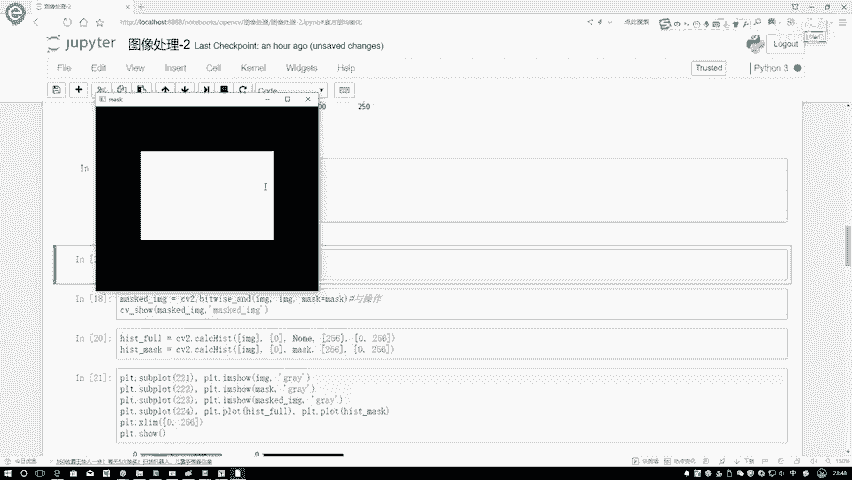
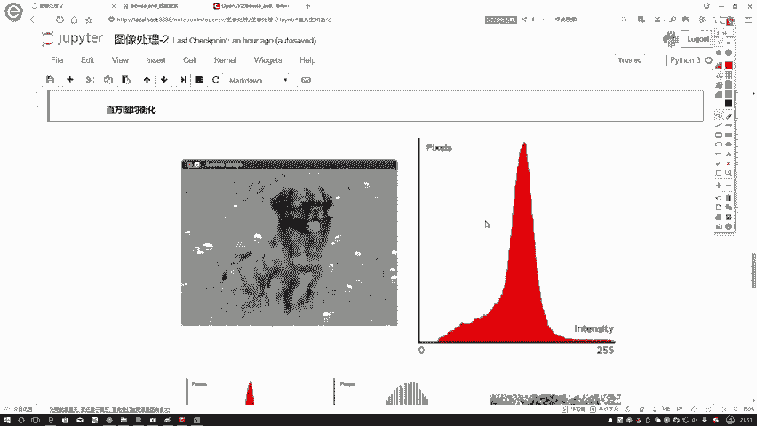
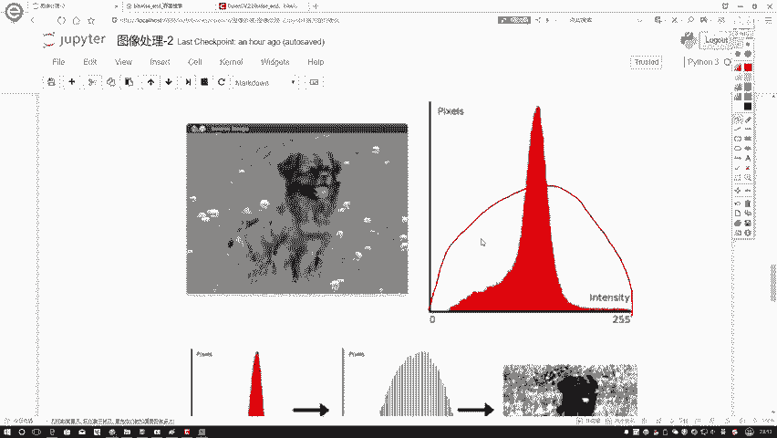

# P26：2-均衡化原理 - 迪哥的AI世界 - BV1hrUNYcENc

然后再说咱们对直方图啊做改变之前还有操作，再给大家说完，刚才说这个操作当中啊，是不是还有一个mask这个掩码，这个东西默认情况下咱们都只用成一个乱值，这回咱们来看一下啊，主要就跟大家说一下。

我们怎么样去创建一个掩码，以及啊这个掩码它的一个定义应该长什么样子，首先第一步我创建出来一个mask。

这个mask这样先给大家看长什么样子，就长这个样子，先来看结果吧，这个就是我创建出一个掩码，这年耳当中啊，它只有两部分，一部分为黑，一部分为为白啊，大家一定要注意一点，它就两部分组成的，没有其他的地方。

就是一个零，一个255，然后呢，这是原始图像，当我把这个原始图像和这个掩码，结合在一起之后，我就得到了下面这第三个图，第三个图相当于什么这个掩码操作当中啊，会执行这样一个变换，就是啊掩码覆盖到的地方。

因为它的大小是一样的，源码所覆盖到的地方怎么样了，它所所有的位置就都制成，就是掩码覆盖到位置，你给它制成255，这你要保留的其他位置支撑零，你构造出来这样一个矩阵之后。

给原始数据组合是不是相当于一个截取操作啊，这样我就把图像当中啊，我希望拿到的部分给它指定出来了啊，这就是我们掩码做些什么事。

然后呢给大家说一下，咱们这个源码该怎么样进行一个定义，就是mask这个东西，首先用neire zero进行定义，然后呢你指定好啊，就是你图像它的一个大小在这里啊，我的图像大小就是我给大家可以打印一下。

看一下吧，我们print一下，然后它的一个shift值。

这样咱来执行一下呃。

不看这个结果，然后他是一个C145百的是吧，所以说啊在这里我们要构造的是一个二维的，你不用把最后颜色通道也加进来，然后呢在这里就是一个无符号无符号整形，对于图像来说啊，我们基本上都用无法整形去做的。

而且是个八位的那八位，它不就是正好是0~255之间吗，这就足够了，然后第一步我创建出来一个mask，然后呢，接下来我是不是说我要再选择一些区域了，选择按键，你注意点就是用imagine shape。

为什么用这么用啊，没有没而没有随便写一个值啊，它俩大小，因为它俩大小要保持的是一个一致的，所以说在这一块传下来是一个imagine shape值啊，然后接下来你是不要选择，你要保存保存的一个部分了。

选择保存部分时候注意点，就是你要保存的是一个白色，所以说你需要把保要保存什么东西，置为255，这个是open CV当中啊，它默认的一个要求，所以说咱要保存什么，你就把什么值啊设置成一个255。

这就可以了，然后这样我可以给他展示一下。

现在咱们就画出来了，我的一个呃mask，我这个掩码它长什么样子。

接下来接下来我把这个猫也画出来，这个猫我很简单，这样我就把这个猫读见了。

它是一个灰度图，然后呢我现在要对这个猫执行一个操作，这里啊有一个什么操作，它是一个语操作，所谓一个语操作啊，这个传进来的是你的这张图像，这个是我传进来的mask，也就是说我需要指定我当前的这个mask。

它是等于什么东西的，当咱们吧写好了这个雨操作之后，相当于就是所有零的地方。

它是不是就是雨嘛，零和一是什么，它是个零吧，所以说咱执行完一下。

看一下是不是只要带掩码的，就是掩码为为零的地方，那有黑色的，咱就没有保存下来啊。

这个就给大家说了一下啊，咱们这个掩码该怎么样去使用，然后呢当你要构造完源码之后，你可以干什么，你可以啊，对图像诶再做一个变换，就在这里我分别统计两个，第一个是什么，第一个就是嗯我不带掩码的时候。

一张完整的图像，然后去统计它的直方图，然后下面呢就是我做了一个掩码之后，就是在这里带上一个mask之后。

它的一个结果，这个咱们来看一下，直接给大家看一下吧，在这里我通过一种子图的方式来进行展示。

这一张图是原始的一个猫，然后用灰度图组建的，第二个呢是我掩码长什么样子吧，第三个就是我执行完掩码操作之后，我图像又变成什么样子，最后一个就是呃，当我去把这两张图分别统计他们直方图的时候，得到的一个结果。

在这里啊，也可以看到，就是嗯其实在这里截取的应该是个主成分，然后他就是整体上来说比那个小了一点啊。

是这样，这样大概一个感觉这个它就是一个掩码的作用，然后啊说完了一下咱们的一个直方图之后啊。

大家应该差不多都理解了，我们直方图要做一件什么事。

说白了就是统计每个像素点，它分别有多少个吗，然后下面再来看一下我这个直方图啊。

它都能做哪些事情，我们先来看第一张图，在第一张图当中啊，反正这张狗，然后呢我们做了一个这张图统计之后啊，在这里我发现一个事儿，哎呀好像有些位置的这个值特别多，有些位置值很少，是不是。

在这里我们第一个感觉这个局和直方图啊。

它不是特别均衡，是不是，那我们也可以想一想，我能不能让直方图变得均衡一些。

更均衡一些，你看现在这个东西一般情况就这样，当我们这个拿到图像之后啊。

可能图像的一个亮度，图像色彩都比较弱，当我们做了一个均衡之后，我们图像的色彩和亮度能进行稍微的一些提升，一会儿会给大家展示一下哦，让我们先来看，既然我们已经说了，有这样一个事儿。

那我们是不是要对这个直方图让它均衡一点，什么叫均衡啊，在这也就这个意思，你看原来零这都没有，那现在我想做完之后原来这么高，现在我让他矮一点，再胖一点，是不是可以了，也就是说没均衡之前是个瘦高的。

我均衡完之后应该是个矮胖的这个意思吧。

那大家可能想了，那这步操作我该怎么去做呢。

在这里啊再跟大家说一下，就是我们的一个直方图均衡化啊，它的一个基本原理长什么样子，其实啊这个做法就是我们要做，要最终要完成的事。

估计大家一下就能看懂，就是让它变矮一些嘛，在这里咱举个例子啊。

比如说现在啊我拿到了一组数据吧，在这里这就是一堆数值嘛，你就当做是我多个像素点就可以了，这些像素点我们先拿到手了，我们暂时认为啊它是一个不均衡的，再也不用观察了。

就给大家讲一下咱这个均衡化它是怎么去做的，然后呢右边就是这个写个A吧，这个写个B，左边是原始图像，我写个圆吧，右边是我做完均衡化之后的一个结果，我写个均吧，怎么去做呢，首先它会进行统计。

统计什么从大到小进行统计啊，你看他算了一下像素灰就是灰度值为50的，它有多少个，有四个为128的，有三个200的，有五个255的，有四个，先分就是先分灰度值进行统计，这个就是我统计的一个指标。

右边就是我实际的一个值是有多少个，然后呢在这一块，你看我这个值啊都能统计出来了，那有这么多值，那概率那是不是一打眼就能算出来了，我可以把它的概率也算出来吧，这个四占总体的百分之多少。

是不一下就能算出来啊，但是大家注意点啊，就是这个概率啊，其实上我们不用我们用的是什么，我们用的是一个累积概率，什么叫累积概率啊，别远得五十五十，第一个值，那累积概率前二没有啊，那就从它开始呗。

他就是个50，那128呢，128累积概率啊，就是不光是他自己的概率了，还要加上前面的概率，他是这个意思，你看前面比128小的，它是0。25，等于128的是0。1875，所以说他的一个累积概率就是0。

25，加上一个0。1875等于0。4375嘛，然后200也是一样的，用他自己的加上前面所有的，最后反正一加最后一个值肯定是一吧，这样我们就先算出来了，嗯对于当前啊我这组数据来说。

我的一个像素点的灰度值来说啊，我的一个累计概率值分别等于多少，接下来我要算一下我映射之后的一个结果，其实啊你说咱这个均衡化，那不就是由一种分布映射到另外一种分布吗，所以啊我们的核心啊。

就是在这样的一个映射操作当中了，映射操作啊，做法也很简单，第一步我们来看一下，在这里啊我们直接去算一下，用0。25乘上什么，用它的一个累积概率值乘上什么，你的一个取值范围在这里。

我们说灰度值它是不是0~255之间啊，那取值范围一共有多少个，有255个吧，所以说此时他是用0。25×1个，255啊，这么去算的，所以说啊当我经过了这样一次映射完之后，第一个值是50诶。

给它映射成了63。75，此时我们的灰度值不能有小数，需要对它再进行一个取整操作啊，只有四舍五入就完事了，接下来下一个值0。4375，是不是说要乘上也是乘上相同的值啊，因为你的取值范围就是0~255吗。

然后乘上255等于新的值111，下一个值0。75，乘完之后191，那最后1×1乘255，肯定还是255本身吧，这样咱就完成了一个映射变换，现在能得到一生新的映射，结果就是这几个值原来为50的。

现在变成64，原来为128的，现在变成112，这个意思，那我们从整体看啊，就是说原来从50开始的，现在从64开始的，原来呢是128，现在变成112，相对来说它们之间的一个间隔，它们之间的一个整体间隔。

是不是感觉更小了一点，这个意思吧，这个就是我们的一个那什么，我们的一个呃基基本的映射啊，怎么去做的，其实这个例子啊，到时候大家大家不用先看啊，具体数值只是啊随便给大家找了一个例子。

然后看一下我们的一个计算方法，实际啊，咱来观察我的一个具体分布，结果咱们通过下面的例子，这个例子啊大家都知道啊。

我们的一个计算方法是长什么样子。