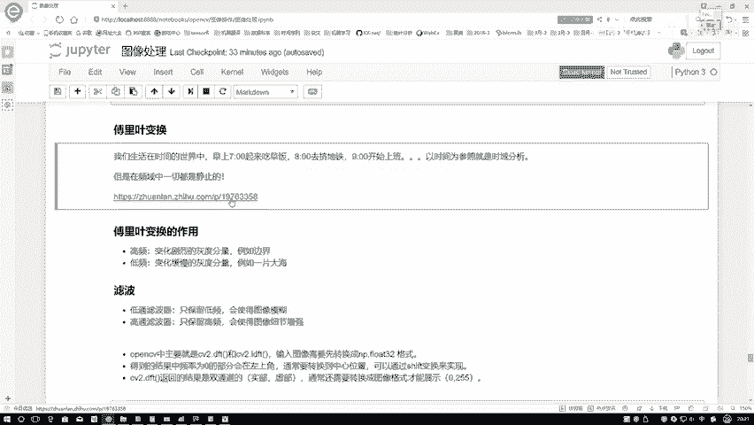
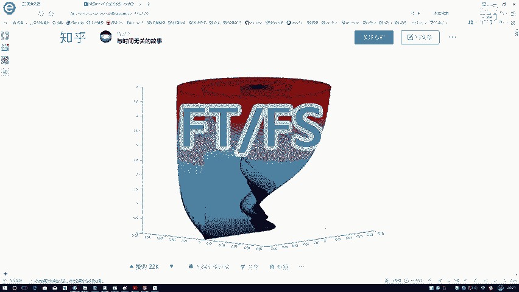
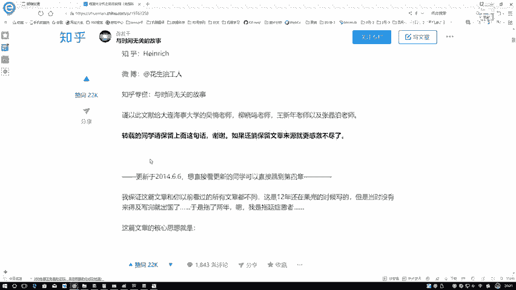
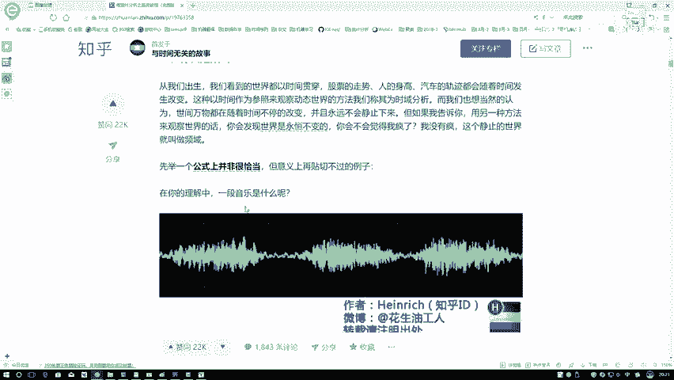
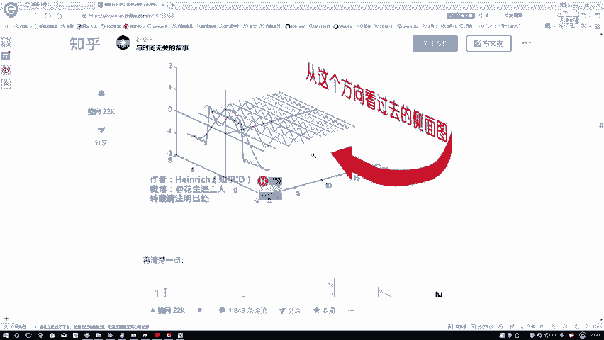
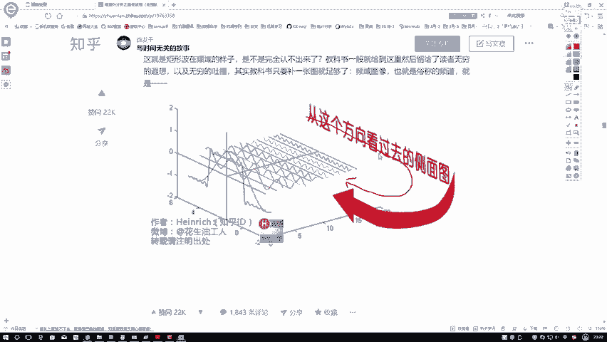
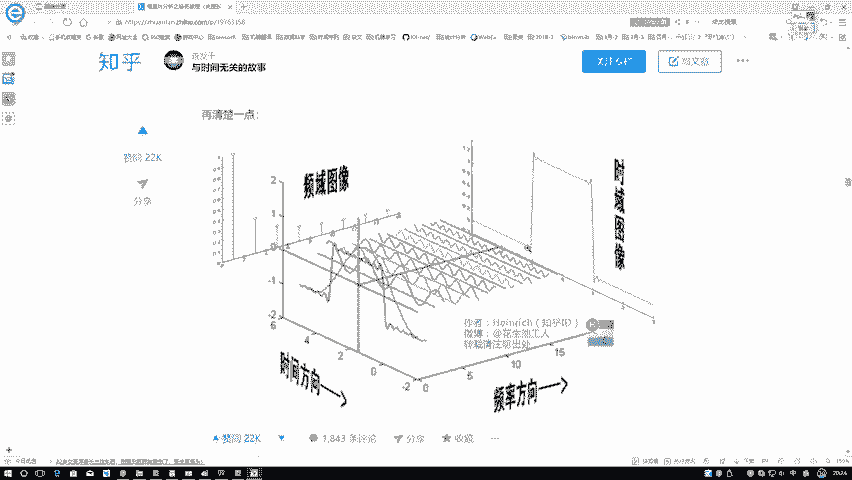

# P28：1-傅里叶概述 - 迪哥的AI世界 - BV1hrUNYcENc

这节课呀，咱们来给大家说一下，复联变换在我们图像当中啊，都能够做哪些事情，我先说一下吧，什么叫做一个复联变换，我们先想一下我们实际生活当中场景，哎我说现在有这样一个事儿，咱们大家呢早上七点起来吃早饭。

我估计咱们大家可能都差不多，然后八点呢被褥要挤地血去了，九点差不多开始上班了，然后一天工作十点做什么，11点开会，12点吃午饭，然后四点盼着下班，五点等着差不多大家走的差不多了，开始走吧。

这个就是我们基本的一个生活吧，那我们在生活过程当中啊，你看我写这段话，他是不是以时间为参照的呀，所以啊我把这个东西叫做一个时域的分析，大家想一想，在我们生活当中，是不是绝大多数事情都是跟时间相关的。

比如说打篮球，哎呀上半场比赛怎么样，然后随着时间进行中场休息了，然后下半场又怎么样，每节比赛都要打满12分钟吧，所以说啊好像一切都能够跟时间挂钩，那我们是生活呢是不是也这样，随着时间怎么样。

我们慢慢长大，又经历一些事情，要做一些事情，这个是我们实际当中做一些东西，但是呢傅里叶啊好像把这件事看得更抽象一点，他是站在一个更高的视角，比如说一个上帝视角，在一个上帝视角来看。

你说他关心你每一天做什么事吗，其实他可能并不关心他，只需要知道你每天都需要吃早饭，你每天呢都需要挤地铁，你每天都需要上班，是不是就完事了，比如这样，比如说在上帝视角，他可能这么看，在一周啊。

比如说咱们就按周来说吧，在一周这个七天当中，可能你需要吃这么七天的早饭，是不是，那也就是说你每天都要吃早饭，然后呢你八点去挤地挤，挤地铁这个事在上帝看来，可能是你每个工作日都要挤地铁。

你的休息日不需要去做，然后呢咱们上班这个事儿，那好像是每个工作室也需要上班吧，所以说啊在上帝视角看来，我们可以把它想象成是一个频率频率，什么意思，比如说每天我都吃饭，那吃饭这个东西。

它是不是一个频率当中一件事情，那我说我每隔一天去抵地铁可以吧，每隔一天去上班，我倒班的今天上，明天不上，那是不是就每隔一天去上班啊，那在我一个上帝视角看来，他不关心你，在这这个实验当中分别做了。

就是按顺序做什么东西，我只需要知道你都做哪些事了，做这件事呢它的一个间隔，它的一个频率就完事了，所以说啊现在我们傅里叶变换，他更关心的是在频域当中发生这些事情，那我们来对比一下。

好像是说在这个时域当中啊，一切都是在进行的，你看随着时间的进行，我们做了什么样的事，所以说它是个运动的吧，但是呢在评语当中每天都吃早饭，你每隔一天去挤挤地铁，他们是不是一个静止的呀，是这样一个感觉吧。

所以说啊我们现在啊所说的频率当中，傅里叶变换就要考虑在频域当中，我们要描述的东西，他做了一件什么事儿，比如说在这里我说现在打篮球，打篮球的一些比赛当中，比如说有这么12分钟吧，然后零到这么12。

这是123456算了，我就写个8分钟得了，咱就当做8分钟吧，写不下了，然后呢，我说现有球星就有库里吧，库里呢他要去就是得分嘛，然后他可能要投三分，他也可能要投两分，是不是，然后呢。

比如说第一分钟的时候哎呀他投了一个三分，然后领个两分，然后接下来第2分钟的时候，他投了一个，他投了一个两分吧，然后零个三分，然后以此类推，他都是这样的啊，这这块应该是一个一，这块是一个零。

然后接下来又是一个零一，又是一个一零，又是一个零一，然后这又是一零，再是一个零一，那我们来观察一下吧，我是不是说啊，现在啊就是随着比赛进行，第一分钟哎呀库里他打进了三分，然后没投进两分。

第2分钟他打进了两分，第3分钟他又打进了三分，是不是以此类推，按照时间描述，我们这么描述的，那在频域当中我们怎么描述，平时当中啊，描述很简单，在这些比赛当中，每隔一分钟得一个三分。

或者是哦以以及每隔一分钟再得一个两分是吧，所以说啊在这里我们是要在频域当中啊，对东西或者说对我们的图像来进行一个描述了，然后在这里啊给大家看这样一张图，看这样一个就是一个链接吧，这个链接啊是我之前啊。

我们的一个学员给我推荐的，我觉着这东西简单看一下。

讲的比较通俗易懂，在这里能给大家分享一下的，不是我，这不是我写的。

是一个写的非常通俗的啊，这个作者到时候大家可以简单来过一下。

这篇文章当中啊，主要说了就是复联变化，从头到尾是一步步怎么去做的。

当然在这里边涉及到知识点比较多，我们图像当中可能不会利用多少这么多的东西。

大家简单过一下就可以，然后呢咱们在这里主要想给大家看这样一个图，就是这个图，这个图我觉着画的非常好，基本上一眼啊。

你就能够把咱们的一个时域和一个频域啊，给联系在一起，首先呢傅里叶说了这样一句话，就是所有的一个周期函数啊，都能用一些正弦波啊叠加出来，比如在这里我现在做一个非常不规则的一个，不能说非常不规则吧。

我就说拿到这样一个图像，我拿一些正弦波去近似堆叠出来这样一个图像，可不可以啊，这个作者他画了张一张图，诶，我觉得画的挺有意思的，咱来看在这张图当中啊，他是不是说了一个正弦波，什么样堆叠两个正弦波。

堆叠三个正弦波，甚至堆叠多个正弦波，比如说他现在想去像是做一个拟合似的吧，想去表示一下这个矩形，那在表示过程当中，你看一个正弦波表示不出来吧，但是呢当我通过多个正弦波的时候。

我就能给它做这样一个近似表达吧，所以说啊这个傅里叶他说这样一件事，任何的一个呃只要是一个周期函数，都可以用我们这些正弦波给堆叠出来，在我们这张图像当中啊，也呈现出来了我们当前这个现象，然后呢这个是什么。

那这个大家一看，那你不还是跟时间相关的吗，那这个食欲我该怎么样转换成一个频域呢，我们来看看这个作者出发点我觉得非常好，就说这么一句话，就把这件事解决了，我们换个方向来观察一下。

就能够得到咱当前的一个频率了，来看下结果，频域呢就在这里，我们来看这一块就是平移的结果了，我们来看这些正弦波啊，这正弦波有的变化浮动比较快，也就是有的比较慢，有的比较快吧。

你看越往后的或者是这些最后一排的，最后一排的怎么样，变化的非常剧烈吧，变化的非常剧烈，这是它的一个特点，并且呢它的振幅比较小吧，你再看前面呢变换的比较缓慢，振幅也比较小吧，所以说啊我直接从侧面一看。

就是在我频域当中的一个结果了，我们频率当中啊，这就是一个振幅，这就是一个频率吧，等于周期的一个倒数嘛，在这里咱们就把这个频率这个东西啊，给它画出来了，所以说啊只需要大家理解一点就行了。

我们的时域当中长什么样子，把时域当中呢换个角度一看，就映射到了我的一个频域当中，在频域当中去理解问题可能要更容易一些，这个就看咱们处理问题的一个对象了，这里就是到这里大家简单看一下这张图就行。

后面的那些结果，就是如果说大家想把复列当中啊，详细的细节再看一下啊。

咱们都可以围绕这个这篇啊。