# 比刷剧还爽！【OpenCV+YOLO】终于有人能把OpenCV图像处理+YOLO目标检测讲的这么通俗易懂了!J建议收藏！（人工智能、深度学习、机器学习算法） - P29：2-频域变换结果 - 迪哥的AI世界 - BV1hrUNYcENc

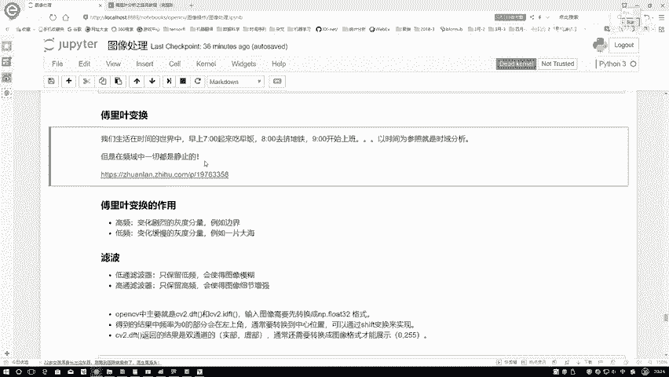

然后呢咱们回到我们的内容当中，在这里呢刚才跟大家说了一下，我们复联变化基本什么意，大概是什么样的一个样子。

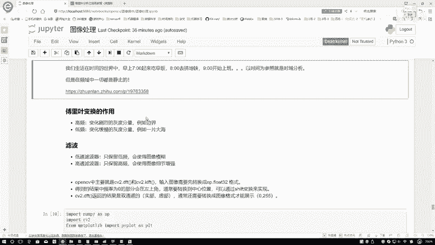

那这个傅里叶变换啊，我们做了一些事情，你给我放到一个频域当中，究竟能给我提供一个什么样的作用呢，咱还得要跟大家说一下。

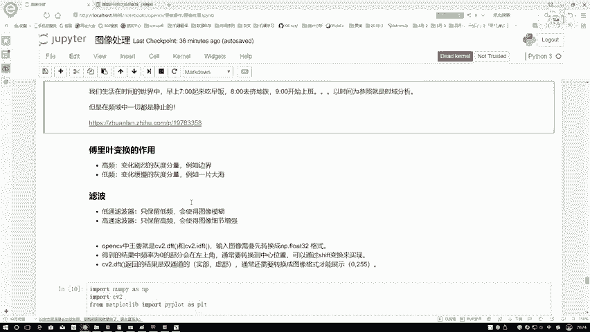

我们要负离亚，它能帮我们做什么事，接下来啊咱们再来说一下我们的低通滤波器，还有一个高通滤波器，那既然提到滤波器，大家肯定知道哎呀，肯定是要保留一些东西，然后排除掉一些东西，那什么叫做一个低通和高通呢。

我们把这个东西啊叫做一个低频和高频，其实也可以，但在图像当中我们来想一想。

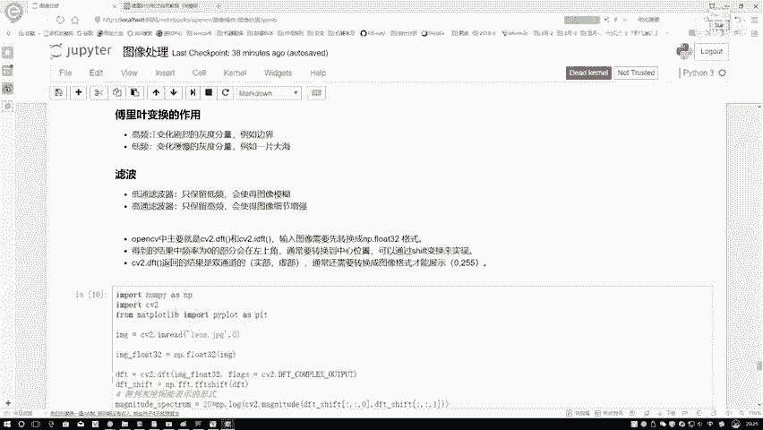

什么东西叫做一个高频，什么东西叫做一个低频呢，如果说按照这张图来说，我们来看哪些叫做一个高频啊，那肯定是这些变化幅度非常剧烈的是吧，那哪些就叫做低频呢，那就像一个老年人似的。

慢慢悠悠的就是动动起来就是也挺慢的是吧。

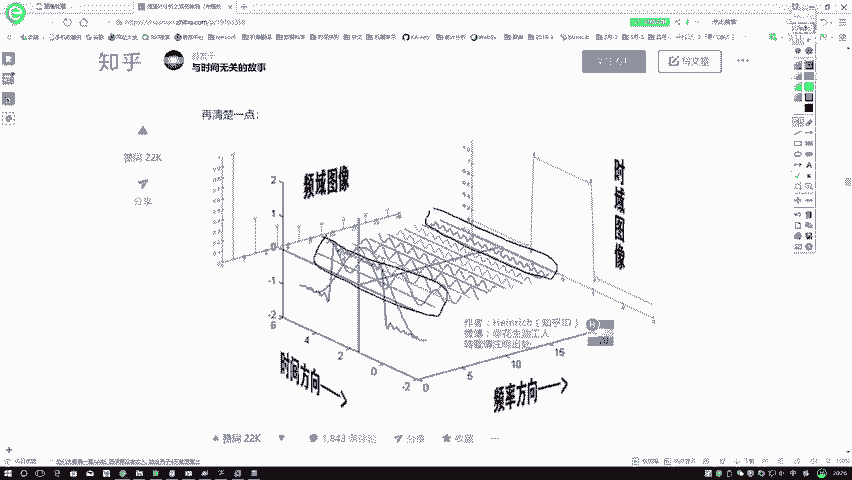

它就是个低频的嘛，那对于这样的一个高频和一个低频来说呀，它在我们图像当中分别表示什么概念呢，我们先来看高频这个高频啊，首先它的概念是什么变化的，非常剧烈的灰度分量，首先第一点变化的比较快吧。

那大家可以想一想，在这个回复当中啊，什么地方它能变化比较快呢，比如说啊现在茫茫的一片大海，那在这个大海上，你看这个大海都是怎么样，都是相同的吧，你能看出这滴水和那滴水之间的一个差别吗，看不出来吧。

都是一样的吧，但是呢大海当中突然出现一艘船，水和船之间形成了明显的一个差异吧，那由我的水到这个船这样的一个边界，变化的幅度是不是非常大，所以说此时啊我们就说啊这是个高频。

相对来说呢就是图像当中的这些边界区域啊，我们把它叫做高频，因为它的灰度值，灰度分量变化非常迅速，在边界的一个左右两端，那什么叫做一个低频呢，低频啊说白了就是老年人慢慢悠悠的，慢慢悠悠的时候。

一片大海当中，这滴水那滴水有啥变化的吗，没啥变化吧，茫茫的大草原是不是也一样啊，所以说啊低频相当于啊图像当中。

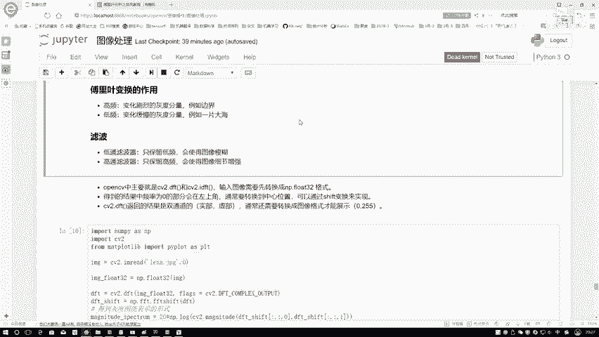

不是边界的那个地方，那我们来看一下吧，在这个滤波当中。

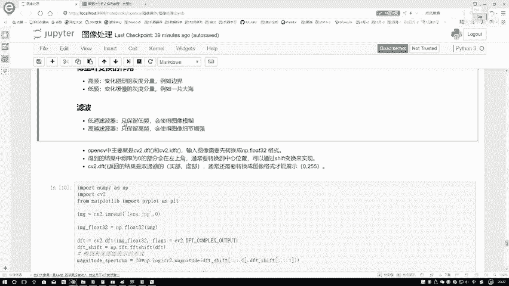

首先低通滤波，低通滤波什么意思啊，低通滤波就是什么滤波，它就是保留什么东西，低通滤波器呢，它就是只保留我们的一些低频的信息，低频信息保留下来了，高频没了，高频没了，图像边界好像会怎么样会变得模糊吧。

所以说啊，此时如果说用低通滤波器对图像做处理，会使得咱图像变得稍微模糊一些，一会儿代码咱会给大家演示一下，然后呢高通滤波器，高通滤波器，你想我会保留一个高频，去掉了一个低频，相当于什么。

相当于让我的一个边界，怎么样给它锐化的一个感觉，是不像是增强的一个感觉啊，一会呢再给大家看一下，分别我的一个低头还有高图啊。

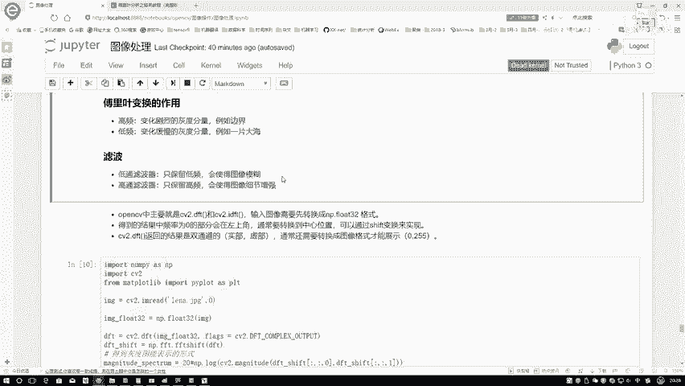

能带来效果，它是长什么样子的，嗯在这里在就是刚才说了一下，我们的低头，还有个还有一个高通分别什么事，然后呢再来看一下在open CV当中啊，两个函数就是一个DFT和一个IDFT，DFT啊。

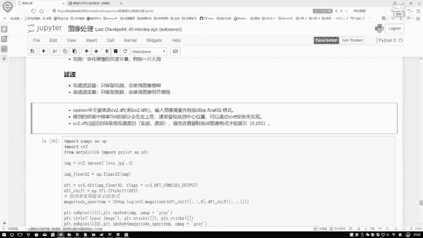

就是执行这样一个复利的变换，那id执行执行完变成什么了，这就变成一个频域当中了。

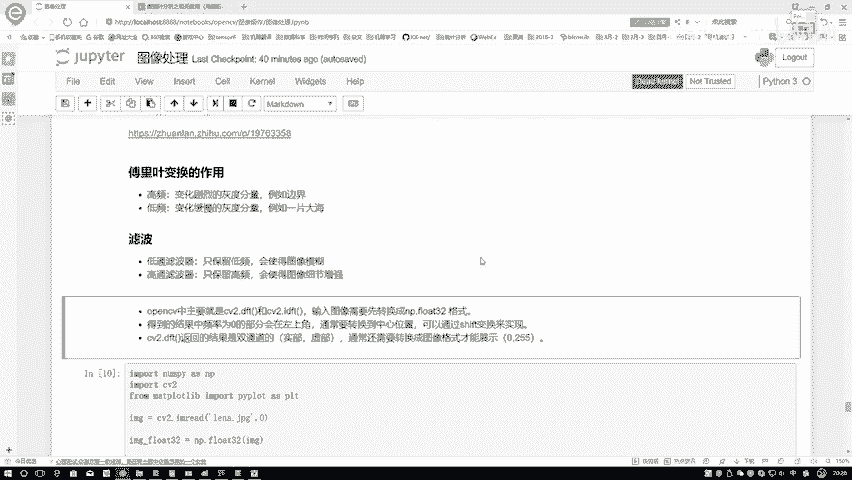

那频域当中这个东西你没办法显示出来吧，频率这个东西又有实部，又有虚部的这个东西就复列变换完之后，结果不太好弄，所以说我们通常要进行一个展示的时候，你还得给我逆变换一下，逆变换就是一个IDFT就完事了。

所以说在这里呢我们就两个核心对象，一个DFT。

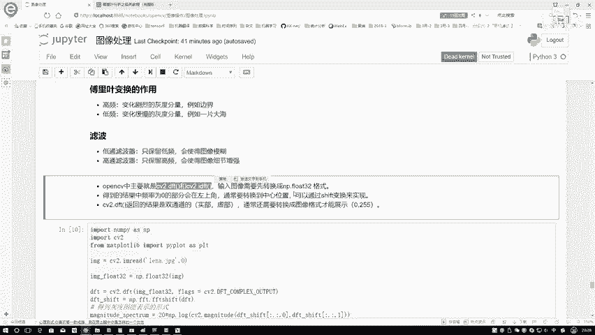

一个IDIDFT，然后呢我们来看一下，我们在这里啊需要注意的几点，这几点啊就是那个open CV当中啊，官方文档已经给我们强调出来了，第一点，我们的输入图像你必须得给转换成南派的flow，32的格式。

这个是一个强制的要求，然后呢咱们来看这一点，当我做这样一个嗯变换的时候，我会得到一个实际的结果吧，那这个实际的结果当中啊，就是正常情况下你得到结果是这个样子的，低频在哪儿啊。

低频一般都是在这个左上角这块，但是呢为了咱们显示和处理方便，我通常啊都希望把这个低频这个东西，你给我拉到一个中心来这样一个感觉，所以说啊咱一会儿会执行一个shift变换啊，南版当中啊，就这样一个操作。

通过一个shift的变换，相当于啊把我这个就是平，就是这个频谱图当中啊，我这个低频区域拉到中心上啊，这个意思，然后呢最后这个DFT啊，像是我执行了一个傅里变换完之后，我得到的结果它是双通道的。

就像是咱们那个复数当中，是有实部和一个虚部吧，那你说一个实部，一个虚部，这也不是个图像啊，我这个结果该怎么样进行展示啊，所以说这一块我们还需要额外的工具，把我当前这个双通道结果转换成图像的格式。

什么叫图像格式啊，0~255之间的值，这叫图像格式，通过一个转换，我就能够进行显示了，这个呢就是其中的几点啊。

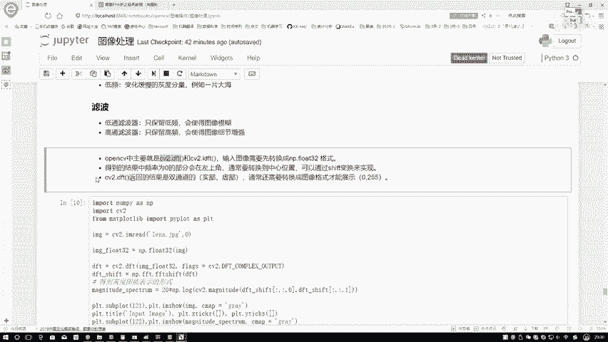

咱们来看一下怎么去做的，导入工具包不说了，还是要读进来LINA这个图像，然后转换成一个灰度图，接下来在这里，你看我转换成南派的flow32格式吧，这是人家open CV r官方他的一个要求。

咱必须这么去做，第一步仅执行一个傅里叶变换，是不是CV two点DV就是DFT一下传进来，我们当前的一个输入图像就可以了，然后呢我们得到什么，然后我得到的是一个就是这个频谱图，在这里呢。

我用南派就是安排当中也有一个FFT，在这个安排当中啊，我也可以对它进行一个shift操作，相当于啊将我的一个呃，这些个值就是低频值，转换到我中间的一个位置了，这样呢咱就得到啊。

就是低频在中间的一个结果了，得到这个结果我们还得再需要转换一下，才能够进行一个啊同样形式的表达，在这里呢，我分别啊需要对它的两个通道进行一个转换，在这里就是c two当中啊，给我们提供了现成的函数啊。

能帮我们执行完这样一个转换，但是呢转化完的结果是非常小的一些数值，我们还得把结果映射到0~255之间，所以说啊直接把这个映射公式啊带给大家了，通过这个公式执行完之后，相当于得到的又是我可以展示出来的。

图像的结果了，在图像技术当中啊。

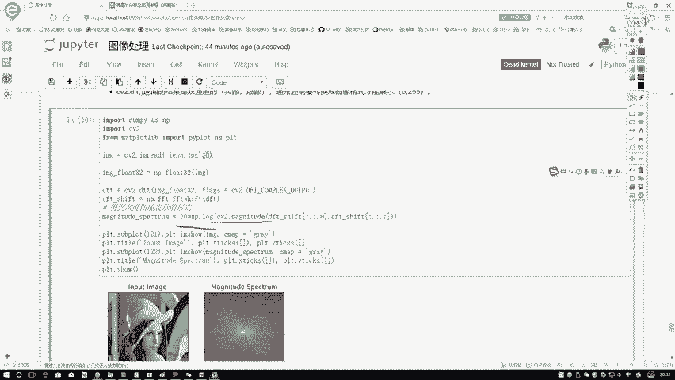

接下来我们就把这个图画出来了，咱们简单来看一下嗯，这张图就是LINA啊，就是我的一个输入图像，然后呢右侧这个图，右侧这个图啊，就是我得到的一个频率的结果，这个频率结果它是经过完一个转换之后。

我们可以发现一点中间这点比较亮，是不是基本是这个情况，就是越靠中间的一个位置。

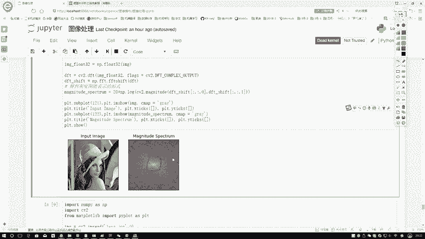

它是什么，它的一个就是频是越低的，就是像我们刚才说的。

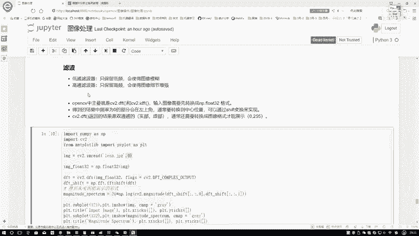

这个低频的东西是在哪儿啊，就是低频这个东西，低频的东西是在中间的，越高频怎么样，越高频越往两边去发散，它可以把这个东西X轴相当于什么X轴，或者是这个轴，你就相当于它是往外发散的一个结果。

越离中心点越近的时候，它的频率是越低的，越往外发散的时候，它的一个频率是越高的。

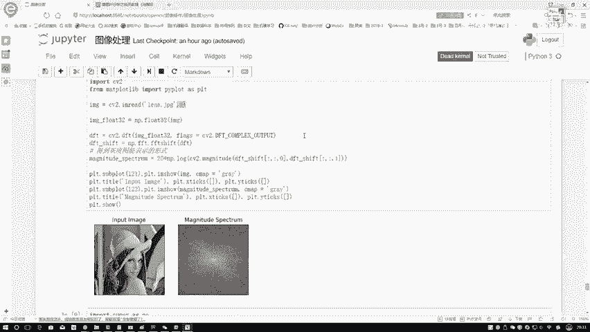

这个就是我们的用COPENCV当中啊，我的一个啊DFT。

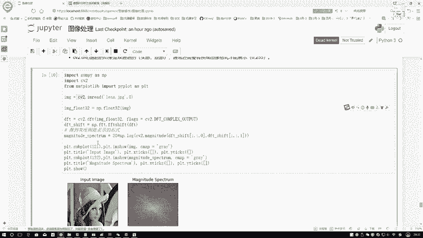

还有一个诶IDFT咱没说啊，咱现在只是执行完了这样一个变换，然后呢把这个变换结果给他展示出来了。

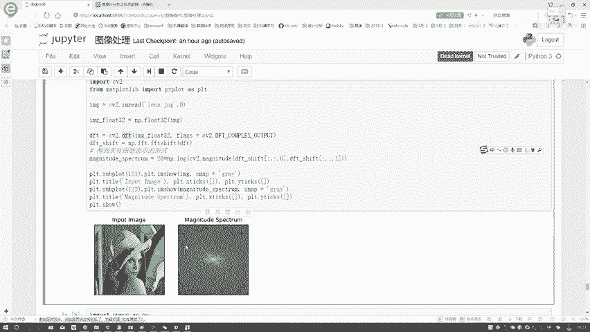

那一会儿啊，我们要给大家演示的就是我们的一个低通。

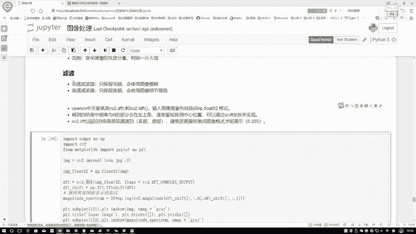