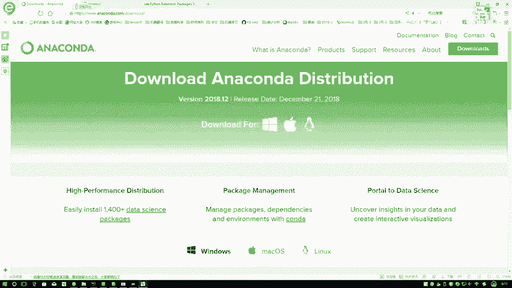
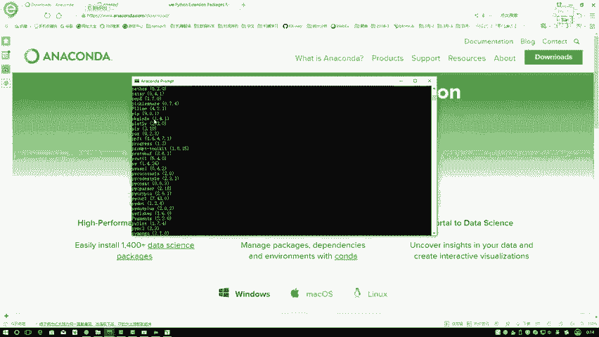
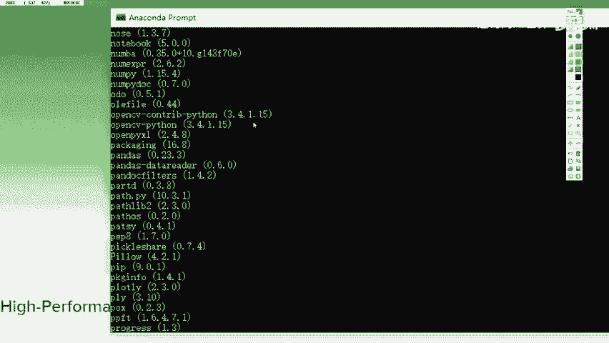
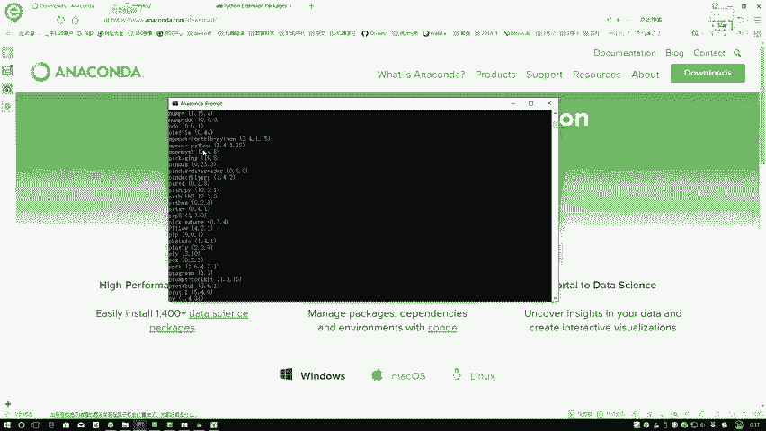
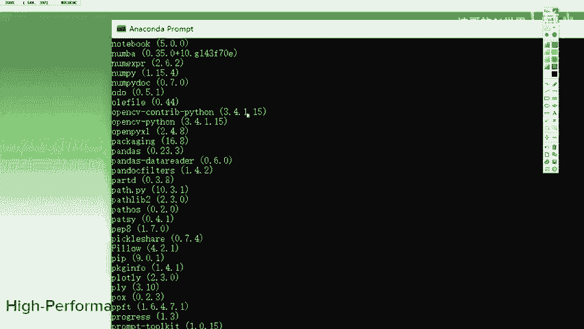
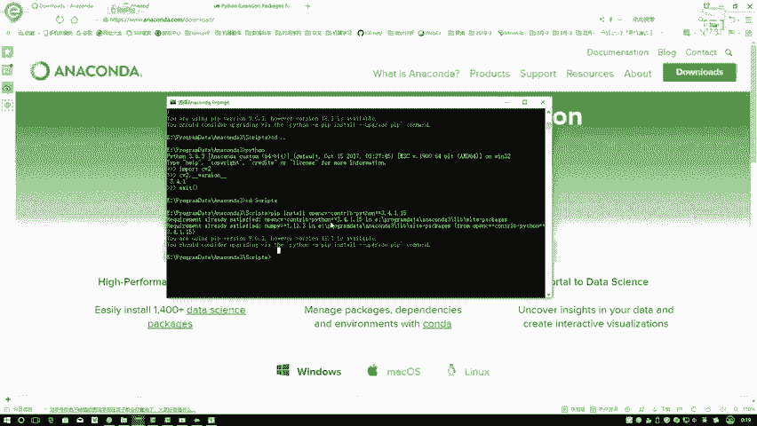

# 比刷剧还爽！【OpenCV+YOLO】终于有人能把OpenCV图像处理+YOLO目标检测讲的这么通俗易懂了!J建议收藏！（人工智能、深度学习、机器学习算法） - P2：1-Python与Opencv配置安装 - 迪哥的AI世界 - BV1hrUNYcENc

这节课呀来跟大家说一下，就是我们整个系列课程环境啊该怎么进行配置，首先啊最重点的就是open CV了，但是呢我们课程当中啊，是用Python接口去调open CV当中啊，各种各样的函数。

各种各样的接口的，所以说啊现在大家第一步，你得先把Python环境给装起来，这个如果说大家以前装过了，那直接用就可以了，如果说以前没装过，我建议大家用这个安妮康达来进行配置。

这个打开网站就是安妮康纳他的一个官网，我简单介绍一下吧，就是安妮康达，相当于跟肯德基的一个全家桶差不太多，它里边把Python你要用到的东西，或者说咱们课程当中会涉及到的东西，全给你配置好了。

你安装工具包的一个呃permit，强水命令行去安装工具包，有给大家演示给我们配置好了，你一会儿去写代码的地方，一个notebook啊，它的一个环境也给我们配置好了，以及啊，咱接下来要进行的后续的工作。

都可以在any accut当中啊，找到对应的一个实现，所以说啊就是安妮康达相当于一个大礼包了，把咱们所有的东西啊都给你集成进去了，我建议大家使用安妮康达来去配置，咱们的Python环境。

这东西怎么安装啊，非常简单，把我们的官网进去，等一会我把这些网址复制到我们第一课当中吧，到时候大家直接下载完之后，你就可以打开网址下载就完事儿了，在这里第一步我们先选择你的一个系统。

我估计大家绝大多数应该都是windows吧，那我们就不用点了，如果说你是一个Mac或者LINUX，点一下进入到你相应的系统当中，然后呢，它会让你选择一下当前啊我们要的一个Python版本。

这里呢有一个二版本，就有一个三版本啊，就是3。7，现在还有一个二版本，2。7这个东西啊，我觉着已经被淘汰了，二版本咱们直接给pass掉，直接下三版本就可以了，三本当中啊，现阶段常用的可能3。63。

7都行啊，若是大家没有特殊的选择，那你默认就下最新的就完事了，在这里你只需要点击一下下载就可以了，我估计咱们绝大多数都是64位的，现在很少有32位吧，如果说咱的笔记本性能啊稍微低一点。

那咱们就是根据64位，32位，咱们自己选，下载完之后啊，它是一个点ex e的一个程序，所以说在windows当中，EIE程序下一步下一步浏览目录，选择下一步安装就完事了，非常便捷啊。

我们就把这个工具包给你配置好了，配置好之后，大家啥都不用去做，你也不用配置一些什么环境变量，你也不用调试任何东西，直接来用就完事了，安装完之后打开我们的开始目录。

在这里啊，它会出现一个A内康带窗口，靠这里出现andy cut窗口吧，我这个东西啊叫做ANICCA3，大家可能下的可能是，因为我这版本可能比较早了，到时候大家下载完可能是新版本，但是无论什么版本。

它应该都是一个安妮康纳，什么名字，咱就不管了，然后完了之后，这里边主要两个工具，我们要去用一个呢是这个黑窗口的，叫做一个安妮康纳permit，为大家点开来看一下，另外一个就是我们写代码用的一个。

notebook的一个环境，我先说第一个一个enicona permit，我们点击出来看一下，点击完之后啊，它出现了一个黑窗口，给我们的感觉像不像是windows里边CMD那个环境。

在这里边我可以执行一些命令，打一些就是输入一些代码是吧，在这里啊，我们主要给大家说一下，怎么样用我的一个permit去安装啊，咱们要用的open CV，首先第一步就是呃默认情况下。

如果说咱们这个系统当中，你只有一个Python环境，那很简单，那你直接啊就是pip store就完事了，如果说你有多个Python环境，像我这里我这Python实在太多了。

因为不同工作需要我用的Python可能不一样，3。53。63。7都有，所以说呢我需要去嗯，指定的一个位置来进行安装，指定的位置啊，就是你这个安妮康达安装的一个路径，安装完之后啊。

咱们可以先记一下你的一个路径在哪，比如说我这里我安装的时候，它是在一个E盘，然后呢是在这个program data当中，然后呢有这个any acca3，我进去这就完事了，里边目录结构啊是这个样子。

然后呢我给大家看一下我的，我这里边你进去之后打开Python，它就是你看进去执行完之后，Python是安装好了，大家在执行过程当中啊，如果说你没有多个Python，你就配了一个全局变量。

然后你支架不用进这个路径，你打Python先试一下，你这个Python环境配音配好，只要只要出现了这些命令，像是让你去输入代码了，就说明咱这个环境已经配置好了，我用的一个是3。6啊，但是这个跟3。63。

7啊没太大关系啊，3。63。7啊，对于咱们客人来说都是一个实用的，只要你别用那个2。7就行了，然后这是一个判断环境，我们也退出来就可以了，然后在这里我们来看一下它有一个scripts文件夹。

相当于就是安妮康纳当中的一些配置工具啊，都是在这个scripts文件夹当中，比如说咱这个pip命令，如果说你没配一个全局变量，或者说你有多个Python，想在不同Python当中进行执行的过程当中。

你需要进入到你对应的Python，比如说我这是3。6的，我进入3。6的这里边的一个scripts文件夹当中，然后呢大家可以先打第一个命令，叫做一个pip list，就是pip l i s t。

然后我们来执行一下这个命令啊，相当于会给我们过一遍，当前我们都安装了哪些个工具包，我在这里有找就找O的，我ABCDFG。

然后OPQ你看这里来看一下吧，这里边有几个是不是有两个open CV相关的open CV，Python，Open cv，哎这个control Python是吧，咱现在有两个这个文件。

接下来咱们跟大家说一下，我们该怎么样进行open CV的安装，我们这个安装啊，它就是只安装Python版本就足够了，在我们课程当中呃，大家我觉着也不用特意啊上网去搜一些教程了。

其实关于open CV安装方法特别特别多，但是我觉着用最简单的方法，大家安装起来应该更省心一些的，你要下源码再编译，那我觉着再下一个vs，那是非常痛苦的一个过程，咱不如直接用软件编译好的东西啊。

来配置就完事了，在这里大家只需要打一个命令pip install一下，然后呢我在这里啊直接给他复制过来了，就是咱有两个东西先装，第一个，第一个叫做一个open CV Python哦。

我把这个东西复制过来，不用复制版本号，大家就是默认情况下，你先装最新版本也行，但是呢有一个问题，我这里先给大家强调一下，在open CV啊，3。4。2以后就是这样，3。4。2以后啊。

他有些算法被申请了一个专利，像我们课程当中啊，会一学到一些关于特征提取算法，有些算法被申请了专利，所以说在open CV当中啊，它这个开源实现我们就没办法去用了，这是3。4。2以后的事啊。

所以说在这里呢在课程当中，我选的是3。4。1的一个版本，你安装过程当中啊，你可以写一个等号，写上这样一个三点，比如说你在这块你可以写上一个3。4。1，我没记错，我应该还有一个点一五。

是不是来看下具体的版本号，我这个东西3。4。1。15，大家在安装的过程当中啊，你也可以去选择它对应的一个版本号，进行安装也行，或者说呢如果说你直接想安装最新的，那你就直接什么版本号都不加。

直接他就会帮你把这个最新的给它配置起来，但是呢我建议大家用咱当前的，3。4。1。15，因为呢这个是我测试过的，有所有算法咱们都能用起来，不会涉及到一些专利，所有东西我们都能直接玩起来。

这个是给大家推荐的一个版本号，这样到时候大家第一步你先去装这个open CV Python，然后等于等于3。4。1。15，这个过程当中啊，它会先进行下载，然后再进行安装，并且会把open CV啊。

所涉及到的所有的相关的一个依赖的东西，都没自动的帮你进行安装，这个过程啊，可能相对来说是一个比较漫长的过程，因为可能涉及到一些去外网进行一个下载，因为这东西原图不一定是个国内的，下载速度比较慢。

如果说大家速度比较慢的时候，想想办法看看我们能不能换一些圆啊，让我们的速度加起来，这个就是我们的安装方法，咱们先去pip store一下open CV杠，Python等于等于3。4。15。

这样呢就把我们的基本环境安装好了，基本环境安装好之后，我们可以来进行一个测试，我先CD点点出去到我的Python当中，大家可以执行这样一个命令，就是安装完之后啊，先在命令行当中测试啊。

就是你安装完工具之后，不要先到一个IDE，或者先到一些其他环境，因为可能是由于你其他环境配置的问题，导致没导进来，先在命令行，就是在我最基础的判断当中先试一下，导不导进来。

import一下CV two啊，注意点import不是open CV啊，是import一下CV two这个名字，然后回车一下，如果说他没出现任何错误，就说明啊当前这个东西啊，咱已经装好了，装完之后呢。

我可以看一下它当前这个版本号，对不对，CV two点，然后按住shift加减号啊，直接减号两下啊，注意点它不是一个，它是两个，再看一下一个两个，然后呢你写一下它的一个版本号，然后按住shift减号。

一个两个来打印一下当前的一个版本，现在我的版本3。4。1，这就说明咱们的一个open CV已经装起来了，这就OK了，给退出掉就可以了，然后呢我再进入到scripts当中，C r i p t。

然后呢大家还需要再装啊，另外的一个东西，这个再给大家说一下，我们来看呃，就是open CV啊，在他的一个三版本之后啊。

进行了一些升级啊，这个二版本没有这个东西，只在三版本，你看啊这个open CV python3。4。15，还有什么open CV control Python也是3。4。15吧。

这里啊，我们还需要再额外的装一下上面这个东西，这里呢我我我我我偷懒了，直接把他名字复制下来了，一会儿在那里，一会儿我在那个咱们第一代当中吧，给大家写一下，到时候大家直接复制就行了。

我把这个东西给它复制过来哦，Open cv，然后呢嗯在这块得打上空格install一下，然后啊大家这个注意点啊，就是你这个版本号一定得是，跟你刚才安装那个open CV版本号是一样的，它这个东西啊。

相当于就是嗯给你加了一些额外的一些拓展，比如说咱一些特征提取的算法，在直接那个Python open CV当中啊，它是没有的，你需要再额外再装这样一个扩展包啊，这样一个感觉，当我们把这样东西安装完之后。

就相当于啊，我们的open c环境已经全步的安装好了，在这里要跟大家推荐的是最简单的方法，你直接用pip音扫去装，要比你去下载一个vs c make再去编译容易的多啊，要不然的话。

你这个open CV可能要装的时间更长一些。

