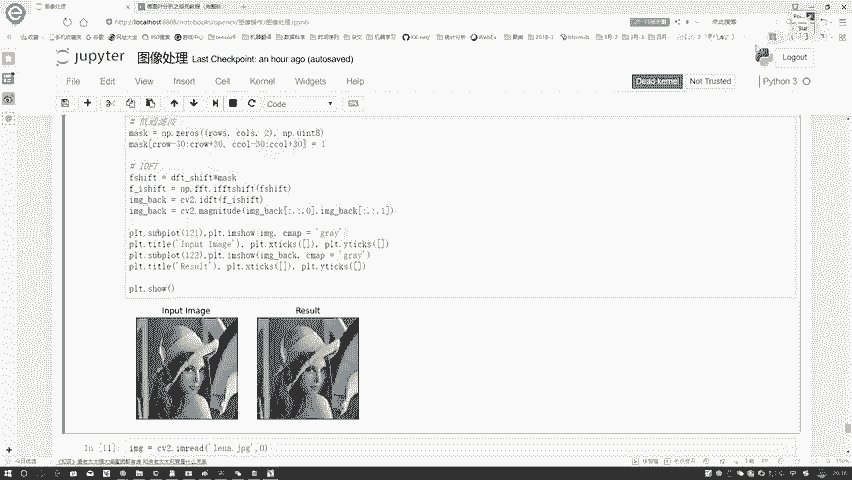

# 比刷剧还爽！【OpenCV+YOLO】终于有人能把OpenCV图像处理+YOLO目标检测讲的这么通俗易懂了!J建议收藏！（人工智能、深度学习、机器学习算法） - P30：3-低通与高通滤波 - 迪哥的AI世界 - BV1hrUNYcENc

来看吧，还是把LINA读进来，然后前面这些操作都是一样的，在这一块啊，我又分别算了几个指标，第一个指标就是图像的一个shift值大小，然后呢以及它的中心的位置，哎这里大家可能会问哎。

你算这个中心位置是干什么，再来想一想，首先这里第一块我先拿这个图像了吧。

哎不拿这个图像了，拿上面这句来说吧，这个更明显，拿到这个图像之后，接下来哎你说我现在是不是，比如比如说我现在要做一个低通的，那低通啥意思，低通好比这个事，我现在只保留低频吧。

我们刚才是不是说了低频这个东西是在中间的，那我现在比如说这个中间就这这个点是零零吧，就假设说这个点零零吧，就中心点吧，零零嘛，然后呢我说我在上面取这么30行吧，在下面我也取30，左边我也取30。

右边呢也是一个30可以吧，然后啊你说应该用什么进行填充啊，在这块相当于我要做一个掩码吧，怎么样只保留中间的位置啊，在这个东西里边，我给它涂涂涂涂涂都用一个什么都用一个白色，就或者用一个255来进行表示。

或者用一来表示，是不是就完事了，这样然后其他地方呢，其他地方咱们这样都得都得是一个黑的，这样我就把这个掩码做出来了吧，这个掩码跟我原始的一个就是得到这个结果，一结合。

它是不是就是我想要的一个什么低通滤波器啊，因为这里就是黑色的，我都过滤掉了，白色的都留下来了。

这就是一个低通滤波器，再来看一下，首先第一步我去算了一下，他的一个就是得到它的一个长和宽，然后呢分别算一下它中心点的位置，注意转成int型，要不然下边可能会报错，在我的低通滤波器当中。

首先构构造一个南派点zero。

我的一个长和宽跟咱的一个图像是一模一样的，然后呢，咱刚才不是指定中间中间的一个位置了吗，中间位置左边30，右边30。

上面30，下面30分别给它置为一，相当于只有咱的一个中心区域是一。

其他位置就都是零，因为是用南派点zeros来进行初始化的。

然后呢当我在做IDFT就是一个复联，要往原始图像当中进行变换。

逆变换的过程当中，逆变换的过程当中啊，相当于这个这个东西，它是一个哎呀红色的吧，这个东西它是一个就是咱们的一个DFT，这是一个DFT，然后从这东西再变回去。

那就是一个IDFT嘛，咱现在啊在做这个IDFT之前。

我先要干什么，先不把我的掩码跟我当前得到的结果，结合在一起吧，那是不是一的就保留下来了，不是一呢就全部过滤掉了吧，此时咱只留下了中间的一个区域，中间区域有了之后，我干什么，中间区久了之后。

我执行一个IDFT，但是注意点，你在执行FDFT之前，你需要干什么，你需要再执行一个i shift是吧，咱之前啊在做事的时候，是不是说啊咱们多做了一步什么，就是f f t shift吧。

就傅里叶里边的shift变换，shift变换，咱说之前原始左上角你拿到中间了，那你现在要做逆变换了，你说你给拿中间了，你是不是得给还回去啊，是不是你给他还到咱原来的位置啊，在这里咱还要再做一个I啊。

就是一个i shift，就是i ft t shift就是在的还回去，这个意思还回去之后呢，我在CV two当中啊。

再进行一个IDFT，这就给还原回去了，还原回去结果还不能看，为什么，因为还原回去的结果，还是实部和虚部的双通道的一个结果，这东西还不是一个图像，你为了它能够显示出来。

我们需要再把实部和虚部再进行一个处理。

才可以的，那接下来展示我们当前的一个结果来看一下吧。

左边是我原始输入啊，就是展示的是灰度图啊，右边是我得到的一个结果，得到结果当中啊，咱们注意点刚才做了什么，刚才做的是个灰度，就是一个低通吧，低通的时候你看是不是只保留了什么。

只保留了图像当中的一些就是就怎么说呢，像是一些比如说帽子里边吧，这个帽子里边中间那个东西，或者是人身体是当中一些中间的东西，脸正中间的东西，你看边界上是不是感觉有些模糊了。

所以啊就像我刚才说的这个低铜这个东西。

它这个低通滤波器啊，它会使得咱们图像变得模糊一些啊。

得到当前的一个结果，因为它只保留低频的信息，然后呢咱再来看一下。

做完了这个低频之后啊，还有这个高频吧，高频做法其实跟低频简直就是一模一样的，还是这个东西，那你说你一个高频你要保留谁啊，高频就这个事儿，你现在你把低频给我去掉了，那是不是就是一个高频了。

在这里我把这个东西我不要了，我说外面这些东西，我说我要外面这个东西它是不是一个高频的，那我要外面。

那就完成高通滤波器吧，很简单，你就可以把mask这个mask这个东西给做出来吧，再来看一下吧。

在这里你看之前我是zeros，现在是once吧，once全是一的，我全要，然后呢只有中间位置支撑零，相当于中间低频，这些给撇了就完事了。

接下来所有操作，直接把上面这个代码复制下来就完事了。

不用做任何东西来看一下吧，我的一个就是高通，就是或者是叫一个高高频吧，这个滤波完之后，你看得到什么了，是不是只保留下来了一些边界的信息，而没有去留下一些什么一些细节吧，你看脸里边空了。

身体这个肩膀这块空了，帽子里边空了，只留下这个边界了吧。

这个就是我的一个高通滤波器得到的一个结果，那大家可能会问了，哎，为什么我们非要给它转换到一个频域当中，做处理呢。

那我问大家一个事儿吧，我说让你去检测一下图像当中哪些个哪些东西。

它是一个低频的，哪些它是一个高频的，或者说我想做一些操作，在原始图像当中，我问大家怎么去做，你想一想原始图像当中做减是不是特别麻烦啊，但是呢如果说你转换到咱这个复利空间当中，是不是就是频频。

就是这个频域当中啊，这个频率当中低频和高频是不是层次分明，或者叫棱次分明一个感觉啊，在这里边我做变换是不是特别容易啊。

所以啊就是有很多时候，当我们在对图像进行处理的过程当中，希望速度或者希望效率能更高效一些，也希望结果做的能够更简单高效吧。

我们通常都会把这个图像，先映射到我们的频率当中。

在频域当中做处理，要比你在原始图像当中做处理容易得多啊，就是这样一个事儿。

所以呢咱在这里给大家介绍了一下，我们的傅里叶变化基本的一个思想啊，大家简单了解一下傅里叶变化基本思想，以及呢在图像当中啊，我们可以用傅里叶变换诶，做什么事，一个低通滤波器，一个高通滤波器，再来看一看。

咱得到结果就知道了，什么叫做一个低频，什么叫做一个高频，这个就是傅里叶变化能给我们呈现出来的。

