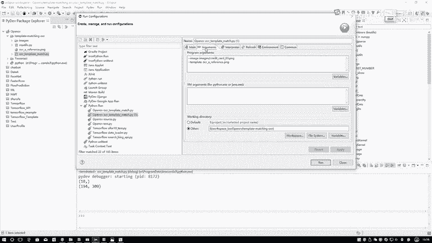

# 比刷剧还爽！【OpenCV+YOLO】终于有人能把OpenCV图像处理+YOLO目标检测讲的这么通俗易懂了!J建议收藏！（人工智能、深度学习、机器学习算法） - P32：2-环境配置与预处理 - 迪哥的AI世界 - BV1hrUNYcENc

行咱来看看代码吧，一步一步怎么去做的，首先第一步呃，第一步就是咱这个ocr template，match这个模板匹配的一个工作，在这里我们这样就是嗯，首先需要大家指定两个参数。

一个是I1个是T或者是一个是咱的输入，一个是咱的模板template，这样到时候大家执行的时候，右键你看第一步我是用Python设置，也设置了一些参数吧，这些参数啊你要是用命令行直接去做的时候。

那是不是杠I杠T，然后写参数就完事了，在这里啊，我这个环境啊它叫做一个eclipse，可能这节课咱们第一次看eclipse这个东西呃，我一般强调一下吧，就这个东西嗯，也不是一个必须的。

你用Python去做也行，用notebook就是用那个notebook去做也行，用py charm去做也行，在这里啊，我选择这个ELISE主要原因啊，就是选择一个IDE啊，然后让大家能进行debug。

给大家进行一个操作，通过debug要给大家讲解一下，其中啊每一行代码他做了一件什么事，嗯大家在做的过程当中，我也给大家这样一个建议，就是当你拿到一个项目，可能代码量比较多的时候，如果说你从前到后的去看。

整体的一这么一打眼去看，好像涉及到的东西挺多，看着挺乱的，但是呢如果说你debug1行一行去看，可能啊这个思路就会比较清晰，我接下来就是所有项目讲解，都是基于这个eclipse去做的，Release。

我我用它的原因就是在于我一方面啊，有时候得用C去做东西，有时候呢我有些任务还得用HADOOP去做东西，所以说c java还有Python我可能都会用上，只不过说平时可能用的更多是Python。

在这里就是无论你是c java还是Python，我们都可以配置一个它的环境，所以说我不愿意来回去换各种各样的id啊，就直接用这个eclipse去做了，到时候大家你用PHM，估计用PH的人可能更多。

也不一定非要用咱这eclipse，如果说你想用嗯，大家可以百度一个教程啊，就是你现在没配置，你可以配置这个东西，eclipse Python你配你就百度这个教程，按照教程咱一步步去装一下。

配下这个环境就可以了，反正无论哪种id，只要有一个有带有debug功能的，这就可以啊，没有具体的限制行，咱下面跟大家说一下，第一步，第一步设置我们参数在这里，我们是不是说我添加了两组参数啊。

ELISE当中啊，咱这样就是你右键点一下咱当前这个点pi文件，就ocr template match这个文件，run当中啊，有一个run as这个run啊，就是第一个Python run。

那就是从头到尾执行了，第二个就是run一下它的一个嗯configuration，相当于就是配置一些他所要的参数。

还有一些其他功能，咱现在用不上，咱只用参数就够了，点开完之后你选中啊，就是左边你选中你要用的这个文件是什么，在这里选好你当前的点pi文件，然后右边当中你指定这个这个min当中啊。

你就不用去看了，暂时我也不需要，你就只看这个东行，就是它的一个参数，在这里这个啊就是第二这第一min。

第一个这是第二个，这里呢咱刚才是不是写了参数啊。

写什么杠杠imagine杠杠，Template，那指定吧，刚刚imagine，你说imagine是不是我当前一张输入图像。

就是在这里，你看这一块这几个信用卡。

一会咱都有给大家进行一个演示，这些信用卡这就是我输入图像。

这个也是我突入图像，你把他的名字把它路径指定好，这就可以了，在这里我需要指定好它的路径看一下吧，他是在咱们当前这个目录结构当中，有叫images的文件夹，在文件当中，你把名字指定好。

在这里你看名字我全指定好了吧，然后接下来接下来就是一个template。

我的模板的模板，刚才咱是不是也有啊，这东西这不就是咱模板吗，里边具体数值啊，咱要经过那个嗯他们match方法进行匹配的吧。

这就是我带匹配的这个模板，把他俩路径给我指定好，这就完事了，第一步把路径指定好就完了。

然后呢你点一下这里我不用点了，就是我我没有更新啊。

点apply，然后你点一下这个close就可以了，这就是咱给他配置好了，那这样我先给大家看一下整体的效果吧，咱先run一下，到大家拿到代码时候啊，你也可以先run一下。

正常情况下都没有什么问题，在这里不需要什么太多工具包，基本上只需要这个open CV啊，它就够了，就是一个open CV，咱先来看一下，因为一会我给大家演示过程当中啊。

会画很多个图，咱这样咱先不看代码，先看这个图怎么变的。

第一步哎，我读到了原始的一个模板文件，然后呢，你看我对模板文件这块先会进行一个灰度处理。

然后紧接着马上要进行一个二值处理，这是二值处理吧。

二值处理完之后我要干什么，这是要检测一个轮廓吧，这个轮廓你看这里我只画了一个外轮廓，是不是，那检测完轮廓之后，我还要算它的外接矩形吧。

这是我的一个模板模板，你算完之后，然后接下来我读进来。

原始的一个信用卡的一个输入，读完之后灰度转换，二值二值转换。

这些就是一些形态学操作，哎大家能不能看出来这是什么操作，这应该是个顶帽的操作吧，然后呢，这个这应该是一个索贝尔的一个索贝尔的梯度。

然后呢在下面在下面我应该这是什么，刚才的你看好像这些轮廓就是这些个呃，怎么说，就这些白色区域吧，这样一个区域没有连在一起吧，现在好像都挺多，连在一起了，那这应该是个B操作吧。

然后接下来那那好像刚才在执行B操作完之后。

又执行了B操作，再看再看完之后这是什么。

这是轮廓检测吧，轮廓检测完之后，我现在要对检测到的每一个小轮廓，第一组是545412，5412当中进行一个二值化处理，然后二值化处理完之后，切分成每一个每一个的小的区域，5412当中第一个区域是五吧。

五当中第二是四，第三个是一，这个是二，然后接下来我要下一个区域，每一个区域每个区域去做，是不是，然后接下来最后一个区域做完。

最后一个区域做完之后，是不是进行模板匹配了，这个就是咱最终啊输出的结果，输出结果当中，你看我把这个区域画出来，54125412没问题吧，751275123456，7890是没问题啊。

最终我就想达到这样一个效果，你告诉我当前每一个位置对应的实际的一个值，像是一个信用卡数值检测，或者是跟车牌检测是不是一模一样，这个东西啊。

就检测到对应的一个结果了吧，这个就是我一会儿要给大家演示的呃，完整的一个流程，就是完整的一个结果长什么样子，咱现在这里啊都是画图，然后这样我们先给大家来看一下嗯，咱这些个操作一步一步是怎么去做的。

这里右键无论你是什么id，估计都有debug功能，打上断点，前面这些断点不用说了，第一个显示我的一个绘图，这修卡类型咱不说了，到底一样，咱用到时候再说，要这一块从咱读进来，咱模板文件开始。

我们就一步步去看，我右键debug as s Python run，注意啊，打上一个断点。

我也是建议大家，就是当我们第一遍做事的时候呃，不要总把观花看一遍，你从整体上你都不用从整体上看一遍上来，咱就打上一个断点，一步一步走看看，一步一步做一件什么事，我是建议大家这么去做。

因为呢这对于你理解啊，咱每一步操作它的帮助，我觉得挺大的，你要从整体上去看，你只知道最终的一个结果，而你很难观察每一步的细节，为什么这么去做，咱现在啊，咱要把这个事儿给他做的稍微麻烦一些。

每一步都给大家解释解释这么做原因是什么，这么做为这么做是为什么啊，咱们要来一步一步去看一遍行，再来看吧，第一步，我独建一个模板，图像没问题吧，咱这参数当中指定了他们的模板是吧，这有独家的图像。

Imagine25255，为什么它二五。

因为周边的一些边界都是一个在这里，边界怎么样都是白色的吧，你看边缘都是白色的，所以说我看刚写的值都是255吧，这是咱那个模板读进来之后展示一下模板。

没问题吧，展示模板，然后一会儿咱是不是说要做一个轮廓检测啊。

裸检测之前要怎么办，之前都讲过了吧，第一步转换灰度图啊，这对大家来说没有任何难度吧，转成灰度图，所以兔点转换一下它的一个颜色通道。

bgr to可瑞是完事了，灰度图看一看。

那这个这张图反正他也没什么可转的，就是这样一个灰度图是吧，然后接下来我做一个二值，二值当中，那其实很简单了，二值当中，因为这里它只是它是什么，它只有一个黑色的字和白色的东西吧，所以说做一个二值它很简单。

得到一个结果，二值图像看一下吧，这就得二值图像吧，为什么要这么做啊，因为一般情况下我们当我们做轮廓检测的时候，输入进来的都是一个二值图像。

咱们啊之前都说过了，这是我当前预处理完结果。

