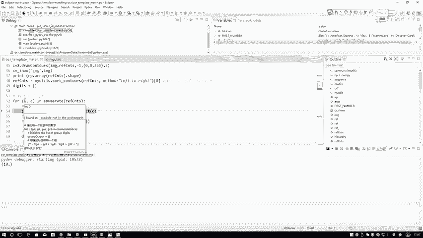
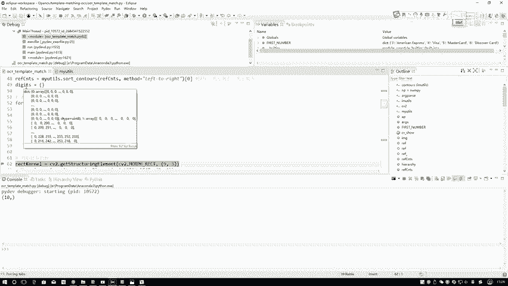

# 比刷剧还爽！【OpenCV+YOLO】终于有人能把OpenCV图像处理+YOLO目标检测讲的这么通俗易懂了!J建议收藏！（人工智能、深度学习、机器学习算法） - P33：3-模板处理方法 - 迪哥的AI世界 - BV1hrUNYcENc

接下来是不是做一个轮廓检测呀，轮廓检测这个函数挺简单的吧，咱以前是不是说过了，这也被大家强调了，然后之前咋说的，是不是说你传进来这个图像指定成什么，指定成一个点copy吧。

啊让大家别忘了去指定这个点copy，因为reference这个东西咱以后要用哦，不要忘记点copy一下，然后接下来指定一个参数，第一个参数啥意思啊，估计大家都忘了，再来看一下吧，咱该咋说的。

是不是说只检测一个外轮廓，所以说啊我这个参数指定的，在这给大家写出来了，是不是只检测外轮廓，其他内轮廓对我来说说没用啊，因为我要用外轮廓去计算它的外接矩形吧，然后接下来我要保留个坐标点。

你是不知道它轮廓的一个位置，这个保轮廓保存的一个方法，执行完之后返回三个参数，三个参数当中你说只要哪个，我只要轮廓是不是就够了，其他我说不要什么层级结构，从原始图像得改，就是画出来的结果，这都不关心吧。

直接关心的就是它的轮廓行，在这里把轮廓给大家画出来看一看。

哎在这里CV to show一下，这是我检测出来轮廓的结果，在这里这个一什么意思啊。

咱以前说的，是不是说这个一表示着你要画所有的轮廓啊。

在这里一共几个，123456789十，正常号有十个轮廓吧，这里十个轮廓只要都给画出来了啊，这是我现在这步轮廓我已经有了轮廓。

有了之后呢，看一下啊，打印下shift值几个，是不是十个没问题吧，每一步啊，当大家在做的时候啊，就是我建议大家勤画一画这个东西，勤展示展示，因为你自己写代码的时候，很难保证你每一步都写是对的。

经常要重复去改，你也知道每一步的结果，唉到底这个实际含义对不对，比如说我打印一下当年shift值等于十，那我就放心了，十个轮廓没毛病吧，这就放心了，就是意味着这东西没没做错，然后接下来我做个排序。

因为在这个轮廓当中啊，你想你看啊，咱这个图像诶哪去了。

这个图像当中它是按什么顺序，0123456789吧，第一个是零二，第二是一，那一会我是不是得说我第一个轮廓，我对应的数值是零二，第二个轮廓对应位置是一啊，那我是不是得按把这个轮廓从小到大。

进行一个排序啊，现在才是顺序啊，可不一定按照就是现在这种零二的第100。

轮廓是第一个一轮廓，第二个，这不一定吧，所以说我自己进行一个排序啊，在这里有一个my utils，当中有一个对咱轮廓进行排序。

F5给大家进去看一下，其实挺简单，在这里啊，其实前面这一步操作都没什么用，核心就在这里，核心核心其实呃就在这块，首先我第一步我去计算什么。

第一步我去计算了它的一个外接矩形，相当于这一块这东西，我计算了它的一个外接的矩形，那有了它的一个矩形之后，你能不能拿到矩形当中，它左上角这个坐标点，第一个坐标点，第二坐标点，其实这个你只需要拿到这个。

就是一个life坐标就够了啊，就是就是你只要拿到你看这第一个坐标，这第二个坐标，这是第三个坐标，你比较它的一个横坐标的大小，是不是就能对我每一个框进行一个排序了。

就拿左上角的坐标就完事了，所以说这里啊就做这样一步操作，我首先拿到轮廓之后，我做了轮廓的一个矩形，这给大家注释出来了，用一个最小的矩形，找到能把它包起来的，那不就外接矩形吗，外接矩形得完之后以后。

它会有几个返回值，这个bounding box boxes，它是一个就是它不是一个值，而是一个元组啊，这个元组当中包含四个值XYHW，你有了XYHW之后，你是不是用一个X就能判断了。

或者用一个或或者用一个一般不用HW，基本上用X来就能就能，咱们就能判断当前这个事了。

用当前你给定的这个坐标点，判断出来咱哪一个在前面。

哪个轮廓排在前面，两个轮廓排在后面，对有轮廓执行一个排序操作，这一步执行一个排序操作，只排序操作吧，只有排序操作完之后返回的。

其实这一步绑定box，我现在不太需要我返回一个轮廓就可以了，所以说此时它给我返回出来的是排序完的轮廓，就在这里。

排序轮廓当中，第一个就是这个零二，第二个就是这个一。

第三个就是这个二啊，排完序了，现在行排序完轮廓之后，那你现在我是不是要做这样一件事啊。

一会儿咱得要做一个模板匹配，那我得知道这个东西它是不是对应零二，这个东西是不是对应一啊，那这个事儿是不是有我自己写啊。

我先指定个字典，字典当中现在是空的，那我在这Z字典当中不断的去遍历吧，遍地什么，咱现在不有十个轮廓吗，十个轮廓当中这个C是每一个轮廓吧，这个I呢是轮廓它的一个索引吧，I等于零二。

这个C等于这个轮廓，咱是不是排序完了，排序完之后。

第一个轮廓是不是就是零二，第二轮廓是不是就是一，所以说此时在这个枚举操作当中，这个I就是数值，这个C就是它对应的轮廓，没问题吧，首先第一步针对我排序好，轮廓当中，第一个得到它的一个外接矩形XYHW啊。

WH没问题吧，通过我的一个举，通过我得到外接矩形，我能不能够把它轮廓给它框出来。

相当于我得外接矩形之后，我用这个Y矩形当做一个索引，我把这一块的位置给它抠出来行吧，ORIREGI应就是我的一个感兴趣区域，等于什么，reference当中，Y冒号Y加H这个东西到这个东西行吧，X呢啊。

这xx这XY这是Y加H，这是什么，这是X加W吧，通过这样的一个区域，我是不是就把这样的一个点拿到手了，所以说当我拿到了这个点之后，你看这是我起始位置，这是我的一个就是我当前这个点，你把它这个区域找出来。

找出来这样的区域之后，我就知道这样一个框了吧，把这个框可能太小了，你看这张图像当中，我这个框做出来太小了吧，we resize一下，reset成合适的一个大小，这个多，那你可能大家说多大合适啊。

稍微啊差不多大小就可以了，也不用太大，也不用太小，随便一个值在这里啊，对于咱这任务来说都行啊，也不用大，也不用小，随便一个适中值就行，接下来你是我构造了字典，构造字典当中我刚才说了，I是不是这个数RI。

是不是这个区就是这个图像或者这个值，抠出来那个东西对应一下子，咱是不是有了零二对应的一个图像，它对应的模板是长什么样子，数不算完了，接下来是不是给我算一是什么东西啊，接下来二是什么东西啊。

最后当我执行完这个复循环之后，是不是在我的字典当中，我就有了零的模板，一的模板一直到九的模板我全有了呀。

那现在咱就做完第一件事，我先把我模板给处理好了。

模板处理啊其实挺简单的，进行轮廓检测，然后进行一个外接矩形。

把模板抠出来，抠出来之后就对应一个值就完事了。

