# 比刷剧还爽！【OpenCV+YOLO】终于有人能把OpenCV图像处理+YOLO目标检测讲的这么通俗易懂了!J建议收藏！（人工智能、深度学习、机器学习算法） - P39：5-tesseract-ocr安装配置 - 迪哥的AI世界 - BV1hrUNYcENc

接下来啊咱们来看一下，就是当我们得到了一张呃扫描完结果之后，怎么样进行一个字符识别，在这里啊，就是给大家准备了一个点偏文件，叫做test点PY，我们点下来看一下，这里边我们来看它的一个名字吧。

叫这个test react嗯，它是是一款开源的OCR识别工具，然后呢提供的功能其实蛮多的，并且呢它不光可以来玩这个英文，它默认其实是只支持英文的，但是如果说你想有一些中文的场景。

你们需要自己去训练一下啊，先训练一下它的一个中文的结果，训练过程当中啊，你可以去在他官网当中啊，去下载一些相应的一个训练包就可以了，人家已经都给你提供好了，我们要做的只是非常简单的几步操作就完事了。

那下面跟大家来说一下，就是呃先大家说第一件事吧，怎么样进行安装，在这一块给大家注释了一下，我们直接CTRL加C复制下来，然后呢我们来看在这里直接给它打开就可以了，这个是它的一个GITHUB。

就相当于是嗯他的一个主战式的，我在这里可以去看一下它的一些基本使用方法，以及它的简介啊，这些我就不给大家说了，关于简介的东西，大家自己来看就行了，一会儿就给大家看结果就好了。

在这里就是我打开的第一个链接，在这个链接当中啊，就是它是一个windows下载的一个地址，因为你看这里边全是点EXE文件吧，但在下的过程当中啊，因为咱们可以找一下最新的一个版本，我看了一下，好像这个4。

0版本是一个最新的，到时候大家下的时候你就下，我觉得下最新版本就行了，咱直接下四版本的，以前我玩的时候都玩三版本啊，但是出了四版本，四版本当中啊，他说加上了一些递归神经网络，做了一些额外处理。

应该会使得在整体效果更好一些，咱支架就是下载最新版本就行了，在这里如果说你不愿意自己下载，我在这里给大家准备好了，就是下载好了这样一个点ESC文件，我们到时候大家直接你双击这个点ex文件。

自己安装就可以了，安装完之后啊，你还需要安装，其实挺简单的，我给大家看一下吧，然后怎么在ELIVE里打开了，行，这样吧哈他他没给我弹出一些错误，还算不错，这样就是说他现在会给你进行安装。

但是由于我这个东西已经是有了，他问我是不是要给它卸载了，那别卸载了，在这里我们还是给它取消掉吧，我不重新装了，到时候大家装的时候nice nice nice，然后你选择一个路径就行，你选路径的过程当中。

你把路径复制下来，因为一会儿你装完之后啊，你还得去呃配置环境变量就在这里，咱们来看一下，配置环境变量其实挺简单，就是进入到你的环境变量当中，把我电脑打开，然后在这里呃咱们来看一下，这是环境变量吧。

环境变量当中你把pass在pass里面给加进来就行吧，这里啊win10你就新建一个，然后帮你安装目录，这是我的一个路径，你把你的你就是你安哪了，那你就把哪个这个东西给添加进来就行，这是一个用户的变量。

只是系统变量咱都加进去啊，然后系统变量当中我们来看一下，还是pass这个东西，还有这里你看呃哪去了，这个最后一个是我我也添加进去了，这个就是嗯咱这个啊下载完之就是安装完之后，我们要做第一步。

先给它进行一个环境变量的配置，这里我的配置过了，咱们简单看一下就行，然后配置完之后呢，我们可以先来试一下它呀，这个东西嗯是不是好使的，我们可以来看一下，在这里我给大家呃复制过来了。

就是用你当用指定这样一个命令杠V1下。

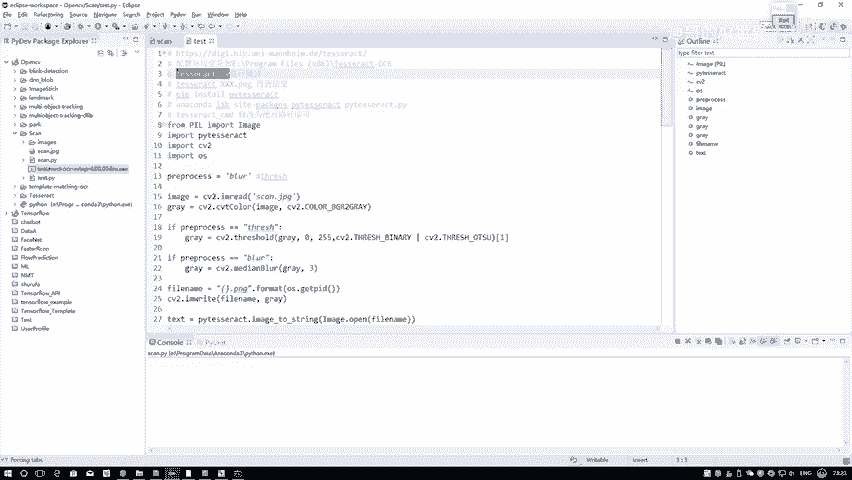

杠V啊，相当于去显示它的一些版本信息了。

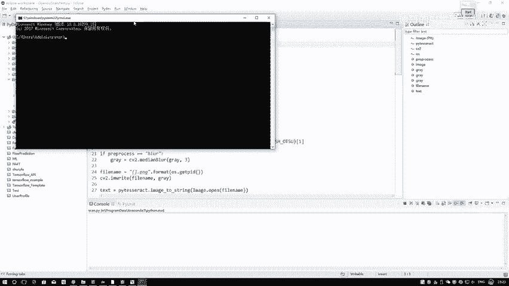

咱们来看一下，此时他告诉我，他是4。00版本，没问题吧，当它出现下面这一行，或者说没给你出现一些报错的东西，证明你这个东西啊已经给它装好了这个意思，并且由于你配置一些环境变量。

你在任何地方来去执行都是可以的，你看我放到这个E盘水也能执行出来啊，然后呢，这样咱拿一张图实际测一下它的一个效果，看它识别样子什么样。

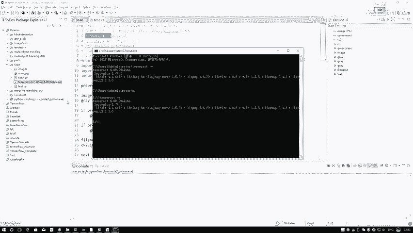

这样吧，我有我哎，我还没准备什么图，我有咱们画一个吧，随便画一个图吧，随便画一个图来看一下，然后拿白色，我去我写什么呢，我写open CV吧，哎呦拿刷子，写个OP，ENCA行。

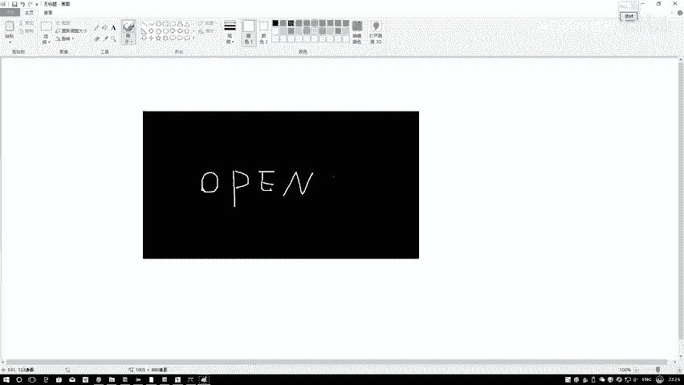

然后这样再给他截个图，额刚才放E盘了，那这样我就得放E盘得了，放到E盘当中，我看叫什么，就叫做一个open CV吧，open CV点PNG行。

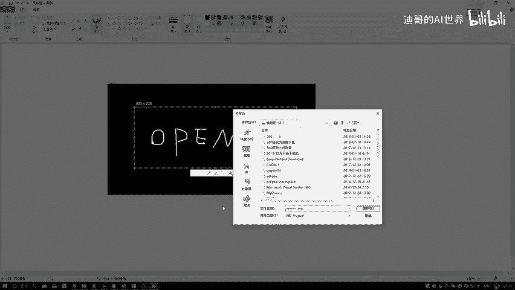

然后进到我们这里边儿，进到这里边儿，咱来直，咱来测试一下。

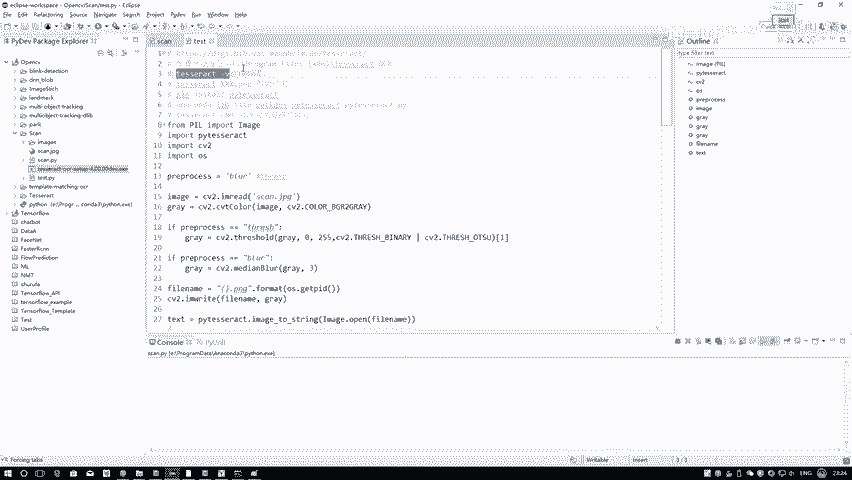

测试啊，很简单，就是直接你输入输入一张图像就可以了，我们来看一下呃，叫open CV opp n open CV点PNG，再来看一下这块，他应该是提示我没有去指定一个输出路径，这样咱重新写一下。

我们把当前接口当中，我们只需要在指定好一个选这里，最终你指定好它输出的一个保存路径就可以了，在这里啊直接在这个E盘当中啊。

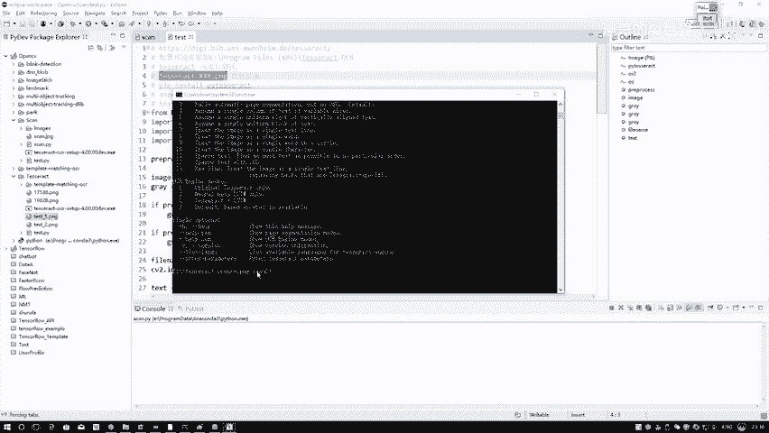

再指定一个路径，就是result txt，这样呢当他俩执行完之后，我们来看一下，这是E盘吧，现在是这个哎这个名字变怎么变了，open CV点PNG好。

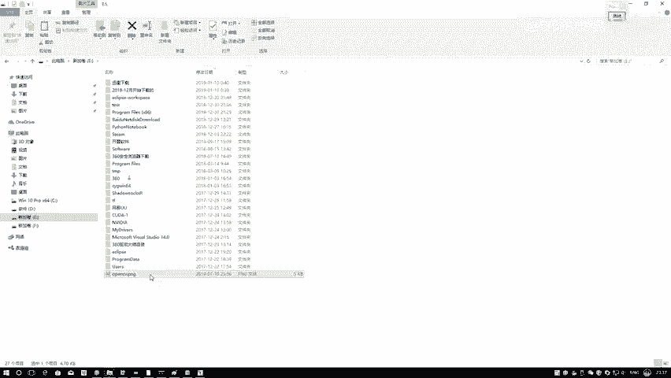

这是我们这张图像，然后呢他为我创建一个在这里来看一下吧，先执行一下。

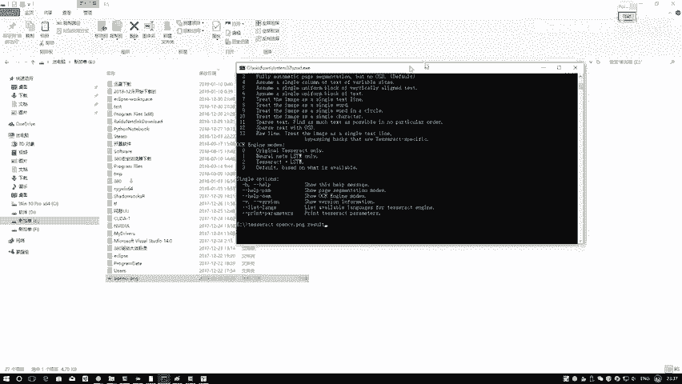

执行完之后啊，它会创建一个result点TXT，咱们来看一下最终的结果，哎呀这个结果这个结果好奇怪啊，这个结果怎么跟我们这open CV不一样呢，这样吧，我觉得应该是这个事，可能是嗯我写这个文字啊。

他把他把我写这个文字，当成一种什么特殊字体了，咱这样我我还是别手写了，我把这个东西呃重新指定一下，我还是拿个文字去写吧，他可能不认我写这个东西啊，刚才是不是说我写这个东西太丑了。

我看一下我写这个东西不是很丑啊，挺工整的呀，算了，重新重新写一下吧，我重新写一个open CV。

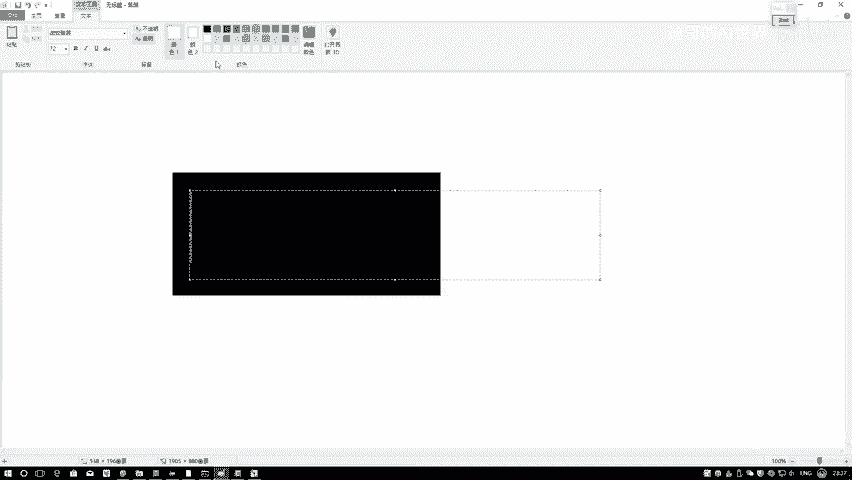

这应该能认识了吧，咱重新再截图一下，然后给它保存掉，我把那个替换掉吧，还是叫做一个open CV。

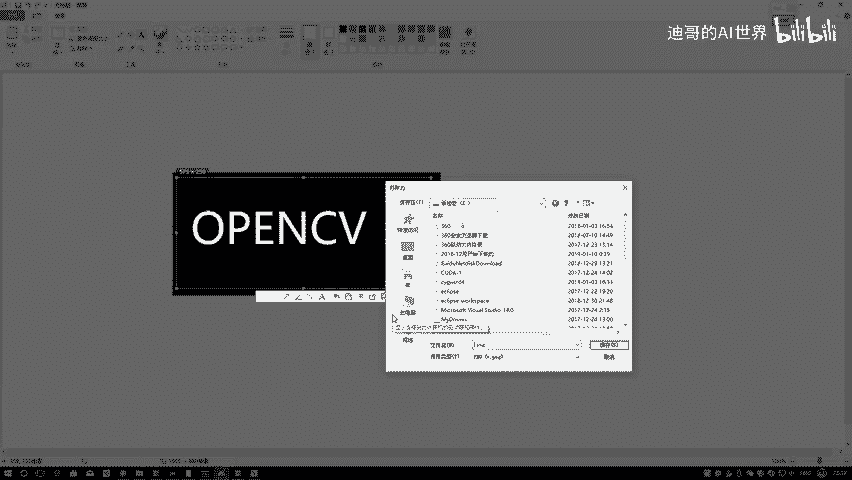

我们ZV点PNG啊，替换一下，然后呢咱再来执行一下。

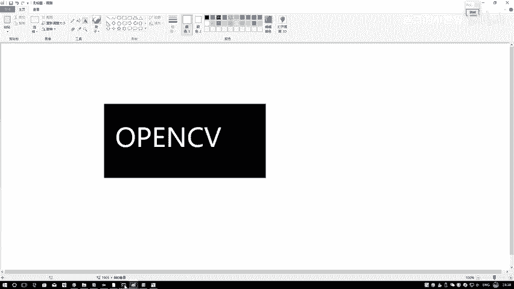

然后看下结果嗯，还是open CV点png result。

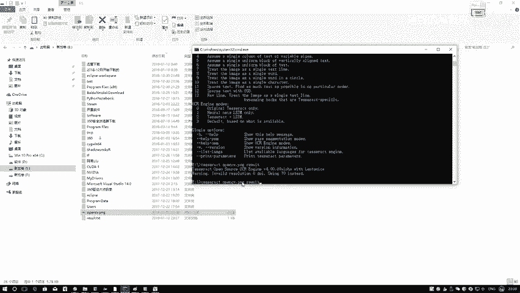

重新执行一下，这回result当中啊，哎变了，这个识别出来了吧，它就是open CV吧，所以说此时啊我们就是啊用我们的工具包，完成了一个OCR这个操作，然后呢这个只是我们在命令行当中去用。

那大家可能在用的过程当中更喜欢用什么，应该是更喜欢跟我们的Python程序结合在一起，当大家需要用我们Python来去做的时候，你还得要再装一个额外的工具包，就是pip install一下就行。

我把这个东西啊给它复制下来嗯，到时候大家装的时候就在命令行里。

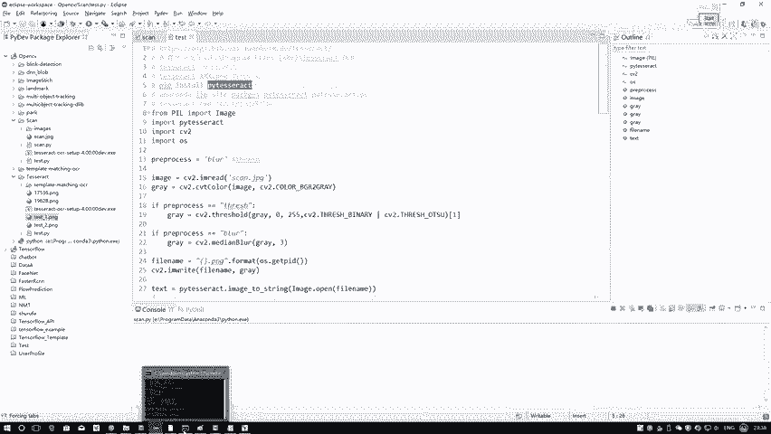

你配置了这个pip，你就在命令行里去装，如果说你有多个Python的情况下，你可以啊到咱们那个就是Python的一个路径，当中啊我一般都用anaconda去配置这个东西，你可以到你的安妮ca当中。

然后呢有多个Python，我这里相当于2。7，我有3。5，3。6，3。7我全有，对于不同工作来说，所以说啊就是到你当前的scripts文件夹当中，在这里边去pip store一下，你用哪个Python。

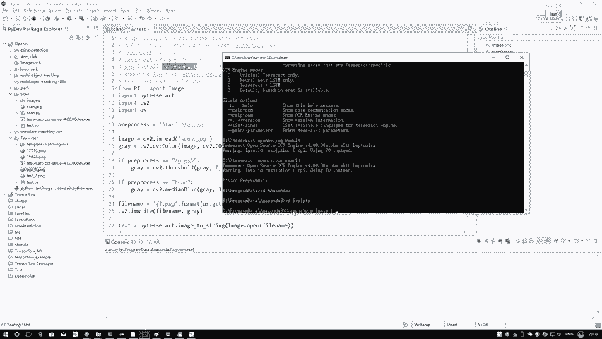