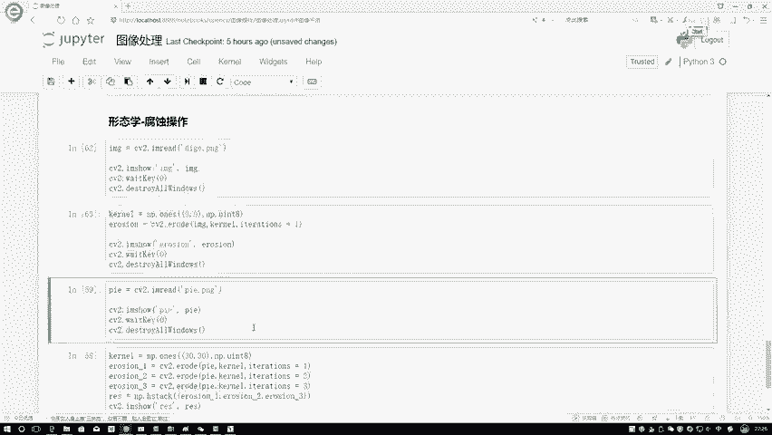
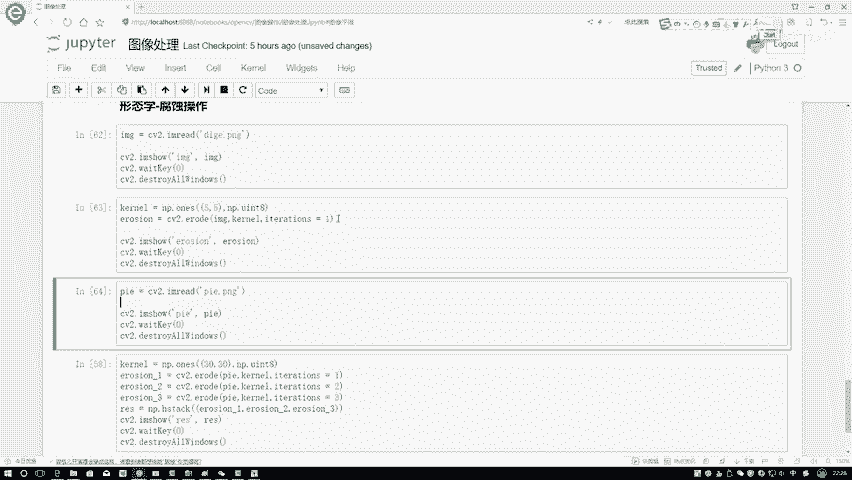
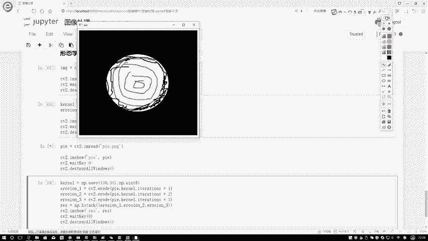
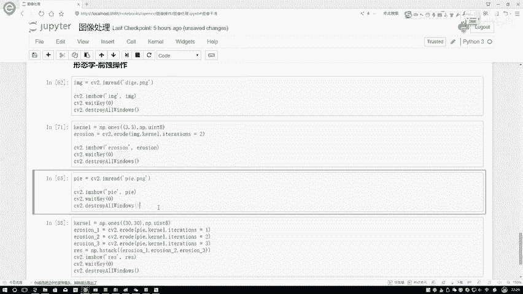
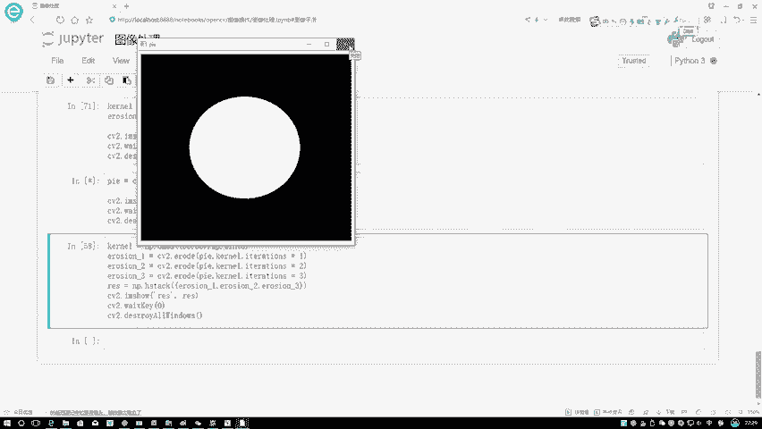
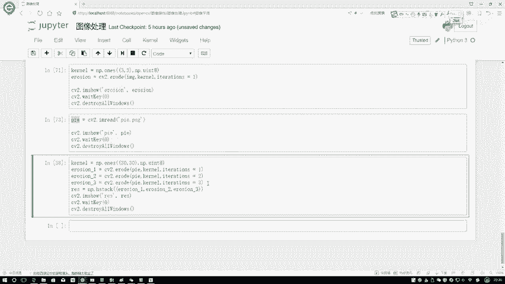
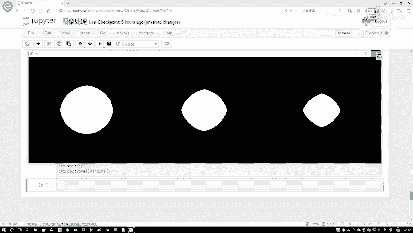

# 比刷剧还爽！【OpenCV+YOLO】终于有人能把OpenCV图像处理+YOLO目标检测讲的这么通俗易懂了!J建议收藏！（人工智能、深度学习、机器学习算法） - P3：1-腐蚀操作 - 迪哥的AI世界 - BV1hrUNYcENc

这节课呀咱们来说一下形态学当中啊，腐蚀操作是怎么一回事，这样咱们先给大家读进来一个图啊，看一看这个图啊，有没有什么特点，这块我通过CV two啊，imagine rate一下写了一个迪哥点PNG。

咱们来看一下，打开这个图啊，我们第一个感觉好像就是现在哎，在一个黑色的黑板上，用白色的笔写了一堆字，那也就是说我们腐蚀操作，通常情况下是有这样一个前提的，呃一般情况下我们拿到的一个数数据啊。

就是图像数据通常都是一个二值的，咱们来执行辅助操作是比较常见的，这里呢就是一个黑色的背景，还有呢白色的一个前景，相当于啊一个不就255吗，一个就是一个一，那这里啊大家是不是发现一个事儿。

你说迪格利亚字啊写的挺好的，其实但是下面怎么好像长角了，这一块有一堆须子出来了，那你说我现在想做一件事，我说啊现在我想把这些毛刺啊都给去掉，大家想一想，有没有什么方法能让我去去一下这个毛刺儿啊。

咱现在跟大家说的俯视操作，就能够完成这样一个事儿，我们先来看一下，就是这样，先给大家演示一下吧，就是咱们经过了一个腐蚀，操作完之后啊，它的结果是长什么样子，我们现在可以想一想什么叫做一个腐蚀啊。

是不是说啊本来这东西挺好的，我要给他侵犯一些东西啊，让他怎么样往里边缩一缩，好像这样一个事吧，再执行一下，看一下效果嗯，这样我用那个呃，首先啊在这里咱们先不看这KO吧，先说用哪个函数嗯。

CV two点有一个ERRO的函数，这个函数啊，我先把咱刚才写那个迪哥传进去，然后呢需要传进来一个盒，一会儿咱说盒是什么东西，这一块呢还需要指定一个迭代次数，这样咱们先来看一下结果，咱们来执行一下诶。

执行这个结果之后，我们发现一个事儿，原来啊在这里那么多毛刺儿，现在是不是说毛刺儿都没了，并且好像原来那个笔挺粗的，你看这里边的线条数变细了，我再来看一下，原来是这个啊。

原来是这个这里边的字条是不是挺粗的，还有毛刺啊，当我执行了一次腐蚀操作完之后啊，咱们再来看我的线条变细了，并且毛刺儿都没有了，这个就是腐蚀操作能够达到的一个效果，那大家可能想辅助操作光能去毛刺吗。

不是啊，在这里用下一张图啊，跟大家来解释一下嗯，咱们这个腐蚀操作啊，从原理上来说是怎么去做的，这一块我读进来了，另外一张图。

它是一个我写个PLE，就是这样一个圆圈在这里啊，通常我们都是，反正刚才我该说的都是拿二值数据嘛，零和一来进行，就是来进行测试的，这里我在这里还选一个卷积核，比如说我先选个盒吧。

它是一个3×3的这个卷积核啊，里边它不用有些数值，或者说它里边是什么值啊，其实上来说不是特别重要，我们暂时认为它里边都是一就得了，这就是111，然后这也是111，下面也是三个一，这样我们现在拿到一个盒。

这是3×3的一个大小啊，然后啊对于这个和我们现在要做一件事了，比如说现在我在圆圈里边，圆圈里啊，我对于这个点来说我要怎么办，我要看它周围3×3的一个区域吧，我一给它框起来。

那周围的区域它是不是也是一个白色的，或者说它的像素点的值，是不是也是255啊，它不是一个零吧，在这里那这个位置它就不用去变，那假如说到这个位置，这个位置我在一框的时候发生了一些事情，有些值它是零。

有些值255，或者说有的是黑的，有的是白的，诶你看周围点确实这样一件事吧，如果说啊它发生这样一件事的时候，我就会把这个点怎么样，我就会把这个点给它腐蚀掉，腐蚀掉相当于什么意思啊，你看怎么叫腐蚀啊。

是不是说一开始里边有白色的，相当于是正常的，比如一个苹果吧，苹果要被细菌吃掉了，吃掉它是不是要变成一个黑色了，在这里我就需要此时把这个点置于一个黑色，原来大家来想，你说这个点它都要是都能被腐蚀掉。

那比它要更外层的点，我再往再往它外面点一点，那是不是说只要这个点能被腐蚀掉，再比它还靠边儿的，那更能被腐蚀掉啊，那也就是说我这整个边界，就是我可能在这里画一个圈儿。

这一个圈上的所有东西可能都要被腐蚀掉吧，大概这样一个事儿，那一会儿咱就来看一下，现在我要对这个圆诶做一个腐蚀操作，才能得到结果是长什么样子。

这里这样在这里啊，不光给大家演演示一个腐蚀操作。

还给大家演示一下，就是我有一个迭代次数，还是拿这个图来看吧，你说我可以做第一次腐蚀，第一次腐蚀，假如这样第一次腐蚀啊，比如在这里我说我把这一个圈的都腐蚀掉了，那是不是说现在此时这一个圈的。

它就都变成一个黑色了，这相当于就是我完成了第一次腐蚀吧，那完成第一次腐蚀之后，我再对这张图像我执行第二次腐蚀可不可以啊，你在执行第二次腐蚀的时候，是不是说它又要该往里进行缩缩了，那还有第三次腐蚀。

第四次腐蚀是不是都能去做这样一个事啊，在这里给大家演示一下，就是嗯咱们这个辅助操作。

如果说改变一下叠次数才能达到的一个效果，在这里这样咱先看第一个这个吧，我把这个东西改成二，再来看哦，这这这这个图没关，我就把这个图关上，这得重新执行一下，改成个二，你看他是不是说什么更细了吧。

线条二都快给我腐蚀没了，那我感觉改改成个三，那个歌那个字可能就要没了，你看改成了三，基本就没剩什么了吧，这个就跟大家说了一下我们的一个迭代次数啊，它的一个作用，那这一块你不光叠加次数。

你还有它的一个核吧，你改成一个3×3的，你看同样是两次两次，它改成了3×3的，是不是说它的线条还是比较明显的，还有这个东西啊，因为3×3内核比较小，它呢可能腐蚀就是被腐蚀的可能性，是不是变小了。

就是这个意思。

在这里你说你指定一个盒儿，你指定的这个盒越大，你看这么大的一个盒，可能到在这个点这么大的一个核，那这个点可能都腐蚀掉了，那如果说小一点的核呢，它有可能没被腐蚀掉吧，这里啊就给大家演示了一下，呃。

我们不同的一个盒大小对结果影响，然后这里咱做这样一个实验啊，还是啊对于我这个派图来说，在这里我要对它执行三次腐蚀。

相当于呃原始输入图像都是这个派读进来，这个P然后呢我第一次腐蚀啊，是只连一次，第二次两次，第三次三次，再来看一下它整体的一个效果长什么样子。

这回啊就是我三次腐蚀完，结果这个是电次数I等于一，这个是你I等于二，这个是你I等于三，大家可以看出来，就是你腐蚀次数越多，是不是说它变的感觉会越小啊，这里啊就给大家先说了一下。

我们在啊就是open CV当中啊，形态学当中第一个操作。

一个腐蚀操作能达到的一个效果。