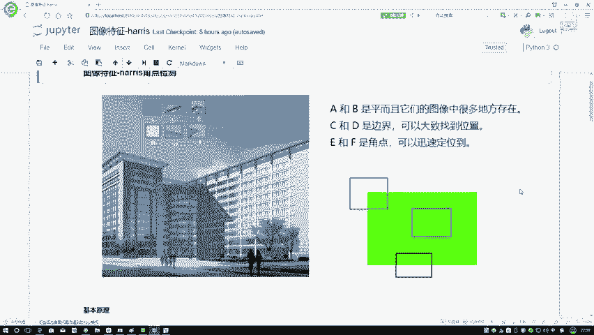
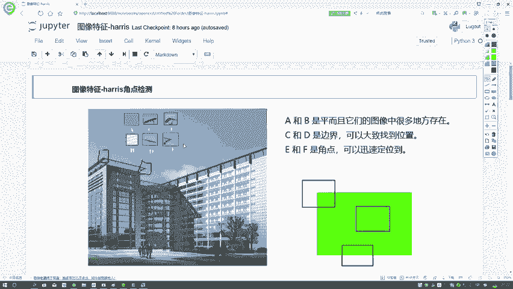
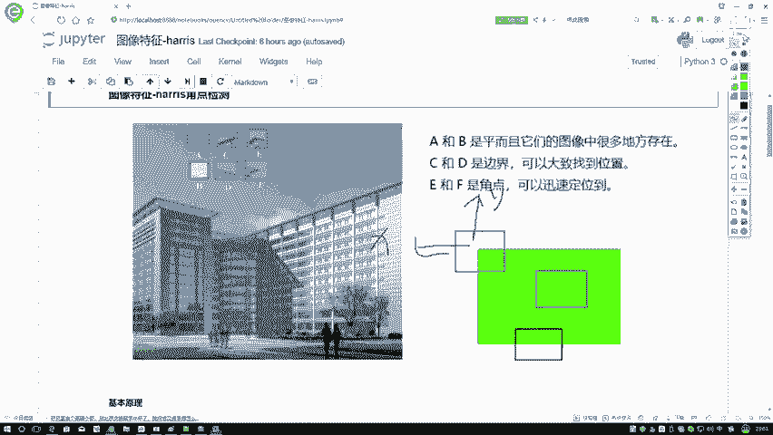
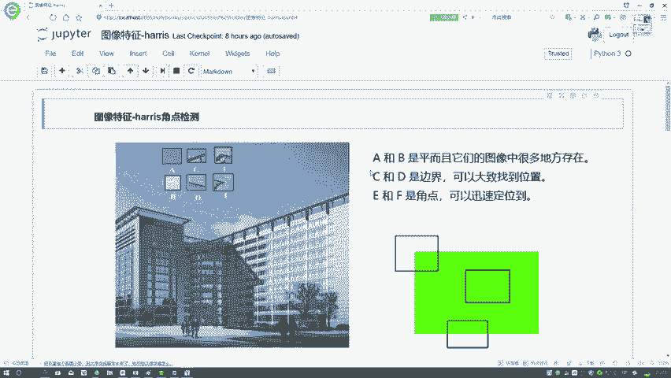
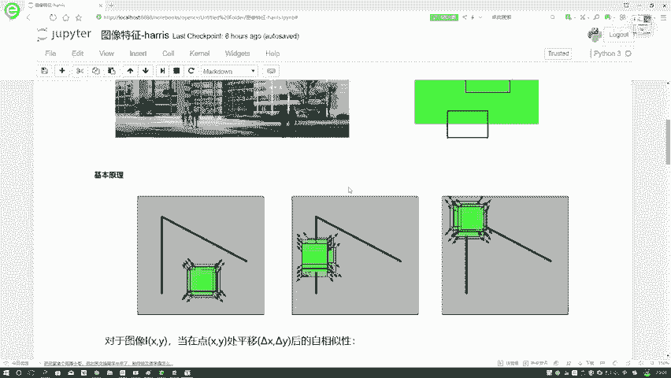
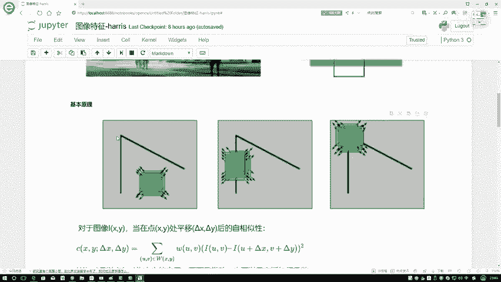
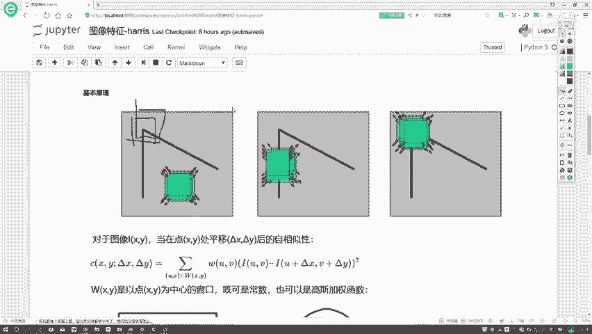

# P41：1-角点检测基本原理 - 迪哥的AI世界 - BV1hrUNYcENc

这节课呀，咱们来说一下在图像特征当中的HARRIS角点检测，首先我们第一个问题，什么叫做焦点呢，我们先来啊看左边这张图，这张图啊，如果说我问大家诶，大家第一印象是什么，可能有些同学哎呀说的是蓝天。

有同学说的是楼，那我估计大家关注点是不是，应该是蓝天和楼之间的这样一个交界啊，另外这里你看这个东西哎，看起来凸出来了，为什么它是凸出来的，因为上面是一个东西，下面是个东西，感觉它是一个边界，是不是。

并且它不光是个边界，还是什么东西啊，还是一个角吧，你看这里，我画出几个角，这是一个角，那这也是一个角，然后这块这样咱就先暂时画两个角吧，这样挺明显的，那我们来观察一下这个角啊，它有什么样的一个特点。

哎大家来想一想，你说你把这张就是我现在框起来这个圈啊，你说你把这个圈，我沿着无论是水平还是还是一个竖直方向，进行移动的时候，我们得到的一个结果是会发生变化，而且你说这个变化明不明显，应该是特别明显吧。

那此时我再给大家说另外一个东西，哎我说你出来这一块，我再圈一个圈，同样是就是同样是33的大小吧，这个圈来说，你对它进行X和Y的移动的时候，你说的变化明显吗，就不太明显吧，那我们所谓的焦点是什么。

我们所谓的角点就这个意思，无论啊你是沿着水平方向还是竖直方向，在进行移动过程当中，我整个图像如果说咱拿灰度图来说，它的一个灰度级应该怎么样了，发生一些变化吧，并且这个变化是一个缓慢的还是一个迅速的。

应该是一个迅速的吧，在这里啊我们就给大家啊说一下，在图案当中啊，我们基本上分成三个部分，第一个部分呃，第一个部分，比如说这个A这个A在这里，我画这一块，它是什么意思啊，你看这个A啊。

他是不是说它自身在这块也不是边边角角的，就在中间的某个区域吧，对蓝天的中间某一个区域，那这一块呢对于这个B来说也是同样的吧，也是在中间也不是边边角角的，那这回我再画一个，我说啊这个东西它是一个C。

大家来观察一下这个C啊，跟这个A肯定有点不同，因为首先C它描述是什么，上面是蓝天，下面是这个楼，所以说对于C来说，它是不是一个边界呀，我们边界该怎么定义边界，你可以这么小，哎为什么说它是个边界。

而不是一个角点呢，在这里你想它沿着X轴在变化的时候，你说的变化明显吗，好像来说没有什么太大的事吧，那你看如果说我沿着Y轴再进行，就是你就水平数值也一样的水平和数值吧，沿沿着一个水平的变化不大。

沿着这个数值的时候呢，变化挺大的吧，此时啊我就说如果说啊有这样的一个区域，它沿着水平或者是竖直区域，一个比较平稳，一个比较迅速，那它就是一个边界，在这里我们就要两点了，一个是我们的平面，像我刚说的A啊。

还有这个B就是我们平面，这个C它就是一个边界，在这里这它不也是一个边界吗，D然后呢什么时候角点向外画的，在这里我这一块它是个角点，因为就像我最开始说的，无论你是沿着水平还是竖直的变化，都比较明显吧。

这就是一个焦点，我们在这个HARRIS检验检测当中啊，你说大家现在目的是什么，肯定就要找出来哪些是角点吧，为什么要找角点，因为角点它的特征更丰富一些吧，不像平面，你移动它可能不会发生变化。

也不让边界沿着一个轴方向，它也是不变的，所以说啊角点它更具特性。

我们现在要做的就是怎么样把角点给它找出来，在这里呢右边这张图当中也是一样的，到时候大家给自己看一下，实际就是角点沿着X沿着Y，你看这里白色的是一个区域，绿色的是一个区域。

在这里无论X沿Y我图像的一个灰度，它的变化情况是不是比较迅速啊，这个就是我的一个焦点该怎么样进行定义。

那行了，跟大家说，基本说了一下我们的一个角点啊，是长什么样子，以及呢我们该怎样进行一个就是判断啊，但是我们刚才说的判断是什么，我说啊是让大家用肉眼去判断，很简单，一打眼就能看到吧。

接下来我们要做的就是在计算机眼中，它怎么样识别出来啊。

一个东西它是一个焦点，那你是不是得给计算机告诉一下角点诶，它的一个公式应该长什么样子，我们该怎样进行计算啊，所以说我们接下来要做的任务，可能稍微有点枯燥哈，但是也是必经那条路。

要大家说一说在数学上我们怎么去做的，其实啊你说让计算机做判断，你给他一个数学公式不就完事了吗。

接下来我们讲一下heroes，九点检测当中必备的一些数学的基础知识点。

首先我们先来看第一个事儿，当我的一个什么，当诶我不论是你的一个平面还是你的一个边界，还是你角点，当我在进行一个移动的时候，你看这块我进行移动了吧，无论沿着什么方向进行移动，当我移动的过程当中。

是不是说它的灰度级诶，像我刚才说的灰度会发生一些变化啊，如果说一个平面你在进行移动的过程当中，是不是说它的灰度基本保持不变的，如果说一个边界在移动过程当中，一个轴保持是不变。

就是这个比如说这个Y轴保持的数不变，X轴表示的就是剧烈的变化，然后呢在我角点X和Y都是剧烈变化吧，所以啊你想大家接下来我们要怎么判断啊，就判断一下，当我这张图像，比如一开始在这个位置哦。

这这这这点没地方画，一开始这个位置吧，下一次我移动到了这样一个位置之后，我的一个灰度级，它的一个变化情况会是什么样的，有两方面，一个是看X轴，一个是看Y轴行了，那现在已经跟大家说了一下。

我们基本的一个目标长什么样子，接下来我们就要想在数学上。

