# P42：2-基本数学原理 - 迪哥的AI世界 - BV1hrUNYcENc

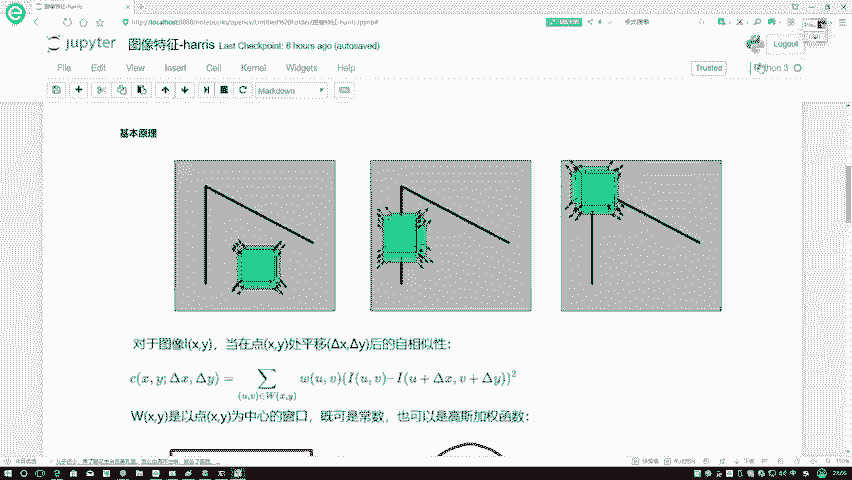

在这里我们直接来看吧，对于一个图像来说，这一块用I来表示它的一个灰度级啊，这个X它XYX大家可以这么小，首先我拿到什么，哎这个东西我一圈起来，我说我不一圈吧，这是一个框是吧，我一框起来之后。

它不是一个点吧，而是什么，而是一个区域吧，我就假设说吧，我说这是一个3×3的区域，3×3的区域当中一共是不是有九个点，那你想当你在移动过程当中，比如第一次在这儿，那下一次他跑上面去了。

下一次上一次就是你在滑动过程当中，你这次圈显示九个点，下次你圈起来是不是另外九个点啊，比如这个意思，第一次是X1X2点点点，一张X9行吧，那第二次呢，第二次我可以是一个Z1Z2点点点点，一直到Z9吧。

我比较是什么，比较的是它们的一个灰度的一个变化情况吧，所以说应该什么法，应该是一个减法操作吧，并且是不是对应位置对应去做呀，这个就是我们该怎么样进行滑动，那行了。

我要把我刚才那句话现在总结成一个数学公式，我们来看一下，在这里我们说对于图像，对于图像我们可以这样，就对于这样的一个小区域来说啊，X和Y它是个小区域，当我这个区域啊，这里我们就把XY相当区域啊。

把这个区域啊进行了一个平移之后，假设说啊给它进行了一个平移，平移完之后，我要看原来诶它这个灰度是等于多少，现在它的灰度是等于多少，说白了去判断一下我平移前后，它的一个自相似性啊。

有没有发生一个什么样的变化，就是我要去做的一件事，那再来看吧，在这里我用C啊，来去当做我最终啊，它的一个灰度变化的一个情况，然后这块啊我们刚才是不是说XY哎它是什么，这样的一个区域啊。

那我是不是要对区域当中每一个点进行判断啊，所以说在这里你看我做了这样一个什么事，求和吧，我说啊这个U还有这个V是它是什么，属于哎属于什么的，属于啊我这个窗口当中的，对于窗口当中的每一个点都要去做计算。

然后呢咱啊这W先不看吧，先看右边这个式子，右边式子IUV，哎这个UV什么意思啊，当前的第一个点吧，或者是当前某一个点假设吧，在这块用蓝色的话假设啊，就是当前这样一个典型吧，下次平移完它。

比如假如说编到这了，IUV表示当前这个蓝色这个点，那对于这个当前这个点我要判断谁呀，它经过平移变换后的一个结果吧，所以说啊U加上德塔X什么，所以说U是我的一个横坐标V呢，它是我纵坐标加德尔塔X。

加德尔塔Y分别表示着是我经过了啊，我往左或者往右还，然后和一个往上往下啊这样一个意思，所以说啊这LOV是原来的一个灰度值，IU加德尔塔XV，加德尔塔X是我平移变换后它的一个灰度值。

做减法是看我经过了这样一次操作之后，哎我得到的一个差异是有多大的，那你这里啊可能发生这样一件事，就是你不同第一个德尔塔X和德尔塔Y，你得到的结果肯定也不一样吧，那有时候你灰度级是上升的。

有时候你灰度级是下降的，我们需要看的是什么，看的是变化的一个趋势吧，所以说在这里啊，你说给我个负数有用吗，我不需要个负数，在这里我又做了一个平方向，相当于要把结果又进行了一个呃，就进行了扩大吧。

以及我给它全变成一个正数，比较的是它变化的一个浮动啊，这样一个意思，那行了，咱们说完了，这个就是这个减法，就是平移前后啊，它的一个变化结果，然后呢前面这个W什么意思啊，咱刚才是不是说这样一个窗口啊。

啊那大家来想一想，你说这个窗口，我要同等的去对待每一个像素点吗，应该不是吧，错误当中我可能更关注的是一个中心点吧，所以说啊这个WUV啊，你可以想象成什么，想象成诶他是这样，首先他这个W。

它的窗口大小跟你平移窗口大小是一样的吧，这里边你就可以当成这个东西吧，比如说呃它是一个高斯的一个权重，可以吧，在这里高权重可能这样，它就是一个121，然后比如这块它是二，这款是二，这也是二。

这是个114，可以吧，这个不就是高次项的一个权重吗，所以说在这里啊，我们还可以对窗口加上权重项，权重项表示着就是哪个点，它对最终结果影响比较大，哪个点对最终结果影最终结果影响比较小吧，所以说啊。

这个U这个WUV和你这个IUV，窗口大小是一模一样的，这样我们就完成第一步定义啊，先做了一下，我原来是等于什么平移变换之后，哎我的一个差异，或者说我的一个变化幅度，它是长什么样子的。

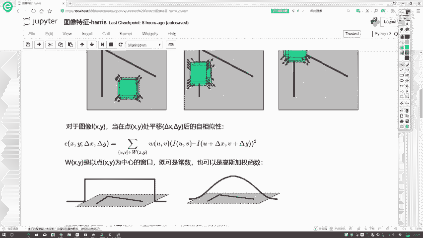

对于W这个窗口，到时大家可以自己选，你可以选择是一个常数值也行，那个常数值窗口，比如说像这个窗口当中一个33的，那全是一不就完事了吗，一个常数值表示大家都是相同的，或者是像右边这张图一样。

它也可以是一个高斯窗口吧，这个都行啊，但是一般但是通常情况下，我们一般情况下都是用一个高斯加权啊。

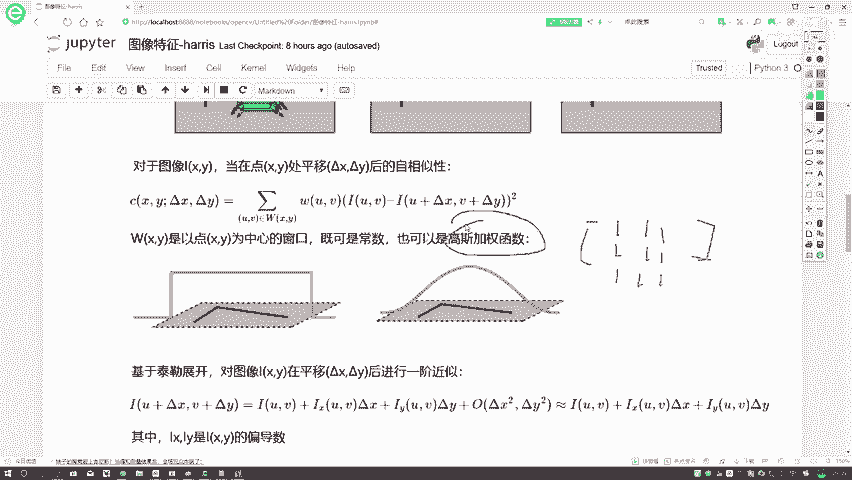

来去做的，然后咱接着来看这一步，我现在做完了，那我问大家这一步怎么解啊，其实就是这个东西解啊，难点在哪啊，难点其实在于我右边这个东西。

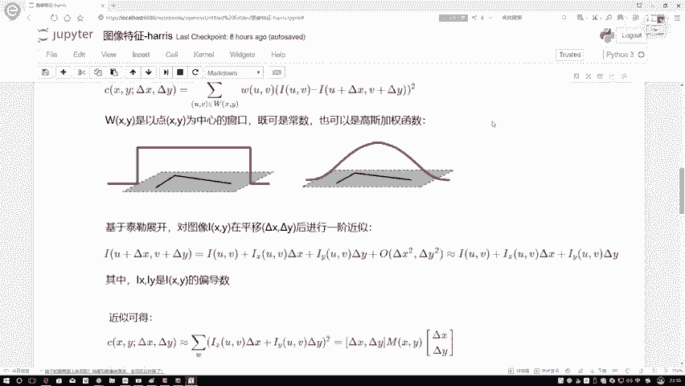

U加德尔塔XV也加德尔塔X啊，这个东西嗯不太好展开，是不是我们现在要把这个东西做一个化简了，那我问大家，大家如果说就是你不去看我下面公式啊，你想一想，你现在看一看啊，这个U加德尔塔X相当于什么。

唉我们什么时候会出现德尔塔X这个东西啊，什么时候又会出现德尔塔Y这个东西啊，嘶可能大家一说哎求极限的时候是吧，还有一个什么时候求一个什么，我们可以进行一个泰勒展开吧，当我认为啊。

这个德尔塔X和德尔塔Y它是相对较小的时候，通常情况下也真的就是在平移过程当中，也是真是相对较小，但是啊图像当中你说你再小能约等于零吗，不能吧，你起码得过一一个格吧，在这里我就假设德尔塔X和德尔塔Y。

它都是比较小的时候，那当你这个德尔塔X德尔塔Y比较小的时候，我可以啊，对我当前框且这个式子做什么泰勒展开吧，它要展开用什么。

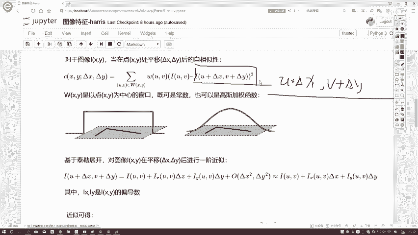

哎是用我的一个呃，在这直谁给大家看吧，咱拿下面这事来讲，我对我这个式子，就是U加德尔塔X和V加德尔塔Y，进行泰勒展开，可以吧，等于什么了，我们来看一下，首先哎，如果说你对这个U加德尔塔X进行泰勒展开。

它等于什么，他首先会算一下我当前啊这个IUV是吧，从哪个点开始，从UV这个点开始吧，只不过说哎U加了个德尔塔XV也加德尔塔X，首先我按照泰勒展开公式，我先把这个IUV应该拿出来吧，然后第二步呢。

第二步我沿的是不是一个X方向是吧，是德尔塔X是吧，X方向，那你说这个式子我在X方向进行移动，那我是不是应该对X去求偏导啊，在这里加上什么LTX两个公式，是不是说我的一个I应该对X求一个偏导，再乘上什么。

再乘上一个德尔塔X吧，这是个乘法是吧，那一般情况下就是这个呃I对X求偏导，我们减去可以减小，直接写简写成一个I小X就可以了，在这里就是这个符号表示，我对一个X求一个偏导。

这就是泰勒展开啊最基本的一个定义啊，如果大家对这个不熟悉啊，可以先了解一下我这个数学课程，或者说自己看一下书，找找张定义啊，知道这么事就行了，然后呢接下来展开，接下来在展开过程当中，你看下一项是什么。

就是还有一个V加德尔塔，这V加德尔塔Y吧，那是不一样啊，这个V就是这个这个德尔塔Y啊，那是不是我X这个I应该对谁求偏导，对Y求偏导，乘上谁啊，乘上德尔塔Y吧，然后后面我还应该加什么。

加上一个无穷小的一项吧，在这里我就把后面这项怎么样了，暂时认为它约等于零了，不约等于零，也没个算了是吧，要加这个东西，暂时认为后面这个东西它是无穷小，约等于零就得了，那现在我得到了这样一个式子。

得到这个式子之后，我们来看一下，首先我问大家一个事啊，为什么我要做个泰勒展开，肯定要做化简吧。

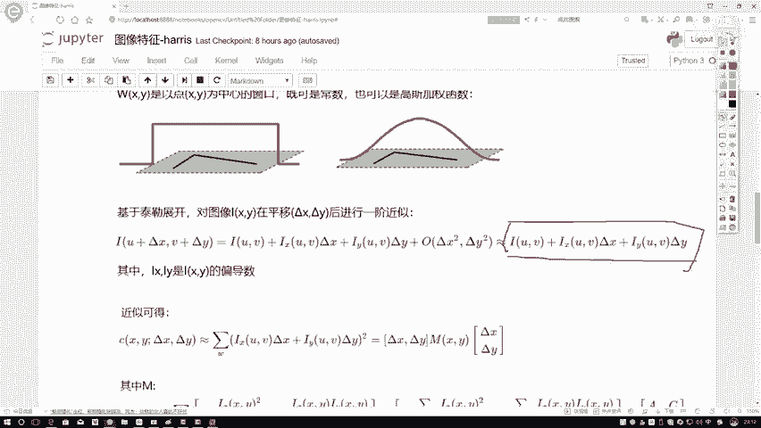

那此时怎么它就能化简了，注意点前面这个东西它是什么，是一个IUV是吧，这一块有什么，是不是也有个IUV表示灰度值啊，这什么法减法吧，当我这个东西你看这个东西是什么，德尔塔U加德尔塔XV加德尔塔Y8。

是不是这个后面这个东西，我它也有一个IUV，这个东西减去它自身是不是就约掉了呀，后面虽然说你一个减法这东西正常情况下，你个减法要怎么样全变负号的吧，但不要忘记这是平方项，我把这个一提出来。

一个平方向等于正一了，所以我用一个加法来表示，是不是也一样的，那这里我就得到了当前的一个结果，在这里啊，我把这个式子直接啊进行了，就是进行一个泰勒展开，只不过说大家注意点啊。

就是在这里我们进行站泰勒展开，进行一个一阶泰勒展开就足够了，因为有目的，我是把它这玩意约定，你给我进行一个二阶三阶的，那是你自己给自己找麻烦了，我不需要了，在这里直接进行一个一阶展开就完事了。

我就得到了当前一个结果。

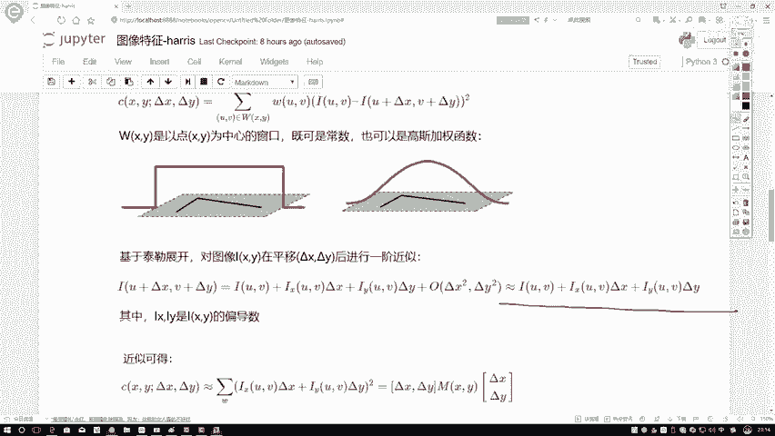

得到当前结果之后，我们来看上面这个式子为一，减完之后，是不是这个东西就没有了，只剩下什么了，只剩下我右边的这个式子了，那行了，现在就是我当前结果大家也看了，只剩下右边这个东西了吧。

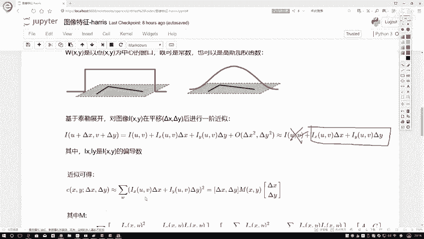

那行我把这个东西拿过来，但是啊大家不要忘记啊，还有什么，还有这块有平方向吧。

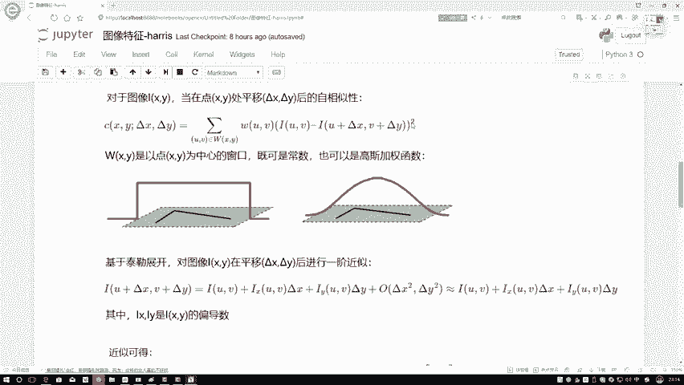

所以说此时平方向我是不是照样落下来了，还有什么要落下来。

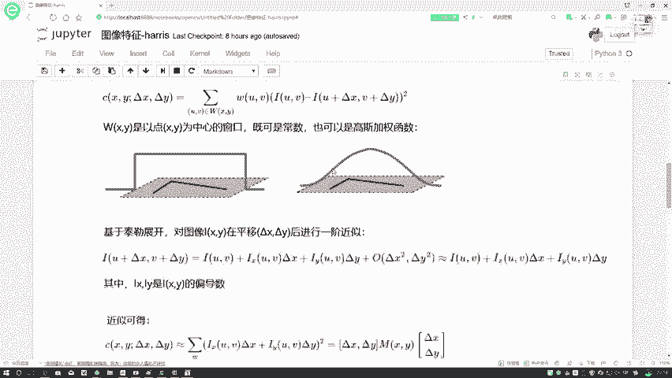

你看这个东西，你刚才无论做什么展开，那是括号里边的事，我外面这个权重项你是不是得给我落下来啊。

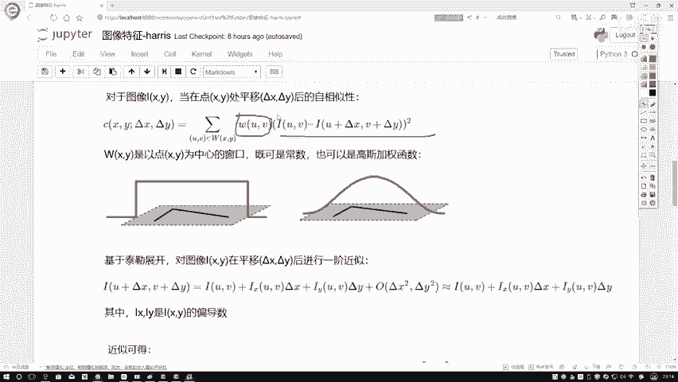

所以说此时哎我这个式子变了，我这个权重项哎，权重项在哪了，我的一个权重项啊，一会儿咱们这里会看到权重项，我是放到我的一个矩阵当中了啊，这块有咱们的一个权重项，这里为了简单起见。

我们就先不去写咱当前的每一个权重项。

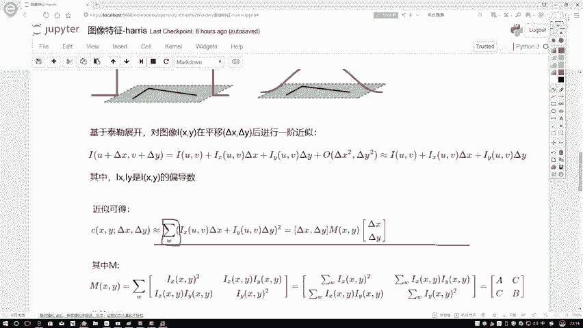

这个值了，暂时认为它都是一就可以了，然后呢在这里我们进行了一个近似，近似完之后呢，我可以把这个式子给它再进行一个化简，再进行化简，我给它转换成矩阵的一个形式呃，为什么转换成矩阵形式啊。

可能大家一定一方面觉着，他是为了你表达起来方便，其实啊我们转换成矩阵形式是为了一会儿啊。

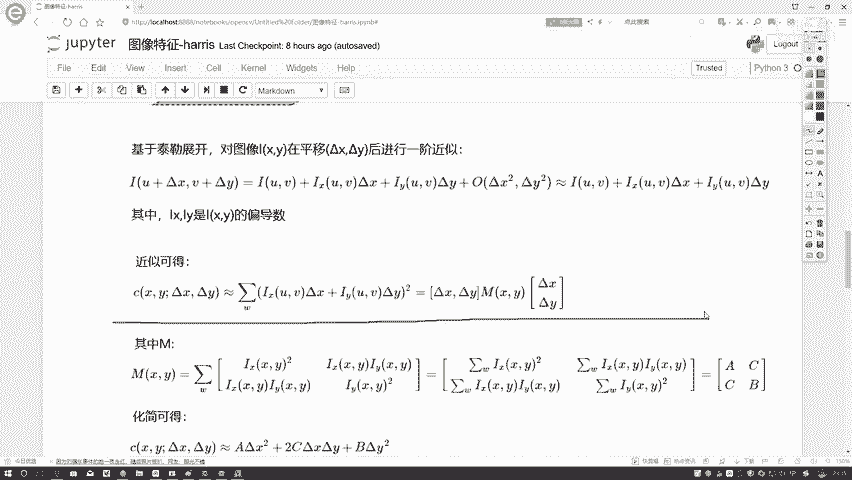