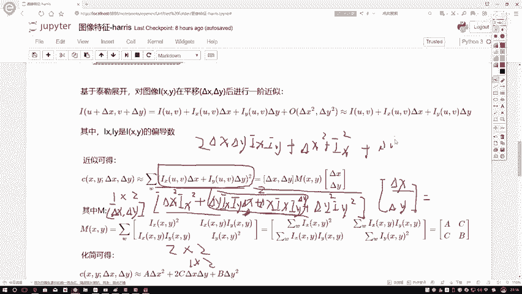
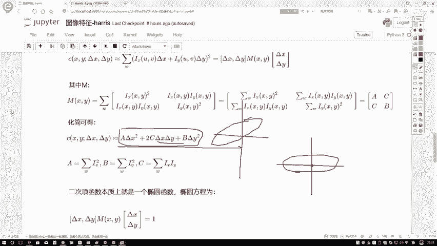
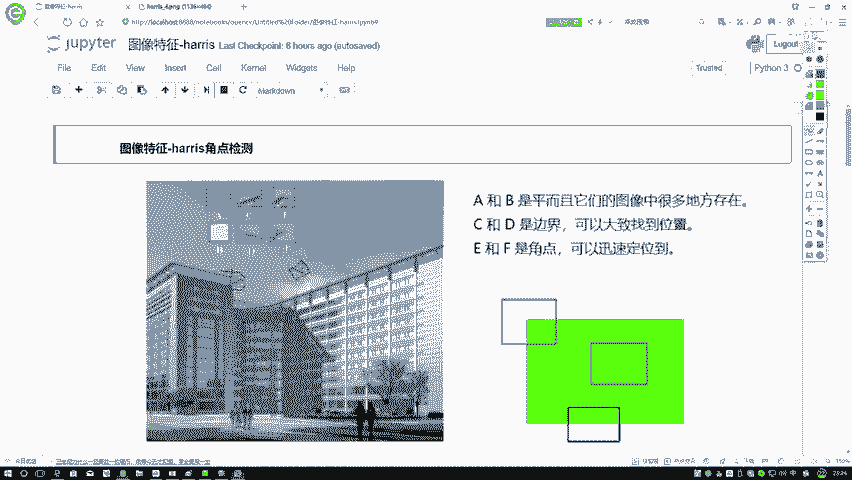
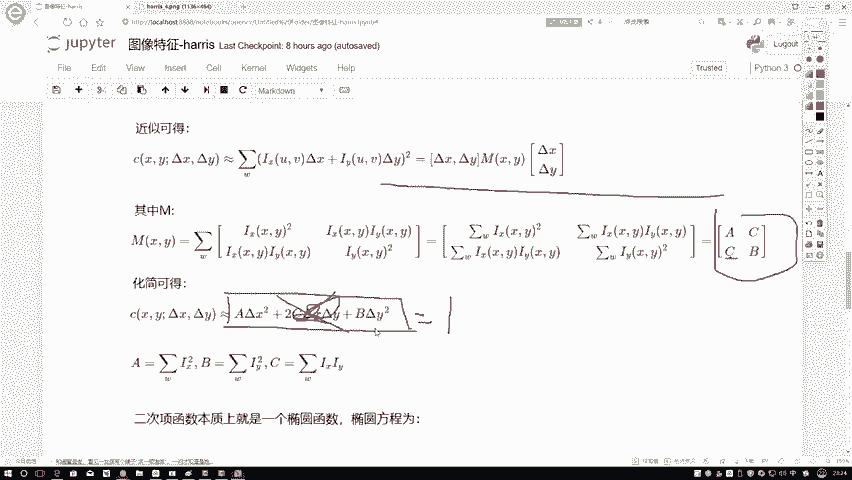

# 比刷剧还爽！【OpenCV+YOLO】终于有人能把OpenCV图像处理+YOLO目标检测讲的这么通俗易懂了!J建议收藏！（人工智能、深度学习、机器学习算法） - P43：3-求解化简 - 迪哥的AI世界 - BV1hrUNYcENc

这样我们先给大家来看一下，它为什么能做这样一个转换，我说现在我把这个式子给他提一下，提什么，在这里边，我需要把德尔塔X和德尔塔Y给它提出来，这是我第一个我要提的东西，然后呢除了德尔塔X和德尔塔Y之后。

还剩下什么了，你看在这个式子当中，我们来看刚才那个式子，你剪完之后，它是不是还有IXX，还有一个IY啊，所以说我要给它转换成德尔塔X，德尔塔Y把它写出来，以及呢IXIY就是德尔塔X，德尔塔Y他写作一组。

xi y写作一组，那我们来看一下，在这一块，咱直接先来看，我说我第一个M它是个矩阵，我先把这个矩阵给定义出来，然后呢再来看一下这个式子，这样做一个转换到底是不是成立的，我左边乘的什么。

左边乘的是一个德尔塔X和一个德尔塔Y吧，咱给它还原一下，看一看当前这个式子，它能不能给它还原成我最原始表达式，这样一个形式就是最开始就是这个形式吧，看咱能不能还原回去啊，再来证明一下，在这里再来看吧。

这是什么，这是一个一行两列的1×2的矩阵，这是什么，这是一个2×2的矩阵，得完之后等于什么，还是个1×2的矩阵吧，来算吧，第一行乘第一列等于第一个值吧，第一行乘第一列，这一块就是一个德尔塔X。

我就直接写XXX了，我不写它后面的平方项了，德尔塔X乘X平方向没问题吧，然后呢，下面下面这个东西是什么，德第一行乘第一列，下面是个德尔塔Y，德尔塔Y乘上一个什么，注意一点IXIY吧。

在这里我写个IXIY哎，在这里大家可以想一想X和YY飞为什么东西啊，咱以前是不是说过那个索贝尔因子手表因子啊，缩表算子是不是那这个东西啊，不就咱索贝尔算子当中X的梯度，Y的梯度嘛，就是同样一个事啊。

咱一会就能用上了，然后这一块咱接着展开，这是第一行，然后逗号吧，要写什么第二列了吧，就是一行两列的嘛，这是第一，这是第一列，这是第二列，第二列，德尔塔X德尔塔Y这一块再乘上一个德尔塔X。

是不是德尔塔X乘上一个IIX，再乘上一个IY，然后呢，右边这是加什么德尔塔Y乘上一个IY方吧，加德尔塔Y再乘上一个IY的一个平方啊，这步我算完了，这一步算完之后，这是一个1×2的矩阵。

接下来我再乘上一个什么2×1的一个矩阵，得到一个值吧，咱看一看这一步我转换完之后，能不能够得到我前面化简完的，当前这个式子来看吧，第一行乘第一列是吧，那就那也就是它乘上一个德尔塔X呗。

它折它是德德尔塔X，这是德尔塔X平方，我在这里写了，这是德尔塔X平方，这一块加上一个德尔塔X吧，然后这块变成一个加法吧，逗号就没了，变成加法的时候，这块乘德尔塔Y吧，那德尔塔Y这块加平方。

德尔塔Y这一块再加，再就是左边这项再乘一个德尔塔Y吧，此时德尔塔XXIY，德尔塔Y德尔塔YIXIY，德尔塔X，我是不是可以给它画成一项是吧，你看都是一样的吗，这个东西我把它俩画成一项。

这不就是一个二倍的吗，行吧，二倍的拿过来，德尔塔X1个德尔塔YIXIY，有了左边什么德尔塔X的平方，再加上一个IX平方吧，右边这个东西德尔塔Y平方加上Y的平方。

加上一个就是IY的平方吧，那我们来看一下这个式子和我上面这个式子，如果说平方向展开是不是一模一样的，是一模一样的吧，所以说此时哎我为了咱当前这个式子化简起来，方便一些，我把当前式子怎么办。

用了一个M矩阵进行了一个近似代替吧，不是近似代替恒等变换吧，这是恒等变换吧，所以说啊这一块我的一个矩阵给他算出来了，算出来矩阵之后，这一块什么要求一个就是求所有的吧，你在求所有的过程当中。

你在外面去求跟我在里边是不是一模一样的，在这里我可以把这个M矩阵重新的定义一下，大家可以观察一下这M矩阵有什么特点，咱刚才看了这两项是不是相哎，注意不，这这这这两项不是相同的。

不是这两项这两项它是不是相同的，相同的吧，所以说用字母来代替一下，为了咱观察方便，我说这一项我用C来代替了，那它是不是也是C啊，我说这是个A，这是个B行吧，来得到这样一个矩阵。

那我问大家这个矩阵它是个什么矩阵，首先第一点对角线ab没问题吧，非对角线它是个对称的，都是C吧，这是什么，这是一个实对称阵吧，一个N行N列的，两行两列的吧，N行N列的实对称阵，或者说你叫这个二次型也行。

他一定能够怎么样，一定能够找到N个单位，就是N个单位特征向量使得咱当前的这个什么，这个就是一个就是一个实对称阵，能进行一个对角化操作吧，可能啊刚才我说那话比较长，我再我再捋一下，再给大家一句话概括一下。

就是对于咱现在拿到这样一个N2ND，它使对称矩阵，我可以对它进行个对角化，什么叫对角化，就相当于怎么说呢，对角化你就当做一个标准化操作得了，对矩阵来说，我当我做完之后，我能得到这样一个东西。

它只有主对角建设有值，除了主对角线上它就没有值了，主对角线上值什么是它的特征值吧，所以这里我写了兰特一兰姆达二啊，这个意思大家先知道有这么个事儿啊，一会儿咱要用这个定义。

如果说以前你没听过什么实对称阵能做对角化，可以翻一下，简单翻译一下咱那个线性代数书啊，这个东西我实在没法解释，因为它就是一个定理而已啊，但我建议大家就是怎么样，你对这个东西通俗理解就行了。

知道数学的定理，它有啊就完事了，也不用啊，非要这么较真，如果说咱们想就是全部看一遍，还得啊把咱们的那个线性代数书啊，就是自己上大学学那个东西，翻出来瞅一眼就得了，来看当前这个式子。

如果说我说这一块它是有这样一个式子，那对于这个式子，我现在我不用你里边你给我写这么复杂一堆了，你给我写这么复杂一堆，说实在的，我看着也挺闹心的，你用ABC来给我做近似的代替了，再来看吧，在这个这这里吧。

如果说这是哎哪去了，就这一块，我把这个M现在用一个ACCB来代替，我，把这个式子给它展开一下，可以吧，展开这个式子，不由咱咱不去，咱不去看了，直接给大家看，结果得了，在这一块直接给他展开了，很简单吧。

这个式子到时候大家自己做一下展开哦，展开完之后等于二倍A倍的德尔塔X平方，加上一个2C倍德尔塔X，德尔塔Y，再加上一个B倍的一个德尔塔Y的一个平方，都问大家一个事儿啊，你说这个东西你看起来像什么。

哎这个东西你看起来像什么，呃，如果说大家看不出来没关系啊，反正我第一次去知道这个算法的时候，我看人家那个论文写的，我也看不出来这是什么，后来听了一些比较牛的人的一个解释，我发现啊确实是这么个事儿。

来给大家说这样一个东西，以前大家上高中的时候学没学过这个东西，X方比A方加上一个Y方，比上一个B方等于一，哎都知道这个式子吧，它是什么，它是一个椭圆吧，不是一个圆吧，在这里哎。

我们现在知道了一个椭圆的一个表达式，那你看这个式子它像不像是一个椭圆表达式，挺像的吧，哎可能大家说哎你这人就等于一的，你这东西没有等于一，反正这东西什么哎这个东西结果值它是C值吧，C值是什么。

不就是我最终我说我想要的那个，它的一个变化的一个值嘛，灰度值的变化情况吧，那你说我们现在我做个等高线，或者说我暂时吧，我就假设认为它等于一行不行，可以吧，所以说在这里我们就可以认为。

现在啊我是有这样一个椭圆，这里啊就得化发挥一下大家的一个想象力了，你可以想象一下，我现在有个椭圆，然后然后呢就是可可以，这这这这假设这么个事吧，其实可能啊这个说的不太严谨，但是你就假设这么个事。

得了X和一个Y，然后有这样一个Z现在有个椭圆，这个椭圆二可以怎么样，随着X和Y的变化，它的大小也在发生变化吧，在这里我可以先取一个一，就是这个等于一的它这样一个等高线吧，所以说我暂时我就可以认为X方。

就是当前这个式子，暂时认为它等于一就得了啊，咱们做这样一个假设，你就当做假设吧，别别提那些等高线的东西了，可能就是大家以前哦如果说没学过这个东西啊，可能理解起来有点抽象，假设说啊这个东西能等于一个一。

那是不是说这个它就是个椭圆了，只不过说哎咱那个椭圆X方比上一个A方，加Y方比B方等于一，好像没有一个X和Y乘在一起，那你这个椭圆是这个样子的是吧，哎他是比较标准的，这是原点吧。

所以说咱现在得到这个椭圆它是什么，它不是一个标准的，那可能是这个样子的可能吧，所以说啊咱现在得到了一个椭圆，但这个椭圆它不标准啊，它不是正常那么放的，它可能歪了这个意思，但是它歪了不要紧。

你说我能不能对这个式子哎做一个预处理，把这个把这个椭圆给它扭过来行不行，就是比如你这个突然扭过来怎么解释呢，你就这么解释吧。

就是像这样似的呃，这个这个解释就是大家给大家想象一下，你说这个图啊，它在这里它是一个拐角点吧，那假设说我把这个图把这个窗口，我说我给它变一个45度，它这个拐角可能现在是这样了。

那你说它就不是一个拐角了吗，它照样是吧，所以说啊咱这个拐角啊，用你那个HARRIS它去检测的时候，它有什么性质啊，它有一个就是你可以进行一些变换，它是就是那个拐点，就你这个角点它是不变的吧。

那这里基于这样这样的一个思想。

不是这样的思想，就是这样一个事实吧，基于这样的一个事实，哎，你说我能不能对咱这个椭圆，进行一些标准化处理啊，这个椭圆这个式子是哪来的，是不是说我由我当前这个M矩阵，带到我这个表达式当中得到的。

那如果那你看这个就是这里它不标准，是由于什么它不标准了，由于这个C吧，假设说他没有C，是不是德尔塔X方加上一个德尔塔Y方，A倍德尔塔X平方加B倍，德尔塔Y平方等于一了，你没CZ项。

那挺标准的一个结果是吧，这不是个椭圆吗。

那我问大家。