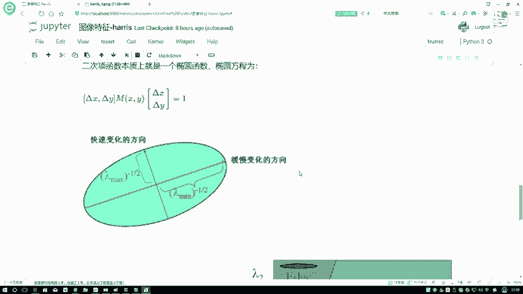
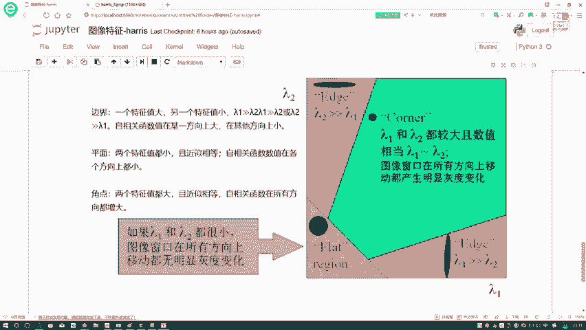

# 比刷剧还爽！【OpenCV+YOLO】终于有人能把OpenCV图像处理+YOLO目标检测讲的这么通俗易懂了!J建议收藏！（人工智能、深度学习、机器学习算法） - P44：4-特征归属划分 - 迪哥的AI世界 - BV1hrUNYcENc

这是一个矩阵，是一个两行两列的实对称阵吧，咱刚才说的啥N行N行N列的实力认证，一定能够找到N个特征向量，使得它能执行一个对角化操作吧，在这里我是不是一定能够进行这样对角化。

对角化完之后就是栏目的一和栏目二吧，相当于我做了一个对角化，你在这里就是如果说你对最对角化，它的一个标准化的理解不是特别深，咱就往通俗说，你就当咱现在得到的椭圆是歪的，你现在要把这个椭圆给它正过来。

这么理解行吧，咱就说我现在要把椭圆正过来啊，然后所以去做了这样的一个标准化的操作，在这里再来看吧，你做完标准化操作之后，你得到什么，这个矩阵当中只有栏目的一和兰目二吧，那这个式子它变成什么了。

咱写一下是不是变成了一个栏目的一的平方哎，就是这样一个嗯，咱咱就拿平方向来说吧，因为这块平方项嘛直接平方写出来了，兰姆达一的平方项将乘上德尔塔X平方吧，再加什么兰博的二的一个平方。

乘上一个德尔塔Y的一个平方吧，此时我还要等于一行吧，在这里咱来看一看，如果说我给他写的再标准一点，正常应该是一个X方比A方吧，那我们来看一下，如果说此时哎正常情况下这块应该比个A方吧，那相当于什么。

相当于啊，现在也就是一个N方A方分之一等于什么，等于一个栏目的一吧，这块这样就就就就就就就就这比这块不对，这块不应该加平方，这不应该加平方，应该正常这个栏目的一，因为你这个栏目一里边咱就代替什么代替。

是这个A啊，它不是代替德尔塔的这块，所以说这块栏目的一栏目二它不应该加平方，刚才这个这个这个写错了，它应该不带平方啊，那此时再来看吧，那我问你这个AA是代表什么，A和B哎。

分别代表着咱这这个东西就是A和B吧，它是长边，还有它的一个短边吧，在这里再来看我，A方分之一等于栏目的那A等于什么，那首先这个东西你得做根号根号完，这是A分之一吧，然后再做什么，再做一个倒数是吧。

那A也就等于一个根号下栏目的11是吧，这是我一个A等于这个东西，B呢根号下栏目的12吧，行了，终于给大家说完了，咱的一个兰姆达一啊，根号下兰姆达1/1和。

根号下兰姆达1/2行，再来看一下吧，在这里啊，刚才咱是不是给大家说了这个椭圆怎么回事啊，以及我做完对角化之后，得到了栏目的一和兰博的二，那它俩相当于什么，是不是有图像，就是我这个椭圆当中的一个长边。

一个短边，这个意思吧，那大家到这里啊，基本上就给大家快说完了，HARRIS咱们怎么他的一个理解方法，然后你接着来看，当我现在有一个栏目的一，有了一个栏目的二之后，当我现在就是我这个椭圆在发生变化的时候。

椭圆发生变化相当于我这个值。

你说你当前这个值是由谁决定的，我们可以想一想当前这个值代表什么，代表着椭圆一个等高线吧，你这个椭圆等高线怎么定义啊，椭圆越大等就是那个它这个值越大吧，此时椭圆越大意味着谁越大呀。

栏目的一越大和栏目T2也越大吧，哎是这个意思吧，再来捋，那可能这块咱讲点快，再来捋一遍，这个东西等于什么，这个东西它是不是等于A倍德尔塔X平方，加B倍德尔塔Y平方，咱刚才是不是说了，做个对角化。

中间这项给干掉了，干掉完之后我说你现在你别用A，你也别用B了，我分别用兰目一和兰姆达二来进行表示了行吧，这个式子，那你想在这里只不过说我这个栏杆一栏目达二，我得稍微的做一些变形啊。

那我们来看我的一个长短轴和我的一个长轴，不管哪个长哪个短了，反正这两个轴一个栏目的一个兰姆达二吧，当他俩进行变大的时候，是不是说我腿儿在变大，椭圆在变大，是不是意味着什么，咱当前的这个值怎么样再变大吧。

这个值变大了意味着什么，我的一个灰度变化比较大吧。

当这个值变化比较小，我的灰度值是不是变化比较小啊。

是这个意思吧，行再来看吧，解释完这个E了之后再对比一下，到这里啊，咱就要马上来说怎么去骗，判断我的是一个边界还是一个平坦区域，还是一个角点来，先说第一个事，兰姆达一大于兰姆达。

大于等于远大于兰姆达二的时候，或者兰姆达二远大于兰姆达一的时候，这块怎么写重了写重了一个东西，大家来想，我说这个栏目的一和这个栏目的二代表什么，分别代表着我的一个两个轴吧，咱不说哪个X哪哪个Y了。

反正分别代表两个轴是吧，分别我代表两个轴吧，如果说我在一个轴上变化的很大，另一个轴上变化的很小，那你说是什么诶，那那那是什么东西啊，那应该它是什么呀，就是一个边界吧是吧，像我该说的边界。

你在滑动过程当中是吧，比如这是边界，你在环过程当中就是呃一个变得大，一个变得小是吧，别在这里沿X和一个沿Y变化肯定不一样的吧，这是不是边界啊，栏目一远大于栏目二，或者兰姆达二远大于栏目一的时候。

这个说的是一个边界，然后呢平面平面啥意思啊，平面栏目的一个兰姆达二，你都不咋变了，是不是当你这个东西就是栏目的一兰姆达二，不咋变了，你最终算出来C值，那也不咋变吧，C值不咋变，灰度不变。

那是不是意味着你是一个平坦区域啊，在这一块当特征值都比较小的时候，怎么样或者近似相等的时候，我们现在就是我这个自相关函数，在各个方向都比较小，整体也比较小吧，得到结果，那此时我就说它是平面。

没问题吧，下面一个角点焦点是啥呀，那角点很明显了，角点你一变化的时候，比如这个东西你无论X往哪移，Y往哪移，都发生比较大的变化吧，此时栏目的一和栏目的二必然都比较大，是不是，那现在啊跟大家说了一下啊。

就是咱的一个结果该怎么样进行一个得到的，现在我们就只得到了，就是知道了。

我们现在比如说一个图像，就有一个区域进行移动过程当中，怎么样进行一个判断。

它的一个判断它是什么，判断它是一个角点还是一个平面。

还是一个边界啊，这个意思其实说白了，咱刚才啊给大家主要学的是他数学原理当中啊，一步怎么去做的，其实核心在哪啊，核心啊就在于这一点就得了，你把这个矩阵给我算出来，这个矩阵里边涉及到什么了，看一看吧。

这几个值你说哪个你不会求啊，X方向的梯度，Y方向的梯度一阶导吧，X和Y你算完之后，这矩阵是不是有了对矩阵干什么，做一个对角化求特征值是不是就完事了呀，所以说咱解释数学原理，其实解释挺复杂。

但是呢真正要你去做的时候，是不是比较容易就做出来了，你把这个结果一求导一求导咋求啊，咱像我刚才说的索贝尔算子当中，是不是啊，咱可以直接算梯度啊，open CV当中也有这个东西吧，咱就可以算出来了。

这一块咱跟大家说了一下，然后算完之后栏目一栏目二能算了吧，算完之后以比较是不是得了。

这事啥咱数据做完了，一比较三种情况是什么边界，是什么角点，是什么平坦区域就都完事了吧，所以啊这个就跟大家说了一下，在图像特征特征当中啊。

我们的hero算法他俩是怎么样去做的，然后呢可能大家现在还有一点比较迷惑。

就是你刚才说了哎这个比大小。

要么它是远比它大，要不是差不多相等，那你这个东西你光说一个大小不太直接，能不能给我做一点，就实际的值啊，在这里啊，就是咱们科学家当中啊，有提到一点叫做一个角点响应，一般我给它用一个R值来进行表示。

来看看他怎么定义的哦，你不用看这几个值了，什么轨迹，什么G之类的，直接来看它的表示就行了，就是用一个兰目的1×1个兰姆达二，再减去一个阿尔法贝，一般情况下，这个阿尔法贝这个阿尔法值比较小啊。

open CV当中好像是0。04，再乘上什么，再乘上一个栏目的一，加上一个栏目的二，它的一个平方项，这个算了，咱用个K值吧，咱先不说具体值，到时候open CV当中我们看一下它的默认值行。

咱这样算完之后，我们来看一下这个R值，咱们来想啊，就是咱们先说第一种情况就是什么，就是一个比较平坦的区域，比较平坦的区域栏目特一栏目二都比较小，那你看比如说都是0。1，0。1×0。1等于什么，0。

01是吧，0。1+0。1=0。2，0。2的平方等于0。04，0。01-1个多少倍的0。04，你说这个值怎么样，是不是都接近于零了，如果说你的R值接近于零了，代表什么平坦的一个区域吧。

那下一个东西下一个东西叫什么，下一个东西咱们来说这个边界，边界是不是一个大一个小啊，比如说一个大一个100一个一行吧，100×1个一，再减去，咱不如那个系数了，1001个E它的一个平方向。

100-1个什么101的平方，再减一个1万得了，它是什么样小于零的个数吧，这个数一旦小于零了，代表什么，它是什么，它就是个边界吧，如果说你这个110这样，那你个一一百一个大一个小一个小一个大。

是不是道理一样的，这就是个边界吧，再来看看咱这个角点，虽然说啊咱当前得到的值也都是比较大的，但是不要忘记啊，就是这块有一个我们的一个系数，通常情况下就是我们认为啊如果说R大于零的，它应该大概是一个角点。

然后呢R啊如果说约等于零的，那它就是一个边界，如果说R它是一个呃不是约约约约等于零的，它就是一个就那个什么约等于零，是一个平坦的区域，然后如果说它是小于零的，那它应该是一个边界吧。

这个是我们基本的一个判断方法。

一会儿啊就是在这里跟大家说了一下，我们的一个啊，那什么就是一个HARO算法。

它的一个基本的一个流程再总结一下吧，第一步干什么，第一步其实要做的很简单，你是不是拿到我的一个拿到一个数据之后，要怕要去做它的一个梯度啊，Xyy，所以说第一步算XYY，第二步呢。

第二步你给整合成一个矩阵，求矩阵特征值吧，第三步呢第三步比较特征值的大小。

然后啊在这里就是当你做完交卷之后，可能会发现一个现象。

比如这里你说这一块它的一个角点，那这是一个角点，那这一块你算没准，它也是个角点哦，这一块也是个交点吧，你看啊在这里可能我们看是一个点，但是在图像当中啊，它可能这些周围的哎算出来结果都挺大的，都挺大的。

值的时候我们需要干什么，不要忘记啊，还有一个东西叫做一个NMS，它是一个非极大值抑制，所以说最后啊通常情况下，我们都还需要再加上一个非极值抑制，把真正的焦点给它留出来，那些啊不是那么特别角的。

相当于在九眼周围的给它暂时给它过滤掉，这个就是我们HARO算法，从数学上以及呢它从实际上它的一个作用啊。

还有它的一个说原点在这里啊。