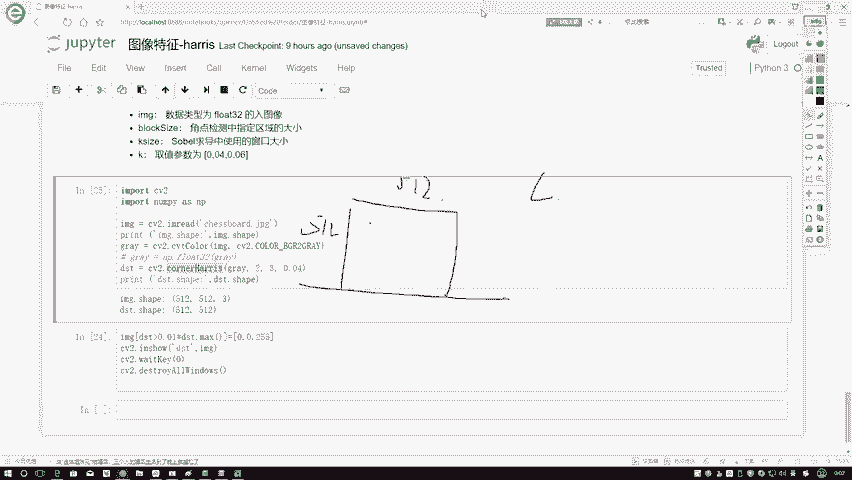
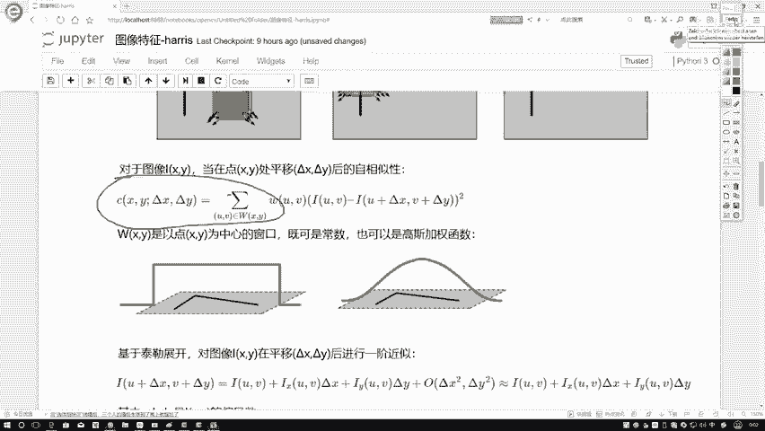
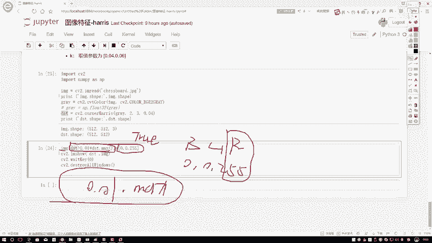
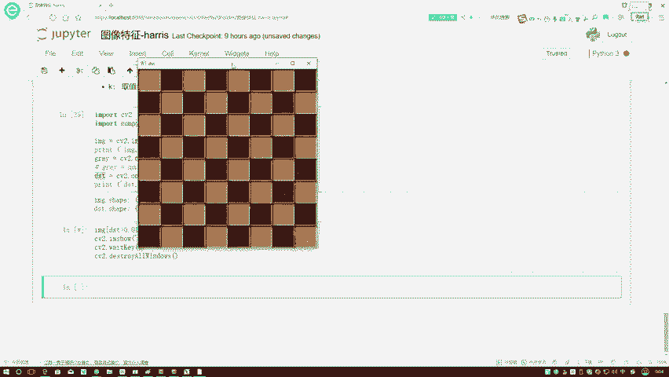
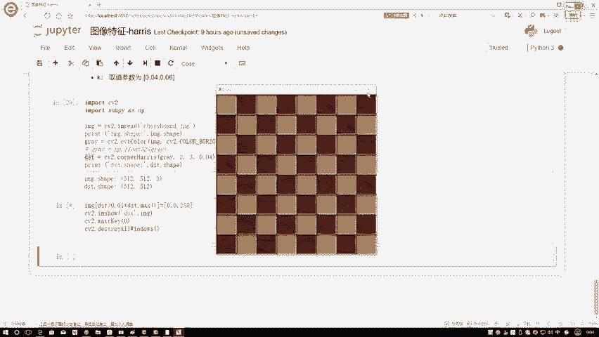
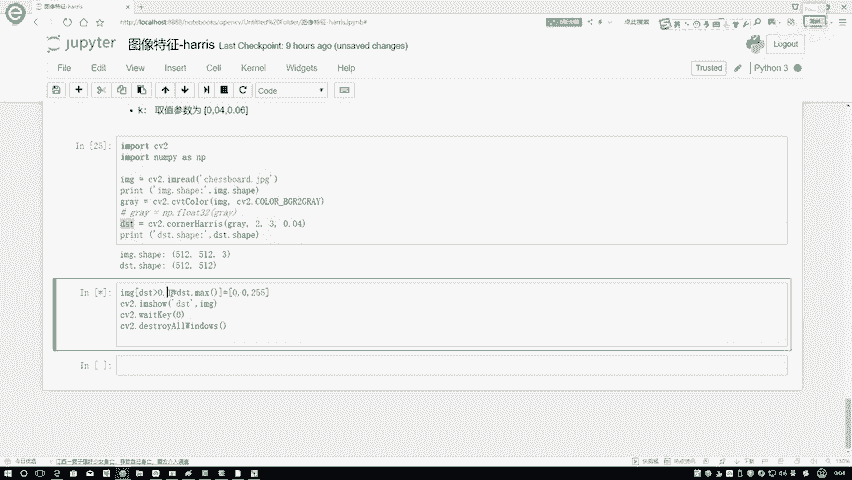
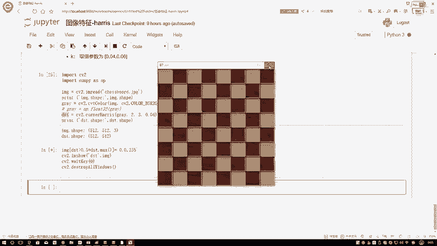
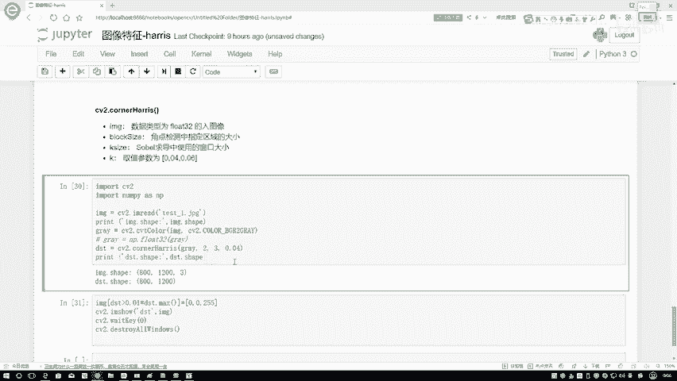

# 比刷剧还爽！【OpenCV+YOLO】终于有人能把OpenCV图像处理+YOLO目标检测讲的这么通俗易懂了!J建议收藏！（人工智能、深度学习、机器学习算法） - P45：5-opencv角点检测效果 - 迪哥的AI世界 - BV1hrUNYcENc

接下来咱们再来看一下在open CV当中啊，我们怎么样进行焦点检测，其实啊就是使用工具包，道理非常简单了，只需要调用接口就完事了，这里给大家使用的函数啊，叫做CV two，点corner haro。

它还有四个数的参数，我们分别看一下第一个参数啊，就是我们当前输一张图像，这就不用说了，直接图片图上就行了，但是啊它有要求你的数据类型虚实为啊，flow32的格式，如果说你的数据格式读取下来的挺特别的。

你还需要自己进行一个转换，通常就是我们都是NDA类格式吗，你需要安排点flow32啊，把它这个东西转换一下，然后呢还有个block size，就是我们说啊九点检测当中，我们该指定一个窗口吧。

并且我还说对一个窗口，你要指定一个ghost的filter吧，所以在这里啊，这个block size就该说的你指定那个窗口，它是有多大的，然后呢当我们在计算过程当中还有什么东西，还有k size吧。

就是我们用那个随便算子啊，在进行你求你那个XIY的时候，你不得用那个随便尔算子吗，他啊就相当于是你索贝尔算子当中啊，因为索贝尔算子它的一个就是里边值，给你固定下来了，但是你得设置好他的个k size。

一般情况下就等于三就可以了啊，这个值然后呢还有K值K值，open CV啊，做了一个推荐，基本上我们用0。04就可以了，就是我们最终要来判定的时候啊，那个比例那个系数等于多少，默认啊咱们就0。

04啊就可以了，这里推荐值啊取值范围比较少，0。04到0。06之间，基本上就是0。04啊，然后再来看一下吧，怎么去用，把我们的工具包导进来，然后呢CV two点哦，一般tion read一下这个图像。

它是一个国际象棋啊，这样吧，呃我觉得不用看了，一会咱一起看，结果大家都看出来了，这个是国际象棋那个棋盘，国际象棋一块黑的一块白的，做检验检测非常合适，然后首先我会去打印一下当前输入图像。

它这个shift值当初入图像是不值啊，是为了让大家观察，我当前执行完这个就是CONTERHARRIS之后，咱结果是得到什么东西，然后第一步独建这个图在这里给大家看啊，算了不看了，咱直接就看结果得了。

在这里就是一个呃国际象棋，然后我下一步对它转换成一个灰度图，独建设彩色图啊，然后转换完它是一个灰度图，然后对灰度图执行我这个counter heroes，然后操作就可以了，你把灰度图传进去。

BLOSIZE为二，还有一个k size等于sin，然后你的一个就是咱这个系数域值啊，等于一个0。04啊，有默认就可以了，然后我又打印了一下，当前咱执行完之后，给我返回值的一个shape值。

再来看一下行了，我输入它是5125123，是不是一个彩色图啊，首先转灰度图吧，转回复图之后，我进行了一个简单检测，hero检验，检测得到结果是得到结果的shape值是512，512表示什么意思啊。

唉我为什么得到一个shift值啊，你想既然我们做完检验检测，比如说这个大小它是512512的，你接下来是不是说你要看每一个点的值，像咱算那个C值，我们刚用就是公式当中C值做推导的吧。

就在这里咱要算什么，咱是不是要算你每一个点啊，是不是每一个点每一个点你是不是都得算出来。

它平移后它的自相似性吧，在这一块得到5125512，什么意思啊，每个点都算完了吧，那你每个点算完之后，这是我得到的结果，那我们要去对比一下了，你算完的结果当中，通常就是我们不设置一个固定值。

因为你设置一个固定值啊，这东西就不好说了，有些图像可能是这个值，有些图像那个值，图像和图像之间差异也特别大的，一般情况下我们是跟它最大直径相比啊，在我图圆角小点当中最大值，那肯定是个小点了。

如果说当前某一个位置它的一个自相似，它的一个变化程度大于了你0。01乘，就是0。101乘上你的一个max值，相当于啊比你max值的一个1%吧要大，我就认为它可能是一个角点，然后把它要画出来。

怎么画出来的，通过imagine哎，你看这样一个判断，判断完之后是不是索引啊，那所有式的位置它是为true了，我把所有式的位置标成什么，标成一个002550025，啥意思啊，这个open CV它是什么。

它是一个BGR的格式吧，所以255表示着你当前用红就是在R通道上，用二五表示用个纯红色吧，给它标记出来这个意思啊，接下来我进行一个展示。

说就完事了，再看看结果吧，进入当中我这里可能看着有点小。

这样给它放大一点，再来看，现在对于每个角点来说，它是不是在这一块一个角点，他认为是角点的，就用红色给你标记出来了，在这块可能AINS做的比较轻，他做的一个角点画面比较多吧。

这个就是我画出来咱的一个角点的一个结果，那你看这块可能大家觉得哎呀这角点有点多，那我能不能可能有些应该是一个边界的，它也判断成它是一个角点了，那我该怎么办呢。

我可不可以再把这个值变一变啊，你可以把这个值再变一下，比如说我写个大于0。1吧，我还没看呢，咱试试看大于0。1的一个结果，在这里我再放大一下，0。1，看着也是挺多的，这样呢如果说我看个大一个0。5呢。

我把这个关掉哦，大于0。5，此时唉呀此时这块儿还是有点多，那可能这里边由于这个棋盘啊，由于这因为由对，由于这东西是棋盘的，由于是棋盘啊，可能它导致中间啊它这个里边还有一条线啊，所以说这个不是特别明显。

到时候大家你换一个纯黑白的一个棋盘吧，可能纯黑白棋盘它的效果可能会更好一些，这里可能简单说角点稍微有点多啊，这里就主要给大家介绍上一个函数。

然后呢这个就是我们的一个棋盘的，然后我们换一个换什么呢，换一个咱换一个，我看test1是什么东西呃，八八百一千二的看一下哦，这test1它是一堆房子，这堆房子当中，你看在这房子上。

我干什么去做这样的一个胶原检测吧，把这一块角点我全检测到了吧，这个就是基于一个房子，我做了一个检验检测，可能这个树上我这树上检测出来这么多点是吧，树上检测出来点的比较多。

就因为这树本身它就有这样一个现象的，这个主要给大家说了一下周本CD当中啊，我们的一个啊这个counter harris这个函数啊，该怎么去用，其实我觉得用法很简单啊，到时候大家最好的使用方法。

就是自己拿张图测一测，试一试就完事了。

这里跟大家说了一下啊。