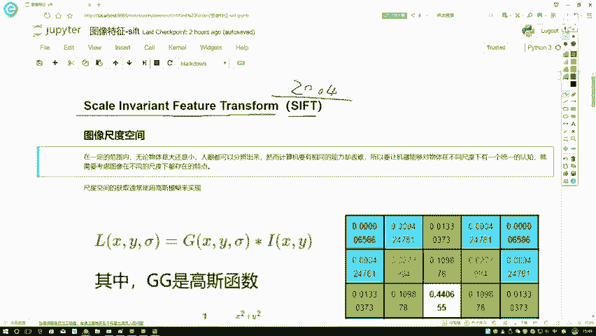
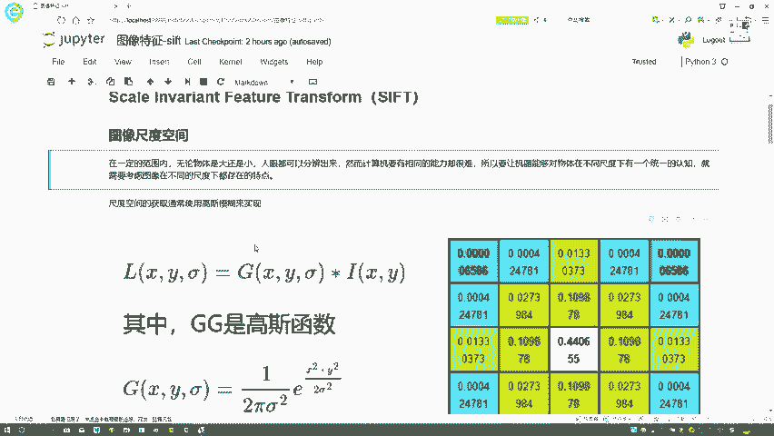
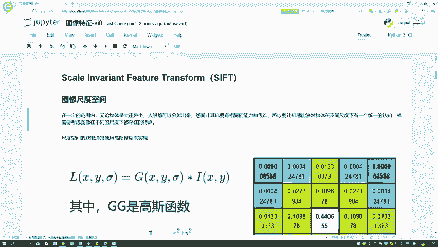
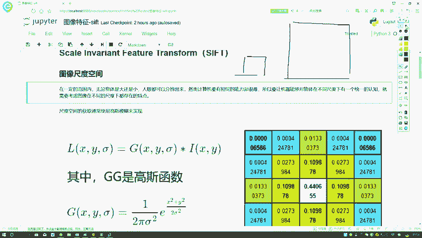
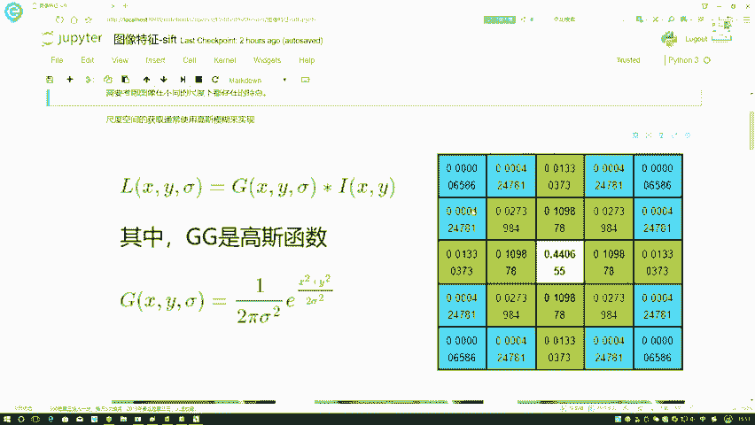
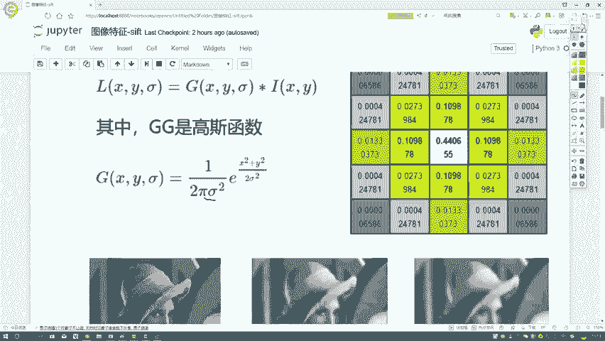
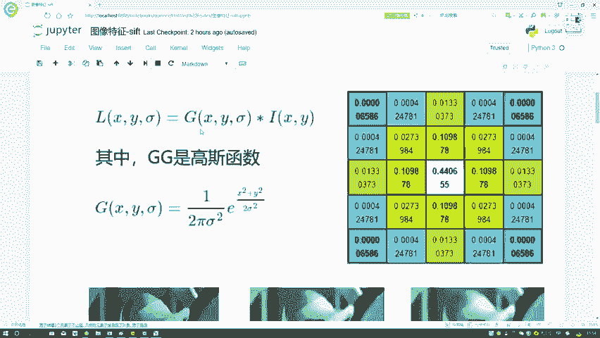
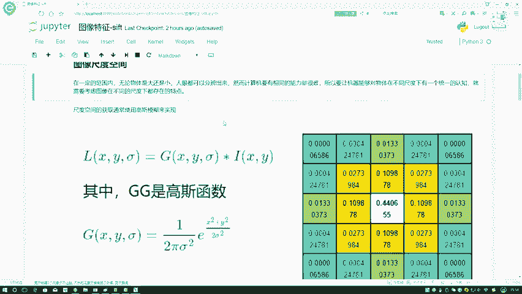
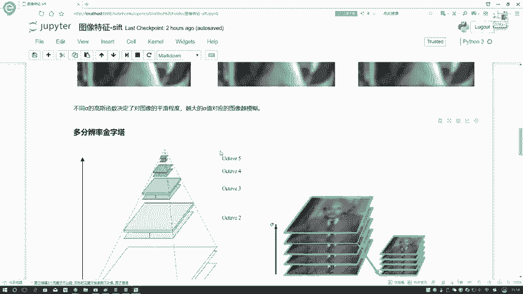

# P46：1-尺度空间定义 - 迪哥的AI世界 - BV1hrUNYcENc

这节课呀，咱们来说一下在图像特征当中的sf t算法嗯，它是一个缩小的，全称，叫什么全称啊，就是一个平移不变性的啊图像特征匹配算法，这个算法啊，大家可能听着名字觉得有些奇怪。

其实啊它是我们在计算机视觉当中啊，最常应用的一种方法了，呃可能大家以后要用到的不一定是SLT啊，它这个算法本身可能是一些延伸算法，因为啊就是后就是这个算法，它本来啊是这个2004年进行一个完善。

然后后续啊已经过了这么多年头，大家又对它进行了各种各样的升级，相当于有很多改进的版本，但是呢无论啊咱们之后用什么改进版本啊，基本思想都是不变的，只不过说在计算性能上，在效率上进行了改变。

基本原理还是大致相同的，那既然这节课，咱们这样给大家从原理上进行通俗解读，呃，由于啊这个sf t算法，它在本质上啊涉及到的数学概念，以及呢就是整体流程都比较多啊，所以说我给大家分模块进行解读。

咱首先来说第一模块，第一模块叫做一个图像的尺度空间，等我们把所有模块给大家讲完之后啊，大家会看到这个算法整体的流程。

以及呢它有什么优缺点，在这里啊，我们就不先给大家就是一一大串的定义，我们先不说啊，先一步步看完，因为我觉着你先列出一大堆定义，大家也不知道为什么这样咱们先一步解读，解读完之后啊，自然我们就清楚了。

这个算法有什么样的一个优势，以及呢他要做一件什么事，先说第一个事儿啊，我的一个图像尺度空间诶。

图像尺度空间什么意思啊，我先问大家一个事啊，就是说我们现在如果说用人眼进行观察的时候，哎呀比如说你一个人这个人比较熟悉，离这挺远的，你也能认出来，离得近的，你更能认出来是这样一个事吧，那我们来举个例子。

比如说我们在高高中的时候，高中的时候我们可能放学的时候，老师不让我们在球场打篮球，能在球场我离着挺老远，看着班主任出来了，我是不是就要跑啊，那我是不是离挺老远就能看到它，那也就是说我人啊。

在远处能观察到图像当中的一些特点，进行一些分辨吧，那你想计算机，我想让计算机做一些计算视觉，如果说你想做得好，是不是让计算机也得有同样的功能，说白了就是你让这个计算机啊。

不光能在清晰的层面上来看到一个物体，它是什么特点，它是什么东西，还要在模糊的情况下也能看到吧，这是第一点，一个清楚，还有一个模糊的感觉，第二点呢你想啊，就是这个物体咱们离远看是不是比较小。

离近看是不是比较大，但是我是不是都能认出来，那你想计算机要做的，它是不是也得让它离小看，离远看也能看到，离近看也能看到，说白了对于图像来说它比较小，分辨率比较低的时候，你能看出来分辨率比较大的时候。

你是不是也要能够看出来啊，这个是我们的要求吧，那你说既然有这样要求，咱们该怎么去做啊，那做法很简单，我们人类在什么样的层面上观察到东西，我让计算机也在相同条件下，只不过说我们说是观察计算机呢。

进行特征的提取吧，所以说啊，第一步我要先做一个尺度空间手动工具啊。

就是这个意思我要对图像进行改变，比如说一开始是一张图像，在这里先来看下面结果，像上接触当中，我选的都是这个LINUX图像，第一张图是LINA本尊啊，就是这样一张图，下面图呢你大家有没有感觉是越来越模糊。

越来越看不清楚里边到底是什么东西吧，所以说啊第一步我需要对图像做一些变换，让图像能尽可能不能说尽可能模糊啊，就是对图像进行一些改变，在不同的一个尺度空间上，在这里我们是怎么改变呢，跟大家先来说一下。

你要做这样一个东西，哎以前咱是不是也做过叫什么一个高斯滤波吧，其实很简单，之前咱也说过，我说啊现在我有一个图像嗯，XY来表示这是当前图像，我对当前图像进行一个高斯滤波，是不是就可以了。

高斯滤波长什么样子，我右边是不是把高斯滤波它的一个filter，一个盒拿出来了，就长这个样子吧，只不过说你在滤波过程当中，你选3×3的，选5×5的，这个都随意啊，大家可以按照自己的兴趣来选择。

在这里咱说5×5的，它的特点是不是说离着中心越近值越大，离中心值越远，值越小，是这个意思吧，然后这一点就是我们的一个高斯，就是高斯一个函数吧，所以说啊，在这里就像我们之前讲过的基础知识点一样。

我拿到一张图像之后，经过了一个高斯滤波。

哎我就可以得到一个变换的一个结果，相当于啊在这里我是越来越模糊了，那大家可能问了，你这里有的不太模糊，有的挺模糊的，怎么做到的呀，其实啊在这里我们可以控制一个参数啊，高斯这个当中啊有西格玛这个参数。

这个参数就是控制着嗯，咱往咱们解它，往白话文说啊，就是他控制的是模糊的程度，就是其实它是控制什么，其实啊，控制里的是你这里边这些和它的一个数值吧，当你的一个SA值越大，西格玛值越大，怎么样，西格玛越大。

相当于标准差吧，标准差越大，这个浮动范围也越大吧，浮动范围越大，是不是给我们的感觉就是怎么说呢，就是利用的一个就是利用，你看这个值比较小的时候，你看利用的它是比较多吧，值比较大的时候，相当于就这么说吧。

当这个值比较小或者C码比较小的时候，你对原始图像的改变也比较小，当你S格玛比较大的时候，因为这个值它也会进行，就是这个值会越来越小吧，越来越小，它进行较大的改变吧，所以说此时啊相当于进行了较大的改变。

到时候大家理解时候这样理解，这个西格玛就当做一个标准差嘛，标准差你指定的越大的时候，你图像变换的幅度也是越大的，那你想你变换的幅度越大。

那肯定越来越偏离原始的一个图像吧，所以说啊整个结果会怎么样越来越模糊吧，在这里啊，我们就是啊有这样的一个高斯函数，可以对我图像进行这样一个滤波操作。

滤波操完之后，我就得到了一个高斯模糊完的结果。

这是我第一步，像我刚才说的，我不光要在一个嗯清晰层面上，我能看到在模糊的时候，我照样我希望能提出来特征啊。

