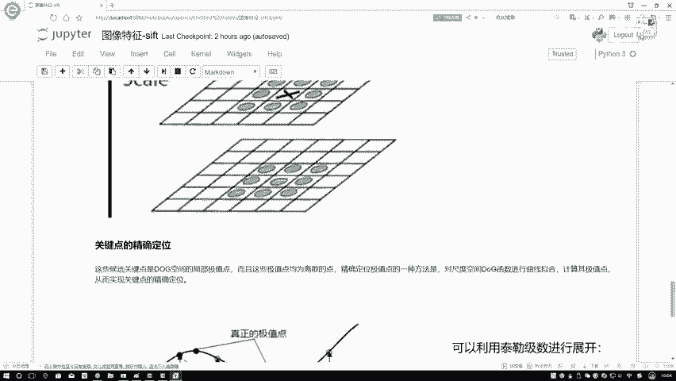
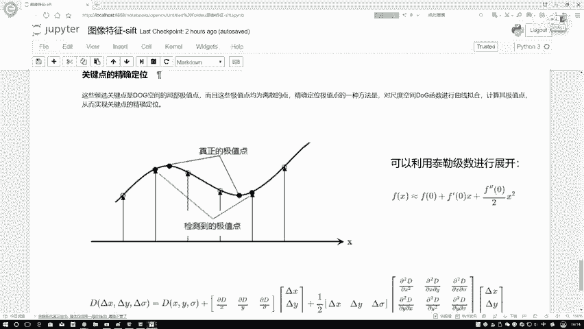

# 比刷剧还爽！【OpenCV+YOLO】终于有人能把OpenCV图像处理+YOLO目标检测讲的这么通俗易懂了!J建议收藏！（人工智能、深度学习、机器学习算法） - P48：3-特征关键点定位 - 迪哥的AI世界 - BV1hrUNYcENc

然后下面再来看你定义完了这个dog之后啊，我们是不是你得把它这个点给我找出来啊，咱现在目标不是找出来一些极值点吗，极值点咋找啊。

在这个sf t32当中啊，它是这么定义的，我先给大家说一下，它是这么定义的，就是在这里我们先取，比如说在这块呃，我这个dog当中得到是个三层，这是第一层，这是第二层，这是第三层哦。

在这里如果说是三层的情况下，你第一层和这个第三层它是用不了的，因为他要考虑它不光是一个平面，还有一个上下的一个感觉，在这里，比如说我当前要考虑画叉这个点，我说我考虑这个点，那你说你考虑这个点是啥呀。

它是不是个极值点吧，它是不是极值点，那你说你跟谁进行比较啊，说白了你跟周围进行比较，看一看它是不是比别的大，或者是是不是它都比别的小就完事了吧，要不极大，要么极小，在这里咱可以比比怎么比呢。

正常情况下你说比一个3×3的区域行吧，跟你自己周围一比就完事了，但是呢在这个sf t32当中啊，它不光要跟我们周围进行比较，还要跟上一层和下一层一起进行比较，那上一层有几个还是3×3窗口吧，这有几个。

我写一下，这是九个吧，那你说本层是几个，本层由于它自身这个，那你就不能跟自己玩了吧，本层是9-1=8个吧，那你说还有下一层啊，下一层是不是也是九个，那咱现在加一起，9+8加九。

291十八十八十八十八加九，18+8等于多少，26个吧，所以说啊就在这个SLD算当中啊，每一个点要跟周围的26个点进行比较啊，在这里就是我做完了dog之后，我每一个点都要跟周围26个点进行比较。

在这里啊大家注意一点，就是你在比较过程当中，你说啊这个这张图当中的每一个点都能比较吧，这一张图当中的每一个点我也都能比较吧，但是你说这个第一个和第四个你能做比较吗，第一个和第四个你做不了比较了吧。

只有中间这个东西啊，它能进行一个比较这个意思，然后还有什么，还有说比如说你这一块你想得到两个比较结果，那你需要的一个dog是有几个你需要的dog啊，就是得加二吧，可能大家有时候看一些参考资料。

会有一些加2+3，你知道加二是说我现在得到两个，这这这两个板子，两个板子吧，需要几个，需要几个板子才能做啊，因为需要四个吧，因为第一个和第四个我不能去做，那这一块有时候还有一个S加三，加三是什么意思。

加三就是表示着你要高斯模糊需要做几层，是不是高斯模糊是不是要大于你的一个dog，它比还等于什么你的一个高斯模糊啊，比如说我这G用的G用写吧，G它等于DOG加几啊，加上一个一吧，所以说这一块它是两两相减。

两两相减，这是五个，这是一个四个啊，大家知道有这样一个事。

就知道我第一个，第四和最后一个是用不了就行了，在这里呢我们就进行了什么一个极值检测。

那大家来想，我现在检测完之后哎会得到什么东西，检测完之后我们会得到什么一些极值点呗，这一个点那一个点那一个点，那我问大家一个事，咱得到的一个极值点它是什么。

它是一个点吧，不是一条线段吧，它是一个点。

而不是一条线段，大家来想，我现在得到的是一个点，它是一个离散的。

那这个离散的情况下，它一定就是准准确确的一个。

就是准准确确的一个极值点吗，不一定吧，再来看这个图。

这张图我给大家解释一下这个东西啊，很重要，再来看一下他们在这个sf TCL当中啊，他提到一点叫做一个关键点的精确定位，首先要问大家一点，什么叫精确定位，就像我刚才说的，我们刚才得到点什么。

它是个离散点吧，它的一个离散点它不一定怎么样，它就是最终的一个极值点吧，所以说我们现在需要对这个离散点，你一般就是你管这个东西叫做一个微调也行，管它叫做一个就是精确点的拟合也行，为大家来说一下这一步啊。

他是怎么去做的，这一步啊，就是正常情况下我们还需要对dog函数啊，就是对我们当前的一个dog，就是这是一个离散的，得到这些就是什么，就相当于得到的这些极值点，它这个离散的，我需要把这个离散点再去拟合。

成一个真实的一个点，这个意思，那怎么去做呢，在这里我们来看一下这个图，这个图当中啊，首先画到一点检测到的一个极值点是吧，这检测到的比如在这里，这是我这些都是我检测到的，但是它是什么，但是啊这是画画反了。

这东西是我检测到的，但是它可能不是真正的一个极值点，可能还差了一堆堆堆一点点，我们需要对它干什么再进行拟合吧，但是我问大家一个事啊，它是什么，它是个离散的离散点，那该怎么去做呀，在这里啊。

我们可以借助我们的泰勒基数啊，来进行一个展开，再来看一下，比如说我说这FX你看这FX它是什么，是一个曲线吧，你说这个曲线我可以近似用什么，近似用一些离散的形式来进行表示吧，相当于什么。

我真正的点是在曲线当中，你这个离散点可能只是我的一个估计是吧，这个意思，那我现在我要基于我的估计值去算出来，它实际更接近的一个值啊，这个意思来看吧，我说FX约等于什么，在这里啊，比如说这个零这个点吧。

比如说在哪个点是零，在这里咱随便画一个点吧，我说这个看找哪个点呢，这是检测到的一个离职点，我说这个吧，这点是个零吧，我要去估计它这个真实值，那估计真实值的过程当中，我是不是得往曲线上进行拟合啊。

那曲线等于什么，FX约等于F02，在这里咱就写个到二阶导就行了，不用再往下写了，再往下写太麻烦了，而且再往下写，基本上你的一个贡献都比较小了，一阶导这块绝大多数贡献，二阶导这块贡献比较小了，再往三阶导。

四阶导一就是再往下涨，那贡献越来越小没啥意思了，所以说在这里啊，我们暂时弄到个二阶导就足够了，在这里先来看约等于什么，就是比如说拿F0点估计吧，对F0这个点加上什么F0。

这个点的一阶导乘上一个X再加上12，二阶导乘上一个X方吧，在这里这个东西什么意思呢，这样吧可能大家呀光看这个公式，我觉着有点抽象是吧，给大家举个例子吧，举个例子，比如说在这块我说现在咱有几个点。

我说这个点是个零，这个点它是个一，这个点是个一行吧，随便编几个数吧，我说得零这个点的时候，零这个点数得几呢，我看这个这个一这个点这么的一这个点得二零，这个点得四行吧，一这个点一这个点咱拿它当当一了。

你别管他是真实点还是什么检测点了，我就拿这个图来画了，咱不重新找图了，要麻烦咱先不用管它，这个具体它是实心还是什么空心的，咱不管，咱就说这个式子，然后来这个一负一这个点，我看它比它大，比它小。

比它大一点是吧，那写个五得了，那这个式子咱咱该怎么去做啊，这个式子当中，比如说现在我要去算的时候，我现在要去算的时候，FI约等于什么，我是不是得把F0约等于F0等于几，F0等于四吧，我是把四拿出来啊。

但是在这块这块有什么F0的一阶导乘X吧，哎我问大家一个事，F01阶导咋算啊，哎这个一阶导怎么算，你现在拿到这个东西是什么，我们知道了，一点值等于五零点，值得四一点值得二，这是什么点，这是一个离散点吧。

你对于离散点，我问大家，你说离散点怎么求导啊，大家可能会告诉我第一点离散的东西求不了导，没关系，求不了导，我们可以做一个近似，可不可以啊，可以做近似吧，近似情况下一般这样啊，这个就是在图像当中啊。

可能有些地方还会用到这一点呃，大家就简单了解一下就行，先不用去深入啊，因为我觉着这里边涉及到的数学比较多啊，大家就简单先靠了解方便你进行理解就可以了，再来看一个一阶导，这样前二等于什么。

用我的一个比如说你要求零二，那你是不是用零，左边点和右边点来做近似的一个代替啊，那是不是应该FX加一呃，不是FX加1-1个FX减一是吧，再比上什么，再比上一个二吧，这里做什么可以做一个近似吧。

FX1阶导是吧，来看一下吧，这个式子大于等于多少呃，FFX加1FX加11X等于零吧，加一这块等于个二是吧，二减谁啊，减一这块等于一个五，负这个负就是一，这块它是不是等于个等于一个五啊，2-1个五。

比上一个二是吧，只有一导算出来了，等于什么负的5/2吧，那这块这不是减法了，这是一个这这这样的负的5/2，X这算出来了吧，行然后二阶导二阶导，这样就离散的数，离散的点啊，它计算方法是点。

特别这个离就是在这里，二阶导等于这个就是中间推导过程，不给大家去看了，我估计大家你也不用去关心一个离散的，在图像当中怎么去求二阶导，正常情况下我们是大家来这么记就行了，等于FI加一，再加上FI减一。

减去一个二倍FX吧，行了，来看一下等于多少，在这里X加一等于什么，等于一个二，然后呢也减一等于一个五，2+5=7，七减去谁减二为FXFX等于四二倍的，减去一个八吧，这什么这是一个一吧。

减二分之1X的平方，这个式子我是不是现在就给他写出来了，这里啊就是一个对于离散的情况下，你去求个一阶导，二阶导这个东西啊，这个公式哎它不是就完全等于的，还等于什么，还应该等于啊，再加上一个德尔塔项啊。

相当于就是在这块，又有一个接近于比较小的一个数，在这里为了简单这个式子啊，我统统给省略了，到时候大家看的时候，你也知道这一块不是你这么近似完，它就是一个等号了，而是什么，而是一个约等号啊。

对于离散情况下，咱不像连续连续的值，你可以直接算离散，我只能做近似代替是吧，所以说此时啊我做的是一个近似代替啊，这个意思啊，只是我在这里就是省略一些步骤，省略中间推导这些，大家来算了，举这个例子行。

那现在我是不是算出来FX啊，它的一个就是什么，它的一个约等于什么值吧，约等于什么日子之后再来看，那你说现在这FS是什么，我通过一个离散的情况，给它拟合成了一个连续情况吧，此时在连续情况下，你要找极值点。

是不是说你对FX要求啥呀，这东西你是不是求它一阶导，让它一阶导等于零二，你就得到了真正的一个极值点啊，算一下吧，这东西对X求导这个四是不是就没了，然后呢这个-5/2是不是落下来了。

然后呢这边2X这二和这里约了，是不是变成什么，减去一个X吧，等于个零吧，X等于什么负的52吧，所以说此时我就算出来了，X等于一个负的52，那真正的一个极值点，我是不是我就能给他算出来了，真正九等于什么。

我把负的5/2再往里带，往哪里带啊，往这里边带吧，4-2分之五，再乘上一个负的5/2，再减去1/2，乘上一个负的5/2，它的一个平方，这样算完之后，咱才相当于什么才相当于啊把算一下吧，四减多少。

这这个这负负得正相当于是个加法吧，加上一个25/4，再减什么，这块这块我看看这块是25/4，在前面相当于一个25/8吧，25/8，那这就是一个50/8，加50/8，减25/8，相当于减25/8吧。

最终它是什么，4-8分之25啊，这就是我拟合完新的一个极值的一个结果了，在这里啊给大家进行进行了一个解释，在这里你看这个差异好像偏差也挺多的，因为我这个数举的是不是不太恰当啊，这个数我这我举得不太恰当。

就是542，但我随便写些值啊，主要给大家看这样一个事的，到时候啊大家知道有这样的事就行，你得到这个东西，它是个离散值，你需要用泰勒基数给它展开一下，拟合成连续值当中实际的一个位置吧。

为什么要跟大家说这个事啊，主要来给大家说下下面这个公式。

下面这个公式啊看起来就更复杂了，因为我刚跟大家说的什么，我刚跟大家说的，它是几维情况下。

是不是个一维情况下呀，但是咱这个数据你说它是个几维的。

咱来数一数吧，你说这个D里边它包含了什么东西啊，不光是一个X1个Y还有个西格玛吧。

三个东西吧，所以说这个式子它是一个三维的。

该给大家举一个一维数它的一个例子，简单看一下，那你说对于三维这个东西，你是不是也得这么写啊，在这里这是什么。

这是如果说按照咱刚才那个简单形式，这是不是你当当前的一个就是你的离散值，这是不是你的一个一阶导，这是不是你的一个二阶导啊，所以说在这里，相当于我们用一种矢量形式来进行一个表示了。

那这一块就这种形式我看起来挺长挺乱的，我把它呀稍微的简化一下，我说这个东西啊，你就是一个D那这个东西啊，你就对D求一个一阶导，这个东西啊，你就是D对X求一个二阶导，可以吧。

由于此时它是一个矩阵矩阵求过程当中，你需要加上转置这个参数吧，在这里我们就给它转换成了一种新的形式。

所以说啊以后啊大家当我们看资料的时候，可能会提到一些关键点。

精确定位，你看到的东西都是什么，都是这个东西啊，这个东西在这里就是我不给大家看看，中间最小过程了，最终让我的一个一阶导等于零，我是不是能求出来我当前的一个结果啊，把这个结果带回进去。

相当于对我极值点又干什么，进行了一个修正的一个过程吧。

所以说在这里就是中间这个过程，你只需要了解一下就行了，不需要大家把所有的数学你都得掌握掉。

这些东西啊，里边涉及到数学概念，其实这我还是往简单说了，没有去说三维情况下它实际展开的一个情况，这实际上的情况已写出来。

那简直要写几大片子了，大家通俗理解就行，就是我们找到的一个极值点啊。

或者找到的一个位置，它是个离散的，但是呢在连续当中啊。

它可能并不是真正意义上的一个极值点，我需要对这个点进行一个拟合，进行一个修正。

找到我的一个真正位置的极值点啊。

