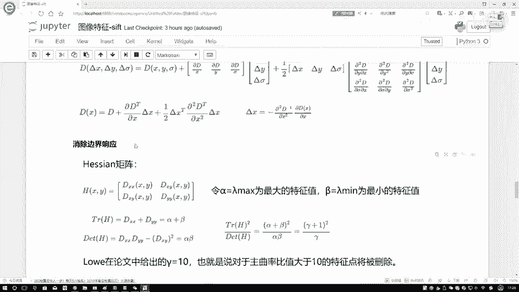
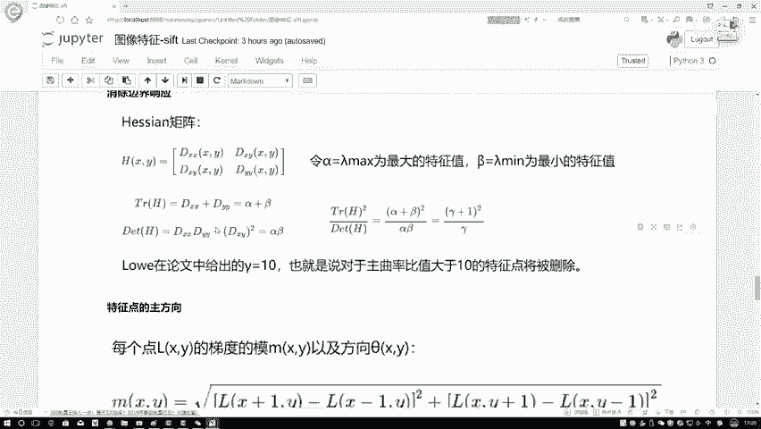
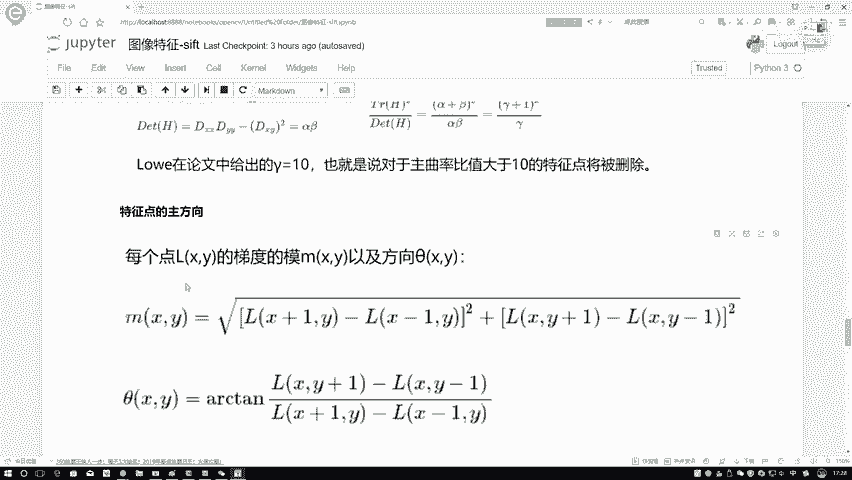
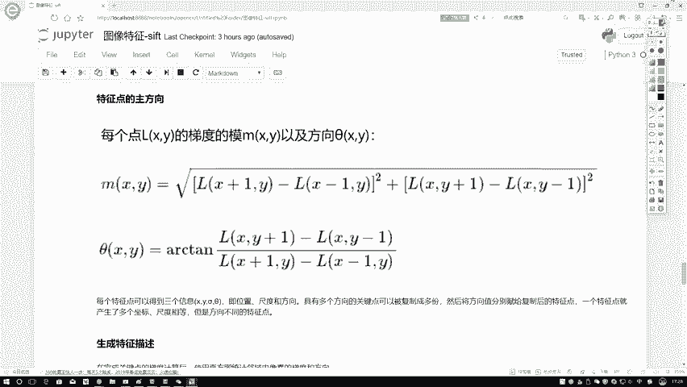
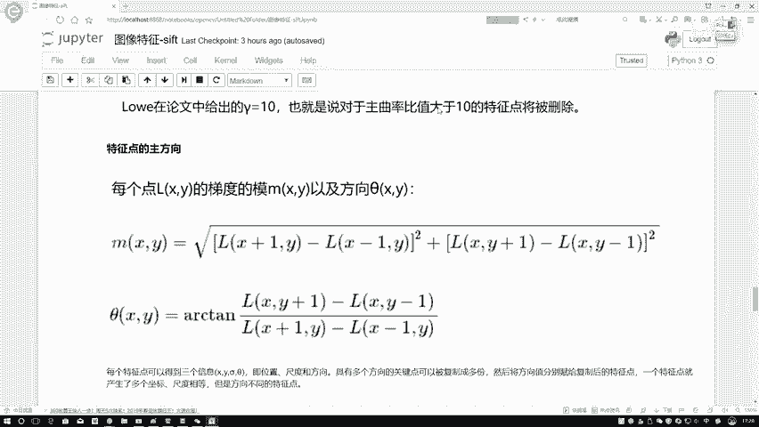
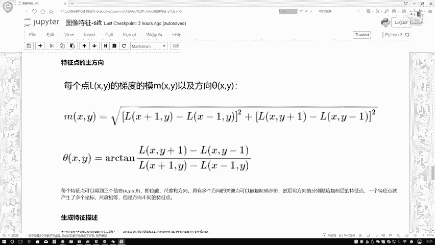
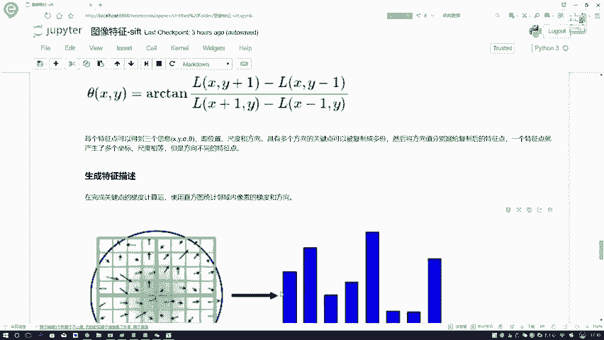
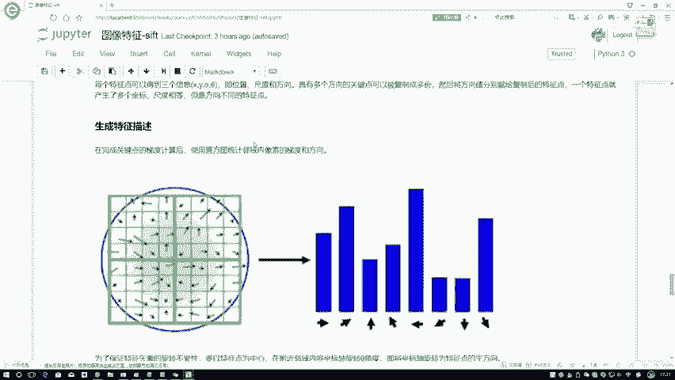
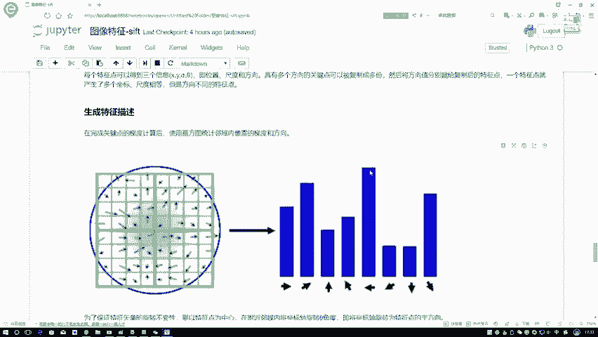

# 比刷剧还爽！【OpenCV+YOLO】终于有人能把OpenCV图像处理+YOLO目标检测讲的这么通俗易懂了!J建议收藏！（人工智能、深度学习、机器学习算法） - P49：4-生成特征描述 - 迪哥的AI世界 - BV1hrUNYcENc

当我们啊得到了一些极值点具体位置之后啊，还需要啊再对我们的位置进行一些过滤，还有判断其重要，论文当中提到这么一点叫做一个消除边界响应，因为我们之前是用那个高斯，对图像进行各种滤波操作。

所以说啊呃就是论文当中提到这么一点，就是你用高斯去做的时候，可能啊会加增加一些边界响应，那此时呢我们就给它消除掉，在这里啊，修图方法跟我们之前讲的那个检验，检测做法基本上是一致的。

我们在讲解员解释当中啊，是不是说提到一点一个叫特征值，栏目一和栏目的二，我们之前是不是说啊，当一个特征值大，一个特征值小的时候，它就边界呗，在这里它的一个做法一样的论文当中啊，说了一个阿尔法和一个贝塔。

这个阿尔法我们认为它是较大那个特征值，贝塔认为它是较小那个特征值，组成一个那个呃黑森矩阵啊，相当于就是这里也是X2阶导XYXY啊，他俩是一样的，然后这是Y的二阶导，在这里啊。

其实我们做法跟之前强酸检测就一模一样的，下面的这个东西啊，大家呃其实看不看都行啊，你就知道一点就行了，栏目一我们说栏目二，我让它的一个比值，或者说这里吧，咱就阿尔法贝塔吧，阿尔法是一对大的特征值。

贝塔是小特征值，我说了他俩的结果，如果说大于十，在大于十的前提下，是不是说一个特征值比另一个值，特征值大挺多呀，在这个原始论文当中啊，给出一个值叫做一个伽马WM等于十，就像咱们之前讲检测说的。

一个特征值比另一个特征值大挺多，那此时啊我们认为什么，那大概率就是个边界吧，对于边界我们应当进行一个过滤操作，所以说啊就是在原始论文当中还提到了啊，两点这样的一个边界的一个响应。

我们该怎么样进行一个消除，然后呢这个就跟大家说了一下。

我们怎么样对观点进行进定位以及定位完之后，我们还要进行消除工作。

那下面呢下面我们得想啊，就是当我得到了一个观点之后，哎我用它干什么呀，找到关键点，我是不是得把这些特殊点表示出来，让计算机能够认识啊，首先第一点计算机认识什么，它认识的是数值，应该是个向量吧。

所以说啊下面我需要做的就是怎么样哎，把当前这一个点转换成一个向量，在我们转身向量之前，我还要做一个事，就是一个什么一个方向嗯。

在这里我们先跟大家说一下，我们这个方向该怎么样进行定义啊，方法挺简单，对于啊咱现在的一个点啊，相当于就是我算它的一个模值，以及呢它的一个方向方向啊，其实咱们讲完检测当中啊，是不是也说了。

用我这个梯度进行一个比值，然后算二弹性的值，是不是算出来跟咱之前说的是不是一模一样啊，然后他这个模值道理，你看是不是天选单两根号下，把各的一个梯度的平方项加在一起，算出一个模值是完事了。

所以说啊在这里当我得到关键点之后，我可以很轻松的就把它的一个模值，它的模纸啊，这样我们就把这个模指当做是它的一个大小了，把方向啊就是一个方向，所以说啊现在当我得到一个特殊点之后，我可以得到以下三个信息。

这里虽然写四个，但是三个就位置用XY表示了，一个是位置，一个是尺度，刚才咱这个东西不就是尺度吗，还有什么，我们刚才算了它的一个方向，那这里就是我现在得到三个东西，位置尺度还有方向，然后呢后面这句话呃。

后面这句话这样，后面这句话一会儿吧，咱看下面这个图，再回过头来看多个方向这个事，那现在我就有了啊，在前三个信息，一个位置。

一个尺度，还有个方向，那你说有了它们之后啊，有什么用啊，咱来看这个图啊。

这个图就给你解释了一下，我们要用它的一个尺度和方向做一件什么事了，在这里先来看左边这张图，左边这张图啊，它就是呃包含了，比如说你要看这个点，我要看什么，你要观察一个点啊，就是观察一个特征点。

你需要对这个特征点进行一个，特征向量的一个描述，或者进行一个特征向量生成，需要观察其周围的一个区域，假设说在这里我找到了这样的一个区域啊，论文当中，如果说大家想详细看的时候，你可以看一下论文当中啊。

它有一些关于半径指定的方法，半径一些选择策略，这下对比实验我就不跟大家去说了，感兴趣我们也看一下，在这里啊，咱就进行一个通俗理解就可以了，在这里对于它的一个领域来说，它这个领域啊，你看是不是邻域当中啊。

应该是方向大小各不相同的，在这个点你看它领域当中，这一块有一些黑色的线，黑色键当中啊标注了方向，并且还标注了什么，还标注了方向它的一个大小吧，所以说啊现在我就知道了当前一个特征点，对于它的领域的情况啊。

大概是长什么样子，那你说对于领域的情况，你给我画出来一堆方向，像一堆小蝌蚪似的，我也不知道他干什么的呀，在这里还得借助一个东西叫做一个直方图，这个图像直方图是什么意思啊。

是不是表示着哎我每一个就是你指定X轴，是每一个就是你要观察指标，Y轴是它出现的数量吧，在这里啊，这个X轴咱就这么去定义了，其实啊，你说咱刚才算出来这个方向一共有多少个，那方向海了去了。

如果说你把所有可能性的方向都给它统计进来。

是不是太多了，在这里啊，咱为了简单起见，直接啊只统计这么八个方向，所以八个方向什么意思啊，你看一下吧，这是一个360度吧，我说这是一个方向，X1X2行吧，然后这块你再来个Y1，这块再来个Y2。

这就四个了吧，这一块45度，这样45度加在一起一共几个了，那我就不都我就我就不写了，这一块我们一共做完之后，是不是相当于现有八个方向了，0~45度是一个45~90，第二个90~135是第三个。

在这里我可以分别标个号，12345678，分别对应着八种方向吧，但当你啊求完了每一个方向之后，你是不是要看一下当前这个方向。

它能落到哪个区间上，在这里直方图当中我们标了八个方向，像我刚才说的，比如第一个第一个他可能0~45，然后呢他可能45~90，然后这个九十一百三十五点点点啊，咱一共标了八个方向，在这里我们就统计呗。

你看每个方向出现多少次是吧，统计完之后我就可以得到了，当前针对于某一个啊就是检测到的一个特征点，他啊领域范围，领域范围当中啊，它的一个梯度，还有一个方向啊，大概是长什么样子，那此时你看现在比如说在这里。

通常情况下我们会得到一个主方向，一般情况下我们需要一个主方向，但是如果说呢如果说啊在这里哎呀，有一个跟主方向特别相近的一个方向，那怎么办啊，我们在这里也可以去把这个关键点，进行一个拆分。

相当于是为它分成一份，是你这个方向的，第二份呢是你这个方向的，我也可以进行个拆分啊，拆分成两份分别去玩，相当于一个拆成两个，两个是不同方向的，因为我们有一个主方向，一个次方向。

这个就仅仅是当你的一个次方向，跟你的主方向接近于重合的时候，论文当中给出的是百分比是一个80%啊，到时候大家可以自己研究，还有这个事，估计大家可能也不太感兴趣，知道这么多就行了。

如果说它呀就是重合的一个方向，大80%，我可以给它进行一个复制操作，相当于由一个我得到两个方向啊，你要一个得到两个方向，是不是得到两个特征向量了啊。

