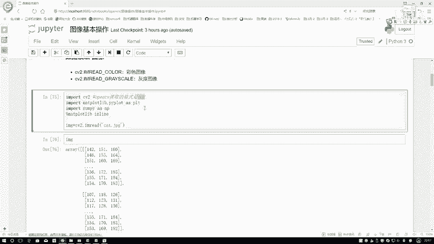
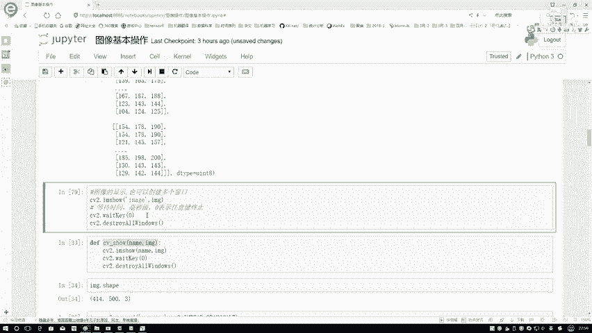

# 比刷剧还爽！【OpenCV+YOLO】终于有人能把OpenCV图像处理+YOLO目标检测讲的这么通俗易懂了!J建议收藏！（人工智能、深度学习、机器学习算法） - P4：1-计算机眼中的图像 - 迪哥的AI世界 - BV1hrUNYcENc

这节课呀咱们来说一下在open CV当中啊，图像最基本的操作，那首先呢我们得先知道一件事，在计算机眼中啊，图像是长什么样子，我们来观察这个图，我们把它叫做LINA，就可以在这张图当中，好像说丽娜这个人。

他被我分成了很多很多小方格，那其实啊这个方格还没有足够小，在这里呢我再拿出来其中的一个方格，咱们再观察一下，好像说啊在这个方格当中，我们的每一个就是一个大区域吧，它是由很多个小块所组成的。

那我们说啊其中的每一个小格，比如这块标个一二或者三，然后四一直标下去，我们说啊其中每个小格它叫做一个像素点，计算机当中啊，就是由这些像素点来构成这样一张图像的，那像素点又是什么呢。

其实啊说白了它是一个值，我们来看右边这边当中，我们先不用看这个RGB，咱们一会再说，先看一下它里边组成，里边有81，这个值还有116，还有一百三十三十三，还有一百七二百零一。

它们就是构成像素点的每一个值了，在这里大家可能会想这个80一比较小，这个130可能稍微有点大，这个数值大小意味着什么呀，在计算机算当中啊，就是一个像素点的值是在0~255之间，进行浮动的。

就只有最小值是零，最大值是255，表示着该点它的一个亮度，说白了零这个表示什么，表示的就是一个黑的255呢，那非常亮了，最亮它不就接近一个白色吗，在这中间啊，就是由它不同的一个亮度所构成的一个结果。

然后呢我们再来看一下，在这个当中啊，我说比如说这样一个区域吧，这个一个区域它是不是对应着我这块R里边，一个值在对应着G里边的一个值，我们管这个RGB叫做图像的颜色通道。

通常情况下我们看到一个彩色图都是RGB啊，三颜色通道的，在这里201表示着在它红色这个通道上，它的一个亮度的一个结果，155呢表着在G通道也就是一个绿色的，165呢表着在一个蓝色的，就是这个B通道。

我们一般情况下拿到的基本图像，都是这样一个三通道的，这是对应什么一个彩色图才会有这样三个通道，那我大家估计还看过一些黑白电影，是不是，那你说那些黑白图它有这些颜色通道吗，黑白图啊它就没有。

对于一个灰度图，我一般叫做一个灰度图，对于恢复来说啊，它就只有一个通道，表示它的一个亮度就足够了，它就不需要这个RGB啊这三个东西了，所以说在这里给大家总结一下我们的图像，在计算机眼中。

它是由很多个像素点组成的，这些像素点我们可以观察一下，它是不是像是一个矩阵似的呀，这个矩阵就表示着你图像的一个大小，比如说我说它是一个500I乘上一个500的，我的一个H等于500，W也等于500。

那相应的RGB3个颜色通道里边，不是都有矩阵构成的吗，那它们都是一个500×100的，所以说呢一个图像整体的一个shift维度多少啊，那就是一个500×1个500，不要忘记还有一个三。

相当于在每一个颜色通道上，我都有一个500×500，这个意思在这里啊，简单先跟大家介绍了一下我们在计算机眼中啊。

图像是什么东西，那接下来呢我们来看一下嗯，在这个open CV当中啊。

我们的一个基本的操作，咱先说一下，比较简单的就是当我拿到一张数据之后。

无论啊之后我们要做什么事，你肯定得把图像加载进来，才能对这个图像进行操作吧，说白了现在呢占有这一张图，比如这里我们随便点一张吧，现在呢我有这样一张图啊，随便一张图什么都行，这个什么。

这是现在大家能看到这一个车，后面是一个楼，这还有一堆树，那你说我现在想做的，是不是我得让计算机能够认识这个车，这个树，还有这个楼啊，比如说认识车的一个轮廓，认识车的轮子，认识车的车牌号。

是不是让计算机去做呀，所以啊我们要转换成它的一个什么，一个像素的一个矩阵吧，所以说第一步我需要先把图像读进来，通过我的像素矩阵，让计算机当中啊进行一些分析。

还有识别工作，咱们先来看第一步进行一个数据的读取。

在这里呢我们导进来三个工具包，一个是CV two，就是我们open CV它的一个在Python当中啊，它的一个缩写，我们就CV two就可以了，然后呢，my pd相当于一会我们要进行一个绘图展示。

南排啊最基本的一些数值计算工具包，然后在这里在这里啊，我指定了一个啊，My plot in line，它是这个意思，就是有些实话，当我们在notebook进行展示的过程当中呃，我想直接把这个图绘制完了。

你就展示出来，你不用去掉那个PLT点show啊，那个函数了，相当于啊就让我们展示的更方便一些，这个我们管它叫做一个魔法指令嗯，它是在这个notebook，就是我们当前这个页面当中啊，它所特有的吧。

你用其他id啊，用这个东西可能就不好使了，只在咱们这个notebook当中啊，它是比较实用的，一会儿会给大家看一下我们绘图的一个结果，第一步我们来看读取一张图像嗯，读图像就是用这个函数。

我们用CV two啊，你们read一下，它呢会在我当前的路径下去找我们。

来看这是什么，这是一个cat点JPG，我们来看就是这张图像吧。

他会把这张图像读进来，所以说呢读图像很简单，直接用open CV工具包去选择一张图像，指定好它的路径，这样呢我就可以把它读取进来了，读取圈之后啊，咱们来看一下它的一个结果，在这一块这样为大家执行一下吧。

执行完之后读进来一张图像，我们给它起一个变量叫做一个mg，然后呢我们来看一下这mg啊，它是长什么样子的，在这里呢咱打印一下它的一个结果，打印的结果，首先它是一个南安排当中的，nd array的一个结构。

你看这是nd array的一个结构，然后呢注意啊，他这个DETAPE值就是对于一个图像来说，咱刚才是不是说最小值是零，最大值是255啊对吧，所以说在这里啊我们用什么，我们用一种就是用INT8啊就可以了。

相当于它的一个取值范围，就是从0~255之间。

这就足够了，然后呢我们来观察一下这个矩阵当中啊，它的一个维度，你看这个中框当中只有几个三个吧，所以说它的一个维度应该是第一个维度，我写个我先这样，我先写一个一，再写个二，再写个三，表示有三个维度吧。

一般情况下我们这样用一个HW，还有C来去表示我当前得到图像shape值，它的一个结果，然后呢，咱们来观察一下，这里边其中啊每一个点就是咱们的像素点吧，这样我就先把图像给读进来了。

那读进来之后啊，有些时候就是随着我们对图像进行处理，我可能要对图像做一些比如说边缘检测，或者是一些更复杂的操作，在做操作过程当中，我想观察一下，哎呀这个图像它变换成什么样子了，怎么办呢。

在这里啊我们可以用map工具包，你也可以啊，直接用open CV当中给我们得留下的一些。

就是给我们提供的一些绘图函数，来进行一个展示，在这里先跟大家说一下，就是open CV啊，它默认读取格式它不是一个RGB的，它是一个BGR的格式，所以说呢在它的一个读取方式上。

跟这个MAPLOT它有一些冲突，所以有时候大家展示的时候，效果可能有一些奇怪哦，最好大家用open CV当中啊，自带函数帮我们进行展示，这样呢，就是我们不用对一个颜色通道再做一些改变了。

如果说你用其他工具包在做的时候，你得考虑一下，你当前这个工具包，默认的格式是不是一个BGR，如果说不是的话，你需要转换成相应的一个格式的。

我们来看，在这里我们要来显示一张图像，我先把它写成个零，在这里呢显示图像其实很简单，我用SUV to点啊，引show一下，然后呢传加两个参数，第一个参数你给这个窗口指定一个名字，随便按名字就可以了。

第二个参数呢就是你要去显示哪一张图像，咱刚才不是读取一张图像。

然后给它叫做一个mg吗，这回啊我给它显示一下，就是呃你们show一下，创建一个窗口，然后呢在这一块咱去啊等待一下等待，意思啊，是这样，咱们先来看一下是等于零的时候它的一个效果。

那最后呢就是当我去触发一些关闭的时候，他就把所有窗口全关闭掉了，我现在执行一下。

大家来看一下它显示的结果，这样咱们的一只猫就得显示出来了，那大家可能会想哎呀，这个VITK当中啊，你指定个零什么意思啊，这个零二它表示的就是，当你进行显示过程当中啊，你不让它自己去消失。

而是说你指定一个就是任意的一个键子，比如说键盘当中你按一下空格，按一下随便一个键什么都行。

比如按下空格，你看这个东西它就消失了吧，所以说啊你传一个零，相当于啊我们在键盘当中摁按下任意的一个键，我就能去把这个东西终止掉了，把所有的window就都给它销毁掉了，这个意思，那如果说你不定成零呢。

我只定成个1000，什么意思啊，它相当于啊在毫秒这个单位上去。

让你就是给你显示这么长时间再执行一下，你看现在显示马上要没了吧，可能这个1000有点太快了，咱写个1万吧，你看现在这个猫就一直在展示吧，它就会慢慢去记秒，大概也就是十秒左右的样子。

这个猫啊马上就要消失了，我估计现在已经快了，你看现在消失了吧，这个就是说你可以自己啊，指定一下我们的一个等待时间，但是一般情况下我建议大家都是用零吧，相当于嗯因为我们通常就是显示过程当中。

都需要自己去观察观察结果，然后可能对结果要进行一些分析的工作。

